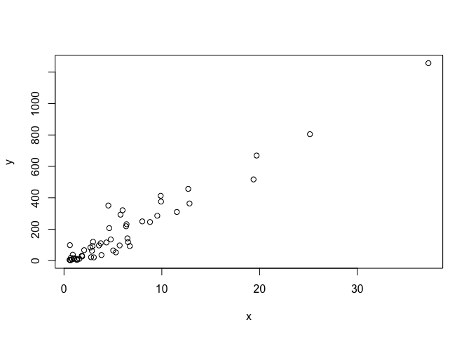

PH125.1 R Basics | Notes
================

## 1.1 R Basics, Functions and Data Types

### Objects

Create objects and store values

``` r
a <- 3
b <- 4
c <- a+b
```

Return stored values

``` r
a
```

    ## [1] 3

With the print function

``` r
print(c)
```

    ## [1] 7

### Functions

We can use pre-built functions like `install.packages`, `sqrt` or `ls`

``` r
log(8)
```

    ## [1] 2.079442

``` r
log(a)
```

    ## [1] 1.098612

Call help files with the help function `help(log)` or `?log`

To know the arguments needed in a function without using the help docs:

``` r
args(log)
```

    ## function (x, base = exp(1)) 
    ## NULL

We can change the default values by assigning another object

``` r
log(8,base=2)
```

    ## [1] 3

If no argument name is included R will understand it in the same order
as the args() specs

``` r
log(8,2)
```

    ## [1] 3

To solve an equation like 3x^2 + 2x -1

``` r
a <- 3
b <- 2
c <- -1
(-b + sqrt(b^2 - 4*a*c)) / (2*a)
(-b - sqrt(b^2 - 4*a*c)) / (2*a)
```

    ## [1] 0.3333333

    ## [1] -1

### Data types

Function `class` help us determine what type we have

``` r
a <- 3
class(a)
```

    ## [1] "numeric"

#### Data frames

Conceptually, we can think of a data frame as a table with rows
representing observations and the different variables reported for each
observation defining the columns. Data frames are particularly useful
for datasets because we can combine different data types into one
object.

``` r
library(dslabs)
data("murders")
class(murders)
```

    ## [1] "data.frame"

#### Examining an object

We can use the function `str()` to know more about the structure of an
object. In the example below we can see it has 51 rows and 5 variables,
with the data type of each. E.g. state is character and region is Factor

``` r
str(murders)
```

    ## 'data.frame':    51 obs. of  5 variables:
    ##  $ state     : chr  "Alabama" "Alaska" "Arizona" "Arkansas" ...
    ##  $ abb       : chr  "AL" "AK" "AZ" "AR" ...
    ##  $ region    : Factor w/ 4 levels "Northeast","South",..: 2 4 4 2 4 4 1 2 2 2 ...
    ##  $ population: num  4779736 710231 6392017 2915918 37253956 ...
    ##  $ total     : num  135 19 232 93 1257 ...

To inspect the first 6 lines we can use the function `head()`

``` r
head(murders)
```

    ##        state abb region population total
    ## 1    Alabama  AL  South    4779736   135
    ## 2     Alaska  AK   West     710231    19
    ## 3    Arizona  AZ   West    6392017   232
    ## 4   Arkansas  AR  South    2915918    93
    ## 5 California  CA   West   37253956  1257
    ## 6   Colorado  CO   West    5029196    65

#### The accessor `$`

We can use the accessor to access variables within a data
    frame

``` r
murders$population
```

    ##  [1]  4779736   710231  6392017  2915918 37253956  5029196  3574097   897934
    ##  [9]   601723 19687653  9920000  1360301  1567582 12830632  6483802  3046355
    ## [17]  2853118  4339367  4533372  1328361  5773552  6547629  9883640  5303925
    ## [25]  2967297  5988927   989415  1826341  2700551  1316470  8791894  2059179
    ## [33] 19378102  9535483   672591 11536504  3751351  3831074 12702379  1052567
    ## [41]  4625364   814180  6346105 25145561  2763885   625741  8001024  6724540
    ## [49]  1852994  5686986   563626

We can quickly access the variable names with the function `names()`

``` r
names(murders)
```

    ## [1] "state"      "abb"        "region"     "population" "total"

#### Vectors: numerics, characters, and logical

The object `murders$population` is not one number but several. We call
these types of objects vectors. A single number is technically a vector
of length 1, but in general we use the term vectors to refer to objects
with several entries. The function `length` tells you how many entries
are in the vector:

``` r
pop <- murders$population
length(pop)
```

    ## [1] 51

We can inspect the vector class

``` r
class(murders$population)
```

    ## [1] "numeric"

Vectors of class character store character strings

``` r
class(murders$state)
```

    ## [1] "character"

Logical vectors must be either true or false

``` r
z <- 3==2
z
```

    ## [1] FALSE

#### Factors

`region` is a factor in the murders dataset.

``` r
class(murders$region)
```

    ## [1] "factor"

Factors store categorical data, in this case there are 4 levels

``` r
levels(murders$region)
```

    ## [1] "Northeast"     "South"         "North Central" "West"

We can use `reorder` to change the order of labels, e.g. by total
murders.

``` r
region <- murders$region
value <- murders$total
region <- reorder(region, value, FUN = sum)
levels(region)
```

    ## [1] "Northeast"     "North Central" "West"          "South"

#### Matrices

Matrices are similar to data frames in that they are two-dimensional:
they have rows and columns. However, like numeric, character and logical
vectors, entries in matrices have to be all the same type.

We can use the function `matrix` with arguments (values, number of rows,
number of columns)

``` r
mat <- matrix(1:12,4,3)
mat
```

    ##      [,1] [,2] [,3]
    ## [1,]    1    5    9
    ## [2,]    2    6   10
    ## [3,]    3    7   11
    ## [4,]    4    8   12

To access specific entries in a matrix

``` r
mat[2,3]
```

    ## [1] 10

If you want the entire second row

``` r
mat[2,]
```

    ## [1]  2  6 10

Similar procedure if we want the entire first column

``` r
mat[,1]
```

    ## [1] 1 2 3 4

To access a subset of the matrix

``` r
mat[3:4,2:3]
```

    ##      [,1] [,2]
    ## [1,]    7   11
    ## [2,]    8   12

We can also use brackets to access subsets of data frames

``` r
data("murders")
murders[25,1]
```

    ## [1] "Mississippi"

Using `murders[1:6,]` would be the same as using `head(murders)`

``` r
murders[1:6,]
```

    ##        state abb region population total
    ## 1    Alabama  AL  South    4779736   135
    ## 2     Alaska  AK   West     710231    19
    ## 3    Arizona  AZ   West    6392017   232
    ## 4   Arkansas  AR  South    2915918    93
    ## 5 California  CA   West   37253956  1257
    ## 6   Colorado  CO   West    5029196    65

     

## 1.2 Vectors and Sorting

Most basic objects available to store data are vectors

### Vectors

#### Creating Vectors

We use concatenate `c` to create vectors

``` r
codes <- c(380, 124, 818)
codes
```

    ## [1] 380 124 818

``` r
countries <- c("USA","Canada","Mexico")
countries
```

    ## [1] "USA"    "Canada" "Mexico"

 

#### Names

We can name the entries of a vector

``` r
country_codes <- c(USA=43, Canada=4, Mexico=33)
country_codes
```

    ##    USA Canada Mexico 
    ##     43      4     33

``` r
class(country_codes)
```

    ## [1] "numeric"

``` r
names(country_codes)
```

    ## [1] "USA"    "Canada" "Mexico"

 

#### Sequencies

Will create vectors

``` r
ten_numbers <- seq(1,10)
ten_numbers
```

    ##  [1]  1  2  3  4  5  6  7  8  9 10

``` r
cerofive <- seq(-10,10,0.5)
cerofive
```

    ##  [1] -10.0  -9.5  -9.0  -8.5  -8.0  -7.5  -7.0  -6.5  -6.0  -5.5  -5.0  -4.5
    ## [13]  -4.0  -3.5  -3.0  -2.5  -2.0  -1.5  -1.0  -0.5   0.0   0.5   1.0   1.5
    ## [25]   2.0   2.5   3.0   3.5   4.0   4.5   5.0   5.5   6.0   6.5   7.0   7.5
    ## [37]   8.0   8.5   9.0   9.5  10.0

``` r
class(cerofive)
```

    ## [1] "numeric"

``` r
class(1:10)
```

    ## [1] "integer"

 

#### Subsetting

To access specific values of a vector

``` r
cerofive[3]
```

    ## [1] -9

``` r
cerofive[c(3,4)]
```

    ## [1] -9.0 -8.5

 

#### Coercion

Flexibility of R with data types

``` r
mix <- c(3, "Canada", TRUE)
mix
```

    ## [1] "3"      "Canada" "TRUE"

``` r
class(mix)
```

    ## [1] "character"

We can convert between data types

``` r
numbers <- c(1,3)
str(numbers)
```

    ##  num [1:2] 1 3

``` r
numchar <- as.character(numbers)
str(numchar)
```

    ##  chr [1:2] "1" "3"

**Warning** R can return NAs

``` r
string <- c("1", "Canada", "45")
as.numeric(string)
```

    ## Warning: NAs introduced by coercion

    ## [1]  1 NA 45

 

### Sorting

#### `sort`

Say we want to rank the states from least to most gun murders. The
function `sort` sorts a vector in increasing order

``` r
library(dslabs)
data("murders")
sort(murders$total)
```

    ##  [1]    2    4    5    5    7    8   11   12   12   16   19   21   22   27   32
    ## [16]   36   38   53   63   65   67   84   93   93   97   97   99  111  116  118
    ## [31]  120  135  142  207  219  232  246  250  286  293  310  321  351  364  376
    ## [46]  413  457  517  669  805 1257

 

#### `order`

It takes a vector as input and returns the vector of indexes that sorts
the input vector.

``` r
x <- c(31, 4, 15, 92, 65)
sort(x)
```

    ## [1]  4 15 31 65 92

Rather than sort the input vector, the function order returns the index
that sorts input vector:

``` r
index <- order(x)
x[index]
```

    ## [1]  4 15 31 65 92

We can order the states names by total murders. According to R
California had the most murders

``` r
index <- order(murders$total)
murders$abb[index]
```

    ##  [1] "VT" "ND" "NH" "WY" "HI" "SD" "ME" "ID" "MT" "RI" "AK" "IA" "UT" "WV" "NE"
    ## [16] "OR" "DE" "MN" "KS" "CO" "NM" "NV" "AR" "WA" "CT" "WI" "DC" "OK" "KY" "MA"
    ## [31] "MS" "AL" "IN" "SC" "TN" "AZ" "NJ" "VA" "NC" "MD" "OH" "MO" "LA" "IL" "GA"
    ## [46] "MI" "PA" "NY" "FL" "TX" "CA"

 

#### `max` and `which.max`

Entry with the largest value

``` r
max(murders$total)
```

    ## [1] 1257

`which.max` will return the index of the entry with largest value

``` r
which.max(murders$total)
```

    ## [1] 5

to return the state name

``` r
murders$state[which.max(murders$total)]
```

    ## [1] "California"

or

``` r
maxmurder <- which.max(murders$total)
murders$state[maxmurder]
```

    ## [1] "California"

 

#### `rank`

Returns a vector with the rank of the first entry, second entry, etc

``` r
rank(x)
```

    ## [1] 3 1 2 5 4

 

**rank, sort and order**

    ##   original order sort rank
    ## 1       31     2    4    3
    ## 2        4     3   15    1
    ## 3       15     1   31    2
    ## 4       92     5   65    5
    ## 5       65     4   92    4

 

#### Vector arithmetics

We can apply arithmetics to vectors

``` r
murder_rate <- murders$total/murders$population*10^5
murder_rate
```

    ##  [1]  2.8244238  2.6751860  3.6295273  3.1893901  3.3741383  1.2924531
    ##  [7]  2.7139722  4.2319369 16.4527532  3.3980688  3.7903226  0.5145920
    ## [13]  0.7655102  2.8369608  2.1900730  0.6893484  2.2081106  2.6732010
    ## [19]  7.7425810  0.8280881  5.0748655  1.8021791  4.1786225  0.9992600
    ## [25]  4.0440846  5.3598917  1.2128379  1.7521372  3.1104763  0.3798036
    ## [31]  2.7980319  3.2537239  2.6679599  2.9993237  0.5947151  2.6871225
    ## [37]  2.9589340  0.9396843  3.5977513  1.5200933  4.4753235  0.9825837
    ## [43]  3.4509357  3.2013603  0.7959810  0.3196211  3.1246001  1.3829942
    ## [49]  1.4571013  1.7056487  0.8871131

Converting a vector of distances from inches to cm

``` r
c <- c(50, 65, 70, 95)
c_cm <- c*2.54
c_cm
```

    ## [1] 127.0 165.1 177.8 241.3

     

## 1.3 Indexing, Data Wrangling and Plots

### Indexing

#### Subsetting with logicals

If we wanted to know states with murder rate lower or equal to 0.71

``` r
rate071 <- murder_rate <= 0.71
murders$state[rate071]
```

    ## [1] "Hawaii"        "Iowa"          "New Hampshire" "North Dakota" 
    ## [5] "Vermont"

In order to count how many are TRUE, the function sum returns the sum of
the entries of a vector and logical vectors get coerced to numeric with
TRUE coded as 1 and FALSE as 0. Thus we can count the states using:

``` r
sum(rate071)
```

    ## [1] 5

 

#### Logical operators

``` r
TRUE & TRUE
```

    ## [1] TRUE

``` r
TRUE & FALSE
```

    ## [1] FALSE

``` r
FALSE & FALSE
```

    ## [1] FALSE

Creating the two logical vectors representing our conditions

``` r
west <- murders$region == "West"
safe <- murder_rate <= 1
```

Defining an index and identifying states with both conditions true

``` r
index <- safe & west
murders$state[index]
```

    ## [1] "Hawaii"  "Idaho"   "Oregon"  "Utah"    "Wyoming"

 

#### `which`

To look up California’s murder rate for example

``` r
index <- which(murders$state=="California")
murder_rate[index]
```

    ## [1] 3.374138

 

#### `match`

Find out the murder rates for several states

``` r
ind <- match(c("New York", "Florida", "Texas"), murders$state)
murder_rate[ind]
```

    ## [1] 2.667960 3.398069 3.201360

 

#### `%in%`

Check if a vector is within another vector with %in%

``` r
c("Boston", "Dakota", "Washington") %in% murders$state
```

    ## [1] FALSE FALSE  TRUE

 

### Basic plots

#### `plot`

The plot function can be used to make scatterplots. Here is a plot of
total murders versus population.

``` r
x <- murders$population / 10^6
y <- murders$total
plot(x, y)
```

<!-- -->
