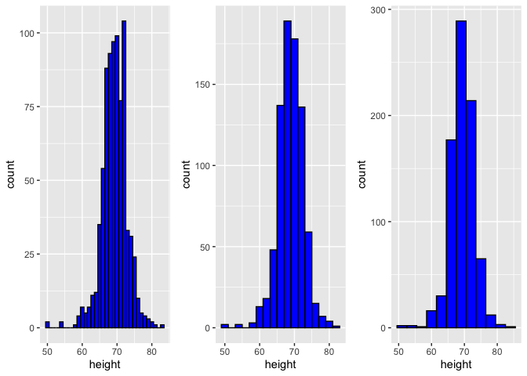
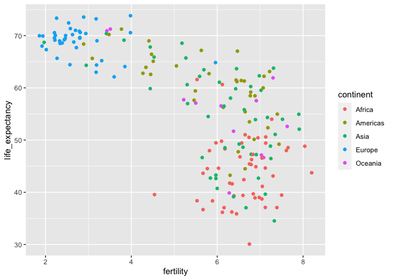
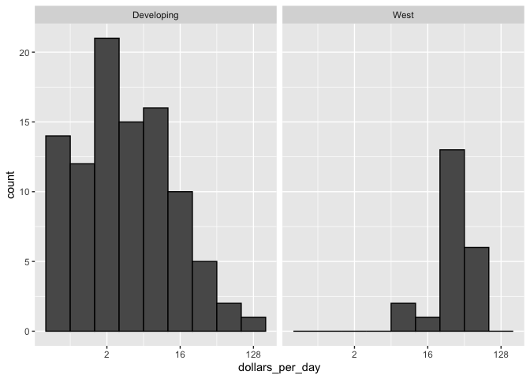
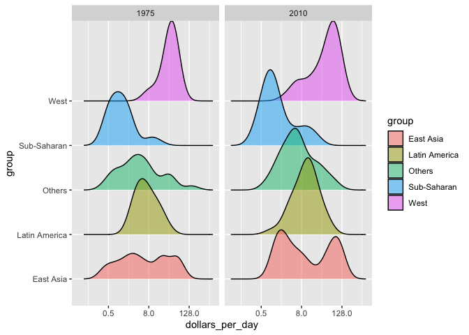

PH125.2 Data Visualisation | Notes
================

## 2.1 Introduction

### Data types

Categorical data are variables that are defined by a small number of
groups. Ordinal categorical data have an inherent order to the
categories (mild/medium/hot, for example). Non-ordinal categorical data
have no order to the categories. Numerical data take a variety of
numeric values. Continuous variables can take any value. Discrete
variables are limited to sets of specific values.

Use the unique and length functions to determine how many unique heights
were reported

``` r
x <- heights$height
length(unique(x))
```

    ## [1] 139

There are 139 different measurements of height in the heights dataset

Use the `table` function to compute the frequencies of each unique
height value. Because we are using the resulting frequency table in a
later exercise we want you to save the results into an object and call
it `tab`.

``` r
x <- heights$height
tab <- table(x)
```

To see why treating the reported heights as an ordinal value is not
useful in practice we note how many values are reported only once.

``` r
sum(tab==1)
```

    ## [1] 63

 

### Distributions

A frequency table is the simplest way to show a categorical
distribution. Use `prop.table()` to convert a table of counts to a
frequency table.

``` r
table(heights$sex)
```

    ## 
    ## Female   Male 
    ##    238    812

``` r
prop.table(table(heights$sex))
```

    ## 
    ##    Female      Male 
    ## 0.2266667 0.7733333

#### CDF Cumulative Distribution Function

For continuous numerical data, reporting the frequency of each unique
entry is not an effective summary as many or most values are unique.

The cumulative distribution function (CDF) reports the proportion of
data below a value 𝑎 for all values of 𝑎 : 𝐹(𝑎)=Pr(𝑥≤𝑎) The proportion
of observations between any two values 𝑎 and 𝑏 can be computed from the
CDF as 𝐹(𝑏)−𝐹(𝑎)

**For datasets that are not Normal**

    # define range of values spanning the dataset
    a <- seq(min(my_data), max(my_data), length = 100)    
    
    # computes prob. for a single value
    cdf_function <- function(x) {                         
      mean(my_data <= x)
    }
    cdf_values <- sapply(a, cdf_function)
    plot(a, cdf_values)

``` r
# define the interval from min to max, with 100 values
a <- seq(min(heights$height), max(heights$height), length = 100)    

#create the function that returns probability for height < x
cdf_function <- function (x) {    
  mean(heights$height <= x)
}
# apply function to vector a (range of 100 heights from min to max)
cdf_values <- sapply(a, cdf_function)

#plot
plot(a, cdf_values, type="l")
```

<!-- -->

 

#### Normal distribution

  - Is centered around one value, the mean.
  - Is symmetric around the mean
  - Is defined completely by its mean (μ) and standard deviation ( σ )
  - Always has the same proportion of observations within a given
    distance of the mean (for example, 95% within 2 σ)

<!-- -->

Calculating mean and sd in heights

``` r
average <- mean(heights$height)
SD <- sd(heights$height)
```

``` r
average
```

    ## [1] 68.32301

``` r
SD
```

    ## [1] 4.078617

**Standard units** describe how many standard deviations a value is away
from the mean. The z-score, or number of standard deviations an
observation x is away from the mean μ: Z=(x−μ)/σ

``` r
z <- function(x) {
  (x-average)/SD
}

#standard units for the smallest, tallest and average:

z(min(x))
```

    ## [1] -4.492457

``` r
z(max(x))
```

    ## [1] 3.519368

``` r
z(average)
```

    ## [1] 0

  - z \< 0 ; below average height
  - z \> 0 ; above average height

Z-scores are useful to quickly evaluate whether an observation is
average or extreme. Z-scores near 0 are average. Z-scores above 2 or
below -2 are significantly above or below the mean, and z-scores above 3
or below -3 are extremely rare.

The `scale()` function converts a vector of approximately normally
distributed values into z-scores.

``` r
x <- heights$height
z <- scale(x)
```

You can compute the proportion of observations that are within 2
standard deviations of the mean like this:

``` r
mean(abs(z) < 2)
```

    ## [1] 0.9466667

The normal distribution is associated with the 68-95-99.7 rule. This
rule describes the probability of observing events within a certain
number of standard deviations of the mean.

 

#### The normal CDF and pnorm

We can estimate the probability that a male is taller than 70.5 inches
with:

``` r
1 - pnorm(70.5, mean(x), sd(x))
```

    ## [1] 0.2967551

Plot distribution of exact heights in
data

``` r
plot(prop.table(table(x)), xlab = "a = Height in inches", ylab = "Pr(x = a)")
```

<!-- -->

Load the height data set and create a vector x with just the male
heights:

``` r
x <- heights$height[heights$sex == "Male"]
male_avg <- mean(x)
male_sd <- sd(x)
```

What proportion of the data is between 69 and 72 inches (taller than 69
but shorter or equal to 72)? A proportion is between 0 and 1.

``` r
mean(x>69 & x<=72)
```

    ## [1] 0.3337438

Suppose you only have avg and stdev below, but no access to x, can you
approximate the proportion of the data that is between 69 and 72 inches?

``` r
pnorm(72,male_avg,male_sd)-pnorm(69,male_avg,male_sd)
```

    ## [1] 0.3061779

Notice that the approximation calculated in the second question is very
close to the exact calculation in the first question. The normal
distribution was a useful approximation for this case.   However, the
approximation is not always useful. An example is for the more extreme
values, often called the “tails” of the distribution. Let’s look at an
example. We can compute the proportion of heights between 79 and
81.

``` r
# Not accurate when going to extreme, e.g. estimating proportion of heights between 79 and 81

x <- heights$height[heights$sex == "Male"]
exact <- mean(x > 79 & x <= 81)
avg <- mean(x)
sd <- sd(x)
approx <- pnorm(81,avg,sd)-pnorm(79,avg,sd)

exact/approx
```

    ## [1] 1.614261

 

### Quantiles, Percentiles and Boxplots

 

#### Quantiles

Quantiles are cutoff points that divide a dataset into intervals with
set probabilities. The 𝑞 th quantile is the value at which 𝑞 % of the
observations are equal to or less than that value.

Given a dataset data and desired quantile q, you can find the qth
quantile of data with:

`quantile(data,q)`

 

#### Percentiles

Percentiles re the quantiles that divide a dataset into 100 intervals
each with 1% probability. You can determine all percentiles of a dataset
data like this:

p \<- seq(0.01, 0.99, 0.01) quantile(data, p)

 

#### Quartiles

Divide a dataset into 4 parts each with 25% probability. They are equal
to the 25th, 50th and 75th percentiles. The 25th percentile is also
known as the 1st quartile, the 50th percentile is also known as the
median, and the 75th percentile is also known as the 3rd quartile.

 

#### Examples

The `summary()` function returns the minimum, quartiles and maximum of a
vector.

``` r
summary(heights$height)
```

    ##    Min. 1st Qu.  Median    Mean 3rd Qu.    Max. 
    ##   50.00   66.00   68.50   68.32   71.00   82.68

Find the percentiles of heights$height:

``` r
p <- seq(0.01, 0.99, 0.01)
percentiles <- quantile(heights$height, p)
head(percentiles)
```

    ## 1% 2% 3% 4% 5% 6% 
    ## 59 60 60 61 62 62

Confirm that the 25th and 75th percentiles match the 1st and 3rd
quartiles. Note that quantile() returns a named vector. You can access
the 25th and 75th percentiles like this (adapt the code for other
percentile values):

``` r
percentiles[names(percentiles) == "25%"]
```

    ## 25% 
    ##  66

``` r
percentiles[names(percentiles) == "75%"]
```

    ## 75% 
    ##  71

 

#### `qnorm()` function

Theoretical value of a quantile with probability p of observing a value
equal to or less than that quantile value given a normal distribution
with mean mu and standard deviation sigma:

`qnorm(p, mu, sigma)`

By default, mu=0 and sigma=1. Therefore, calling qnorm() with no
arguments gives quantiles for the standard normal distribution.

`qnorm(p)`

Recall that quantiles are defined such that p is the probability of a
random observation less than or equal to the quantile.

``` r
qnorm(0.025)
```

    ## [1] -1.959964

 

#### `pnorm()` function

Gives the probability that a value from a standard normal distribution
will be less than or equal to a z-score value z. Consider:

``` r
pnorm(-1.96) 
```

    ## [1] 0.0249979

The result of pnorm() is the quantile (~0.025). Note that:

qnorm() and pnorm() are inverse functions:

``` r
pnorm(qnorm(0.025))
```

    ## [1] 0.025

 

#### Theoretical quantiles

You can use qnorm() to determine the theoretical quantiles of a dataset:
that is, the theoretical value of quantiles assuming that a dataset
follows a normal distribution. Run the qnorm() function with the desired
probabilities p, mean mu and standard deviation sigma.

Suppose male heights follow a normal distribution with a mean of 69
inches and standard deviation of 3 inches. The theoretical quantiles
are:

``` r
p <- seq(0.01, 0.99, 0.01)
theoretical_quantiles <- qnorm(p, 69, 3)
head(theoretical_quantiles)
```

    ## [1] 62.02096 62.83875 63.35762 63.74794 64.06544 64.33568

 

#### QQ-plots

Are used to check whether distributions are well-approximated by a
normal distribution.

Given a proportion p, the quantile q is the value such that the
proportion of values in the data below q is p

``` r
index <- heights$sex=="Male"
x <- heights$height[index]
z <- scale(x)
```

Proportion of data below 69.5

``` r
mean(x <= 69.5)
```

    ## [1] 0.5147783

Calculate observed and theoretical quantiles

``` r
p <- seq(0.05, 0.95, 0.05)
observed_quantiles <- quantile(x, p)

observed_quantiles
```

    ##       5%      10%      15%      20%      25%      30%      35%      40% 
    ## 63.90079 65.00000 66.00000 67.00000 67.00000 68.00000 68.00000 68.62236 
    ##      45%      50%      55%      60%      65%      70%      75%      80% 
    ## 69.00000 69.00000 70.00000 70.00000 70.86614 71.00000 72.00000 72.00000 
    ##      85%      90%      95% 
    ## 72.44000 73.22751 75.00000

``` r
theoretical_quantiles <- qnorm(p, mean = mean(x), sd = sd(x))

theoretical_quantiles
```

    ##  [1] 63.37515 64.68704 65.57217 66.27564 66.87916 67.42113 67.92335 68.39991
    ##  [9] 68.86099 69.31475 69.76852 70.22960 70.70616 71.20838 71.75035 72.35387
    ## [17] 73.05734 73.94247 75.25436

QQ-plot

``` r
plot(theoretical_quantiles, observed_quantiles)
abline(0,1)
```

<!-- -->

 

#### Boxplots

In a boxplot, the box is defined by the 25th and 75th percentiles and
the median is a horizontal line through the box. The whiskers show the
range excluding outliers, and outliers are plotted separately as
individual points. The interquartile range is the distance between the
25th and 75th percentiles.

``` r
Male <- heights$sex=="Male"
Female <- heights$sex=="Female"

M <- heights$height[Male]
F <- heights$height[Female]

boxplot(M,F)
```

<!-- -->

##### Exercise with percentiles

``` r
# vectors with heights for each gender

male <- heights$height[heights$sex=="Male"]
female <- heights$height[heights$sex=="Female"]

# the 10th, 30th, 50th, 70th, and 90th percentiles for the heights of each sex

p <- seq(0.1,0.9,0.2)
male_percentiles <- quantile(male,p)
female_percentiles <- quantile(female,p)

# data frame with percentiles
df <- data.frame(male=male_percentiles,female=female_percentiles)
df
```

    ##         male   female
    ## 10% 65.00000 61.00000
    ## 30% 68.00000 63.00000
    ## 50% 69.00000 64.98031
    ## 70% 71.00000 66.46417
    ## 90% 73.22751 69.00000

   

## 2.2 ggplot2

 

### ggplot basics

[ggplot
cheatsheet](https://rstudio.com/wp-content/uploads/2015/03/ggplot2-cheatsheet.pdf)

In ggplot2 we create graphs by adding layers. Layers can define
geometries, compute summary statistics, define what scales to use, or
even change styles. To add layers, we use the symbol +. In general, a
line of code will look like this:

`DATA %>% ggplot() + LAYER 1 + LAYER 2 + … + LAYER N`

Plots in ggplot2 consist of 3 main components:

  - **Data**: The dataset being summarized
  - **Geometry**: The type of plot (scatterplot, boxplot, barplot,
    histogram, qqplot, smooth density, etc.)
  - **Aesthetic mapping**: Variables mapped to visual cues, such as
    x-axis and y-axis values and color

There are additional components:

  - Scale
  - Labels, Title, Legend
  - Theme/Style

You can associate a dataset x with a ggplot object with any of the 3
commands:

`ggplot(data = x)` `ggplot(x)` `x %>% ggplot()`

### Customising plots

**Aesthetic mappings** describe how properties of the data connect with
features of the graph

``` r
murders %>% ggplot(aes(x = population/10^6, y = total)) + geom_point()
```

<!-- -->

We can store it as
`graph`

``` r
graph <- murders %>% ggplot() + geom_point(aes(x=population/10^6,y=total))
```

 

#### labels

`label=` within the `aes` argument

``` r
graph <- graph + geom_text(aes(population/10^6, total, label = abb))
graph
```

<!-- -->

`size` to change points size `nudge` to move labels

``` r
p <- murders %>% ggplot()

p + geom_point(aes(population/10^6, total), size = 3) + geom_text(aes(population/10^6, total, label = abb),nudge_x=1.5)
```

<!-- -->

 

#### global vs local `aes`

If we define a mapping in ggplot, all the geometries that are added as
layers will default to this mapping. We redefine p:

``` r
p <- murders %>% ggplot(aes(population/10^6, total, label = abb))
```

and then we can simply write the following code to produce the previous
plot:

``` r
p + geom_point(size = 3) + geom_text(nudge_x = 1.5)
```

<!-- -->

 

#### log scales and axis names

``` r
murders %>%
  ggplot(aes(population/10^6, total, label = abb)) +
  scale_x_log10() +
  scale_y_log10() +
  xlab("Population in millions (log scale)") +
  ylab("Total number of murders (log scale)") +
  ggtitle("US Gun Murders in 2010")
```

<!-- -->

We can redefine p to contain everything except the point geometry:

``` r
p <- murders %>%
  ggplot(aes(population/10^6, total, label = abb)) +
  geom_text(nudge_x = 0.075) +
  scale_x_log10() +
  scale_y_log10() +
  xlab("Population in millions (log scale)") +
  ylab("Total number of murders (log scale)") +
  ggtitle("US Gun Murders in 2010")
```

then we can tinker geom\_point separately

``` r
p + geom_point(size=3, col="blue")
```

<!-- -->

 

#### color

To color points by region, we need to map geom\_point to specify that
the categorical data associated with colour (col) is region

``` r
p + geom_point(aes(col = region), size = 3)
```

<!-- -->

 

#### abline

we want to add a line that represents the average murder rate for the
entire country. Once we determine the per million rate to be r , this
line is defined by the formula:  
`y=rx`, with y and x our axes: total murders and population in millions,
respectively. In the log-scale this line turns into:

`log(y) = log(r) + log(x)`

So in our plot it’s a line with slope 1 and intercept log(r). To compute
this value, we use our dplyr skills:

``` r
r <- murders %>% 
  summarize(rate = sum(total) /  sum(population) * 10^6) %>% 
  pull(rate)
```

To add a line we use the geom\_abline function. ggplot2 uses ab in the
name to remind us we are supplying the intercept (a) and slope (b). The
default line has slope 1 and intercept 0 so we only have to define the
intercept:

``` r
p + geom_point(aes(col=region), size = 3) + 
  geom_abline(intercept = log10(r))
```

<!-- -->

To change the line and capitalise “Region” in legend
`geom_abline(intercept = log10(r),lty=2,color="darkgrey")`
`scale_color_discrete(name =
"Region")`

``` r
p + geom_point(aes(col=region),size=3) + geom_abline(intercept = log10(r),lty=2,color="darkgrey") + scale_color_discrete(name = "Region")
```

<!-- -->

Putting all together from scratch

``` r
#define intercept

r <- murders %>% summarise(rate=sum(total)/sum(population)*10^6) %>% pull(rate)

#make the plot combining all elements

murders %>% ggplot(aes(population/10^6,total,label=abb)) +
  geom_point(aes(col=region),size=3) +
  scale_x_log10() +
  scale_y_log10() +
  xlab ("Population in millions (log scale)") +
  ylab ("Total number of murders (log scale)") +
  ggtitle("US Murders in 2010") +
  geom_abline(intercept=log10(r),lty=2,color="darkgrey") +
  scale_color_discrete(name="Region") +
  geom_text_repel() +  # avoids overlap of labels
  theme_economist()    # changes the plot look and feel
```

<!-- -->

 

#### geom\_histogram()

``` r
p <- heights %>% filter(sex=="Male") %>% ggplot(aes(x=height))
p + geom_histogram(binwidth = 1,fill="blue",color="black") +
  xlab("Male height in inches") +
  ggtitle("Heights Histogram")
```

<!-- -->

 

#### geom\_density()

``` r
p <- heights %>% filter(sex=="Male") %>% ggplot(aes(x=height))
p + geom_density(fill="blue") +
  xlab("Male height in inches") +
  ggtitle("Heights Density")
```

<!-- -->

 

#### geom\_qq()

``` r
heights %>% filter(sex=="Male") %>%
  ggplot(aes(sample = height)) +
  geom_qq()
```

<!-- -->

By default, the sample variable is compared to a normal distribution
with average 0 and standard deviation 1. To change this, we use the
dparams arguments based on the help file. Adding an identity line is as
simple as assigning another layer. For straight lines, we use the
geom\_abline function. The default line is the identity line (slope = 1,
intercept = 0).

``` r
params <- heights %>% filter(sex=="Male") %>%
  summarize(mean = mean(height), sd = sd(height))
params
```

    ##       mean       sd
    ## 1 69.31475 3.611024

``` r
heights %>% filter(sex=="Male") %>%
  ggplot(aes(sample = height)) +
  geom_qq(dparams = params) +
  geom_abline()
```

<!-- -->

 

#### gridExtra package

``` r
p <- heights %>% filter(sex == "Male") %>% ggplot(aes(x = height))
p1 <- p + geom_histogram(binwidth = 1, fill = "blue", col = "black")
p2 <- p + geom_histogram(binwidth = 2, fill = "blue", col = "black")
p3 <- p + geom_histogram(binwidth = 3, fill = "blue", col = "black")

# arrange plots next to each other in 1 row, 3 columns

grid.arrange(p1, p2, p3, ncol = 3)
```

<!-- -->

   

## 2.3 Summarising with `dplyr`

 

``` r
s <- heights %>% 
  filter(sex == "Female") %>%
  summarize(average = mean(height), standard_deviation = sd(height))
s
```

    ##    average standard_deviation
    ## 1 64.93942           3.760656

This takes our original data table as input, filters it to keep only
females, and then produces a **new summarized table** with just the
average and the standard deviation of heights. We get to choose the
names of the columns of the resulting table. For example, above we
decided to use `average` and `standard_deviation`, but we could have
used other names just the same.

 

### accessor

Because the resulting table stored in s is a data frame, we can access
the components with the accessor $:

``` r
s$average
```

    ## [1] 64.93942

``` r
s$standard_deviation
```

    ## [1] 3.760656

 

### the dot placeholder

``` r
# calculate US murder rate, generating a data frame
us_murder_rate <- murders %>%
    summarize(rate = sum(total) / sum(population) * 100000)
us_murder_rate
```

    ##       rate
    ## 1 3.034555

``` r
# extract the numeric US murder rate with the dot operator
us_murder_rate %>% .$rate
```

    ## [1] 3.034555

``` r
# calculate and extract the murder rate with one pipe
us_murder_rate <- murders %>%
    summarize(rate = sum(total) / sum(population * 100000)) %>%
    .$rate

# Several options to do the same
```

 

### group\_by

compute separate average and standard deviation for male/female heights

``` r
heights %>%
    group_by(sex) %>%
    summarize(average = mean(height), standard_deviation = sd(height))
```

    ## # A tibble: 2 x 3
    ##   sex    average standard_deviation
    ##   <fct>    <dbl>              <dbl>
    ## 1 Female    64.9               3.76
    ## 2 Male      69.3               3.61

Compute median murder rate in 4 regions of US

``` r
murders <- murders %>%
    mutate(rate = total/population * 100000)
murders %>%
    group_by(region) %>%
    summarize(median_rate = median(rate))
```

    ## # A tibble: 4 x 2
    ##   region        median_rate
    ##   <fct>               <dbl>
    ## 1 Northeast            1.80
    ## 2 South                3.40
    ## 3 North Central        1.97
    ## 4 West                 1.29

 

### sorting data tables

``` r
murders <- murders %>% mutate(rate=total/population*100000)

# arrange by murder rate, smallest to largest
murders %>% arrange(rate) %>% head()
```

    ##           state abb        region population total      rate
    ## 1       Vermont  VT     Northeast     625741     2 0.3196211
    ## 2 New Hampshire  NH     Northeast    1316470     5 0.3798036
    ## 3        Hawaii  HI          West    1360301     7 0.5145920
    ## 4  North Dakota  ND North Central     672591     4 0.5947151
    ## 5          Iowa  IA North Central    3046355    21 0.6893484
    ## 6         Idaho  ID          West    1567582    12 0.7655102

``` r
# arrange by murder rate in descending order
murders %>% arrange(desc(rate)) %>% head()
```

    ##                  state abb        region population total      rate
    ## 1 District of Columbia  DC         South     601723    99 16.452753
    ## 2            Louisiana  LA         South    4533372   351  7.742581
    ## 3             Missouri  MO North Central    5988927   321  5.359892
    ## 4             Maryland  MD         South    5773552   293  5.074866
    ## 5       South Carolina  SC         South    4625364   207  4.475323
    ## 6             Delaware  DE         South     897934    38  4.231937

``` r
# arrange by region alphabetically, then by murder rate within each region
murders %>% arrange(region, rate) %>% head()
```

    ##           state abb    region population total      rate
    ## 1       Vermont  VT Northeast     625741     2 0.3196211
    ## 2 New Hampshire  NH Northeast    1316470     5 0.3798036
    ## 3         Maine  ME Northeast    1328361    11 0.8280881
    ## 4  Rhode Island  RI Northeast    1052567    16 1.5200933
    ## 5 Massachusetts  MA Northeast    6547629   118 1.8021791
    ## 6      New York  NY Northeast   19378102   517 2.6679599

``` r
# show the top 10 states with highest murder rate, ordered by rate
murders %>% arrange(desc(rate)) %>% top_n(10)
```

    ## Selecting by rate

    ##                   state abb        region population total      rate
    ## 1  District of Columbia  DC         South     601723    99 16.452753
    ## 2             Louisiana  LA         South    4533372   351  7.742581
    ## 3              Missouri  MO North Central    5988927   321  5.359892
    ## 4              Maryland  MD         South    5773552   293  5.074866
    ## 5        South Carolina  SC         South    4625364   207  4.475323
    ## 6              Delaware  DE         South     897934    38  4.231937
    ## 7              Michigan  MI North Central    9883640   413  4.178622
    ## 8           Mississippi  MS         South    2967297   120  4.044085
    ## 9               Georgia  GA         South    9920000   376  3.790323
    ## 10              Arizona  AZ          West    6392017   232  3.629527

``` r
head(NHANES)
```

    ## # A tibble: 6 x 76
    ##      ID SurveyYr Gender   Age AgeDecade AgeMonths Race1 Race3 Education
    ##   <int> <fct>    <fct>  <int> <fct>         <int> <fct> <fct> <fct>    
    ## 1 51624 2009_10  male      34 " 30-39"        409 White <NA>  High Sch…
    ## 2 51624 2009_10  male      34 " 30-39"        409 White <NA>  High Sch…
    ## 3 51624 2009_10  male      34 " 30-39"        409 White <NA>  High Sch…
    ## 4 51625 2009_10  male       4 " 0-9"           49 Other <NA>  <NA>     
    ## 5 51630 2009_10  female    49 " 40-49"        596 White <NA>  Some Col…
    ## 6 51638 2009_10  male       9 " 0-9"          115 White <NA>  <NA>     
    ## # … with 67 more variables: MaritalStatus <fct>, HHIncome <fct>,
    ## #   HHIncomeMid <int>, Poverty <dbl>, HomeRooms <int>, HomeOwn <fct>,
    ## #   Work <fct>, Weight <dbl>, Length <dbl>, HeadCirc <dbl>, Height <dbl>,
    ## #   BMI <dbl>, BMICatUnder20yrs <fct>, BMI_WHO <fct>, Pulse <int>,
    ## #   BPSysAve <int>, BPDiaAve <int>, BPSys1 <int>, BPDia1 <int>, BPSys2 <int>,
    ## #   BPDia2 <int>, BPSys3 <int>, BPDia3 <int>, Testosterone <dbl>,
    ## #   DirectChol <dbl>, TotChol <dbl>, UrineVol1 <int>, UrineFlow1 <dbl>,
    ## #   UrineVol2 <int>, UrineFlow2 <dbl>, Diabetes <fct>, DiabetesAge <int>,
    ## #   HealthGen <fct>, DaysPhysHlthBad <int>, DaysMentHlthBad <int>,
    ## #   LittleInterest <fct>, Depressed <fct>, nPregnancies <int>, nBabies <int>,
    ## #   Age1stBaby <int>, SleepHrsNight <int>, SleepTrouble <fct>,
    ## #   PhysActive <fct>, PhysActiveDays <int>, TVHrsDay <fct>, CompHrsDay <fct>,
    ## #   TVHrsDayChild <int>, CompHrsDayChild <int>, Alcohol12PlusYr <fct>,
    ## #   AlcoholDay <int>, AlcoholYear <int>, SmokeNow <fct>, Smoke100 <fct>,
    ## #   Smoke100n <fct>, SmokeAge <int>, Marijuana <fct>, AgeFirstMarij <int>,
    ## #   RegularMarij <fct>, AgeRegMarij <int>, HardDrugs <fct>, SexEver <fct>,
    ## #   SexAge <int>, SexNumPartnLife <int>, SexNumPartYear <int>, SameSex <fct>,
    ## #   SexOrientation <fct>, PregnantNow <fct>

``` r
NHANES %>% 
    filter(Gender=="male" & AgeDecade==" 40-49") %>%
group_by(Race1) %>%
summarise(average=mean(BPSysAve,na.rm=TRUE),standard_deviation=sd(BPSysAve,na.rm=TRUE)) %>%
    arrange(average)
```

    ## # A tibble: 5 x 3
    ##   Race1    average standard_deviation
    ##   <fct>      <dbl>              <dbl>
    ## 1 White       120.               13.4
    ## 2 Other       120.               16.2
    ## 3 Hispanic    122.               11.1
    ## 4 Mexican     122.               13.9
    ## 5 Black       126.               17.1

   

## 2.4 Gapminder

 

``` r
gapminder %>% as_tibble()
```

    ## # A tibble: 10,545 x 9
    ##    country  year infant_mortality life_expectancy fertility population      gdp
    ##    <fct>   <int>            <dbl>           <dbl>     <dbl>      <dbl>    <dbl>
    ##  1 Albania  1960            115.             62.9      6.19    1636054 NA      
    ##  2 Algeria  1960            148.             47.5      7.65   11124892  1.38e10
    ##  3 Angola   1960            208              36.0      7.32    5270844 NA      
    ##  4 Antigu…  1960             NA              63.0      4.43      54681 NA      
    ##  5 Argent…  1960             59.9            65.4      3.11   20619075  1.08e11
    ##  6 Armenia  1960             NA              66.9      4.55    1867396 NA      
    ##  7 Aruba    1960             NA              65.7      4.82      54208 NA      
    ##  8 Austra…  1960             20.3            70.9      3.45   10292328  9.67e10
    ##  9 Austria  1960             37.3            68.8      2.7     7065525  5.24e10
    ## 10 Azerba…  1960             NA              61.3      5.57    3897889 NA      
    ## # … with 10,535 more rows, and 2 more variables: continent <fct>, region <fct>

 

### filter(), %in%, select()

Comparing infant\_mortality between Sri Lanka and Turkey

``` r
gapminder %>% 
  filter(year==2015 & country %in% c("Sri Lanka","Turkey")) %>%
  select(country,infant_mortality)
```

    ##     country infant_mortality
    ## 1 Sri Lanka              8.4
    ## 2    Turkey             11.6

 

### plot color grouping

``` r
gapminder %>% 
  filter(year==1962) %>%
  ggplot(aes(fertility,life_expectancy,color=continent)) +
  geom_point()
```

<!-- -->

 

### facet\_grid()

``` r
gapminder %>% 
  filter(year %in% c(1962,2002)) %>%
  ggplot(aes(fertility,life_expectancy,color=continent)) +
  geom_point() +
  facet_grid(continent~year)
```

<!-- -->

 

### facet\_wrap()

``` r
years <- c(1962,1980,1990,2000,2012)
continents <- c("Europe","Asia")

gapminder %>% 
  filter(year %in% years & continent %in% continents) %>%
  ggplot(aes(fertility,life_expectancy,color=continent)) +
  geom_point() +
  facet_wrap(~year)
```

<!-- -->

 

### labels x,y coordinates

``` r
countries <- c("South Korea", "Germany")
labels <- data.frame(country=countries, x=c(1978,1965), y=c(60,68))

gapminder %>%
  filter(country %in% countries) %>%
  ggplot(aes(year,life_expectancy,color=country)) +
  geom_line() +
  geom_text(data=labels, aes(x,y,label=country),size=5)
```

<!-- -->

 

### log scales

`scale_x_continuous(trans = "log2")` in D2

``` r
gapminder <- gapminder %>%
  mutate(dollars_per_day=gdp/population/365)

d1 <- gapminder %>%
  filter(year == 1970 & !is.na(gdp)) %>%
  ggplot(aes(dollars_per_day)) +
  geom_histogram(binwidth = 1, color = "black") +
  ggtitle("D1 no scale transformation")

d2 <- gapminder %>%
  filter(year == 1970 & !is.na(gdp)) %>%
  ggplot(aes(dollars_per_day)) +
  geom_histogram(binwidth = 1, color = "black") +
  scale_x_continuous(trans = "log2") +
  ggtitle("D2 log2 scale")

grid.arrange(d1,d2,nrow=1)
```

<!-- -->

 

### axis text 90 degrees

``` r
gapminder %>%
  filter(year==1970) %>%
  ggplot(aes(region,dollars_per_day)) +
  geom_boxplot() +
  theme(axis.text.x = element_text(angle = 90,hjust = 1))
```

    ## Warning: Removed 72 rows containing non-finite values (stat_boxplot).

<!-- -->

 

### redorder()

``` r
fac <- factor(c("Asia","Asia","West","West","West"))

levels(fac)
```

    ## [1] "Asia" "West"

It is ordered alphabetically by default

``` r
value <- c(10,11,12,6,4)
```

If we want to order Asia and West based on the mean of values:

``` r
fac <- reorder(fac, value, FUN=mean)

levels(fac)
```

    ## [1] "West" "Asia"

We can reorder the previous boxplot.

`is.na()`is used to filter out any NAs, including only countries with
actual values for gdp

``` r
gapminder %>%
  filter(year == 1970 & !is.na(gdp)) %>%
  mutate(region = reorder(region, dollars_per_day, FUN = median)) %>%    
  ggplot(aes(region, dollars_per_day, fill = continent)) +   
  scale_y_continuous(trans = "log2") +
  geom_boxplot() +
  theme(axis.text.x = element_text(angle = 90, hjust = 1)) +
  xlab("")
```

<!-- -->

 

### further grouping with ifelse()

We define a vector that groups regions in the
“West”

``` r
west <- c("Northern Europe","Southern Europe","Western Europe", "Northern America", "Australia and New Zealand")
```

We can use ifelse to group regions into West or Developing

``` r
gapminder %>%
  filter(year==1975 & !is.na(gdp)) %>%
  mutate(group=ifelse(region %in% west, "West", "Developing")) %>%
  ggplot(aes(dollars_per_day)) +
  geom_histogram(binwidth = 1,color="black") +
  scale_x_continuous(trans = "log2") +
  facet_wrap(.~group)
```

<!-- -->

To compare by group AND year (ej 1975 vs 2010)

``` r
gapminder %>%
  filter(year==c(1975,2010) & !is.na(gdp)) %>%
  mutate(group=ifelse(region %in% west, "West", "Developing")) %>%
  ggplot(aes(dollars_per_day)) +
  geom_histogram(binwidth = 1,color="black") +
  scale_x_continuous(trans = "log2") +
  facet_grid(year~group)
```

    ## Warning in year == c(1975, 2010): longer object length is not a multiple of
    ## shorter object length

<!-- -->

 

### \!is.na()

BUT, we know there are more countries with data available in 2010 than
in 1970. We will re-do it using only those countries that have data for
both years

``` r
#countries with gdp different to NA in 1970
country_list1 <- gapminder %>%
  filter(year==1975 & !is.na(dollars_per_day)) %>%
  .$country


#countries with gdp different to NA in 2010
country_list2 <- gapminder %>%
  filter(year==2010 & !is.na(dollars_per_day)) %>%
  .$country


# vector of countries to use in the plot
country_list <- intersect(country_list1,country_list2)

gapminder %>%
    # filter to include only countries in country_list
  filter(year %in% c(1975,2010) & country %in% country_list) %>%
  mutate(group = ifelse(region %in% west, "West", "Developing")) %>%
  ggplot(aes(dollars_per_day)) +
  geom_histogram(binwidth = 1,color="black") +
  scale_x_continuous(trans = "log2") +
  facet_grid(year~group)
```

<!-- -->

 

### Comparing plots

``` r
gapminder %>%
  filter(year==c(1975,2010) & country %in% country_list) %>%
  mutate(region=reorder(region,dollars_per_day,FUN=median)) %>%
  ggplot(aes(region,dollars_per_day,fill=continent)) +
  geom_boxplot() +
  scale_y_continuous(trans = "log2") +
  theme(axis.text.x = element_text(angle=90,hjust=1)) +
  facet_grid(year~.)
```

<!-- -->

This plot is hard to compare, but we can use `fill=factor(year)`

``` r
gapminder %>%
  filter(year==c(1975,2010) & country %in% country_list) %>%
  mutate(region=reorder(region,dollars_per_day,FUN=median)) %>%
  ggplot(aes(region,dollars_per_day,fill=factor(year))) +
  geom_boxplot() +
  scale_y_continuous(trans = "log2") +
  theme(axis.text.x = element_text(angle=90,hjust=1))
```

<!-- -->

 

### Density plots

When we overlay two densities, the default is to have the area
represented by each distribution add up to 1, regardless of the size of
each group:

``` r
gapminder %>%
  filter(year == c(1975,2010) & country %in% country_list) %>%
  mutate(group=ifelse(region %in% west, "West", "Developing")) %>%
  ggplot(aes(dollars_per_day,fill=group)) +
  geom_density(alpha=0.2) +
  scale_x_continuous(trans = "log2") +
  facet_grid(year~.)
```

    ## Warning in year == c(1975, 2010): longer object length is not a multiple of
    ## shorter object length

<!-- -->

This makes it appear as if there are the same number of countries in
each group. To change this, we will need to learn to access computed
variables with `geom_density` function, adding `y=..count..`

``` r
gapminder %>%
  filter(year == c(1975,2010) & country %in% country_list) %>%
  mutate(group=ifelse(region %in% west, "West", "Developing")) %>%
  ggplot(aes(dollars_per_day,y=..count..,fill=group)) +
  geom_density(alpha=0.2,bw=0.65) +
  scale_x_continuous(trans = "log2", limit= c(0.125,300)) +
  facet_grid(year~.)
```

    ## Warning in year == c(1975, 2010): longer object length is not a multiple of
    ## shorter object length

<!-- -->

 

### Grouping with case\_when()

``` r
gapminder <- gapminder %>%
  mutate(dollars_per_day=gdp/population/365)

# use case_when() to group regions at a higher level
gapminder <- gapminder %>% 
  mutate(group = case_when(
    region %in% c("Western Europe", "Northern Europe","Southern Europe", 
                  "Northern America", 
                  "Australia and New Zealand") ~ "West",
    region %in% c("Eastern Asia", "South-Eastern Asia") ~ "East Asia",
    region %in% c("Caribbean", "Central America", 
                  "South America") ~ "Latin America",
    continent == "Africa" & 
      region != "Northern Africa" ~ "Sub-Saharan",
    TRUE ~ "Others"))

gapminder %>%
  filter(year %in% c(1975,2010) & !is.na(dollars_per_day)) %>%
  ggplot(aes(dollars_per_day,group,fill=group)) +
  geom_density_ridges(adjust=1.5,alpha=0.5) +
  scale_x_continuous(trans = "log2") +
  facet_grid(.~year)
```

    ## Warning: Ignoring unknown parameters: adjust

    ## Picking joint bandwidth of 0.684

    ## Picking joint bandwidth of 0.726

<!-- -->

 

### Stacked density plot

``` r
gapminder %>% 
  filter(year %in% c(1975,2010) & country %in% country_list) %>%
  group_by(year) %>%
  mutate(weight = population/sum(population)*2) %>%
  ungroup() %>%
  ggplot(aes(dollars_per_day, fill = group)) +
  scale_x_continuous(trans = "log2", limit = c(0.125, 300)) + 
  geom_density(alpha = 0.2, bw = 0.75, position = "stack") + 
  facet_grid(year ~ .)
```

<!-- -->

 

### Weighted densities

``` r
gapminder %>%
  filter(year %in% c(1975, 2010) & country %in% country_list) %>%
  mutate(weight=population/sum(population)*2) %>%
  ggplot(aes(dollars_per_day,fill=group,weight=weight)) +
  geom_density(alpha = 0.2, bw = 0.75, position = "stack") +
  scale_x_continuous(trans = "log2",limit=c(0.125,300)) +
  facet_grid(year~.)
```

<!-- -->

 

### Ecological fallacy

``` r
gapminder <- gapminder %>%
  mutate(group = case_when(
    .$region %in% west ~ "The West",
    .$region %in% "Northern Africa" ~ "Northern Africa",
    .$region %in% c("Eastern Asia", "South-Eastern Asia") ~ "East Asia",
    .$region == "Southern Asia" ~ "Southern Asia",
    .$region %in% c("Central America", "South America", "Caribbean") ~ "Latin America",
    .$continent == "Africa" & .$region != "Northern Africa" ~ "Sub-Saharan Africa",
    .$region %in% c("Melanesia", "Micronesia", "Polynesia") ~ "Pacific Islands"))


# define a data frame with group average income and average infant survival rate

surv_income <- gapminder %>%
  filter(year == 2010 & !is.na(gdp) & !is.na(infant_mortality) & !is.na(group)) %>%
  group_by(group) %>%
  summarise(income=sum(gdp)/sum(population)/365,
infant_survival_rate = 1 - sum(infant_mortality/1000*population)/sum(population))

# sort by income

surv_income %>% arrange(income)
```

    ## # A tibble: 7 x 3
    ##   group              income infant_survival_rate
    ##   <chr>               <dbl>                <dbl>
    ## 1 Sub-Saharan Africa   1.76                0.936
    ## 2 Southern Asia        2.07                0.952
    ## 3 Pacific Islands      2.70                0.956
    ## 4 Northern Africa      4.94                0.970
    ## 5 Latin America       13.2                 0.983
    ## 6 East Asia           13.4                 0.985
    ## 7 The West            77.1                 0.995

``` r
# plot

surv_income %>% ggplot(aes(income, infant_survival_rate, label = group, color = group)) +
  scale_x_continuous(trans = "log2", limit = c(0.25, 150)) +
  scale_y_continuous(trans = "logit", limit = c(0.875, .9981),
                     breaks = c(.85, .90, .95, .99, .995, .998)) +
  geom_label(size = 3, show.legend = FALSE) 
```

<!-- -->

Based on the plot above, do we conclude that a country with a low income
is destined to have low survival rate? Do we conclude that survival
rates in Sub-Saharan Africa are all lower than in Southern Asia, which
in turn are lower than in the Pacific Islands, and so on?

Jumping to this conclusion based on a plot showing averages is referred
to as the ecological fallacy. The almost perfect relationship between
survival rates and income is only observed for the averages at the
region level. Once we show all the data, we see a somewhat more
complicated
story:

``` r
GROUP <- surv_income %>% ggplot(aes(income, infant_survival_rate, label = group, color = group)) +
  scale_x_continuous(trans = "log2", limit = c(0.25, 150)) +
  scale_y_continuous(trans = "logit", limit = c(0.875, .9981),
                     breaks = c(.85, .90, .95, .99, .995, .998)) +
  geom_label(size = 3, show.legend = FALSE) 


COUNTRY <- gapminder %>% 
  filter(year == 2010 & !is.na(gdp) & !is.na(infant_mortality) & !is.na(group)) %>%
  group_by(group) %>%
  ggplot(aes(dollars_per_day,1-infant_mortality/1000,color=group)) +
  geom_point(size=3,alpha=0.5,show.legend = FALSE) +
  scale_x_continuous(trans = "log2", limit=c(.25,150)) +
  scale_y_continuous(trans = "logit",limit=c(0.875,.9981), breaks = c(.85, .90, .95, .99, .995, .998))

grid.arrange(GROUP,COUNTRY,nrow=1)
```

<!-- -->

We can conclude that the correlation works when using averages at the
region level but not examining the data at the country level

   

## 2.5 Data visualisation principles

**Don’t use pie charts**

**Don’t use D charts that add no value**

``` r
str(us_contagious_diseases)
```

    ## 'data.frame':    16065 obs. of  6 variables:
    ##  $ disease        : Factor w/ 7 levels "Hepatitis A",..: 1 1 1 1 1 1 1 1 1 1 ...
    ##  $ state          : Factor w/ 51 levels "Alabama","Alaska",..: 1 1 1 1 1 1 1 1 1 1 ...
    ##  $ year           : num  1966 1967 1968 1969 1970 ...
    ##  $ weeks_reporting: num  50 49 52 49 51 51 45 45 45 46 ...
    ##  $ count          : num  321 291 314 380 413 378 342 467 244 286 ...
    ##  $ population     : num  3345787 3364130 3386068 3412450 3444165 ...

``` r
the_disease <- "Measles"

dat <- us_contagious_diseases %>%
  filter(!state%in%c("Hawaii","Alaska") & disease == the_disease) %>%
  mutate(rate = count / population * 10000 * 52 / weeks_reporting) %>% 
  mutate(state = reorder(state, rate)) 


dat %>% filter(state == "California" & !is.na(rate)) %>%
  ggplot(aes(year, rate)) +
  geom_line() + 
  ylab("Cases per 10,000")  + 
  geom_vline(xintercept=1963, col = "blue")
```

<!-- -->

``` r
dat %>% ggplot(aes(year, state, fill = rate)) +
  geom_tile(color = "grey50") +
  scale_x_continuous(expand=c(0,0)) +
  scale_fill_gradientn(colors = brewer.pal(9, "Reds"), trans = "sqrt") +
  geom_vline(xintercept=1963, col = "blue") +
  theme_minimal() +  
  theme(panel.grid = element_blank(), 
        legend.position="bottom", 
        text = element_text(size = 8)) +
  ggtitle(the_disease) + 
  ylab("") + xlab("")
```

<!-- -->

To show the average for the US

``` r
# us rate for Measles (the_disease)

avg <- us_contagious_diseases %>%
  filter(disease==the_disease) %>%
  group_by(year) %>%
  summarise(us_rate=sum(count,na.rm=TRUE)/sum(population,na.rm=TRUE)*10000)

# first geom_line adds rate by state
# second geom_line adds us_rate from avg, calculated before

dat %>% 
  filter(!is.na(rate)) %>%
  ggplot() +
  geom_line(aes(year,rate,group=state),color="grey50",size=1,alpha=0.1,show.legend = FALSE) +
  scale_y_continuous(trans="sqrt",breaks=c(0,5, 25,125,300)) +
  geom_line(mapping = aes(year, us_rate),  data = avg, size = 1) +
  ggtitle("Cases per 10,000 by state") + 
  xlab("") + ylab("") +
  geom_text(data=data.frame(x=1955,y=60),mapping=aes(x,y,label="US average rate")) +
  geom_vline(xintercept = 1963,color="blue")
```

<!-- -->

   

## Exercises and examples

 

### TITANIC

``` r
library(titanic)

titanic <- titanic_train %>%
  select(Survived, Pclass, Sex, Age, SibSp, Parch, Fare) %>%
  mutate(Survived = factor(Survived),
         Pclass = factor(Pclass),
         Sex = factor(Sex))


# density

titanic %>% 
  ggplot(aes(x=Age,fill=Sex)) +
  geom_density(alpha=0.6)
```

<!-- -->

``` r
# density facet

titanic %>% 
  ggplot(aes(x=Age,fill=Sex)) +
  geom_density(alpha=0.6) +
  facet_grid(Sex~.)
```

<!-- -->

``` r
# count

titanic %>% 
  ggplot(aes(x=Age,y=..count..,fill=Sex)) +
  geom_density(alpha=0.6)
```

<!-- -->

``` r
# density facet

titanic %>% 
  ggplot(aes(x=Age,y=..count..,fill=Sex)) +
  geom_density(alpha=0.6) +
  facet_grid(Sex~.)
```

<!-- -->

``` r
#proportion of 18-35 male higher than women

titanic %>% 
  ggplot(aes(x=Age,fill=Sex)) +
  geom_density(alpha=0.6) +
  geom_vline(xintercept = 18) +
  geom_vline(xintercept = 35)
```

<!-- -->

``` r
#proportion of < 17 male higher than women

titanic %>% 
  ggplot(aes(x=Age,fill=Sex)) +
  geom_density(alpha=0.6) +
  geom_vline(xintercept = 17)
```

<!-- -->

``` r
# QUESTION 3 QQ plot age distribution

params <- titanic %>%
  filter(!is.na(Age)) %>%
  summarize(mean = mean(Age), sd = sd(Age))

titanic %>%
  ggplot(aes(sample = Age)) +
  geom_qq(dparams = params) +
  geom_abline()
```

<!-- -->

``` r
# QUESTION 4 survival by sex

titanic %>%
  ggplot(aes(Survived,y=..count..,fill=Sex)) +
  geom_bar(position = position_dodge())
```

<!-- -->

``` r
# QUESTION 5 survival by age

titanic %>%
  ggplot(aes(x=Age,y=..count..,fill=Survived)) +
  geom_density(alpha=0.4)
```

<!-- -->

``` r
# QUESTION 6 survival by fare 
# Filter the data to remove individuals who paid a fare of 0. 
# Make a boxplot of fare grouped by survival status. 
# Try a log2 transformation of fares. 
# Add the data points with jitter and alpha blending.

names(titanic)
```

    ## [1] "Survived" "Pclass"   "Sex"      "Age"      "SibSp"    "Parch"    "Fare"

``` r
titanic %>%
  filter(!Fare==0) %>%
  group_by(Survived) %>%
  ggplot(aes(Survived,Fare,color=Survived)) +
  geom_boxplot() +
  scale_y_continuous(trans = "log2") +
  geom_jitter(alpha=0.2,width = 0.1)
```

<!-- -->

``` r
# QUESTION 7 survival by passenger class

titanic %>%
  ggplot(aes(Pclass,y=..count..,fill=Survived)) +
  geom_bar()
```

<!-- -->

``` r
titanic %>%
  ggplot(aes(Pclass,y=..count..,fill=Survived)) +
  geom_bar(position = position_fill())
```

<!-- -->

``` r
titanic %>%
  ggplot(aes(Survived,y=..count..,fill=Pclass)) +
  geom_bar(position = position_fill())
```

<!-- -->

``` r
# QUESTION 7 survival by age, sex and passenger class
# Create a grid of density plots for age, filled by survival status, 
# with count on the y-axis, faceted by sex and passenger class.

titanic %>%
  filter(!is.na(Age)) %>%
  ggplot(aes(Age,y=..count..,fill=Survived)) +
  geom_density(alpha=0.5) +
  facet_grid(Sex~Pclass)
```

<!-- -->

``` r
titanic %>%
  filter(!is.na(Age)) %>%
  ggplot(aes(Age,y=..count..,fill=Pclass)) +
  geom_density(alpha=0.5) +
  facet_grid(.~Pclass)
```

<!-- -->

``` r
titanic %>%
  filter(!is.na(Age)) %>%
  ggplot(aes(Age,y=..count..,fill=Sex)) +
  geom_density(alpha=0.5) +
  facet_grid(Sex~Pclass)
```

<!-- -->

 

### STARS

``` r
data(stars)
options(digits = 3)   # report 3 significant 

mean(stars$magnitude)
```

    ## [1] 4.26

``` r
#4.26

sd(stars$magnitude)
```

    ## [1] 7.35

``` r
#7.35

# distribution of magnitude
stars %>%
  ggplot(aes(magnitude,y=..count..)) +
  geom_density(fill="grey")
```

<!-- -->

``` r
#distribution of temperature
stars %>%
  ggplot(aes(temp)) +
  geom_density(fill="grey")
```

<!-- -->

``` r
# scatter plot of temperature (X) and magnitude (Y)

stars %>%
  ggplot(aes(temp,magnitude)) +
  geom_point()
```

<!-- -->

``` r
# scatter plot of temperature (X) and magnitude (Y) with flipped axis

stars %>%
  ggplot(aes(temp,magnitude)) +
  geom_point() +
  scale_y_reverse() +
  scale_x_continuous(trans = "log10") +
  scale_x_reverse()
```

<!-- -->

``` r
# The least lumninous star in the sample with a surface temperature over 5000K
stars %>%
  ggplot(aes(temp,magnitude,label=star)) +
  geom_point() +
  geom_text_repel() +
  scale_y_reverse() +
  scale_x_continuous(trans = "log10") 
```

<!-- -->

``` r
# Color by star type

stars %>%
  ggplot(aes(temp,magnitude,color=type,label=type)) +
  geom_point() +
  geom_text_repel() +
  scale_y_reverse() +
  scale_x_continuous(trans = "log10") +
  scale_x_reverse()
```

<!-- -->

``` r
# G type

stars %>%
  filter(type=="G") %>%
  ggplot(aes(temp,magnitude,color=type)) +
  geom_point() +
  scale_y_reverse() +
  scale_x_continuous(trans = "log10")
```

<!-- -->

 

### CLIMATE CHANGE

``` r
data(temp_carbon)
data(greenhouse_gases)
data(historic_co2)


temp_carbon %>%
  filter(!is.na(carbon_emissions)) %>%
  pull(year) %>%
  max()
```

    ## [1] 2014

``` r
temp_carbon %>%
  filter(!is.na(carbon_emissions)) %>%
  .$year %>%
  max()
```

    ## [1] 2014

``` r
temp_carbon %>%
  filter(!is.na(carbon_emissions)) %>%
  select(year) %>%
  max()
```

    ## [1] 2014

``` r
# First year with carbon emissions available

temp_carbon %>%
  filter(!is.na(carbon_emissions)) %>%
  select(year) %>% min()
```

    ## [1] 1751

``` r
# Last year with carbon emissions available

temp_carbon %>%
  filter(!is.na(carbon_emissions)) %>%
  select(year) %>% max()
```

    ## [1] 2014

``` r
temp_carbon$carbon_emissions[temp_carbon$year==2014]/temp_carbon$carbon_emissions[temp_carbon$year==1751]
```

    ## [1] 3285

``` r
# First and last year with temp anomaly

temp_carbon %>%
  filter(!is.na(temp_anomaly)) %>%
  .$year %>% min()
```

    ## [1] 1880

``` r
temp_carbon %>%
  filter(!is.na(temp_anomaly)) %>%
  .$year %>% max()
```

    ## [1] 2018

``` r
min <- temp_carbon$temp_anomaly[temp_carbon$year==1880]
max <- temp_carbon$temp_anomaly[temp_carbon$year==2018]


# 20th century mean temperature

TA20 <- temp_carbon %>%
  filter(!is.na(temp_anomaly) & year %in% c(1901:2000))

colMeans(TA20)
```

    ##             year     temp_anomaly     land_anomaly    ocean_anomaly 
    ##        1950.5000           0.0004          -0.0002          -0.0002 
    ## carbon_emissions 
    ##        2704.6900

``` r
# temperature with blue line for mean 20th century

p <- TA20 %>%
  ggplot(aes(year,temp_anomaly)) +
  geom_line()


p <- p + geom_hline(aes(yintercept = 0), col = "blue")
p
```

<!-- -->

``` r
TA20 %>%
  ggplot(aes(year,temp_anomaly)) +
  geom_line() +
  geom_hline(yintercept = 0, col="blue") +
  ylab("Temperature anomaly (degrees C)") +
  ggtitle("Temperature anomaly relative to 20th century mean, 1880-2018") +
  geom_text(aes(x = 2000, y = 0.05, label = "20th century mean"), col = "blue") +
  geom_vline(aes(xintercept=1939),col="red") +
  geom_vline(aes(xintercept=1976),col="orange") +
  geom_text(aes(x=1936,y=0.05,label="1939"),col="red") +
  geom_text(aes(x=1978,y=0.05,label="1976"),col="orange")
```

<!-- -->

``` r
TA20 %>%
  filter(temp_anomaly>0) %>%
  .$year %>% min()
```

    ## [1] 1939

``` r
TA20 %>%
  filter(temp_anomaly<0) %>%
  .$year %>% max()
```

    ## [1] 1976

``` r
TA20 %>%
  filter(temp_anomaly>0.5) %>%
  .$year %>% min()
```

    ## [1] 1997

``` r
#adding land and ocean

temp_carbon %>%
  filter(year %in% c(1880:2020)) %>%
  ggplot() +
  geom_line(aes(year,temp_anomaly)) +
  geom_line(aes(year,ocean_anomaly),col="blue") +
  geom_line(aes(year,land_anomaly), col="brown") +
  geom_hline(yintercept = 0, col="black",alpha=0.5) +
  geom_vline(xintercept = 2018, col="black",alpha=0.5)
```

<!-- -->

``` r
names(greenhouse_gases)
```

    ## [1] "year"          "gas"           "concentration"

``` r
head(greenhouse_gases)
```

    ##   year gas concentration
    ## 1   20 CO2           278
    ## 2   40 CO2           278
    ## 3   60 CO2           277
    ## 4   80 CO2           277
    ## 5  100 CO2           278
    ## 6  120 CO2           278

``` r
greenhouse_gases %>%
  ggplot(aes(year,concentration)) +
  geom_line() +
  facet_grid(gas~., scales = "free") +
  geom_vline(xintercept = 1850) +
  ylab("Concentration (ch4/n2o ppb, co2 ppm)") +
  ggtitle("Atmospheric greenhouse gas concentration by year, 0-2000")
```

<!-- -->

``` r
temp_carbon %>%
  ggplot(aes(year,carbon_emissions)) +
  geom_line()
```

<!-- -->

``` r
#year, co2, source

co2_time <- historic_co2 %>%
  ggplot(aes(year,co2,color=source)) +
  geom_line()

co2_time_recent <- historic_co2 %>%
  filter(year>1500) %>%
  ggplot(aes(year,co2,color=source)) +
  geom_line()
co2_time
```

<!-- -->

``` r
co2_time_recent
```

<!-- -->

``` r
grid.arrange(co2_time,co2_time_recent)
```

<!-- -->

``` r
historic_co2 %>%
  ggplot(aes(year,co2,color=source)) +
  geom_line() +
  xlim(-800000,-775000)
```

<!-- -->

``` r
historic_co2 %>%
  ggplot(aes(year,co2,color=source)) +
  geom_line() +
  xlim(-375000,-330000)
```

<!-- -->

``` r
historic_co2 %>%
  ggplot(aes(year,co2,color=source)) +
  geom_line() +
  xlim(-140000,-120000)
```

<!-- -->

``` r
historic_co2 %>%
  ggplot(aes(year,co2,color=source)) +
  geom_line() +
  xlim(1700,2018)
```

<!-- -->
