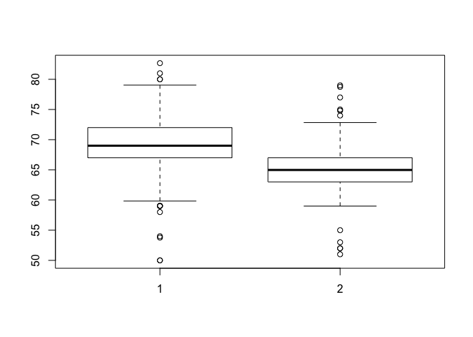

PH125.2 Data Visualisation | Notes
================

## 2.1 Introduction

### Data types

Categorical data are variables that are defined by a small number of
groups. Ordinal categorical data have an inherent order to the
categories (mild/medium/hot, for example). Non-ordinal categorical data
have no order to the categories. Numerical data take a variety of
numeric values. Continuous variables can take any value. Discrete
variables are limited to sets of specific values.

``` r
library(dslabs)
library(ggplot2)
data("heights")
```

Use the unique and length functions to determine how many unique heights
were reported

``` r
x <- heights$height
length(unique(x))
```

    ## [1] 139

There are 139 different measurements of height in the heights dataset

Use the `table` function to compute the frequencies of each unique
height value. Because we are using the resulting frequency table in a
later exercise we want you to save the results into an object and call
it `tab`.

``` r
x <- heights$height
tab <- table(x)
```

To see why treating the reported heights as an ordinal value is not
useful in practice we note how many values are reported only once.

``` r
sum(tab==1)
```

    ## [1] 63

 

### Distributions

A frequency table is the simplest way to show a categorical
distribution. Use `prop.table()` to convert a table of counts to a
frequency table.

``` r
table(heights$sex)
```

    ## 
    ## Female   Male 
    ##    238    812

``` r
prop.table(table(heights$sex))
```

    ## 
    ##    Female      Male 
    ## 0.2266667 0.7733333

#### CDF Cumulative Distribution Function

For continuous numerical data, reporting the frequency of each unique
entry is not an effective summary as many or most values are unique.

The cumulative distribution function (CDF) reports the proportion of
data below a value 𝑎 for all values of 𝑎 : 𝐹(𝑎)=Pr(𝑥≤𝑎) The proportion
of observations between any two values 𝑎 and 𝑏 can be computed from the
CDF as 𝐹(𝑏)−𝐹(𝑎)

**For datasets that are not Normal**

    # define range of values spanning the dataset
    a <- seq(min(my_data), max(my_data), length = 100)    
    
    # computes prob. for a single value
    cdf_function <- function(x) {                         
      mean(my_data <= x)
    }
    cdf_values <- sapply(a, cdf_function)
    plot(a, cdf_values)

``` r
# define the interval from min to max, with 100 values
a <- seq(min(heights$height), max(heights$height), length = 100)    

#create the function that returns probability for height < x
cdf_function <- function (x) {    
  mean(heights$height <= x)
}
# apply function to vector a (range of 100 heights from min to max)
cdf_values <- sapply(a, cdf_function)

#plot
plot(a, cdf_values, type="l")
```

<!-- -->

 

#### Normal distribution

  - Is centered around one value, the mean.
  - Is symmetric around the mean
  - Is defined completely by its mean (μ) and standard deviation ( σ )
  - Always has the same proportion of observations within a given
    distance of the mean (for example, 95% within 2 σ)

<!-- -->

Calculating mean and sd in heights

``` r
average <- mean(heights$height)
SD <- sd(heights$height)
```

``` r
average
```

    ## [1] 68.32301

``` r
SD
```

    ## [1] 4.078617

**Standard units** describe how many standard deviations a value is away
from the mean. The z-score, or number of standard deviations an
observation x is away from the mean μ: Z=(x−μ)/σ

``` r
z <- function(x) {
  (x-average)/SD
}

#standard units for the smallest, tallest and average:

z(min(x))
```

    ## [1] -4.492457

``` r
z(max(x))
```

    ## [1] 3.519368

``` r
z(average)
```

    ## [1] 0

  - z \< 0 ; below average height
  - z \> 0 ; above average height

Z-scores are useful to quickly evaluate whether an observation is
average or extreme. Z-scores near 0 are average. Z-scores above 2 or
below -2 are significantly above or below the mean, and z-scores above 3
or below -3 are extremely rare.

The `scale()` function converts a vector of approximately normally
distributed values into z-scores.

``` r
x <- heights$height
z <- scale(x)
```

You can compute the proportion of observations that are within 2
standard deviations of the mean like this:

``` r
mean(abs(z) < 2)
```

    ## [1] 0.9466667

The normal distribution is associated with the 68-95-99.7 rule. This
rule describes the probability of observing events within a certain
number of standard deviations of the mean.

 

#### The normal CDF and pnorm

We can estimate the probability that a male is taller than 70.5 inches
with:

``` r
1 - pnorm(70.5, mean(x), sd(x))
```

    ## [1] 0.2967551

Plot distribution of exact heights in
data

``` r
plot(prop.table(table(x)), xlab = "a = Height in inches", ylab = "Pr(x = a)")
```

<!-- -->

Load the height data set and create a vector x with just the male
heights:

``` r
x <- heights$height[heights$sex == "Male"]
male_avg <- mean(x)
male_sd <- sd(x)
```

What proportion of the data is between 69 and 72 inches (taller than 69
but shorter or equal to 72)? A proportion is between 0 and 1.

``` r
mean(x>69 & x<=72)
```

    ## [1] 0.3337438

Suppose you only have avg and stdev below, but no access to x, can you
approximate the proportion of the data that is between 69 and 72 inches?

``` r
pnorm(72,male_avg,male_sd)-pnorm(69,male_avg,male_sd)
```

    ## [1] 0.3061779

Notice that the approximation calculated in the second question is very
close to the exact calculation in the first question. The normal
distribution was a useful approximation for this case.   However, the
approximation is not always useful. An example is for the more extreme
values, often called the “tails” of the distribution. Let’s look at an
example. We can compute the proportion of heights between 79 and
81.

``` r
# Not accurate when going to extreme, e.g. estimating proportion of heights between 79 and 81

x <- heights$height[heights$sex == "Male"]
exact <- mean(x > 79 & x <= 81)
avg <- mean(x)
sd <- sd(x)
approx <- pnorm(81,avg,sd)-pnorm(79,avg,sd)

exact/approx
```

    ## [1] 1.614261

 

### Quantiles, Percentiles and Boxplots

 

#### Quantiles

Quantiles are cutoff points that divide a dataset into intervals with
set probabilities. The 𝑞 th quantile is the value at which 𝑞 % of the
observations are equal to or less than that value.

Given a dataset data and desired quantile q, you can find the qth
quantile of data with:

`quantile(data,q)`

 

#### Percentiles

Percentiles re the quantiles that divide a dataset into 100 intervals
each with 1% probability. You can determine all percentiles of a dataset
data like this:

p \<- seq(0.01, 0.99, 0.01) quantile(data, p)

 

#### Quartiles

Divide a dataset into 4 parts each with 25% probability. They are equal
to the 25th, 50th and 75th percentiles. The 25th percentile is also
known as the 1st quartile, the 50th percentile is also known as the
median, and the 75th percentile is also known as the 3rd quartile.

 

#### Examples

The `summary()` function returns the minimum, quartiles and maximum of a
vector.

``` r
summary(heights$height)
```

    ##    Min. 1st Qu.  Median    Mean 3rd Qu.    Max. 
    ##   50.00   66.00   68.50   68.32   71.00   82.68

Find the percentiles of heights$height:

``` r
p <- seq(0.01, 0.99, 0.01)
percentiles <- quantile(heights$height, p)
head(percentiles)
```

    ## 1% 2% 3% 4% 5% 6% 
    ## 59 60 60 61 62 62

Confirm that the 25th and 75th percentiles match the 1st and 3rd
quartiles. Note that quantile() returns a named vector. You can access
the 25th and 75th percentiles like this (adapt the code for other
percentile values):

``` r
percentiles[names(percentiles) == "25%"]
```

    ## 25% 
    ##  66

``` r
percentiles[names(percentiles) == "75%"]
```

    ## 75% 
    ##  71

 

#### `qnorm()` function

Theoretical value of a quantile with probability p of observing a value
equal to or less than that quantile value given a normal distribution
with mean mu and standard deviation sigma:

`qnorm(p, mu, sigma)`

By default, mu=0 and sigma=1. Therefore, calling qnorm() with no
arguments gives quantiles for the standard normal distribution.

`qnorm(p)`

Recall that quantiles are defined such that p is the probability of a
random observation less than or equal to the quantile.

``` r
qnorm(0.025)
```

    ## [1] -1.959964

 

#### `pnorm()` function

Gives the probability that a value from a standard normal distribution
will be less than or equal to a z-score value z. Consider:

``` r
pnorm(-1.96) 
```

    ## [1] 0.0249979

The result of pnorm() is the quantile (~0.025). Note that:

qnorm() and pnorm() are inverse functions:

``` r
pnorm(qnorm(0.025))
```

    ## [1] 0.025

 

#### Theoretical quantiles

You can use qnorm() to determine the theoretical quantiles of a dataset:
that is, the theoretical value of quantiles assuming that a dataset
follows a normal distribution. Run the qnorm() function with the desired
probabilities p, mean mu and standard deviation sigma.

Suppose male heights follow a normal distribution with a mean of 69
inches and standard deviation of 3 inches. The theoretical quantiles
are:

``` r
p <- seq(0.01, 0.99, 0.01)
theoretical_quantiles <- qnorm(p, 69, 3)
head(theoretical_quantiles)
```

    ## [1] 62.02096 62.83875 63.35762 63.74794 64.06544 64.33568

 

#### QQ-plots

Are used to check whether distributions are well-approximated by a
normal distribution.

Given a proportion p, the quantile q is the value such that the
proportion of values in the data below q is p

``` r
index <- heights$sex=="Male"
x <- heights$height[index]
z <- scale(x)
```

Proportion of data below 69.5

``` r
mean(x <= 69.5)
```

    ## [1] 0.5147783

Calculate observed and theoretical quantiles

``` r
p <- seq(0.05, 0.95, 0.05)
observed_quantiles <- quantile(x, p)

observed_quantiles
```

    ##       5%      10%      15%      20%      25%      30%      35%      40% 
    ## 63.90079 65.00000 66.00000 67.00000 67.00000 68.00000 68.00000 68.62236 
    ##      45%      50%      55%      60%      65%      70%      75%      80% 
    ## 69.00000 69.00000 70.00000 70.00000 70.86614 71.00000 72.00000 72.00000 
    ##      85%      90%      95% 
    ## 72.44000 73.22751 75.00000

``` r
theoretical_quantiles <- qnorm(p, mean = mean(x), sd = sd(x))

theoretical_quantiles
```

    ##  [1] 63.37515 64.68704 65.57217 66.27564 66.87916 67.42113 67.92335 68.39991
    ##  [9] 68.86099 69.31475 69.76852 70.22960 70.70616 71.20838 71.75035 72.35387
    ## [17] 73.05734 73.94247 75.25436

QQ-plot

``` r
plot(theoretical_quantiles, observed_quantiles)
abline(0,1)
```

<!-- -->

 

#### Boxplots

In a boxplot, the box is defined by the 25th and 75th percentiles and
the median is a horizontal line through the box. The whiskers show the
range excluding outliers, and outliers are plotted separately as
individual points. The interquartile range is the distance between the
25th and 75th percentiles.

``` r
Male <- heights$sex=="Male"
Female <- heights$sex=="Female"

M <- heights$height[Male]
F <- heights$height[Female]

boxplot(M,F)
```

<!-- -->

##### Exercise with percentiles

``` r
# vectors with heights for each gender

male <- heights$height[heights$sex=="Male"]
female <- heights$height[heights$sex=="Female"]

# the 10th, 30th, 50th, 70th, and 90th percentiles for the heights of each sex

p <- seq(0.1,0.9,0.2)
male_percentiles <- quantile(male,p)
female_percentiles <- quantile(female,p)

# data frame with percentiles
df <- data.frame(male=male_percentiles,female=female_percentiles)
df
```

    ##         male   female
    ## 10% 65.00000 61.00000
    ## 30% 68.00000 63.00000
    ## 50% 69.00000 64.98031
    ## 70% 71.00000 66.46417
    ## 90% 73.22751 69.00000

   

## 2.2 ggplot2

[ggplot
cheatsheet](https://rstudio.com/wp-content/uploads/2015/03/ggplot2-cheatsheet.pdf)

In ggplot2 we create graphs by adding layers. Layers can define
geometries, compute summary statistics, define what scales to use, or
even change styles. To add layers, we use the symbol +. In general, a
line of code will look like this:

`DATA %>% ggplot() + LAYER 1 + LAYER 2 + … + LAYER N`
