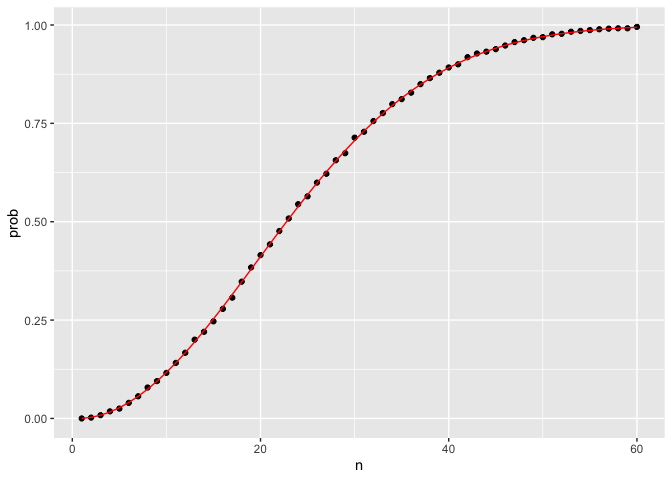

PH125.3 Probability | Notes
================

 

## 3.1 Discrete probability

 

### Monte Carlo simulations for categorical data

We have a box with 5 beads, 2 blue and 3 red

``` r
beads <- rep (c("blue","red"), times= c(2,3))
beads
```

    ## [1] "blue" "blue" "red"  "red"  "red"

``` r
#picking one at random

sample(beads,1)
```

    ## [1] "blue"

``` r
# repeating subtraction 10000 times

t <- 10000
subs <- replicate (t, sample(beads,1))

# results of substraction:

table(subs)
```

    ## subs
    ## blue  red 
    ## 3939 6061

``` r
# proportion

prop.table(table(subs))
```

    ## subs
    ##   blue    red 
    ## 0.3939 0.6061

Values are really close to 40 and 60%

 

### `sample` function

Can be used directly, without the use of replicate, to repeat the same
experiment of picking 1 out of the 5 beads, continually, under the same
conditions.

``` r
B <- 10000
events <- sample(beads, B, replace = TRUE)
prop.table(table(events))
```

    ## events
    ##   blue    red 
    ## 0.3914 0.6086

We get results very similar to those previously obtained with
`replicate`.

 

### Conditional probabilities

When events are not independent e.g.

Pr(Card 2 is King | Card 1 was a King) = 3 / 51

When two events are independent

Pr(A|B) = Pr(A)

 

### Addition and multiplication rules

 

#### Multiplication rule

Pr (A and B) = Pr(A) \* Pr(B|A)

Pr (A and B and C) = Pr(A) \* Pr(B|A) \* Pr(C|A and B)

 

#### Multiplication rule under independence

Pr (A and B and C) = Pr(A) \* Pr(B) \* Pr(C)

General rule for computing conditional probabilities

Pr(B|A) = Pr(A and B) / Pr(A)

 

#### Addition rule

Pr(A or B) = Pr(A) + Pr(B) - Pr(A and B)

 

### Combinations and permutations

 

#### `paste`

We use `paste` to create strings by combining other strings That’s how
we can build cards for example

``` r
number <- "Three"
suit <- "Hearts"
paste(number, suit)
```

    ## [1] "Three Hearts"

Another example

``` r
paste(letters[1:5], as.character(1:5))
```

    ## [1] "a 1" "b 2" "c 3" "d 4" "e 5"

 

#### `expand.grid()`

The function expand.grid gives us all the combinations of entries of two
vectors. For example, if you have blue and black pants and white, grey,
and plaid shirts, all your combinations
are:

``` r
expand.grid(pants = c("blue", "black"), shirt = c("white", "grey", "plaid"))
```

    ##   pants shirt
    ## 1  blue white
    ## 2 black white
    ## 3  blue  grey
    ## 4 black  grey
    ## 5  blue plaid
    ## 6 black plaid

``` r
# Building a card deck

suits <- c("Diamonds", "Clubs", "Hearts", "Spades")
numbers <- c("Ace", "Deuce", "Three", "Four", "Five", "Six", "Seven", 
             "Eight", "Nine", "Ten", "Jack", "Queen", "King")
deck <- expand.grid(number = numbers, suit = suits)
deck <- paste(deck$number, deck$suit)
head(deck)
```

    ## [1] "Ace Diamonds"   "Deuce Diamonds" "Three Diamonds" "Four Diamonds" 
    ## [5] "Five Diamonds"  "Six Diamonds"

``` r
# probability of kings in deck

kings <- paste("King", suits)
kings
```

    ## [1] "King Diamonds" "King Clubs"    "King Hearts"   "King Spades"

``` r
mean(deck %in% kings)
```

    ## [1] 0.07692308

``` r
# 5 random phone numbers of 7 digits

all_phone_numbers <- permutations(10, 7, v = 0:9)
n <- nrow(all_phone_numbers)
index <- sample(n, 5)
all_phone_numbers[index,]
```

    ##      [,1] [,2] [,3] [,4] [,5] [,6] [,7]
    ## [1,]    6    9    0    7    4    2    1
    ## [2,]    8    7    6    4    2    1    0
    ## [3,]    9    1    2    8    5    0    6
    ## [4,]    5    8    6    9    1    3    0
    ## [5,]    9    4    3    7    0    6    2

To compute all possible ways we can choose two cards when the order
matters, we type:

``` r
hands <- permutations(52, 2, v = deck)

# This is a matrix with two columns and 2652 rows. 

head(hands)
```

    ##      [,1]        [,2]            
    ## [1,] "Ace Clubs" "Ace Diamonds"  
    ## [2,] "Ace Clubs" "Ace Hearts"    
    ## [3,] "Ace Clubs" "Ace Spades"    
    ## [4,] "Ace Clubs" "Deuce Clubs"   
    ## [5,] "Ace Clubs" "Deuce Diamonds"
    ## [6,] "Ace Clubs" "Deuce Hearts"

With a matrix we can get the first and second cards like this. This will
return the whole 1st and 2nd columns

``` r
first_card <- hands[,1]
second_card <- hands[,2]
```

Now the cases for which the first hand was a King can be computed like
this:

``` r
kings <- paste("King", suits)
sum(first_card %in% kings)
```

    ## [1] 204

To get the conditional probability, we compute what fraction of these
have a King in the second
card:

``` r
sum(first_card%in%kings & second_card%in%kings) / sum(first_card%in%kings)
```

    ## [1] 0.05882353

which is exactly 3/51, as we had already deduced. Notice that the code
above is equivalent to:

``` r
mean(first_card%in%kings & second_card%in%kings) /
mean(first_card%in%kings)
```

    ## [1] 0.05882353

which uses mean instead of sum and is an R version of:

Pr (A and B) / Pr (A)

 

**Probability of a natural 21 in blackjack**

``` r
aces <- paste("Ace", suits)
facecard <- c("King", "Queen", "Jack", "Ten")
facecard <- expand.grid(number = facecard, suit = suits)
facecard <- paste(facecard$number, facecard$suit)

hands <- combinations(52, 2, v=deck) # all possible hands

# probability of a natural 21 given that the ace is listed first in combinations

mean(hands[,1] %in% aces & hands[,2] %in% facecard)
```

    ## [1] 0.04826546

``` r
# probability of a natural 21 checking for both ace first and ace second

mean((hands[,1] %in% aces & hands[,2] %in% facecard)|(hands[,2] %in% aces & hands[,1] %in% facecard))
```

    ## [1] 0.04826546

 

#### The birthday problem

Birthdays can be represented as a number from 1 to 365 (we exclude 29th
Feb)

``` r
n <- 50
sample(1:365,n,replace=TRUE)
```

    ##  [1] 100  98 109  67 105  39 149 266 150 281 203  79   9  32 295 213  57  11 275
    ## [20]  89 321  98 146 273 256 205 281 312 107  34 272  97 276 333 234 133  58  94
    ## [39] 274 122   6 189 307 196 322 172 164  28 268 289

Montecarlo

``` r
B <- 10000

same_birthday <- function (n) {
  bdays <- sample(1:365,n,replace=TRUE)
  any(duplicated(bdays))
}

results <- replicate(B, same_birthday(50))

mean(results)
```

    ## [1] 0.9746

In a group of 50 people there is 96% probability of at least 2 people
having the same birthday

Say we want to use this knowledge to bet with friends about two people
having the same birthday in a group of people. When are the chances
larger than 50%? Larger than 75%?

Let’s create a look-up table. We can quickly create a function to
compute this for any group size:

``` r
compute_prob <- function(n, B=10000){
  results <- replicate(B, same_birthday(n))
  mean(results)
}
```

Using the function sapply, we can perform element-wise operations on any
function:

``` r
n <- seq(1,60)

# n is a vector of 1 to 60 (groups of 1 to 60 people)
# with sapply we can run the function for each of the elements in n

prob <- sapply(n, compute_prob)
```

We can now make a plot of the estimated probabilities of two people
having the same birthday in a group of size n:

``` r
prob <- sapply(n, compute_prob)
qplot(n, prob)
```

<!-- -->

With statistical formulas

``` r
exact_prob <- function(n){
  prob_unique <- seq(365,365-n+1)/365 
  1 - prod( prob_unique)
}
eprob <- sapply(n, exact_prob)
qplot(n, prob) + geom_line(aes(n, eprob), col = "red")
```

<!-- -->

 

### Monty Hall problem

We run a monte carlo for the option of not switching doors

``` r
B <- 10000
stick <- replicate(B, {
    doors <- as.character(1:3)
    prize <- sample(c("car","goat","goat"))   #random prizes
    prize_door <- doors[prize == "car"]     # prize door with car
    my_pick  <- sample(doors, 1)            #random pick
    show <- sample(doors[!doors %in% c(my_pick, prize_door)],1)   
    stick <- my_pick    
    stick == prize_door    
})
mean(stick)    
```

    ## [1] 0.3324

Monte carlo including switching doors

``` r
B <- 10000
switch <- replicate(B, {
  doors <- as.character(1:3)
  prize <- sample(c("car","goat","goat"))   #random prizes
  prize_door <- doors[prize == "car"]       # prize door with car
  my_pick  <- sample(doors, 1)          #random pick
  show <- sample(doors[!doors %in% c(my_pick, prize_door)],1)   
  switch <- doors[!doors %in% c(my_pick,show)]    
  switch == prize_door    
})

mean(switch) 
```

    ## [1] 0.6586

``` r
mean(stick) 
```

    ## [1] 0.3324

Twice the probability to win the prize by changing doors

 

## 3.2 Continuous probability

``` r
x <- heights %>% filter(sex=="Male") %>% pull(height)
```

We defined the empirical distribution function (eCDF) as:

``` r
F <- function(a) mean(x<=a)
```

which, for any value a, gives the proportion of values in the list x
that are smaller or equal than a.

If I pick one of the male students at random, what is the chance that he
is taller than 70.5 inches? Because every student has the same chance of
being picked, the answer to this is equivalent to the proportion of
students that are taller than 70.5 inches. Using the CDF we obtain an
answer by typing:

``` r
1 - F(70)
```

    ## [1] 0.3768473

 

### Theoretical continuous distributions

We say that a random quantity is normally distributed with average m and
standard deviation s if its probability distribution is defined by:

F(a) = pnorm(a, m, s)

This is useful because if we are willing to use the normal approximation
for, say, height, we don’t need the entire dataset to answer questions
such as: what is the probability that a randomly selected student is
taller then 70 inches? We just need the average height and standard
deviation:

``` r
x <- heights$height[heights$sex=="Male"]
m <- mean(x)
s <- sd(x)
1 - pnorm(70.5, m, s)
```

    ## [1] 0.371369

 

### The Probability density

The probability of a single value is not defined for a continuous
distribution.

The quantity with the most similar interpretation to the probability of
a single value is the probability density function 𝑓(𝑥) .

The probability density 𝑓(𝑥) is defined such that the integral of 𝑓(𝑥)
over a range gives the CDF of that range. 𝐹(𝑎)=Pr(𝑋≤𝑎)=∫𝑎−∞𝑓(𝑥)𝑑𝑥

In R, the probability density function for the normal distribution is
given by dnorm(). We will see uses of dnorm() in the future.

Note that **dnorm() gives the density function and pnorm() gives the
distribution function**, which is the integral of the density function

 

## 3.3 Random variables, sampling and CLT

 

### Random variables

``` r
beads <- rep( c("red", "blue"), times = c(2,3))
X <- ifelse(sample(beads, 1) == "blue", 1, 0)
```

Here X is a random variable: every time we select a new bead the outcome
changes randomly. See below:

``` r
ifelse(sample(beads, 1) == "blue", 1, 0)
```

    ## [1] 1

``` r
ifelse(sample(beads, 1) == "blue", 1, 0)
```

    ## [1] 1

``` r
ifelse(sample(beads, 1) == "blue", 1, 0)
```

    ## [1] 1

 

### Sampling models

We are going to define a random variable S that will represent the
casino’s total winnings. Let’s start by constructing the urn. A roulette
wheel has 18 red pockets, 18 black pockets and 2 green ones. So playing
a color in one game of roulette is equivalent to drawing from this urn:

``` r
color <- rep(c("Black", "Red", "Green"), c(18, 18, 2))
```

The 1,000 outcomes from 1,000 people playing are independent draws from
this urn. If red comes up, the gambler wins and the casino loses a
dollar, so we draw a -$1. Otherwise, the casino wins a dollar and we
draw a $1. To construct our random variable S, we can use this code:

``` r
n <- 1000
X <- sample(ifelse(color == "Red", -1, 1),  n, replace = TRUE)
X[1:10]
```

    ##  [1]  1  1 -1 -1 -1  1 -1 -1  1 -1

Because we know the proportions of 1s and -1s, we can generate the draws
with one line of code, without defining color:

``` r
X <- sample(c(-1,1), n, replace = TRUE, prob=c(9/19, 10/19))
```

We call this a sampling model since we are modeling the random behavior
of roulette with the sampling of draws from an urn. The total winnings S
is simply the sum of these 1,000 independent draws:

``` r
X <- sample(c(-1,1), n, replace = TRUE, prob=c(9/19, 10/19))
S <- sum(X)
S
```

    ## [1] 82

 

### Probability distribution of a random variable

We can estimate the distribution function for the random variable S by
using a Monte Carlo simulation to generate many realizations of the
random variable. With this code, we run the experiment of having 1,000
people play roulette, over and over, specifically B=10,000 times

``` r
n <- 1000
B <- 10000
roulette_winnings <- function(n){
  X <- sample(c(-1,1), n, replace = TRUE, prob=c(9/19, 10/19))
  sum(X)
}
S <- replicate(B, roulette_winnings(n))
```

Now we can ask the following: in our simulations, how often did we get
sums less than or equal to a?

This will be a very good approximation of F(a) and we can easily answer
the casino’s question: how likely is it that we will lose money? We can
see it is quite low:

``` r
mean(S<0)
```

    ## [1] 0.0429

 

### Expected value and standard error

``` r
B <- 10^6
x <- sample(c(-1,1), B, replace = TRUE, prob=c(9/19, 10/19))
mean(x)
```

    ## [1] 0.051364

In general, if the urn has two possible outcomes, say a and b, with
proportions p and (1-p) respectively, the average is:

**E(x) = ap + b(1-p)**

and standard error

\*\*SE\[x\] = |b-a|*sqrt(p*(1-p))

In the roulette example

``` r
2 * sqrt(90)/19
```

    ## [1] 0.998614

The standard error tells us the typical difference between a random
variable and its expectation. Since one draw is obviously the sum of
just one draw, we can use the formula above to calculate that the random
variable defined by one draw has an expected value of 0.05 and a
standard error of about 1. This makes sense since we either get 1 or -1,
with 1 slightly favored over -1.

Using the formula above, the sum of 1,000 people playing has standard
error of about $32:

``` r
n <- 1000
sqrt(n) * 2 * sqrt(90)/19
```

    ## [1] 31.57895

As a result, when 1,000 people bet on red, the casino is expected to win
$50 with a standard error of $32. It therefore seems like a safe bet.
But we still haven’t answered the question: how likely is it to lose
money? Here the CLT will help.

 

### Central Limit Theorem

We previously ran this Monte Carlo simulation:

``` r
n <- 1000
B <- 10000
roulette_winnings <- function(n){
  X <- sample(c(-1,1), n, replace = TRUE, prob=c(9/19, 10/19))
  sum(X)
}
S <- replicate(B, roulette_winnings(n))
```

The Central Limit Theorem (CLT) tells us that the sum S is approximated
by a normal distribution. Using the formulas above, we know that the
expected value and standard error are:

``` r
n * (20-18)/38 
```

    ## [1] 52.63158

``` r
sqrt(n) * 2 * sqrt(90)/19 
```

    ## [1] 31.57895

The theoretical values above match those obtained with the Monte Carlo
simulation:

``` r
mean(S)
```

    ## [1] 52.4694

``` r
sd(S)
```

    ## [1] 31.60938

Using the CLT, we can skip the Monte Carlo simulation and instead
compute the probability of the casino losing money using this
approximation:

``` r
mu <- n * (20-18)/38
se <-  sqrt(n) * 2 * sqrt(90)/19 
pnorm(0, mu, se)
```

    ## [1] 0.04779035

which is also in very good agreement with our Monte Carlo result:

``` r
mean(S < 0)
```

    ## [1] 0.0451

 

## 3.4 Case study: The Big Short

``` r
set.seed(1)

# bank loses $200,000 to loans not paid back
# there is a chance of 2% that clients will default
# we assume there are no profits made from paying clients

n <- 1000
loss_per_foreclosure <- -200000
p <- 0.02 
defaults <- sample( c(0,1), n, prob=c(1-p, p), replace = TRUE)
sum(defaults * loss_per_foreclosure)
```

    ## [1] -4600000

``` r
# The sum above is random
# Monte Carlo for distribution of losses

B <- 10000

losses <- replicate(B,{
  defaults <- sample(c(0,1),n,replace=TRUE,prob=c(1-p,p))
  sum(defaults*loss_per_foreclosure)
})

mean(losses)
```

    ## [1] -4003200

``` r
sd(losses)
```

    ## [1] 884943

``` r
# With CLT

n*(p*loss_per_foreclosure+(1-p)*0)
```

    ## [1] -4e+06

``` r
sqrt(n)*abs(loss_per_foreclosure)*sqrt(p*(1-p))
```

    ## [1] 885437.7

``` r
# adding an amount to laons (that are re-paid) so that losses are CERO
# losses*p + x (1-p) = 0
# x (1-p) ; x is the amount added
# x = -losses / (1-p)

-loss_per_foreclosure*p/(1-p)/200000
```

    ## [1] 0.02040816

``` r
qnorm(0.01)
```

    ## [1] -2.326348

``` r
# Quantity to make sure the bank losses money 1 in 100

l <- loss_per_foreclosure
z <- qnorm(0.01)
x <- -l*( n*p - z*sqrt(n*p*(1-p)))/ ( n*(1-p) + z*sqrt(n*p*(1-p)))

x/180000
```

    ## [1] 0.03471767

``` r
#Interest rate is 0.035 or 3.5%

# Expected profit per loan

EP <- loss_per_foreclosure*p + x*(1-p)


# Total expected profit

TEP <- n*(l*p + x*(1-p))


# Monte Carlo for total expected profit

B <- 10000

profit <- replicate(B,{
  draws <- sample(c(x,l),n,replace = TRUE, prob=c(1-p,p))
  sum(draws)
})


# Employee suggests increasing n even if p doubles from 2% defaults to 4%

p <- 0.04

# new interest rate l*p + x*(1-p)=0
# x=l*p/(1-p)
# r = x / 180000

r <- -l*p/(1-p)/180000
r
```

    ## [1] 0.0462963

``` r
# r is 0.04629
# If we set r to 5% the expected profit

r <- 0.05
x <- r*180000
NewEP <- l*p+(r*180000)*(1-p)
NewEP
```

    ## [1] 640

``` r
# what n do we need for our probability of losing money of 1%

z <- qnorm(0.01)
n <- ceiling((z^2*(x-l)^2*p*(1-p))/(l*p + x*(1-p))^2)
n
```

    ## [1] 22163

``` r
# 22163 loans will reduce P of losing money to 1%, 
# and total expected profit would be 14,184,320

n*(l*p+x*(1-p))
```

    ## [1] 14184320

``` r
# Now we don't wrongly assume that the probability of defaulting by borrowers
# is independent. We keep p of defaulting to 4% but now We will assume that
# with 50-50 chance, all the probabilities go up or down slightly to somewhere 
# between 0.03 and 0.05. But it happens to everybody at once, not just one person


p <- 0.04

x <- 0.05*180000

profit <- replicate(B, {
  new_p <- 0.04 + sample(seq(-0.01, 0.01, length = 100), 1)
  draws <- sample( c(x, loss_per_foreclosure), n, prob=c(1-new_p, new_p), replace = TRUE) 
  sum(draws)
})

mean(profit)
```

    ## [1] 14025355

``` r
# continues to be very large, but now the probability to lose money is 34.6%

mean(profit<0)
```

    ## [1] 0.3468
