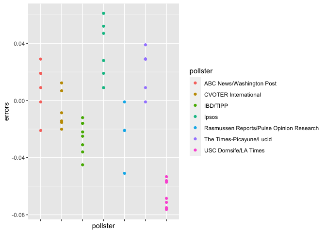
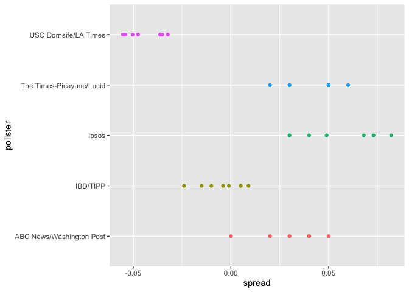

PH125.4 Inference and Modeling | Notes
================

 

## 4.1 Parameters and Estimates

We have an urn with blue and red beads (population that may vote to
republicans or democrats)

We don’t know the real proportion of beads in the urn

``` r
# p <- probability of blue
# 1 - p <- probability of red
```

Inference is focused on solving p, by taking samples from the urn, how
can we estimate what p is? (i.e. republican vote intention)

We define the random variable X

X = 1 if we pick blue

X = 0 if red

After sampling, determining the average value of X would be the same as
p

**Expected value** **E(X) = p**

**Standard Error** **SE(X) = 2 \* sqrt( p \* (1-p) / N )**

**The larger N, the smaller SE**

d = X¯−(1−X¯) difference between democrats and republicans

E\[X¯−(1−X¯)\]=E\[2X¯−1\] =2E\[X¯\]−1 =2p−1 = **p − (1−p)**

SE\[X¯−(1−X¯)\]= SE\[2X¯−1\] =2SE\[X¯\] = \*\*2 \* sqrt( p\*(1−p) / N
)\*\*

 

## 4.2 CLT Central Limit Theorem

In our first sample we had 12 blue and 13 red so

``` r
# expected x
x_hat <- 0.48

# standard error
se <- sqrt(x_hat*(1-x_hat)/25)
se
```

    ## [1] 0.09991997

Suppose we want to know what is the probability that we are within 1%
from  
p

``` r
pnorm(0.01/se) - pnorm(-0.01/se) 
```

    ## [1] 0.07971926

``` r
# There is an 8% chance that 48% is within 1% of the actual p for our case
```

Therefore, there is a small chance that we will be close. A poll of only
N=25 people is not really very useful, at least not for a close
election.

Earlier we mentioned the margin of error. Now we can define it because
it is simply two times the standard error, which we can now estimate. In
our case it
is:

``` r
1.96*se
```

    ## [1] 0.1958431

``` r
# we use 1.96 because it is the probability that we are within 1.96 standard errors from p

pnorm(1.96)-pnorm(-1.96)
```

    ## [1] 0.9500042

Hence, there is a 95% probability that X will be within 1.96\*se , in
our case within about 0.2, of p

``` r
0.48 - 1.96*se
```

    ## [1] 0.2841569

``` r
0.48 + 1.96*se
```

    ## [1] 0.6758431

 

### Monte Carlo

Suppose we want to use a Monte Carlo simulation to corroborate the tools
we have built using probability theory. To create the simulation, we
would write code like this:

B \<- 10000 N \<- 1000 x\_hat \<- replicate(B, { x \<- sample(c(0,1),
size = N, replace = TRUE, prob = c(1-p, p)) mean(x) })

The problem is we don’t know p

Let’s set `p=0.45`. We can then simulate a poll:

``` r
p <- 0.45
N <- 1000

# with p=0.45 and 1000 withdraw from an urn (sample/random) we get a random variable x_hat

x <- sample(c(0,1), size = N, replace = TRUE, prob = c(1-p, p))
x_hat <- mean(x)
```

We can use that code to do a Monte Carlo simulation:

``` r
B <- 10000
x_hat <- replicate(B, {
  x <- sample(c(0,1), size = N, replace = TRUE, prob = c(1-p, p))
  mean(x)
})
```

To review, the theory tells us that X is approximately normally
distributed, has expected value `p=0.45` and standard error
`sqrt(p*(1-p)/N)= 0.016`. The simulation confirms this:

``` r
mean(x_hat)
```

    ## [1] 0.4497676

``` r
sd(x_hat)
```

    ## [1] 0.01569912

 

### The spread

The competition is to predict the spread, not the proportion p. However,
because we are assuming there are only two parties, we know that the
spread is p - (1- p) or **2p - 1**

**Spread = 2p-1**

Once we have estimate E\[X\] and SE\[X\], we calculate

d = 2\*E\[X\] - 1

se = 2\*SE\[X\]

In our previous example of 12 and 13 beads we had:

E\[X\] = 0.48

1.96 \* SE\[X\] = 0.2

spread = 2\*0.48 - 1 = 0.04

margin error = 2\*0.2 = 0.40

 

### EXERSICES

1.  Write an urn model function that takes the proportion of Democrats p
    and the sample size N as arguments and returns the sample average if
    Democrats are 1s and Republicans are 0s. Call the function
    `take_sample`

<!-- end list -->

``` r
take_sample <- function(p,N){
  x <- sample(c(0,1),size = N, replace = TRUE, prob=c(1-p,p))
  mean(x)
}
```

2.  Now assume p \<- 0.45 and that your sample size is N=100. Take a
    sample 10,000 times and save the vector of mean(X) - p into an
    object called errors. Hint: use the function you wrote for exercise
    1 to write this in one line of code.

<!-- end list -->

``` r
p <- 0.45
N <- 100
B <- 10000
set.seed(1)
errors <- replicate(B,{
  x <- take_sample(p,N)
  mean(x)
  error <- p - mean(x)
})
```

3.  The vector errors contains, for each simulated sample, the
    difference between the actual p and our estimate X\`. We refer to
    this difference as the error. Compute the average and make a
    histogram of the errors generated in the Monte Carlo simulation and
    select which of the following best describes their distributions:

<!-- end list -->

``` r
mean(errors)
```

    ## [1] -4.9e-05

``` r
hist(errors)
```

<!-- -->

4.  Average size of error The error p−X¯ is a random variable. In
    practice, the error is not observed because we do not know the
    actual proportion of Democratic voters, p. However, we can describe
    the size of the error by constructing a simulation. What is the
    average size of the error if we define the size by taking the
    absolute value ∣∣p−X¯∣∣?

Instructions Use the sample code to generate errors, a vector of
∣∣p−X¯∣∣. Calculate the absolute value of errors using the
abs function. Calculate the average of these values using the mean
function.

``` r
mean(abs(errors))
```

    ## [1] 0.039267

5.  The standard error is related to the typical size of the error we
    make when predicting. We say size because we just saw that the
    errors are centered around 0, so thus the average error value is 0.
    For mathematical reasons related to the Central Limit Theorem, we
    actually use the standard deviation of errors rather than the
    average of the absolute values to quantify the typical size. What is
    this standard deviation of the errors?

<!-- end list -->

``` r
sqrt(mean(errors^2))
```

    ## [1] 0.04949939

6.  The theory we just learned tells us what this standard deviation is
    going to be because it is the standard error of X. What does theory
    tell us is the standard error of X for a sample size of 100?

<!-- end list -->

``` r
p <- 0.45
n <- 100
2*sqrt(p*(1-p)/n)
```

    ## [1] 0.09949874

7.  In practice, we don’t know p, so we construct an estimate of the
    theoretical prediction based by plugging in X for p. Compute this
    estimate. Set the seed at 1 with set.seed(1).

<!-- end list -->

``` r
# Define `p` as a proportion of Democratic voters to simulate
p <- 0.45

# Define `N` as the sample size
N <- 100

# Use the `set.seed` function to make sure your answer matches the expected result after random sampling
set.seed(1)

# Define `X` as a random sample of `N` voters with a probability of picking a Democrat ('1') equal to `p`
X <- sample(0:1, N, replace=T, p=c(1-p,p))

# Define `X_bar` as the average sampled proportion
X_bar <- mean(X)

# Calculate the standard error of the estimate. Print the result to the console.
sqrt(X_bar*(1-X_bar)/N)
```

    ## [1] 0.04983974

8.  Note how close the standard error estimates obtained from the Monte
    Carlo simulation (exercise 5), the theoretical prediction (exercise
    6), and the estimate of the theoretical prediction (exercise 7) are.
    The theory is working and it gives us a practical approach to
    knowing the typical error we will make if we predict p with X.
    Another advantage that the theoretical result provides is that it
    gives an idea of how large a sample size is required to obtain the
    precision we need. Earlier we learned that the largest standard
    errors occur for p=0.5 Create a plot of the largest standard error
    for N ranging from 100 to 5,000. Based on this plot, how large does
    the sample size have to be to have a standard error of about 1%?

<!-- end list -->

``` r
N <- seq(100, 5000, len = 100)
p <- 0.5
se <- sqrt(p*(1-p)/N)

plot(N,se)
```

<!-- -->

``` r
# se^2 = p*(1-p)/N
# N = p*(1-p) / se^2

(0.5*0.5)/(0.01^2)
```

    ## [1] 2500

``` r
# it would have to be sample size of 2500 
```

9.  For sample size N = 100, the central limit theorem tells us that the
    distribution of X\_hat
is

<!-- end list -->

``` r
# Approximately normal with expected value p and standard error sqrt(p*(1-p)/n)

N=100
p <- 0.45
X_hat <- p
se <- sqrt(p*(1-p)/N)
X_hat
```

    ## [1] 0.45

``` r
se
```

    ## [1] 0.04974937

Make a qq-plot of the errors you generated in exercise 2 to see if they
follow a normal distribution.

``` r
N <- 100
p <- 0.45
B <- 10000
set.seed(1)
errors <- replicate(B, p - take_sample(p,N))
qqnorm(errors)
```

<!-- -->

What is the probability that X\_hat \> 0.5

``` r
p <- 0.45
N <- 100
1 - pnorm(0.5, p, sqrt(p*(1-p)/N))
```

    ## [1] 0.1574393

Assume you are in a practical situation and you don’t know p. Take a
sample of size N=100 and obtain a sample average of X=0.51. What is the
CLT approximation for the probability that your error is equal to or
larger than 0.01?

``` r
# Define `N` as the number of people polled
N <-100

# Define `X_hat` as the sample average
X_hat <- 0.51

# Define `se_hat` as the standard error of the sample average
se_hat <- sqrt(X_hat*(1-X_hat)/N)

# Calculate the probability that the error is 0.01 or larger
1 - pnorm(.01, 0, se_hat) + pnorm(-0.01, 0, se_hat)
```

    ## [1] 0.8414493

 

## 4.3 Confidence Intervals and p-values

We want to know the probability that the interval \[X - 2 SEX, X +
2SEX\] contains the true proportion p. First, consider that the start
and end of these intervals are random variables: every time we take a
sample, they change. To illustrate this, run the Monte Carlo simulation
twice. We use the same parameters as above:

``` r
p <- 0.45
N <- 1000
set.seed(1)

x <- sample(c(0,1), size=N, replace=TRUE, prob=c(1-p,p))
x_hat <- mean(x)
se_hat <- sqrt(x_hat*(1-x_hat)/N)
serror <- 1.96*se_hat

# the interval would be

c(x_hat-serror,x_hat+serror)
```

    ## [1] 0.4012976 0.4627024

``` r
# to determine the probability that the interval contains p 0.45

pnorm(1.96) - pnorm(-1.96)
```

    ## [1] 0.9500042

``` r
# if we want a larger probability we need to multiply by whatever z satisfies
# the probability we are after

z <- qnorm(.995)
z
```

    ## [1] 2.575829

``` r
# using z the resulting interval we would include p with a confidence of...

pnorm(z) - pnorm(-z)
```

    ## [1] 0.99

We can use this approach for any proportion p we set

**z = qnorm(1 - (1 - p)/2)**

 

### Monte Carlo for confidence intervals

We can run a Monte Carlo simulation to confirm that, in fact, a 95%
confidence interval includes p 95% of the time.

``` r
N <- 1000
B <- 10000
set.seed(1)

inside <- replicate(B,{
  x <- sample(c(0,1),size = N, replace = TRUE, prob=c(1-p,p))
  x_hat <- mean(x)
  se_hat <- sqrt(x_hat*(1-x_hat)/N)
  between(p, x_hat-1.96*se_hat, x_hat+1.96*se_hat)
})

mean(inside)
```

    ## [1] 0.9482

function between assess if p (1st argument) falls between the 2 next
arguments in this case is p falling between x\_hat +- 1.96 \* se?

With a 94.82% confidence we can state that p will fall in that interval

 

### Confidence intervals exercises

using data(“polls\_us\_election\_2016”)

Generate an object `polls` that contains data filtered for polls that
ended on or after October 31, 2016 in the United States

``` r
polls <- polls_us_election_2016 %>%
  filter(state %in% "U.S." & enddate >= "2016-10-31")

head(polls)
```

    ##   state  startdate    enddate
    ## 1  U.S. 2016-11-03 2016-11-06
    ## 2  U.S. 2016-11-01 2016-11-07
    ## 3  U.S. 2016-11-02 2016-11-06
    ## 4  U.S. 2016-11-04 2016-11-07
    ## 5  U.S. 2016-11-03 2016-11-06
    ## 6  U.S. 2016-11-03 2016-11-06
    ##                                                     pollster grade samplesize
    ## 1                                   ABC News/Washington Post    A+       2220
    ## 2                                    Google Consumer Surveys     B      26574
    ## 3                                                      Ipsos    A-       2195
    ## 4                                                     YouGov     B       3677
    ## 5                                           Gravis Marketing    B-      16639
    ## 6 Fox News/Anderson Robbins Research/Shaw & Company Research     A       1295
    ##   population rawpoll_clinton rawpoll_trump rawpoll_johnson rawpoll_mcmullin
    ## 1         lv           47.00         43.00            4.00               NA
    ## 2         lv           38.03         35.69            5.46               NA
    ## 3         lv           42.00         39.00            6.00               NA
    ## 4         lv           45.00         41.00            5.00               NA
    ## 5         rv           47.00         43.00            3.00               NA
    ## 6         lv           48.00         44.00            3.00               NA
    ##   adjpoll_clinton adjpoll_trump adjpoll_johnson adjpoll_mcmullin
    ## 1        45.20163      41.72430        4.626221               NA
    ## 2        43.34557      41.21439        5.175792               NA
    ## 3        42.02638      38.81620        6.844734               NA
    ## 4        45.65676      40.92004        6.069454               NA
    ## 5        46.84089      42.33184        3.726098               NA
    ## 6        49.02208      43.95631        3.057876               NA

How many rows does `polls` contain? Print this value to the console.

``` r
nrow(polls)
```

    ## [1] 70

Assign the sample size of the first poll in `polls` to a variable called
\`N Print this value to the console.

``` r
N <- polls$samplesize[1]
N
```

    ## [1] 2220

For the first poll in `polls`, assign the estimated percentage of
Clinton voters to a variable called `X_hat`. Print this value to the
console.

``` r
X_hat <- polls$rawpoll_clinton[1]/100
X_hat
```

    ## [1] 0.47

Calculate the standard error of `X_hat` and save it to a variable called
`se_hat`. Print this value to the console.

``` r
se_hat <- sqrt(X_hat*(1-X_hat)/N)
se_hat
```

    ## [1] 0.01059279

Use `qnorm` to calculate the 95% confidence interval for the proportion
of Clinton voters. Save the lower and then the upper confidence interval
to a variable called `ci`.

``` r
ci <- c(X_hat-qnorm(.975)*se_hat,X_hat+qnorm(.975)*se_hat)
ci
```

    ## [1] 0.4492385 0.4907615

Create a new object called `pollster_results` that contains columns for
pollster name, end date, X\_hat, se\_hat, lower confidence interval, and
upper confidence interval for each poll.

``` r
polls <- polls %>%
  mutate(X_hat=polls$rawpoll_clinton/100,se_hat=sqrt(X_hat*(1-X_hat)/polls$samplesize),lower=X_hat - qnorm(.975)*se_hat,upper=X_hat + qnorm(.975)*se_hat)

pollster_results <- select(polls, pollster, enddate, X_hat, se_hat, lower, upper)
```

The `pollster_results` object has already been loaded. Examine it using
the `head`
    function.

``` r
head(pollster_results)
```

    ##                                                     pollster    enddate  X_hat
    ## 1                                   ABC News/Washington Post 2016-11-06 0.4700
    ## 2                                    Google Consumer Surveys 2016-11-07 0.3803
    ## 3                                                      Ipsos 2016-11-06 0.4200
    ## 4                                                     YouGov 2016-11-07 0.4500
    ## 5                                           Gravis Marketing 2016-11-06 0.4700
    ## 6 Fox News/Anderson Robbins Research/Shaw & Company Research 2016-11-06 0.4800
    ##        se_hat     lower     upper
    ## 1 0.010592790 0.4492385 0.4907615
    ## 2 0.002978005 0.3744632 0.3861368
    ## 3 0.010534681 0.3993524 0.4406476
    ## 4 0.008204286 0.4339199 0.4660801
    ## 5 0.003869218 0.4624165 0.4775835
    ## 6 0.013883131 0.4527896 0.5072104

Add a logical variable called `hit` that indicates whether the actual
value exists within the confidence interval of each poll. Summarize the
average `hit` result to determine the proportion of polls with
confidence intervals include the actual value. Save the result as an
object called
`avg_hit`.

``` r
avg_hit <- pollster_results %>% mutate(hit=(lower<0.482 & upper>0.482)) %>% summarize(mean(hit))
avg_hit
```

    ##   mean(hit)
    ## 1 0.3142857

data(“polls\_us\_election\_2016”) head(polls\_us\_election\_2016)

Add a statement to this line of code that will add a new column named
`d_hat` to `polls`. The new column should contain the difference in the
proportion of
voters.

``` r
polls <- polls_us_election_2016 %>% filter(enddate >= "2016-10-31" & state == "U.S.") %>%
  mutate(d_hat = rawpoll_clinton/100 - rawpoll_trump/100)
```

Assign the sample size of the first poll in `polls` to a variable called
`N`. Print this value to the console.

``` r
N <- polls$samplesize[1]
N
```

    ## [1] 2220

Assign the difference `d_hat` of the first poll in `polls` to a variable
called `d_hat`. Print this value to the console.

``` r
d_hat <- polls$d_hat[1]
d_hat
```

    ## [1] 0.04

Assign proportion of votes for Clinton to the variable `X_hat`.

``` r
X_hat <- (d_hat+1)/2
```

Calculate the standard error of the spread and save it to a variable
called `se_hat`. Print this value to the console.

``` r
se_hat <- 2*sqrt(X_hat*(1-X_hat)/N)
se_hat
```

    ## [1] 0.02120683

Use `qnorm` to calculate the 95% confidence interval for the difference
in the proportions of voters. Save the lower and then the upper
confidence interval to a variable called `ci`.

``` r
ci <- c(d_hat-qnorm(.975)*se_hat, d_hat+qnorm(.975)*se_hat)
ci
```

    ## [1] -0.001564627  0.081564627

Create a new object called `pollster_results` that contains columns for
pollster name, end date, d\_hat, lower confidence interval of d\_hat,
and upper confidence interval of d\_hat for each poll.

``` r
pollster_results <- polls %>%
  mutate(X_hat = (d_hat+1)/2,
         se_hat = 2*sqrt(X_hat*(1-X_hat)/samplesize),
         lower = d_hat-qnorm(.975)*se_hat,
         upper = d_hat+qnorm(.975)*se_hat) %>%
  select(pollster,enddate,d_hat,lower,upper)
```

Add a logical variable called `hit` that indicates whether the actual
value (0.021) exists within the confidence interval of each poll.
Summarize the average `hit` result to determine the proportion of polls
with confidence intervals include the actual value. Save the result as
an object called `avg_hit`.

``` r
avg_hit <- pollster_results %>%
  mutate(hit=(lower<=0.021 & upper>=0.021)) %>% summarise(mean(hit))
avg_hit
```

    ##   mean(hit)
    ## 1 0.7714286

Add variable called `error` to the object `polls` that contains the
difference between d\_hat and the actual difference on election day.
Then make a plot of the error stratified by pollster.

``` r
polls %>% mutate(errors = d_hat - 0.021) %>%
  ggplot(aes(x = pollster, y = errors)) +
  geom_point() +
  theme(axis.text.x = element_text(angle = 90, hjust = 1)) 
```

<!-- -->

Add variable called `error` to the object `polls` that contains the
difference between d\_hat and the actual difference on election day.
Then make a plot of the error stratified by pollster, but only for
pollsters who took 5 or more polls.

``` r
polls %>% mutate(errors=d_hat-0.021) %>%
  group_by(pollster) %>%
  filter(n()>=5) %>%
  ggplot(aes(x=pollster,y=errors, color=pollster)) +
  geom_point() +
  theme(axis.text.x = element_blank())
```

<!-- -->

 

### p-values

Let’s consider the blue and red beads. Suppose that rather than wanting
an estimate of the spread or the proportion of blue, I am interested
only in the question: are there more blue beads or red beads? I want to
know if the spread 2p - 1 \> 0

N = 100, we observe 52 blue beads

2\*X - 1 = 0.04

This seems to be pointing to the existence of more blue than red beads
since 0.04 is larger than 0. However, as data scientists we need to be
skeptical. We know there is chance involved in this process and we could
get a 52 even when the actual spread is 0. We call the assumption that
the spread is 2 \* p -1 = 0 a null hypothesis. The null hypothesis is
the skeptic’s hypothesis. We have observed a random variable 2\*X - 1 =
0.04 and the p-value is the answer to the question: how likely is it to
see a value this large, when the null hypothesis is true? So we write:

``` r
N <- 100
z <- sqrt(N)*0.02/0.5
1 - (pnorm(z) - pnorm(-z))
```

    ## [1] 0.6891565

 

## 4.4 Statistical models

### Poll aggregators

As we described earlier, a few weeks before the 2012 election Nate
Silver was giving Obama a 90% chance of winning. How was Mr. Silver so
confident? We will use a Monte Carlo simulation to illustrate the
insight Mr. Silver had and others missed. To do this, we generate
results for 12 polls taken the week before the election. We mimic sample
sizes from actual polls and construct and report 95% confidence
intervals for each of the 12 polls. We save the results from this
simulation in a data frame and add a poll ID column.

``` r
d <- 0.039
Ns <- c(1298, 533, 1342, 897, 774, 254, 812, 324, 1291, 1056, 2172, 516)
p <- (d+1)/2
```

calculate confidence intervals of the spread

``` r
confidence_intervals <- sapply(Ns, function(N){
  X <- sample(c(0,1), size=N, replace=TRUE, prob = c(1-p, p))
  X_hat <- mean(X)
  SE_hat <- sqrt(X_hat*(1-X_hat)/N)
  2*c(X_hat, X_hat - 2*SE_hat, X_hat + 2*SE_hat) - 1
})
```

generate a data frame storing results

``` r
polls <- data.frame(poll = 1:ncol(confidence_intervals),
                    t(confidence_intervals), sample_size = Ns)
names(polls) <- c("poll", "estimate", "low", "high", "sample_size")
polls
```

    ##    poll     estimate          low       high sample_size
    ## 1     1  0.013867488 -0.041639912 0.06937489        1298
    ## 2     2  0.005628518 -0.080999726 0.09225676         533
    ## 3     3  0.058122206  0.003619391 0.11262502        1342
    ## 4     4  0.041248606 -0.025472616 0.10796983         897
    ## 5     5  0.064599483 -0.007138877 0.13633784         774
    ## 6     6  0.110236220 -0.014490124 0.23496257         254
    ## 7     7  0.081280788  0.011326777 0.15123480         812
    ## 8     8 -0.061728395 -0.172627616 0.04917083         324
    ## 9     9  0.041053447 -0.014562660 0.09666955        1291
    ## 10   10  0.039772727 -0.021724320 0.10126977        1056
    ## 11   11  0.047882136  0.005017252 0.09074702        2172
    ## 12   12  0.038759690 -0.049219240 0.12673862         516

Calculating the spread of combined polls. Note that to compute the exact
95% confidence interval, we would use qnorm(.975) instead of 1.96.

``` r
d_hat <- polls %>%
  summarize(avg = sum(estimate*sample_size) / sum(sample_size)) %>%
  .$avg

p_hat <- (1+d_hat)/2
moe <- 2*1.96*sqrt(p_hat*(1-p_hat)/sum(polls$sample_size))   
round(d_hat*100,1)
```

    ## [1] 4.3

``` r
round(moe*100, 1)
```

    ## [1] 1.8

 

### Poll Data and Pollster Bias

The table includes results for national polls, as well as state polls,
taken during the year prior to the election. For this first example, we
will filter the data to include national polls conducted during the week
before the election. We also remove polls that FiveThirtyEight has
determined not to be reliable and graded with a “B” or less. Some polls
have not been graded and we include those:

``` r
# Filter out US, data after 31 Oct and upper grades or no grade

polls <- polls_us_election_2016 %>% 
  filter(state == "U.S." & enddate >= "2016-10-31" &
           (grade %in% c("A+","A","A-","B+") | is.na(grade)))

# include a column for spread

polls <- polls %>%
  mutate(spread = rawpoll_clinton/100 - rawpoll_trump/100)

head(polls)
```

    ##   state  startdate    enddate
    ## 1  U.S. 2016-11-03 2016-11-06
    ## 2  U.S. 2016-11-02 2016-11-06
    ## 3  U.S. 2016-11-03 2016-11-06
    ## 4  U.S. 2016-11-02 2016-11-06
    ## 5  U.S. 2016-11-03 2016-11-05
    ## 6  U.S. 2016-11-04 2016-11-07
    ##                                                     pollster grade samplesize
    ## 1                                   ABC News/Washington Post    A+       2220
    ## 2                                                      Ipsos    A-       2195
    ## 3 Fox News/Anderson Robbins Research/Shaw & Company Research     A       1295
    ## 4                                    CBS News/New York Times    A-       1426
    ## 5                               NBC News/Wall Street Journal    A-       1282
    ## 6                                                   IBD/TIPP    A-       1107
    ##   population rawpoll_clinton rawpoll_trump rawpoll_johnson rawpoll_mcmullin
    ## 1         lv            47.0          43.0             4.0               NA
    ## 2         lv            42.0          39.0             6.0               NA
    ## 3         lv            48.0          44.0             3.0               NA
    ## 4         lv            45.0          41.0             5.0               NA
    ## 5         lv            44.0          40.0             6.0               NA
    ## 6         lv            41.2          42.7             7.1               NA
    ##   adjpoll_clinton adjpoll_trump adjpoll_johnson adjpoll_mcmullin spread
    ## 1        45.20163      41.72430        4.626221               NA  0.040
    ## 2        42.02638      38.81620        6.844734               NA  0.030
    ## 3        49.02208      43.95631        3.057876               NA  0.040
    ## 4        45.11649      40.92722        4.341786               NA  0.040
    ## 5        43.58576      40.77325        5.365788               NA  0.040
    ## 6        42.92745      42.23545        6.316175               NA -0.015

``` r
# we call p for Clinton and (1-p) for Trump
# we are interested in the difference d = 2p - 1
# there are 49 estimates of the spread
# we know they follow approx. a normal function with
# expected value d and standard error 2*sqrt(p*(1-p)/N)

d_hat <- polls %>%
  summarise(d_hat = sum(spread*samplesize)/sum(samplesize)) %>%
  pull(d_hat)


# to calculate the standard error, we know that p_hat is (d+1)/2
# and N is polls$samplesize

p_hat <- (d_hat+1)/2

moe <- 1.96 * 2 * sqrt(p_hat*(1-p_hat)/sum(polls$samplesize))


# We report an expected spread (difference) of d_hat ~ 1.42%
# and standard error moe ~ 0.66%

d_hat
```

    ## [1] 0.01426264

``` r
moe
```

    ## [1] 0.006623178

``` r
# So we report a spread of 1.43% with a margin of error of 0.66%. 
# On election night, we discover that the actual percentage was 2.1%, 
# which is outside a 95% confidence interval. What happened?
  
# A histogram of the reported spreads shows a problem:


polls %>% 
  ggplot(aes(spread)) + geom_histogram(binwidth = .01,col="black")
```

<!-- -->

``` r
# The distribution does not appear to be normal, and the standard error 
# is larger than 0.0066
```

**POLLSTER
BIAS**

``` r
# Note that various pollster are involved are some are taking several polls a week

polls %>% group_by(pollster) %>% summarise(n())
```

    ## # A tibble: 15 x 2
    ##    pollster                                                   `n()`
    ##    <fct>                                                      <int>
    ##  1 ABC News/Washington Post                                       7
    ##  2 Angus Reid Global                                              1
    ##  3 CBS News/New York Times                                        2
    ##  4 Fox News/Anderson Robbins Research/Shaw & Company Research     2
    ##  5 IBD/TIPP                                                       8
    ##  6 Insights West                                                  1
    ##  7 Ipsos                                                          6
    ##  8 Marist College                                                 1
    ##  9 Monmouth University                                            1
    ## 10 Morning Consult                                                1
    ## 11 NBC News/Wall Street Journal                                   1
    ## 12 RKM Research and Communications, Inc.                          1
    ## 13 Selzer & Company                                               1
    ## 14 The Times-Picayune/Lucid                                       8
    ## 15 USC Dornsife/LA Times                                          8

``` r
polls %>% group_by(pollster) %>% 
  filter(n()>=6) %>%
  ggplot(aes(spread,pollster,color=pollster)) + geom_point() + theme(legend.position="none") 
```

<!-- -->

This plot reveals an unexpected result. First, consider that the
standard error predicted by theory for each poll:

``` r
polls %>% group_by(pollster) %>% 
  filter(n() >= 6) %>%
  summarize(se = 2 * sqrt(p_hat * (1-p_hat) / median(samplesize)))
```

    ## # A tibble: 5 x 2
    ##   pollster                     se
    ##   <fct>                     <dbl>
    ## 1 ABC News/Washington Post 0.0265
    ## 2 IBD/TIPP                 0.0333
    ## 3 Ipsos                    0.0225
    ## 4 The Times-Picayune/Lucid 0.0196
    ## 5 USC Dornsife/LA Times    0.0183

is between 0.018 and 0.033, which agrees with the within poll variation
we see. However, there appears to be differences across the polls. Note,
for example, how the USC Dornsife/LA Times pollster is predicting a 4%
win for Trump, while Ipsos is predicting a win larger than 5% for
Clinton. The theory we learned says nothing about different pollsters
producing polls with different expected values. All the polls should
have the same expected value. FiveThirtyEight refers to these
differences as “house effects”. We also call them pollster bias. In the
following section, rather than use the urn model theory, we are instead
going to develop a data-driven model.

 

### Data-driven models

For each pollster, let’s collect their last reported result before the
election:

``` r
one_poll_per_pollster <- polls %>% group_by(pollster) %>% 
  filter(enddate == max(enddate)) %>%
  ungroup()
```

Here is a histogram of the data for these 15 pollsters:

``` r
qplot(spread, data = one_poll_per_pollster, binwidth = 0.01)
```

<!-- -->

The urn model with 0 or 1 is no longer valid, we need to build a new
model, where expected value d and standard deviation are unknown
parameters

The sd function in R computes the sample standard deviation:

``` r
sd(one_poll_per_pollster$spread)
```

    ## [1] 0.02419369

We are now ready to form a new confidence interval based on our new
data-driven model:

``` r
results <- one_poll_per_pollster %>%
  summarise(avg = mean(spread), 
            se = sd(spread) / sqrt(length(spread))) %>%
  mutate(start=avg-1.96*se, end=avg+1.96*se)
```

``` r
round(results*100,1)
```

    ##   avg  se start end
    ## 1 2.9 0.6   1.7 4.1

Our confidence interval is wider now since it incorporates the pollster
variability. It does include the election night result of 2.1%. Also,
note that it was small enough not to include 0, which means we were
confident Clinton would win the popular vote.

 

### Exercises

``` r
# Make a vector of heights from all males in the population
x <- heights %>% filter(sex == "Male") %>%
  .$height

# Calculate the population average. Print this value to the console.
μ <- mean(x)

# Calculate the population standard deviation. Print this value to the console.
sd(x)
```

    ## [1] 3.611024

``` r
# The vector of all male heights in our population `x` has already been loaded for you. You can examine the first six elements using `head`.
head(x)
```

    ## [1] 75 70 68 74 61 67

``` r
# Use the `set.seed` function to make sure your answer matches the expected result after random sampling
set.seed(1)

# Define `N` as the number of people measured
N <- 50

# Define `X` as a random sample from our population `x`
X <- sample(x,size=N,replace=TRUE)

# Calculate the sample average. Print this value to the console.
sample_average <- mean(X)
sample_average
```

    ## [1] 70.47293

``` r
# Calculate the sample standard deviation. Print this value to the console.
sample_deviation <- sd(X)
sample_deviation
```

    ## [1] 3.426742

``` r
# The sample average is a random variable with 
# expected value μ and standard error σ/sqrt(N)

# We will use X¯ as our estimate of the heights in the population from 
# our sample size N. We know from previous exercises that the standard 
# estimate of our error X¯−μ is σ/sqrt(N)

# Construct a 95% confidence interval for μ.

# Define `se` as the standard error of the estimate. 
# Print this value to the console.

se <- sample_deviation/sqrt(N)
se
```

    ## [1] 0.4846145

``` r
# Construct a 95% confidence interval for the population average based on our sample. Save the lower and then the upper confidence interval to a variable called `ci`.

ci <- c(sample_average-qnorm(.975)*se, sample_average+qnorm(.975)*se)
ci
```

    ## [1] 69.52310 71.42276

``` r
# Define `mu` as the population average
mu <- mean(x)

# Use the `set.seed` function to make sure your answer matches the expected result after random sampling
set.seed(1)

# Define `N` as the number of people measured
N <- 50

# Define `B` as the number of times to run the model
B <- 10000

# Define an object `res` that contains a logical vector for simulated 
# intervals that contain mu

res <- replicate(B,{
  X <- sample(x,size=N,replace=TRUE)
  X_hat = mean(X)
  se_hat = sd(X)
  se = se_hat/sqrt(N)
  interval <- c(X_hat-qnorm(.975)*se, X_hat+qnorm(.975)*se)
  between(mu,interval[1],interval[2])})


# Calculate the proportion of results in `res` that include mu. 
# Print this value to the console.

mean(res)
```

    ## [1] 0.9479

``` r
# Load the libraries and data you need for the following exercises
library(dslabs)
library(dplyr)
library(ggplot2)
data("polls_us_election_2016")

# These lines of code filter for the polls we want and calculate the spreads
polls <- polls_us_election_2016 %>% 
  filter(pollster %in% c("Rasmussen Reports/Pulse Opinion Research","The Times-Picayune/Lucid") &
           enddate >= "2016-10-15" &
           state == "U.S.") %>% 
  mutate(spread = rawpoll_clinton/100 - rawpoll_trump/100) 

# Make a boxplot with points of the spread for each pollster

polls %>% ggplot(aes(pollster, spread)) + geom_boxplot() + geom_point()
```

<!-- -->

``` r
# We will model the observed data Yij in the following way:
# Yij = d + bi + εij
# with i=1,2 indexing the two pollsters, bi the bias for pollster i, and 
# εij poll to poll chance variability. We assume the ε are independent from
# each other, have expected value 0 and standard deviation σi regardless of j.


# Create an object called `sigma` that contains a column for `pollster` and 
# a column for `s`, the standard deviation of the spread

sigma <- polls %>% group_by(pollster) %>% summarize(s = sd(spread))

# Print the contents of sigma to the console

sigma
```

    ## # A tibble: 2 x 2
    ##   pollster                                      s
    ##   <fct>                                     <dbl>
    ## 1 Rasmussen Reports/Pulse Opinion Research 0.0177
    ## 2 The Times-Picayune/Lucid                 0.0268

``` r
# Exercise 15 - Calculate the 95% Confidence Interval of the Spreads
# We have constructed a random variable that has expected value b2−b1, 
# the pollster bias difference. If our model holds, then this random variable 
# has an approximately normal distribution. The standard error of this random 
# variable depends on σ1 and σ2, but we can use the sample standard deviations 
# we computed earlier. We have everything we need to answer our initial question: 
# is b2−b1 different from 0?
  
# Construct a 95% confidence interval for the difference b2 and b1. Does this 
# interval contain zero?

# Create an object called `res` that summarizes the average, standard deviation, 
# and number of polls for the two pollsters.

res <- polls %>%
  group_by(pollster) %>% 
  summarise(avg=mean(spread), se=sd(spread), n=n())

res 
```

    ## # A tibble: 2 x 4
    ##   pollster                                      avg     se     n
    ##   <fct>                                       <dbl>  <dbl> <int>
    ## 1 Rasmussen Reports/Pulse Opinion Research 0.000625 0.0177    16
    ## 2 The Times-Picayune/Lucid                 0.0529   0.0268    24

``` r
# Store the difference between the larger average and the smaller in a 
# variable called `estimate`. Print this value to the console.

estimate <- res$avg[2] - res$avg[1]
estimate
```

    ## [1] 0.05229167

``` r
# Store the standard error of the estimates as a variable called `se_hat`. 
# Print this value to the console.

se_hat <- sqrt(res$se[2]^2/res$n[2] + res$se[1]^2/res$n[1])
se_hat
```

    ## [1] 0.007031433

``` r
# Calculate the 95% confidence interval of the spreads. Save the lower and 
# then the upper confidence interval to a variable called `ci`.

ci <- c(estimate-qnorm(.975)*se_hat, estimate+qnorm(.975)*se_hat)
ci
```

    ## [1] 0.03851031 0.06607302

``` r
# Calculate the p-value
2 * (1 - pnorm(estimate / se_hat, 0, 1))
```

    ## [1] 1.030287e-13

``` r
# Execute the following lines of code to filter the polling data and calculate 
# the spread
polls <- polls_us_election_2016 %>% 
  filter(enddate >= "2016-10-15" &
           state == "U.S.") %>%
  group_by(pollster) %>%
  filter(n() >= 5) %>% 
  mutate(spread = rawpoll_clinton/100 - rawpoll_trump/100) %>%
  ungroup()

# Create an object called `var` that contains columns for the pollster, 
# mean spread, and standard deviation. Print the contents of this object to 
# the console.

var <- polls %>% group_by(pollster) %>% summarise(avg=mean(spread),s=sd(spread))
var
```

    ## # A tibble: 11 x 3
    ##    pollster                                       avg       s
    ##    <fct>                                        <dbl>   <dbl>
    ##  1 ABC News/Washington Post                  0.0373   0.0339 
    ##  2 CVOTER International                      0.0279   0.0180 
    ##  3 Google Consumer Surveys                   0.0303   0.0185 
    ##  4 Gravis Marketing                          0.0160   0.0152 
    ##  5 IBD/TIPP                                  0.00105  0.0168 
    ##  6 Ipsos                                     0.0553   0.0195 
    ##  7 Morning Consult                           0.0414   0.0146 
    ##  8 Rasmussen Reports/Pulse Opinion Research  0.000625 0.0177 
    ##  9 The Times-Picayune/Lucid                  0.0529   0.0268 
    ## 10 USC Dornsife/LA Times                    -0.0213   0.0207 
    ## 11 YouGov                                    0.0398   0.00709

 

## 4.5 Bayesian statistics

We start by describing Bayes theorem. We do this using a hypothetical
cystic fibrosis test as an example. Suppose a test for cystic fibrosis
has an accuracy of 99%. We will use the following notation:

Prob( + | D=1) = 0.99; probability of positive test, having the disease

Prob( - | D=0) = 0.99; probability of negative test, not having the
disease

Suppose we select a random person and they test positive. What is the
probability that they have the disease? We write this as Pr (D=1|+)?

The cystic fibrosis rate is 1 in 3,900 which implies that
Pr(D=1)=0.00025

To answer this question, we will use Bayes theorem, which in general
tells us that:

Pr(A|B) = Pr(B|A) \* Pr(A) / Pr(B)

This says that despite the test having 0.99 accuracy, the probability of
having the disease given a positive test is only 0.02. This may appear
counter-intuitive to some, but the reason this is the case is because we
have to factor in the very rare probability that a person, chosen at
random, has the disease. To illustrate this, we run a Monte Carlo
simulation.

``` r
# STATEMENT: the probability of having the disease given a positive test is only 0.02

# The following simulation is meant to help you visualize Bayes theorem. 
# We start by randomly selecting 100,000 people from a population in which the 
# disease in question has a 1 in 4,000 prevalence.

prev <- 0.00025
N <- 100000

set.seed(1)

outcome <- sample(c("Disease","Healthy"),size = N, replace = TRUE, prob=c(prev, 1-prev))

N_D <- sum(outcome=="Disease")
N_D
```

    ## [1] 19

``` r
N_H <- sum(outcome=="Healthy")
N_H
```

    ## [1] 99981

``` r
# We have built a random population of 100000 that are either healthy or have the disease
# Now we create a vector with random test results

accuracy <- 0.99

# Character vector of length N

test <- vector("character", N)

# For each category of D/H, we asssign a test result of accuracy 99% defined above

test[outcome=="Disease"] <- sample(c("+","-"),size=N_D,replace=TRUE,prob=c(accuracy,1-accuracy))
test[outcome=="Healthy"] <- sample(c("-","+"),size=N_H,replace=TRUE,prob=c(accuracy,1-accuracy))

table(outcome,test)
```

    ##          test
    ## outcome       -     +
    ##   Disease     0    19
    ##   Healthy 99025   956

``` r
# because we have so many more control (healthy) than cases, even with a low error test
# we get more controls than cases in the group that tested positive

19/(19+956)
```

    ## [1] 0.01948718

``` r
# We can run this over and over again to see that the probability converges to 0.02
```

### Exercises

``` r
# Define `Pr_1` as the probability of the first son dying of SIDS
Pr_1 <- 1/8500

# Define `Pr_2` as the probability of the second son dying of SIDS
Pr_2 <- 1/100

# Define `Pr_B` as the probability of both sons dying of SIDS
Pr_B <- Pr_1*Pr_2

# Define Pr_A as the rate of mothers that are murderers
Pr_A <- 1/1000000

# Define Pr_BA as the probability that two children die without evidence of harm, 
# given that their mother is a murderer
Pr_BA <- 0.50

# Define Pr_AB as the probability that a mother is a murderer, given that her two 
# children died with no evidence of physical harm. Print this value to the console.
Pr_AB <- (Pr_BA*Pr_A)/Pr_B
Pr_AB
```

    ## [1] 0.425

``` r
# Load the libraries and poll data
library(dplyr)
library(dslabs)
data(polls_us_election_2016)

# Create an object `polls` that contains the spread of predictions for each candidate 
# in Florida during the last polling days

head(polls_us_election_2016)
```

    ##   state  startdate    enddate
    ## 1  U.S. 2016-11-03 2016-11-06
    ## 2  U.S. 2016-11-01 2016-11-07
    ## 3  U.S. 2016-11-02 2016-11-06
    ## 4  U.S. 2016-11-04 2016-11-07
    ## 5  U.S. 2016-11-03 2016-11-06
    ## 6  U.S. 2016-11-03 2016-11-06
    ##                                                     pollster grade samplesize
    ## 1                                   ABC News/Washington Post    A+       2220
    ## 2                                    Google Consumer Surveys     B      26574
    ## 3                                                      Ipsos    A-       2195
    ## 4                                                     YouGov     B       3677
    ## 5                                           Gravis Marketing    B-      16639
    ## 6 Fox News/Anderson Robbins Research/Shaw & Company Research     A       1295
    ##   population rawpoll_clinton rawpoll_trump rawpoll_johnson rawpoll_mcmullin
    ## 1         lv           47.00         43.00            4.00               NA
    ## 2         lv           38.03         35.69            5.46               NA
    ## 3         lv           42.00         39.00            6.00               NA
    ## 4         lv           45.00         41.00            5.00               NA
    ## 5         rv           47.00         43.00            3.00               NA
    ## 6         lv           48.00         44.00            3.00               NA
    ##   adjpoll_clinton adjpoll_trump adjpoll_johnson adjpoll_mcmullin
    ## 1        45.20163      41.72430        4.626221               NA
    ## 2        43.34557      41.21439        5.175792               NA
    ## 3        42.02638      38.81620        6.844734               NA
    ## 4        45.65676      40.92004        6.069454               NA
    ## 5        46.84089      42.33184        3.726098               NA
    ## 6        49.02208      43.95631        3.057876               NA

``` r
polls <- polls_us_election_2016 %>%
  filter(state=="Florida" & enddate >= "2016-11-04") %>%
  mutate(spread=rawpoll_clinton/100 - rawpoll_trump/100)

# Examine the `polls` object using the `head` function
head(polls)
```

    ##     state  startdate    enddate                                 pollster grade
    ## 1 Florida 2016-11-03 2016-11-06                    Quinnipiac University    A-
    ## 2 Florida 2016-11-02 2016-11-04                                   YouGov     B
    ## 3 Florida 2016-11-01 2016-11-07                             SurveyMonkey    C-
    ## 4 Florida 2016-11-06 2016-11-06                          Trafalgar Group     C
    ## 5 Florida 2016-11-05 2016-11-06           Opinion Savvy/InsiderAdvantage    C-
    ## 6 Florida 2016-11-02 2016-11-06 Rasmussen Reports/Pulse Opinion Research    C+
    ##   samplesize population rawpoll_clinton rawpoll_trump rawpoll_johnson
    ## 1        884         lv           46.00         45.00            2.00
    ## 2       1188         rv           45.00         45.00              NA
    ## 3       4092         lv           47.00         45.00            4.00
    ## 4       1100         lv           46.13         49.72            2.43
    ## 5        843         lv           48.40         46.40            3.00
    ## 6        525         lv           47.00         45.00            2.00
    ##   rawpoll_mcmullin adjpoll_clinton adjpoll_trump adjpoll_johnson
    ## 1               NA        46.44315      43.93999        2.098310
    ## 2               NA        47.07455      46.99468              NA
    ## 3               NA        45.59190      44.32744        1.692430
    ## 4               NA        45.75904      46.82230        3.495849
    ## 5               NA        47.37976      45.68637        2.721857
    ## 6               NA        47.55885      45.13673        2.418502
    ##   adjpoll_mcmullin  spread
    ## 1               NA  0.0100
    ## 2               NA  0.0000
    ## 3               NA  0.0200
    ## 4               NA -0.0359
    ## 5               NA  0.0200
    ## 6               NA  0.0200

``` r
# Create an object called `results` that has two columns containing the average spread 
# (`avg`) and the standard error (`se`). Print the results to the console.

results <- polls %>%
  summarise(avg=mean(spread), se=sd(spread)/sqrt(n()))
results
```

    ##           avg          se
    ## 1 0.004154545 0.007218692

``` r
# Define `mu` and `tau`
mu <- 0
tau <- 0.01

# Define a variable called `sigma` that contains the standard error in the object `results`
sigma <- results$se

# Define a variable called `Y` that contains the average in the object `results`
Y <- results$avg

# Define a variable `B` using `sigma` and `tau`. Print this value to the console.
B <- (sigma^2)/(sigma^2 + tau^2)

# Calculate the expected value of the posterior distribution

mu + (1-B)*Y
```

    ## [1] 0.002731286

``` r
# Here are the variables we have defined
mu <- 0
tau <- 0.01
sigma <- results$se
Y <- results$avg
B <- sigma^2 / (sigma^2 + tau^2)

# Compute the standard error of the posterior distribution. 
# Print this value to the console.

sqrt(1/((1/sigma^2)+(1/tau^2)))
```

    ## [1] 0.005853024

``` r
# Construct the 95% credible interval. Save the lower and then the upper 
# confidence interval to a variable called `ci`.

mu <- 0
tau <- 0.01
sigma <- results$se
Y <- results$avg
B <- sigma^2 / (sigma^2 + tau^2)
se <- sqrt( 1/ (1/sigma^2 + 1/tau^2))


est <- B * mu +(1-B)*Y
est
```

    ## [1] 0.002731286

``` r
ci <- c(est-qnorm(.975)*se,est+qnorm(.975)*se)
ci
```

    ## [1] -0.008740432  0.014203003

``` r
# Assign the expected value of the posterior distribution to the variable `exp_value`
exp_value <- B*mu + (1-B)*Y 

# Assign the standard error of the posterior distribution to the variable `se`
se <- sqrt( 1/ (1/sigma^2 + 1/tau^2))

# Using the `pnorm` function, calculate the probability that the actual spread was 
# less than 0 (in Trump's favor). Print this value to the console.

pnorm(0, exp_value,se)
```

    ## [1] 0.3203769

``` r
# We had set the prior variance τ to 0.01, reflecting that these races are often close.
# Change the prior variance to include values ranging from 0.005 to 0.05 and observe 
# how the probability of Trump winning Florida changes by making a plot.

# Define the variables from previous exercises
mu <- 0
sigma <- results$se
Y <- results$avg

# Define a variable `taus` as different values of tau
taus <- seq(0.005, 0.05, len = 100)

# Create a function called `p_calc` that generates `B` and calculates the probability 
# of the spread being less than 0

p_calc <- function(tau) {
  B <- sigma^2/(sigma^2+tau^2)
  exp_value <- B * mu + (1-B) * Y
  se <- sqrt(1/(1/sigma^2+1/tau^2))
  pnorm(0, exp_value, se)
}

ps <- p_calc(taus)

plot(taus,ps)
```

<!-- -->

 

## 4.6 Election forecasting

``` r
polls <- polls_us_election_2016 %>% 
  filter(state == "U.S." & enddate >= "2016-10-31" &
           (grade %in% c("A+","A","A-","B+") | is.na(grade))) %>% 
  mutate(spread = rawpoll_clinton/100 - rawpoll_trump/100)


one_poll_per_pollster <- polls %>% group_by(pollster) %>% 
  filter(enddate == max(enddate)) %>%
  ungroup()


results <- one_poll_per_pollster %>% 
  summarize(avg = mean(spread), se = sd(spread)/sqrt(length(spread))) %>% 
  mutate(start = avg - 1.96*se, end = avg + 1.96*se) 


mu <- 0
tau <- 0.035


Y <- results$avg
sigma <- results$se

B <- sigma^2/(sigma^2+tau^2)

posterior_mean <- mu*B+(1-B)*Y
posterior_se <- sqrt(1/(1/sigma^2+1/tau^2))

posterior_mean
```

    ## [1] 0.02808534

``` r
posterior_se
```

    ## [1] 0.006149604

``` r
# Interval of 95% confidence

ci <- posterior_mean + c(-1.96,+1.96)*posterior_se
ci  
```

    ## [1] 0.01603212 0.04013857

``` r
# what's the probability that Clinton will win

1 - pnorm(0, posterior_mean, posterior_se)
```

    ## [1] 0.9999975

``` r
# simulating J=6 polls

set.seed(3)
J <- 6
N <- 2000
d <- .021
p <- (d + 1)/2
X <- d + rnorm(J, 0, 2 * sqrt(p * (1 - p) / N))

# simulating 6 polls from I=5 different pollsters

I <- 5
J <- 6
N <- 2000
X <- sapply(1:I, function(i){
  d + rnorm(J, 0, 2 * sqrt(p * (1 - p) / N))
})

# we have generated a matrix of 5 pollsters with 6 polls each

# We need to introduce (h) pollster-to-pollster variability

I <- 5
J <- 6
N <- 2000
d <- .021
p <- (d + 1) / 2
h <- rnorm(I, 0, 0.025)
X <- sapply(1:I, function(i){
  d + h[i] + rnorm(J, 0, 2 * sqrt(p * (1 - p) / N))
})

# We still need to introduce general bias (b)
# One way to interpret b is as the difference between the average of all polls from 
# all pollsters and the actual result of the election. Because we don’t know the actual 
# result until after the election, we can’t estimate b until after the election. 
# However, we can estimate b from previous elections

# b is of expected value 0 and se 0.025


mu <- 0
tau <- 0.035
sigma <- sqrt(results$se^2 + .025^2)
Y <- results$avg
B <- sigma^2 / (sigma^2 + tau^2)

posterior_mean <- B*mu + (1-B)*Y
posterior_se <- sqrt( 1/ (1/sigma^2 + 1/tau^2))

1 - pnorm(0, posterior_mean, posterior_se)
```

    ## [1] 0.8174373

``` r
# Now the probability of Clinton winning is a lot closer to what FiveThirtyEight predicted
```

``` r
# PREDICTING THE ELECTORAL COLLEGE

results_us_election_2016 %>% top_n(5, electoral_votes)
```

    ##          state electoral_votes clinton trump others
    ## 1   California              55    61.7  31.6    6.7
    ## 2        Texas              38    43.2  52.2    4.5
    ## 3      Florida              29    47.8  49.0    3.2
    ## 4     New York              29    59.0  36.5    4.5
    ## 5     Illinois              20    55.8  38.8    5.4
    ## 6 Pennsylvania              20    47.9  48.6    3.6

``` r
# We start by aggregating results from a poll taken during the last week before 
# the election. We use the str_detect, a function we introduce later in Section 24.1, 
# to remove polls that are not for entire states.

results <- polls_us_election_2016 %>%
  filter(state!="U.S." & 
           !str_detect(state, "CD") & 
           enddate >="2016-10-31" & 
           (grade %in% c("A+","A","A-","B+") | is.na(grade))) %>%
  mutate(spread = rawpoll_clinton/100 - rawpoll_trump/100) %>%
  group_by(state) %>%
  summarize(avg = mean(spread), sd = sd(spread), n = n()) %>%
  mutate(state = as.character(state))

# The closest (lowest d) are:

results %>% arrange(abs(avg))
```

    ## # A tibble: 47 x 4
    ##    state               avg     sd     n
    ##    <chr>             <dbl>  <dbl> <int>
    ##  1 Florida         0.00356 0.0163     7
    ##  2 North Carolina -0.00730 0.0306     9
    ##  3 Ohio           -0.0104  0.0252     6
    ##  4 Nevada          0.0169  0.0441     7
    ##  5 Iowa           -0.0197  0.0437     3
    ##  6 Michigan        0.0209  0.0203     6
    ##  7 Arizona        -0.0326  0.0270     9
    ##  8 Pennsylvania    0.0353  0.0116     9
    ##  9 New Mexico      0.0389  0.0226     6
    ## 10 Georgia        -0.0448  0.0238     4
    ## # … with 37 more rows

``` r
# we add electoral votes from the 2016 actuals data set

results <- left_join(results, results_us_election_2016, by = "state")

results
```

    ## # A tibble: 47 x 8
    ##    state            avg        sd     n electoral_votes clinton trump others
    ##    <chr>          <dbl>     <dbl> <int>           <int>   <dbl> <dbl>  <dbl>
    ##  1 Alabama     -0.149    0.0253       3               9    34.4  62.1    3.6
    ##  2 Arizona     -0.0326   0.0270       9              11    45.1  48.7    6.2
    ##  3 Arkansas    -0.151    0.000990     2               6    33.7  60.6    5.8
    ##  4 California   0.260    0.0387       5              55    61.7  31.6    6.7
    ##  5 Colorado     0.0452   0.0295       7               9    48.2  43.3    8.6
    ##  6 Connecticut  0.0780   0.0211       3               7    54.6  40.9    4.5
    ##  7 Delaware     0.132    0.0335       2               3    53.4  41.9    4.7
    ##  8 Florida      0.00356  0.0163       7              29    47.8  49      3.2
    ##  9 Georgia     -0.0448   0.0238       4              16    45.9  51      3.1
    ## 10 Hawaii       0.186   NA            1               4    62.2  30      7.7
    ## # … with 37 more rows

``` r
# Because we can’t estimate the standard deviation for states with just one poll, 
# we will estimate it as the median of the standard deviations estimated for 
# states with more than one poll:
  
results <- results %>%
  mutate(sd = ifelse(is.na(sd), median(results$sd, na.rm = TRUE), sd))

mu <- 0
tau <- 0.02
results %>% mutate(sigma = sd/sqrt(n),
                   B = sigma^2/ (sigma^2 + tau^2),
                   posterior_mean = B*mu + (1-B)*avg,
                   posterior_se = sqrt( 1 / (1/sigma^2 + 1/tau^2))) %>%
  arrange(abs(posterior_mean))
```

    ## # A tibble: 47 x 12
    ##    state      avg     sd     n electoral_votes clinton trump others   sigma
    ##    <chr>    <dbl>  <dbl> <int>           <int>   <dbl> <dbl>  <dbl>   <dbl>
    ##  1 Flor…  0.00356 0.0163     7              29    47.8  49      3.2 0.00618
    ##  2 Nort… -0.00730 0.0306     9              15    46.2  49.8    4   0.0102 
    ##  3 Iowa  -0.0197  0.0437     3               6    41.7  51.1    7.1 0.0252 
    ##  4 Ohio  -0.0104  0.0252     6              18    43.5  51.7    4.8 0.0103 
    ##  5 Neva…  0.0169  0.0441     7               6    47.9  45.5    6.6 0.0167 
    ##  6 Mich…  0.0209  0.0203     6              16    47.3  47.5    5.2 0.00827
    ##  7 Ariz… -0.0326  0.0270     9              11    45.1  48.7    6.2 0.00898
    ##  8 New …  0.0389  0.0226     6               5    48.3  40     11.7 0.00921
    ##  9 Geor… -0.0448  0.0238     4              16    45.9  51      3.1 0.0119 
    ## 10 Penn…  0.0353  0.0116     9              20    47.9  48.6    3.6 0.00387
    ## # … with 37 more rows, and 3 more variables: B <dbl>, posterior_mean <dbl>,
    ## #   posterior_se <dbl>

``` r
# MONTE CARLO SIMULATION 
# We account for 7 electoral votes in DC and RhodeIsland that are not in results 

B <- 10000
mu <- 0
tau <- 0.02

clinton_EV <- replicate(B, {
  results %>% 
    mutate(sigma = sd/sqrt(N),
           B = sigma^2/(sigma^2 + tau^2),
           posterior_mean = B*mu+(1-B)*avg,
           posterior_se = sqrt(1/((1/sigma^2)+(1/tau^2))),
           result=rnorm(length(posterior_mean), posterior_mean, posterior_se),
           clinton=ifelse(result>0, electoral_votes,0)) %>%
    summarise(clinton=sum(clinton)) %>%
    pull(clinton) + 7
})

mean(clinton_EV>269)
```

    ## [1] 1

``` r
# The model above ignores the general bias and 
# assumes the results from different states are independent.

# We can simulate the results now with a bias term. For the state level, the general bias can 
# be larger so we set it at 0.03

tau <- 0.02
bias_sd <- 0.03
clinton_EV_2 <- replicate(1000, {
  results %>% mutate(sigma = sqrt(sd^2/n  + bias_sd^2),  #sigma with general bias 
                     B = sigma^2 / (sigma^2 + tau^2),
                     posterior_mean = B*mu + (1-B)*avg,
                     posterior_se = sqrt( 1/ (1/sigma^2 + 1/tau^2)),
                     result = rnorm(length(posterior_mean), 
                                    posterior_mean, posterior_se),
                     clinton = ifelse(result>0, electoral_votes, 0)) %>% 
    summarize(clinton = sum(clinton) + 7) %>% 
    pull(clinton)
})
mean(clinton_EV_2 > 269)
```

    ## [1] 0.848

``` r
## FORECASTING ##

# To make sure the variability we observe is not due to pollster effects, 
# let’s study data from one pollster

one_pollster <- polls_us_election_2016 %>%
  filter(pollster=="Ipsos" & state=="U.S.") %>%
  mutate(spread=rawpoll_clinton/100-rawpoll_trump/100)

se <- one_pollster %>% 
  summarize(empirical = sd(spread), 
            theoretical = 2 * sqrt(mean(spread) * (1 - mean(spread)) / min(samplesize)))
se
```

    ##    empirical theoretical
    ## 1 0.04025194  0.03256719

``` r
one_pollster %>% ggplot(aes(spread)) + geom_histogram(col="black")
```

    ## `stat_bin()` using `bins = 30`. Pick better value with `binwidth`.

<!-- -->

``` r
polls_us_election_2016 %>%
  filter(state == "U.S." & enddate >= "2016-07-01") %>%
  group_by(pollster) %>%
  filter(n() >= 10) %>%
  ungroup() %>%
  mutate(spread = rawpoll_clinton/100 - rawpoll_trump/100) %>%
  ggplot(aes(enddate, spread)) +
  geom_smooth(method = "loess", span = 0.1) +
  geom_point(aes(color = pollster), show.legend = FALSE, alpha = 0.6)
```

    ## `geom_smooth()` using formula 'y ~ x'

<!-- -->

``` r
polls_us_election_2016 %>%
  filter(state == "U.S." & enddate >= "2016-07-01") %>%
  select(enddate, pollster, rawpoll_clinton, rawpoll_trump) %>%
  rename(Clinton = rawpoll_clinton, Trump = rawpoll_trump) %>%
  gather(candidate, percentage, -enddate, -pollster) %>%
  mutate(candidate = factor(candidate, levels = c("Trump", "Clinton"))) %>%
  group_by(pollster) %>%
  filter(n() >= 10) %>%
  ungroup() %>%
  ggplot(aes(enddate, percentage, color = candidate)) +
  geom_point(show.legend = FALSE, alpha = 0.4) +
  geom_smooth(method = "loess", span = 0.15) +
  scale_y_continuous(limits = c(30, 50))
```

    ## `geom_smooth()` using formula 'y ~ x'

    ## Warning: Removed 22 rows containing non-finite values (stat_smooth).

    ## Warning: Removed 22 rows containing missing values (geom_point).

<!-- -->

### Exercises

``` r
# Create a table called `polls` that filters by  state, date, and reports the spread
polls <- polls_us_election_2016 %>% 
  filter(state != "U.S." & enddate >= "2016-10-31") %>% 
  mutate(spread = rawpoll_clinton/100 - rawpoll_trump/100)

# Create an object called `cis` that has the columns indicated in the instructions

cis <- polls %>%
  mutate(X_hat = (spread+1)/2,
         se = 2*sqrt(X_hat*(1-X_hat)/samplesize),
         lower = spread-qnorm(.975)*se,
         upper = spread+qnorm(.975)*se) %>%
  select(state, startdate, enddate, pollster, grade, spread, lower, upper)

# Add the actual results to the `cis` data set

add <- results_us_election_2016 %>%
  mutate(actual_spread = clinton/100 - trump/100) %>%
  select(state, actual_spread)

ci_data <- cis %>%
  mutate(state=as.character(state)) %>%
  left_join(add,by="state")


# Create an object called `p_hits` that summarizes the proportion of hits for 
# each pollster that has at least 5 polls.

p_hits <- ci_data %>%
  mutate(hit = lower <= actual_spread & upper >= actual_spread) %>%
  group_by(pollster) %>%
  filter(n()>=5) %>%
  summarise(proportion_hits=mean(hit),n=n(),grade=grade[1]) %>%
  arrange(desc(proportion_hits))

p_hits
```

    ## # A tibble: 13 x 4
    ##    pollster                                 proportion_hits     n grade
    ##    <fct>                                              <dbl> <int> <fct>
    ##  1 Quinnipiac University                              1         6 A-   
    ##  2 Emerson College                                    0.909    11 B    
    ##  3 Public Policy Polling                              0.889     9 B+   
    ##  4 University of New Hampshire                        0.857     7 B+   
    ##  5 Ipsos                                              0.807   119 A-   
    ##  6 Mitchell Research & Communications                 0.8       5 D    
    ##  7 Gravis Marketing                                   0.783    23 B-   
    ##  8 Trafalgar Group                                    0.778     9 C    
    ##  9 Rasmussen Reports/Pulse Opinion Research           0.774    31 C+   
    ## 10 Remington                                          0.667     9 <NA> 
    ## 11 Google Consumer Surveys                            0.588   102 B    
    ## 12 SurveyMonkey                                       0.577   357 C-   
    ## 13 YouGov                                             0.544    57 B

``` r
# Stratify by State (same as before, by state)

p_hits <- ci_data %>%
  mutate(hit= lower<= actual_spread & upper >= actual_spread) %>%
  group_by(state) %>%
  filter(n()>5) %>%
  summarise(proportion_hits=mean(hit),n=n()) %>%
  arrange(desc(proportion_hits))

# barplot of p_hits

p_hits %>%
  mutate(state=reorder(state,proportion_hits)) %>%
  ggplot(aes(state,proportion_hits),coordflip) +
  geom_bar(stat="identity") + coord_flip()
```

<!-- -->

``` r
# Create an object called `errors` that calculates the difference between the predicted 
# and actual spread and indicates if the correct winner was predicted

errors <- ci_data %>% 
  mutate(error=spread-actual_spread, hit= sign(spread) == sign(actual_spread))

# Examine the last 6 rows of `errors`
tail(errors)  
```

    ##            state  startdate    enddate                pollster grade  spread
    ## 807         Utah 2016-10-04 2016-11-06                  YouGov     B -0.0910
    ## 808         Utah 2016-10-25 2016-10-31 Google Consumer Surveys     B -0.0121
    ## 809 South Dakota 2016-10-28 2016-11-02                   Ipsos    A- -0.1875
    ## 810   Washington 2016-10-21 2016-11-02                   Ipsos    A-  0.0838
    ## 811         Utah 2016-11-01 2016-11-07 Google Consumer Surveys     B -0.1372
    ## 812       Oregon 2016-10-21 2016-11-02                   Ipsos    A-  0.0905
    ##             lower       upper actual_spread   error  hit
    ## 807 -0.1660704570 -0.01592954        -0.180  0.0890 TRUE
    ## 808 -0.1373083389  0.11310834        -0.180  0.1679 TRUE
    ## 809 -0.3351563485 -0.03984365        -0.298  0.1105 TRUE
    ## 810 -0.0004028265  0.16800283         0.162 -0.0782 TRUE
    ## 811 -0.2519991224 -0.02240088        -0.180  0.0428 TRUE
    ## 812 -0.0019261469  0.18292615         0.110 -0.0195 TRUE

``` r
# Plotting prediction results

# Create an object called `errors` that calculates the difference between the predicted 
# and actual spread and indicates if the correct winner was predicted

errors <- ci_data %>% mutate(error = spread - actual_spread, hit = sign(spread) == sign(actual_spread))

# Create an object called `p_hits` that summarizes the proportion of hits for each 
# state that has 5 or more polls

p_hits <- errors %>%
  group_by(state) %>%
  filter(n()>5) %>%
  summarise(proportion_hits = mean(hit),n=n())


# Make a barplot of the proportion of hits for each state

p_hits %>%
  mutate(state=reorder(state,proportion_hits)) %>%
  ggplot(aes(state,proportion_hits)) +
  geom_bar(stat="identity") + coord_flip()
```

<!-- -->

``` r
# PLOTTING THE ERRORS

# Generate a histogram of the error
hist(errors$error)
```

<!-- -->

``` r
# Calculate the median of the errors. Print this value to the console.
median(errors$error)
```

    ## [1] 0.037

``` r
errors %>%
  filter(grade %in% c("A+","A","A-","B+")) %>%
  mutate(state=reorder(state, error)) %>%
  ggplot(aes(state, error)) +
  theme(axis.text.x = element_text(angle = 90, hjust = 1)) +
  geom_boxplot() + geom_point()
```

<!-- -->

``` r
# Errors by state for states with 5 or more polls

errors %>%
  filter(grade %in% c("A+","A","A-","B+")) %>%
  group_by(state) %>%
  filter(n()>5) %>%
  ungroup() %>%
  mutate(reorder(state,error)) %>%
  ggplot(aes(state, error)) +
  geom_boxplot() + geom_point()
```

<!-- -->

 

## 4.7 Association tests

The statistical tests we have studied up to now leave out a substantial
portion of data types. Specifically, we have not discussed inference for
binary, categorical, and ordinal data. To give a very specific example,
consider the following case study.

A 2014 PNAS paper56 analyzed success rates from funding agencies in the
Netherlands and concluded that their:

results reveal gender bias favoring male applicants over female
applicants in the prioritization of their “quality of researcher” (but
not “quality of proposal”) evaluations and success rates, as well as in
the language use in instructional and evaluation materials.

The main evidence for this conclusion comes down to a comparison of the
percentages. Table S1 in the paper includes the information we need.
Here are the three columns showing the overall outcomes:

data(“research\_funding\_rates”)

``` r
research_funding_rates %>% select(discipline, applications_total, 
                                  success_rates_total) %>% head()
```

    ##           discipline applications_total success_rates_total
    ## 1  Chemical sciences                122                26.2
    ## 2  Physical sciences                174                20.1
    ## 3            Physics                 76                26.3
    ## 4         Humanities                396                16.4
    ## 5 Technical sciences                251                17.1
    ## 6  Interdisciplinary                183                15.8

We have these values for each
    gender:

``` r
names(research_funding_rates)
```

    ##  [1] "discipline"          "applications_total"  "applications_men"   
    ##  [4] "applications_women"  "awards_total"        "awards_men"         
    ##  [7] "awards_women"        "success_rates_total" "success_rates_men"  
    ## [10] "success_rates_women"

We can compute the totals that were successful and the totals that were
not as follows:

``` r
totals <- research_funding_rates %>% 
  select(-discipline) %>% 
  summarize_all(sum) %>%
  summarize(yes_men = awards_men, 
            no_men = applications_men - awards_men, 
            yes_women = awards_women, 
            no_women = applications_women - awards_women) 
```

So we see that a larger percent of men than women received awards:

``` r
totals %>% summarize(percent_men = yes_men/(yes_men+no_men),
                     percent_women = yes_women/(yes_women+no_women))
```

    ##   percent_men percent_women
    ## 1     0.17737     0.1489899

But could this be due just to random variability? Here we learn how to
perform inference for this type of data.

 

### Lady tasting tea

``` r
tab <- matrix(c(3,1,1,3),2,2)
rownames(tab) <- c("Poured before","Poured after")
colnames(tab) <- c("Guessed before","Guessed after")
tab
```

    ##               Guessed before Guessed after
    ## Poured before              3             1
    ## Poured after               1             3

``` r
fisher.test(tab,alternative = "greater")$p.value
```

    ## [1] 0.2428571

### Chi-square test

``` r
totals <- research_funding_rates %>% 
  select(-discipline) %>% 
  summarize_all(sum) %>%
  summarize(yes_men = awards_men, 
            no_men = applications_men - awards_men, 
            yes_women = awards_women, 
            no_women = applications_women - awards_women) 

# Imagine we have 290, 1,345, 177, 1,011 applicants, some are men and some are women and 
# some get funded, whereas others don’t. We saw that the success rates for men and woman were:

# percent_men percent_women
#    0.17737     0.1489899

totals %>% summarize(percent_men = yes_men/(yes_men+no_men),
                     percent_women = yes_women/(yes_women+no_women))
```

    ##   percent_men percent_women
    ## 1     0.17737     0.1489899

``` r
# respectively. Would we see this again if we randomly assign funding at the overall rate:

rate <- totals %>%
  summarise(rate=(yes_men+yes_women)/(yes_men+yes_women+no_men+no_women)) %>%
  pull(rate)
rate
```

    ## [1] 0.1654269

``` r
# The Chi-square test answers this question. The first step is to create the 
# two-by-two data table:

two_by_two <- data.frame(awarded=c("no","yes"),
                         men = c(totals$no_men,totals$yes_men),
                         women = c(totals$no_women,totals$yes_women))
two_by_two
```

    ##   awarded  men women
    ## 1      no 1345  1011
    ## 2     yes  290   177

``` r
# The general idea of the Chi-square test is to compare this two-by-two table 
# to what you expect to see. We build a 2x2 applying the total rate to total applications
# by gender


data.frame(awarded=c("no","yes"),
           men = (totals$no_men+totals$yes_men)*c(1-rate,rate),
           women = (totals$no_women+totals$yes_women)*c(1-rate,rate))
```

    ##   awarded       men    women
    ## 1      no 1364.5271 991.4729
    ## 2     yes  270.4729 196.5271

``` r
chisq_test <- two_by_two %>% select(-awarded) %>% chisq.test()
chisq_test
```

    ## 
    ##  Pearson's Chi-squared test with Yates' continuity correction
    ## 
    ## data:  .
    ## X-squared = 3.8111, df = 1, p-value = 0.05091

 

### The odds ratio

``` r
# Get yes/no by gender

totals <- research_funding_rates %>%
  select(-discipline) %>%
  summarise_all(sum) %>%
  mutate(yes_men = awards_men,
         no_men = applications_men-awards_men,
         yes_women = awards_women,
         no_women = applications_women-awards_women)

# total success rate

rate <- totals$awards_total / totals$applications_total

# two by two by gender, with data from dataset

two_by_two <- data.frame(awarded = c("no", "yes"), 
                         men = c(totals$no_men, totals$yes_men),
                         women = c(totals$no_women, totals$yes_women))

# odds of receiving funding for men

odds_men <- with(two_by_two, (men[2]/sum(men)) / (men[1]/sum(men)))                       
odds_men
```

    ## [1] 0.2156134

``` r
odds_women <- with(two_by_two, (women[2]/sum(women)) / (women[1]/sum(women)))
odds_women
```

    ## [1] 0.1750742

``` r
# how many times larger for men than women

odds_men/odds_women
```

    ## [1] 1.231554

``` r
# confidence intervals for the odds ratio (work with log)

log_or <- log(odds_men / odds_women)
se <- two_by_two %>% select(-awarded) %>%
  summarize(se = sqrt(sum(1/men) + sum(1/women))) %>%
  pull(se)
ci <- log_or + c(-1,1) * qnorm(0.975) * se

exp(ci)
```

    ## [1] 1.004313 1.510213

 

### Exercises

``` r
# Generate an object called 'totals' that contains the numbers of good and bad 
# predictions for polls rated A- and C-

totals <- errors %>%
  filter(grade %in% c("A-","C-")) %>%
  group_by(grade, hit) %>%
  summarise(num=n()) %>%
  spread(grade,num)


# Print the proportion of hits for grade A- polls to the console
totals[2,3]/sum(totals[3])
```

    ##          A-
    ## 1 0.8030303

``` r
# Print the proportion of hits for grade C- polls to the console
totals[2,2]/sum(totals[2])
```

    ##          C-
    ## 1 0.8614958

``` r
# Perform a chi-squared test on the hit data. Save the results as an object called 'chisq_test'.
chisq_test <- totals %>% 
  select(-hit) %>%
  chisq.test()
chisq_test
```

    ## 
    ##  Pearson's Chi-squared test with Yates' continuity correction
    ## 
    ## data:  .
    ## X-squared = 2.1053, df = 1, p-value = 0.1468

``` r
# Generate a variable called `odds_C` that contains the odds of getting the 
# prediction right for grade C- polls


odds_C <- (totals[[2,2]] / sum(totals[[2]])) / 
  (totals[[1,2]] / sum(totals[[2]]))


# Generate a variable called `odds_A` that contains the odds of getting the 
# prediction right for grade A- polls

odds_A <- (totals[[2,3]] / sum(totals[[3]])) / 
  (totals[[1,3]] / sum(totals[[3]]))


# Calculate the odds ratio to determine how many times larger the odds 
# ratio is for grade A- polls than grade C- polls

odds_A/odds_C
```

    ## [1] 0.6554539
