PH125.6 Data Wrangling | Notes
================

 

## 6.1 Data Import

 

### Importing spreadsheets

Most common formats are csv, excel or online like google sheets

 

### Paths and the working directory

``` r
# see working directory
getwd()

# change your working directory
setwd()

# set path to the location for raw data files in the dslabs package and list files
path <- system.file("extdata", package="dslabs")
list.files(path)

# generate a full path to a file
filename <- "murders.csv"
fullpath <- file.path(path, filename)
fullpath

# copy file from dslabs package to your working directory
file.copy(fullpath, getwd())

# check if the file exists
file.exists(filename)
```

 

### The readr and readxl packages

  - readr is the tidyverse library that includes functions for reading
    data stored in text file spreadsheets into R. Functions in the
    package include read\_csv(), read\_tsv(), read\_delim() and more.
    These differ by the delimiter they use to split columns.

<!-- end list -->

``` r
dat <- read_csv(filename)
```

  - The readxl package provides functions to read Microsoft Excel
    formatted files. **read\_excel** is the most common

  - The excel\_sheets() function gives the names of the sheets in the
    Excel file. These names are passed to the sheet argument for the
    readxl functions read\_excel(), read\_xls() and read\_xlsx().

  - The read\_lines() function shows the first few lines of a file in R.

<!-- end list -->

``` r
read_lines("murders.csv", n_max = 3)
#> [1] "state,abb,region,population,total"
#> [2] "Alabama,AL,South,4779736,135"     
#> [3] "Alaska,AK,West,710231,19"
```

 

### Downloading files

Another common place for data to reside is on the internet. When these
data are in files, we can download them and then import them or even
read them directly from the web. For example, we note that because our
dslabs package is on GitHub, the file we downloaded with the package has
a url:

url \<-
“<https://raw.githubusercontent.com/rafalab/dslabs/master/inst/extdata/murders.csv>”
The read\_csv file can read these files directly:

``` r
dat <- read_csv(url)
```

If you want to have a local copy of the file, you can use the
download.file function:

``` r
download.file(url, "murders.csv")
```

 

### R-Base importing functions

R-base also provides import functions. These have similar names to those
in the tidyverse, for example read.table, read.csv and read.delim.
However, there are a couple of important differences. To show this we
read-in the data with an R-base function:

``` r
dat2 <- read.csv(filename)
```

An important difference is that the characters are converted to factors:

``` r
class(dat2$abb)
#> [1] "factor"
class(dat2$region)
#> [1] "factor"
```

This can be avoided by setting the argument stringsAsFactors to FALSE.

``` r
dat <- read.csv("murders.csv", stringsAsFactors = FALSE)
class(dat$state)
#> [1] "character"
```

 

## 6.2 Tidy Data

 

### Reshaping data

We will use the fertility dataset

``` r
library(tidyverse) 
library(dslabs)
path <- system.file("extdata", package="dslabs")
filename <- file.path(path, "fertility-two-countries-example.csv")
wide_data <- read_csv(filename)
wide_data
```

    ## # A tibble: 2 x 57
    ##   country `1960` `1961` `1962` `1963` `1964` `1965` `1966` `1967` `1968` `1969`
    ##   <chr>    <dbl>  <dbl>  <dbl>  <dbl>  <dbl>  <dbl>  <dbl>  <dbl>  <dbl>  <dbl>
    ## 1 Germany   2.41   2.44   2.47   2.49   2.49   2.48   2.44   2.37   2.28   2.17
    ## 2 South …   6.16   5.99   5.79   5.57   5.36   5.16   4.99   4.85   4.73   4.62
    ## # … with 46 more variables: `1970` <dbl>, `1971` <dbl>, `1972` <dbl>,
    ## #   `1973` <dbl>, `1974` <dbl>, `1975` <dbl>, `1976` <dbl>, `1977` <dbl>,
    ## #   `1978` <dbl>, `1979` <dbl>, `1980` <dbl>, `1981` <dbl>, `1982` <dbl>,
    ## #   `1983` <dbl>, `1984` <dbl>, `1985` <dbl>, `1986` <dbl>, `1987` <dbl>,
    ## #   `1988` <dbl>, `1989` <dbl>, `1990` <dbl>, `1991` <dbl>, `1992` <dbl>,
    ## #   `1993` <dbl>, `1994` <dbl>, `1995` <dbl>, `1996` <dbl>, `1997` <dbl>,
    ## #   `1998` <dbl>, `1999` <dbl>, `2000` <dbl>, `2001` <dbl>, `2002` <dbl>,
    ## #   `2003` <dbl>, `2004` <dbl>, `2005` <dbl>, `2006` <dbl>, `2007` <dbl>,
    ## #   `2008` <dbl>, `2009` <dbl>, `2010` <dbl>, `2011` <dbl>, `2012` <dbl>,
    ## #   `2013` <dbl>, `2014` <dbl>, `2015` <dbl>

``` r
# this generates a table with countries in rows, years in columns
```

#### `gather`

We will tell gather the column names we want to assign to the columns
containing the current column names and observations, respectively. In
this case a good choice for these two arguments would be year and
fertility.

``` r
new_tidy_data <- wide_data %>% gather(year, fertility, '1960':'2015')
new_tidy_data
```

    ## # A tibble: 112 x 3
    ##    country     year  fertility
    ##    <chr>       <chr>     <dbl>
    ##  1 Germany     1960       2.41
    ##  2 South Korea 1960       6.16
    ##  3 Germany     1961       2.44
    ##  4 South Korea 1961       5.99
    ##  5 Germany     1962       2.47
    ##  6 South Korea 1962       5.79
    ##  7 Germany     1963       2.49
    ##  8 South Korea 1963       5.57
    ##  9 Germany     1964       2.49
    ## 10 South Korea 1964       5.36
    ## # … with 102 more rows

The gather function assumes that column names are characters. So we need
a bit more wrangling before we are ready to make a plot. We need to
convert the year column to be numbers. The gather function includes the
convert argument for this
purpose:

``` r
class(new_tidy_data$year)
```

    ## [1] "character"

``` r
new_tidy_data <- wide_data %>% gather(year, fertility, '1960':'2015',convert=TRUE)

class(new_tidy_data$year)
```

    ## [1] "integer"

Note that we could have also used the mutate and as.numeric.

Now that the data is tidy, we can use this relatively simple ggplot
code:

``` r
new_tidy_data %>% ggplot(aes(year, fertility, color = country)) + 
  geom_point()
```

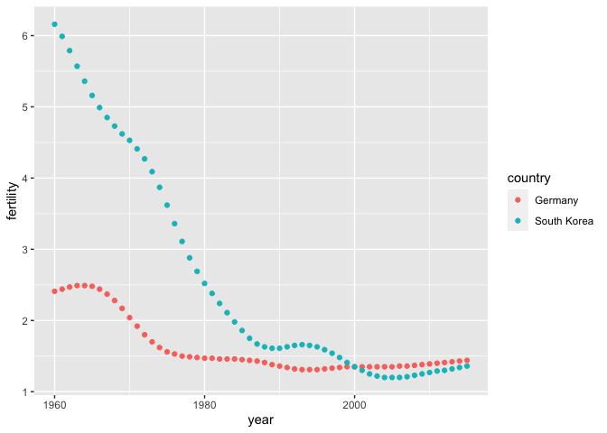<!-- -->

 

#### `spread`

It’s the inverse of `gather`. The second argument tells spread which
variable will be used as the column names. The third argument specifies
which variable to use to fill out the cells:

``` r
back_to_wide <- new_tidy_data %>% spread(year,fertility)
back_to_wide
```

    ## # A tibble: 2 x 57
    ##   country `1960` `1961` `1962` `1963` `1964` `1965` `1966` `1967` `1968` `1969`
    ##   <chr>    <dbl>  <dbl>  <dbl>  <dbl>  <dbl>  <dbl>  <dbl>  <dbl>  <dbl>  <dbl>
    ## 1 Germany   2.41   2.44   2.47   2.49   2.49   2.48   2.44   2.37   2.28   2.17
    ## 2 South …   6.16   5.99   5.79   5.57   5.36   5.16   4.99   4.85   4.73   4.62
    ## # … with 46 more variables: `1970` <dbl>, `1971` <dbl>, `1972` <dbl>,
    ## #   `1973` <dbl>, `1974` <dbl>, `1975` <dbl>, `1976` <dbl>, `1977` <dbl>,
    ## #   `1978` <dbl>, `1979` <dbl>, `1980` <dbl>, `1981` <dbl>, `1982` <dbl>,
    ## #   `1983` <dbl>, `1984` <dbl>, `1985` <dbl>, `1986` <dbl>, `1987` <dbl>,
    ## #   `1988` <dbl>, `1989` <dbl>, `1990` <dbl>, `1991` <dbl>, `1992` <dbl>,
    ## #   `1993` <dbl>, `1994` <dbl>, `1995` <dbl>, `1996` <dbl>, `1997` <dbl>,
    ## #   `1998` <dbl>, `1999` <dbl>, `2000` <dbl>, `2001` <dbl>, `2002` <dbl>,
    ## #   `2003` <dbl>, `2004` <dbl>, `2005` <dbl>, `2006` <dbl>, `2007` <dbl>,
    ## #   `2008` <dbl>, `2009` <dbl>, `2010` <dbl>, `2011` <dbl>, `2012` <dbl>,
    ## #   `2013` <dbl>, `2014` <dbl>, `2015` <dbl>

 

#### `separate`

``` r
path <- system.file("extdata", package = "dslabs")

filename <- "life-expectancy-and-fertility-two-countries-example.csv"
filename <-  file.path(path, filename)

raw_dat <- read_csv(filename)
select(raw_dat, 1:5)
```

    ## # A tibble: 2 x 5
    ##   country  `1960_fertility` `1960_life_expec… `1961_fertility` `1961_life_expec…
    ##   <chr>               <dbl>             <dbl>            <dbl>             <dbl>
    ## 1 Germany              2.41              69.3             2.44              69.8
    ## 2 South K…             6.16              53.0             5.99              53.8

We can start the data wrangling with the gather function, but we should
no longer use the column name year for the new column since it also
contains the variable type. We will call it key, the default, for now:

``` r
dat <- raw_dat %>% gather(key,value,-country)
dat
```

    ## # A tibble: 224 x 3
    ##    country     key                  value
    ##    <chr>       <chr>                <dbl>
    ##  1 Germany     1960_fertility        2.41
    ##  2 South Korea 1960_fertility        6.16
    ##  3 Germany     1960_life_expectancy 69.3 
    ##  4 South Korea 1960_life_expectancy 53.0 
    ##  5 Germany     1961_fertility        2.44
    ##  6 South Korea 1961_fertility        5.99
    ##  7 Germany     1961_life_expectancy 69.8 
    ##  8 South Korea 1961_life_expectancy 53.8 
    ##  9 Germany     1962_fertility        2.47
    ## 10 South Korea 1962_fertility        5.79
    ## # … with 214 more rows

We want to have the values from the two variables, fertility and life
expectancy, in two separate columns. The first challenge to achieve this
is to separate the key column into the year and the variable type.
Notice that the entries in this column separate the year from the
variable name with an
    underscore:

``` r
dat$key[1:3]
```

    ## [1] "1960_fertility"       "1960_fertility"       "1960_life_expectancy"

The `separate` function takes three arguments: the name of the column to
be separated, the names to be used for the new columns, and the
character that separates the
    variables.

``` r
dat %>% separate(key,c("year","variable_name"),"_")
```

    ## Warning: Expected 2 pieces. Additional pieces discarded in 112 rows [3, 4, 7, 8,
    ## 11, 12, 15, 16, 19, 20, 23, 24, 27, 28, 31, 32, 35, 36, 39, 40, ...].

    ## # A tibble: 224 x 4
    ##    country     year  variable_name value
    ##    <chr>       <chr> <chr>         <dbl>
    ##  1 Germany     1960  fertility      2.41
    ##  2 South Korea 1960  fertility      6.16
    ##  3 Germany     1960  life          69.3 
    ##  4 South Korea 1960  life          53.0 
    ##  5 Germany     1961  fertility      2.44
    ##  6 South Korea 1961  fertility      5.99
    ##  7 Germany     1961  life          69.8 
    ##  8 South Korea 1961  life          53.8 
    ##  9 Germany     1962  fertility      2.47
    ## 10 South Korea 1962  fertility      5.79
    ## # … with 214 more rows

We could add a third column to catch this and let the separate function
know which column to fill in with missing values, NA, when there is no
third value. Here we tell it to fill the column on the right:

``` r
var_names <- (c("year","first_variable_name","second_variable_name"))

dat %>% separate(key,var_names,fill="right")
```

    ## # A tibble: 224 x 5
    ##    country     year  first_variable_name second_variable_name value
    ##    <chr>       <chr> <chr>               <chr>                <dbl>
    ##  1 Germany     1960  fertility           <NA>                  2.41
    ##  2 South Korea 1960  fertility           <NA>                  6.16
    ##  3 Germany     1960  life                expectancy           69.3 
    ##  4 South Korea 1960  life                expectancy           53.0 
    ##  5 Germany     1961  fertility           <NA>                  2.44
    ##  6 South Korea 1961  fertility           <NA>                  5.99
    ##  7 Germany     1961  life                expectancy           69.8 
    ##  8 South Korea 1961  life                expectancy           53.8 
    ##  9 Germany     1962  fertility           <NA>                  2.47
    ## 10 South Korea 1962  fertility           <NA>                  5.79
    ## # … with 214 more rows

Or we can use the `extra="merge"`
argument

``` r
new_dat <- dat %>% separate(key, c("year", "variable_name"),"_", extra = "merge")
new_dat
```

    ## # A tibble: 224 x 4
    ##    country     year  variable_name   value
    ##    <chr>       <chr> <chr>           <dbl>
    ##  1 Germany     1960  fertility        2.41
    ##  2 South Korea 1960  fertility        6.16
    ##  3 Germany     1960  life_expectancy 69.3 
    ##  4 South Korea 1960  life_expectancy 53.0 
    ##  5 Germany     1961  fertility        2.44
    ##  6 South Korea 1961  fertility        5.99
    ##  7 Germany     1961  life_expectancy 69.8 
    ##  8 South Korea 1961  life_expectancy 53.8 
    ##  9 Germany     1962  fertility        2.47
    ## 10 South Korea 1962  fertility        5.79
    ## # … with 214 more rows

Now we need to create a column for each variable, we can use `spread` or
`pivot_wider`

``` r
# with pivot_wider, new columns as names_from=..., and the values_from=...

new_dat %>% pivot_wider(names_from=variable_name, values_from=value)
```

    ## # A tibble: 112 x 4
    ##    country     year  fertility life_expectancy
    ##    <chr>       <chr>     <dbl>           <dbl>
    ##  1 Germany     1960       2.41            69.3
    ##  2 South Korea 1960       6.16            53.0
    ##  3 Germany     1961       2.44            69.8
    ##  4 South Korea 1961       5.99            53.8
    ##  5 Germany     1962       2.47            70.0
    ##  6 South Korea 1962       5.79            54.5
    ##  7 Germany     1963       2.49            70.1
    ##  8 South Korea 1963       5.57            55.3
    ##  9 Germany     1964       2.49            70.7
    ## 10 South Korea 1964       5.36            56.0
    ## # … with 102 more rows

``` r
new_dat %>% spread(variable_name,value)
```

    ## # A tibble: 112 x 4
    ##    country year  fertility life_expectancy
    ##    <chr>   <chr>     <dbl>           <dbl>
    ##  1 Germany 1960       2.41            69.3
    ##  2 Germany 1961       2.44            69.8
    ##  3 Germany 1962       2.47            70.0
    ##  4 Germany 1963       2.49            70.1
    ##  5 Germany 1964       2.49            70.7
    ##  6 Germany 1965       2.48            70.6
    ##  7 Germany 1966       2.44            70.8
    ##  8 Germany 1967       2.37            71.0
    ##  9 Germany 1968       2.28            70.6
    ## 10 Germany 1969       2.17            70.5
    ## # … with 102 more rows

 

#### `unite`

Suppose that we did not know about extra and used this command to
separate:

``` r
dat %>% 
  separate(key, var_names, fill = "right")
```

    ## # A tibble: 224 x 5
    ##    country     year  first_variable_name second_variable_name value
    ##    <chr>       <chr> <chr>               <chr>                <dbl>
    ##  1 Germany     1960  fertility           <NA>                  2.41
    ##  2 South Korea 1960  fertility           <NA>                  6.16
    ##  3 Germany     1960  life                expectancy           69.3 
    ##  4 South Korea 1960  life                expectancy           53.0 
    ##  5 Germany     1961  fertility           <NA>                  2.44
    ##  6 South Korea 1961  fertility           <NA>                  5.99
    ##  7 Germany     1961  life                expectancy           69.8 
    ##  8 South Korea 1961  life                expectancy           53.8 
    ##  9 Germany     1962  fertility           <NA>                  2.47
    ## 10 South Korea 1962  fertility           <NA>                  5.79
    ## # … with 214 more rows

We can achieve the same final result by uniting the second and third
columns, then spreading the columns and renaming fertility\_NA to
fertility:

``` r
dat %>% 
  separate(key, var_names, fill = "right") %>%
  unite(variable_name,first_variable_name,second_variable_name) %>%
  spread(variable_name,value) %>%
  rename(fertility=fertility_NA)
```

    ## # A tibble: 112 x 4
    ##    country year  fertility life_expectancy
    ##    <chr>   <chr>     <dbl>           <dbl>
    ##  1 Germany 1960       2.41            69.3
    ##  2 Germany 1961       2.44            69.8
    ##  3 Germany 1962       2.47            70.0
    ##  4 Germany 1963       2.49            70.1
    ##  5 Germany 1964       2.49            70.7
    ##  6 Germany 1965       2.48            70.6
    ##  7 Germany 1966       2.44            70.8
    ##  8 Germany 1967       2.37            71.0
    ##  9 Germany 1968       2.28            70.6
    ## 10 Germany 1969       2.17            70.5
    ## # … with 102 more rows

 

#### Exercises

``` r
library(tidyverse)
library(dslabs)
```

9.  Examine the built-in dataset co2. This dataset comes with base R,
    not dslabs - just type co2 to access the dataset.

Is co2 tidy? Why or why
not?

``` r
# not tidy, we would have 1 observation per row with columns year, month, value
```

10. Run the following command to define the co2\_wide object:

<!-- end list -->

``` r
co2_wide <- data.frame(matrix(co2, ncol = 12, byrow = TRUE)) %>% 
      setNames(1:12) %>%
    mutate(year = as.character(1959:1997))

head(co2_wide)
```

    ##        1      2      3      4      5      6      7      8      9     10     11
    ## 1 315.42 316.31 316.50 317.56 318.13 318.00 316.39 314.65 313.68 313.18 314.66
    ## 2 316.27 316.81 317.42 318.87 319.87 319.43 318.01 315.74 314.00 313.68 314.84
    ## 3 316.73 317.54 318.38 319.31 320.42 319.61 318.42 316.63 314.83 315.16 315.94
    ## 4 317.78 318.40 319.53 320.42 320.85 320.45 319.45 317.25 316.11 315.27 316.53
    ## 5 318.58 318.92 319.70 321.22 322.08 321.31 319.58 317.61 316.05 315.83 316.91
    ## 6 319.41 320.07 320.74 321.40 322.06 321.73 320.27 318.54 316.54 316.71 317.53
    ##       12 year
    ## 1 315.43 1959
    ## 2 316.03 1960
    ## 3 316.85 1961
    ## 4 317.53 1962
    ## 5 318.20 1963
    ## 6 318.55 1964

Use the gather() function to make this dataset tidy. Call the column
with the CO2 measurements co2 and call the month column month. Name the
resulting object co2\_tidy.

``` r
co2_tidy <- gather(co2_wide,month,co2,-year)
head(co2_tidy)
```

    ##   year month    co2
    ## 1 1959     1 315.42
    ## 2 1960     1 316.27
    ## 3 1961     1 316.73
    ## 4 1962     1 317.78
    ## 5 1963     1 318.58
    ## 6 1964     1 319.41

11. Use co2\_tidy to plot CO2 versus month with a different curve for
    each year: What can be concluded from this
plot?

<!-- end list -->

``` r
co2_tidy %>% ggplot(aes(as.numeric(month), co2, color = year)) + geom_line()
```

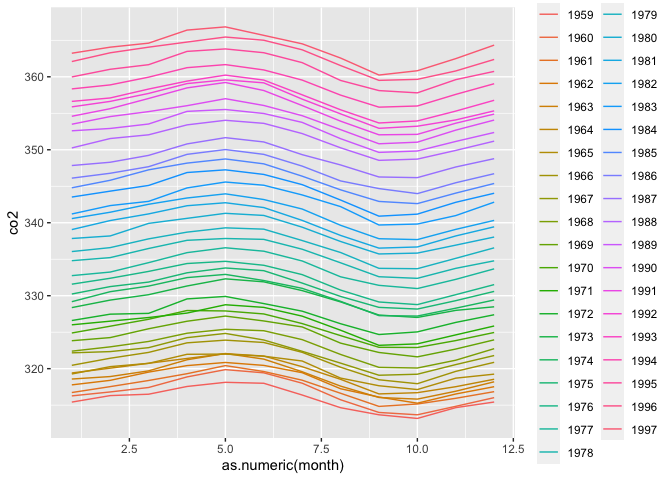<!-- -->

``` r
# CO2 concentrations are highest around May and the yearly average increased from 1959 to 1997.
```

12. Load the admissions dataset from dslabs, which contains college
    admission information for men and women across six majors, and
    remove the applicants percentage column:

<!-- end list -->

``` r
library(dslabs)
data(admissions)
dat <- admissions %>% select(-applicants)
dat
```

    ##    major gender admitted
    ## 1      A    men       62
    ## 2      B    men       63
    ## 3      C    men       37
    ## 4      D    men       33
    ## 5      E    men       28
    ## 6      F    men        6
    ## 7      A  women       82
    ## 8      B  women       68
    ## 9      C  women       34
    ## 10     D  women       35
    ## 11     E  women       24
    ## 12     F  women        7

Your goal is to get the data in the shape that has one row for each
major

``` r
dat %>% spread(gender, admitted)
```

    ##   major men women
    ## 1     A  62    82
    ## 2     B  63    68
    ## 3     C  37    34
    ## 4     D  33    35
    ## 5     E  28    24
    ## 6     F   6     7

13. Now use the admissions dataset to create the object tmp, which has
    columns major, gender, key and value:

<!-- end list -->

``` r
tmp <- gather(admissions, key, value, admitted:applicants)
tmp
```

    ##    major gender        key value
    ## 1      A    men   admitted    62
    ## 2      B    men   admitted    63
    ## 3      C    men   admitted    37
    ## 4      D    men   admitted    33
    ## 5      E    men   admitted    28
    ## 6      F    men   admitted     6
    ## 7      A  women   admitted    82
    ## 8      B  women   admitted    68
    ## 9      C  women   admitted    34
    ## 10     D  women   admitted    35
    ## 11     E  women   admitted    24
    ## 12     F  women   admitted     7
    ## 13     A    men applicants   825
    ## 14     B    men applicants   560
    ## 15     C    men applicants   325
    ## 16     D    men applicants   417
    ## 17     E    men applicants   191
    ## 18     F    men applicants   373
    ## 19     A  women applicants   108
    ## 20     B  women applicants    25
    ## 21     C  women applicants   593
    ## 22     D  women applicants   375
    ## 23     E  women applicants   393
    ## 24     F  women applicants   341

Combine the key and gender and create a new column called column\_name
to get a variable with the following values: admitted\_men,
admitted\_women, applicants\_men and applicants\_women. Save the new
data as tmp2.

Which command could help you to wrangle the data into the desired
format?

``` r
tmp2 <- unite(tmp, column_name, c(key, gender))
tmp2
```

    ##    major      column_name value
    ## 1      A     admitted_men    62
    ## 2      B     admitted_men    63
    ## 3      C     admitted_men    37
    ## 4      D     admitted_men    33
    ## 5      E     admitted_men    28
    ## 6      F     admitted_men     6
    ## 7      A   admitted_women    82
    ## 8      B   admitted_women    68
    ## 9      C   admitted_women    34
    ## 10     D   admitted_women    35
    ## 11     E   admitted_women    24
    ## 12     F   admitted_women     7
    ## 13     A   applicants_men   825
    ## 14     B   applicants_men   560
    ## 15     C   applicants_men   325
    ## 16     D   applicants_men   417
    ## 17     E   applicants_men   191
    ## 18     F   applicants_men   373
    ## 19     A applicants_women   108
    ## 20     B applicants_women    25
    ## 21     C applicants_women   593
    ## 22     D applicants_women   375
    ## 23     E applicants_women   393
    ## 24     F applicants_women   341

14. Which function can reshape tmp2 to a table with six rows and five
    columns named major, admitted\_men, admitted\_women, applicants\_men
    and
    applicants\_women?

<!-- end list -->

``` r
tmp2 %>% spread(column_name,value)
```

    ##   major admitted_men admitted_women applicants_men applicants_women
    ## 1     A           62             82            825              108
    ## 2     B           63             68            560               25
    ## 3     C           37             34            325              593
    ## 4     D           33             35            417              375
    ## 5     E           28             24            191              393
    ## 6     F            6              7            373              341

 

### Joining tables

 

#### Joins

The join functions in the dplyr package combine two tables such that
matching rows are together.

  - left\_join() only keeps rows that have information in the first
    table.

  - right\_join() only keeps rows that have information in the second
    table.

  - inner\_join() only keeps rows that have information in both tables.

  - full\_join() keeps all rows from both tables.

  - semi\_join() keeps the part of first table for which we have
    information in the second.

  - anti\_join() keeps the elements of the first table for which there
    is no information in the second.

Notice what happens if we join the two tables below by state using
left\_join (we will remove the others column and rename electoral\_votes
so that the tables fit on the page)

``` r
head(murders)
```

    ##        state abb region population total
    ## 1    Alabama  AL  South    4779736   135
    ## 2     Alaska  AK   West     710231    19
    ## 3    Arizona  AZ   West    6392017   232
    ## 4   Arkansas  AR  South    2915918    93
    ## 5 California  CA   West   37253956  1257
    ## 6   Colorado  CO   West    5029196    65

``` r
head(results_us_election_2016)
```

    ##          state electoral_votes clinton trump others
    ## 1   California              55    61.7  31.6    6.7
    ## 2        Texas              38    43.2  52.2    4.5
    ## 3      Florida              29    47.8  49.0    3.2
    ## 4     New York              29    59.0  36.5    4.5
    ## 5     Illinois              20    55.8  38.8    5.4
    ## 6 Pennsylvania              20    47.9  48.6    3.6

``` r
# left join, removing others, and renaming ev
tab <- left_join(murders, results_us_election_2016, by = "state") %>% select(-others) %>% rename(ev = electoral_votes)
head(tab)
```

    ##        state abb region population total ev clinton trump
    ## 1    Alabama  AL  South    4779736   135  9    34.4  62.1
    ## 2     Alaska  AK   West     710231    19  3    36.6  51.3
    ## 3    Arizona  AZ   West    6392017   232 11    45.1  48.7
    ## 4   Arkansas  AR  South    2915918    93  6    33.7  60.6
    ## 5 California  CA   West   37253956  1257 55    61.7  31.6
    ## 6   Colorado  CO   West    5029196    65  9    48.2  43.3

Now we can explore population and electoral data combined

``` r
library(ggrepel)
tab %>% ggplot(aes(population/10^6, ev, label = abb)) +
  geom_point() +
  geom_text_repel() + 
  scale_x_continuous(trans = "log2") +
  scale_y_continuous(trans = "log2") +
  geom_smooth(method = "lm", se = FALSE)
```

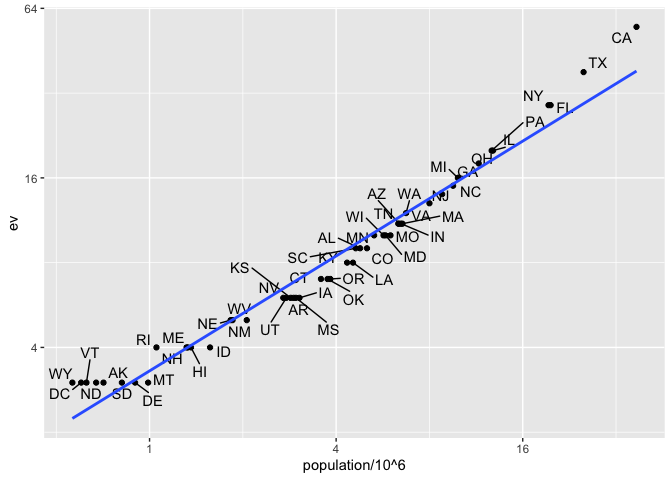<!-- -->

it is not always the case that each row in one table has a matching row
in the other. For this reason, we have several versions of join. To
illustrate this challenge, we will take subsets of the tables above. We
create the tables tab1 and tab2 so that they have some states in common
but not all:

``` r
tab_1 <- slice(murders, 1:6) %>% select(state, population)
tab_1
```

    ##        state population
    ## 1    Alabama    4779736
    ## 2     Alaska     710231
    ## 3    Arizona    6392017
    ## 4   Arkansas    2915918
    ## 5 California   37253956
    ## 6   Colorado    5029196

``` r
tab_2 <- results_us_election_2016 %>% 
  filter(state%in%c("Alabama", "Alaska", "Arizona", 
                    "California", "Connecticut", "Delaware")) %>% 
  select(state, electoral_votes) %>% rename(ev = electoral_votes)
tab_2
```

    ##         state ev
    ## 1  California 55
    ## 2     Arizona 11
    ## 3     Alabama  9
    ## 4 Connecticut  7
    ## 5      Alaska  3
    ## 6    Delaware  3

 

#### left\_join

Suppose we want a table like tab\_1, but adding electoral votes to
whatever states we have available. For this, we use left\_join with
tab\_1 as the first argument. We specify which column to use to match
with the by argument. Note that NAs are added to the two states not
appearing in tab\_2. Also, notice that this function, as well as all the
other joins, can receive the first arguments through the pipe

``` r
left_join(tab_1, tab_2, by = "state")
```

    ##        state population ev
    ## 1    Alabama    4779736  9
    ## 2     Alaska     710231  3
    ## 3    Arizona    6392017 11
    ## 4   Arkansas    2915918 NA
    ## 5 California   37253956 55
    ## 6   Colorado    5029196 NA

 

#### right\_join

If instead of a table with the same rows as first table, we want one
with the same rows as second table, we can use right\_join:

``` r
right_join(tab_1, tab_2,by="state")
```

    ##         state population ev
    ## 1  California   37253956 55
    ## 2     Arizona    6392017 11
    ## 3     Alabama    4779736  9
    ## 4 Connecticut         NA  7
    ## 5      Alaska     710231  3
    ## 6    Delaware         NA  3

 

#### inner\_join

If we want to keep only the rows that have information in both tables,
we use inner\_join. You can think of this as an intersection:

``` r
inner_join(tab_1,tab_2,by="state")
```

    ##        state population ev
    ## 1    Alabama    4779736  9
    ## 2     Alaska     710231  3
    ## 3    Arizona    6392017 11
    ## 4 California   37253956 55

 

#### full\_join

If we want to keep all the rows and fill the missing parts with NAs, we
can use full\_join. You can think of this as a union:

``` r
full_join(tab_1, tab_2, by="state")
```

    ##         state population ev
    ## 1     Alabama    4779736  9
    ## 2      Alaska     710231  3
    ## 3     Arizona    6392017 11
    ## 4    Arkansas    2915918 NA
    ## 5  California   37253956 55
    ## 6    Colorado    5029196 NA
    ## 7 Connecticut         NA  7
    ## 8    Delaware         NA  3

 

#### semi\_join

The semi\_join function lets us keep the part of first table for which
we have information in the second. It does not add the columns of the
second:

``` r
semi_join(tab_1, tab_2,by="state")
```

    ##        state population
    ## 1    Alabama    4779736
    ## 2     Alaska     710231
    ## 3    Arizona    6392017
    ## 4 California   37253956

 

#### anti\_join

The function anti\_join is the opposite of semi\_join. It keeps the
elements of the first table for which there is no information in the
second:

``` r
anti_join(tab_1, tab_2, by="state")
```

    ##      state population
    ## 1 Arkansas    2915918
    ## 2 Colorado    5029196

 

### Binding

 

#### Binding columns

The dplyr function bind\_cols binds two objects by making them columns
in a tibble. For example, we quickly want to make a data frame
consisting of numbers we can use.

``` r
bind_cols(a = 1:3, b = 4:6)
```

    ## # A tibble: 3 x 2
    ##       a     b
    ##   <int> <int>
    ## 1     1     4
    ## 2     2     5
    ## 3     3     6

 

#### Binding rows

``` r
tab_1 <- tab[1:2,]
tab_2 <- tab[3:4,]
bind_rows(tab_1, tab_2)
```

    ##      state abb region population total ev clinton trump
    ## 1  Alabama  AL  South    4779736   135  9    34.4  62.1
    ## 2   Alaska  AK   West     710231    19  3    36.6  51.3
    ## 3  Arizona  AZ   West    6392017   232 11    45.1  48.7
    ## 4 Arkansas  AR  South    2915918    93  6    33.7  60.6

 

### Set operators

 

#### intersect

You can take intersections of vectors of any type, such as numeric:

``` r
intersect(1:10, 6:15)
```

    ## [1]  6  7  8  9 10

or characters:

``` r
intersect(c("a","b","c"), c("b","c","d"))
```

    ## [1] "b" "c"

The dplyr package includes an intersect function that can be applied to
tables with the same column names. This function returns the rows in
common between two tables. To make sure we use the dplyr version of
intersect rather than the base package version, we can use
dplyr::intersect like this:

``` r
tab_1 <- tab[1:5,]
tab_2 <- tab[3:7,]
dplyr::intersect(tab_1, tab_2)
```

    ##        state abb region population total ev clinton trump
    ## 1    Arizona  AZ   West    6392017   232 11    45.1  48.7
    ## 2   Arkansas  AR  South    2915918    93  6    33.7  60.6
    ## 3 California  CA   West   37253956  1257 55    61.7  31.6

 

#### union

Similarly union takes the union of vectors. For example:

``` r
union(1:10, 6:15)
```

    ##  [1]  1  2  3  4  5  6  7  8  9 10 11 12 13 14 15

``` r
union(c("a","b","c"), c("b","c","d"))
```

    ## [1] "a" "b" "c" "d"

The dplyr package includes a version of union that combines all the rows
of two tables with the same column names.

``` r
tab_1 <- tab[1:5,]
tab_2 <- tab[3:7,]
dplyr::union(tab_1, tab_2) 
```

    ##         state abb    region population total ev clinton trump
    ## 1     Alabama  AL     South    4779736   135  9    34.4  62.1
    ## 2      Alaska  AK      West     710231    19  3    36.6  51.3
    ## 3     Arizona  AZ      West    6392017   232 11    45.1  48.7
    ## 4    Arkansas  AR     South    2915918    93  6    33.7  60.6
    ## 5  California  CA      West   37253956  1257 55    61.7  31.6
    ## 6    Colorado  CO      West    5029196    65  9    48.2  43.3
    ## 7 Connecticut  CT Northeast    3574097    97  7    54.6  40.9

 

#### setdiff

The set difference between a first and second argument can be obtained
with setdiff. Unlike intersect and union, this function is not
symmetric:

``` r
setdiff(1:10, 6:15)
```

    ## [1] 1 2 3 4 5

``` r
setdiff(6:15, 1:10)
```

    ## [1] 11 12 13 14 15

As with the functions shown above, dplyr has a version for data frames:

``` r
tab_1 <- tab[1:5,]
tab_2 <- tab[3:7,]
dplyr::setdiff(tab_1, tab_2)
```

    ##     state abb region population total ev clinton trump
    ## 1 Alabama  AL  South    4779736   135  9    34.4  62.1
    ## 2  Alaska  AK   West     710231    19  3    36.6  51.3

 

#### setequal

the function setequal tells us if two sets are the same, regardless of
order. So notice that:

``` r
setequal(1:5, 1:6)
```

    ## [1] FALSE

but:

``` r
setequal(1:5, 5:1)
```

    ## [1] TRUE

 

#### Exercises

5.  The Batting data frame contains the offensive statistics for all
    baseball players over several seasons. Filter this data frame to
    define top as the top 10 home run (HR) hitters in 2016:

<!-- end list -->

``` r
library(Lahman)
top <- Batting %>% 
  filter(yearID == 2016) %>%
  arrange(desc(HR)) %>%    # arrange by descending HR count
  slice(1:10)    # take entries 1-10
top %>% as_tibble()
```

    ## # A tibble: 10 x 22
    ##    playerID yearID stint teamID lgID      G    AB     R     H   X2B   X3B    HR
    ##    <chr>     <int> <int> <fct>  <fct> <int> <int> <int> <int> <int> <int> <int>
    ##  1 trumbma…   2016     1 BAL    AL      159   613    94   157    27     1    47
    ##  2 cruzne02   2016     1 SEA    AL      155   589    96   169    27     1    43
    ##  3 daviskh…   2016     1 OAK    AL      150   555    85   137    24     2    42
    ##  4 doziebr…   2016     1 MIN    AL      155   615   104   165    35     5    42
    ##  5 encared…   2016     1 TOR    AL      160   601    99   158    34     0    42
    ##  6 arenano…   2016     1 COL    NL      160   618   116   182    35     6    41
    ##  7 cartech…   2016     1 MIL    NL      160   549    84   122    27     1    41
    ##  8 frazito…   2016     1 CHA    AL      158   590    89   133    21     0    40
    ##  9 bryankr…   2016     1 CHN    NL      155   603   121   176    35     3    39
    ## 10 canoro01   2016     1 SEA    AL      161   655   107   195    33     2    39
    ## # … with 10 more variables: RBI <int>, SB <int>, CS <int>, BB <int>, SO <int>,
    ## #   IBB <int>, HBP <int>, SH <int>, SF <int>, GIDP <int>

Also Inspect the Master data frame, which has demographic information
for all players:

``` r
Master %>% as_tibble()
```

    ## # A tibble: 19,617 x 26
    ##    playerID birthYear birthMonth birthDay birthCountry birthState birthCity
    ##    <chr>        <int>      <int>    <int> <chr>        <chr>      <chr>    
    ##  1 aardsda…      1981         12       27 USA          CO         Denver   
    ##  2 aaronha…      1934          2        5 USA          AL         Mobile   
    ##  3 aaronto…      1939          8        5 USA          AL         Mobile   
    ##  4 aasedo01      1954          9        8 USA          CA         Orange   
    ##  5 abadan01      1972          8       25 USA          FL         Palm Bea…
    ##  6 abadfe01      1985         12       17 D.R.         La Romana  La Romana
    ##  7 abadijo…      1850         11        4 USA          PA         Philadel…
    ##  8 abbated…      1877          4       15 USA          PA         Latrobe  
    ##  9 abbeybe…      1869         11       11 USA          VT         Essex    
    ## 10 abbeych…      1866         10       14 USA          NE         Falls Ci…
    ## # … with 19,607 more rows, and 19 more variables: deathYear <int>,
    ## #   deathMonth <int>, deathDay <int>, deathCountry <chr>, deathState <chr>,
    ## #   deathCity <chr>, nameFirst <chr>, nameLast <chr>, nameGiven <chr>,
    ## #   weight <int>, height <int>, bats <fct>, throws <fct>, debut <chr>,
    ## #   finalGame <chr>, retroID <chr>, bbrefID <chr>, deathDate <date>,
    ## #   birthDate <date>

Use the correct join or bind function to create a combined table of the
names and statistics of the top 10 home run (HR) hitters for 2016. This
table should have the player ID, first name, last name, and number of HR
for the top 10 players. Name this data frame top\_names.

Identify the join or bind that fills the blank in this code to create
the correct table:

top\_names \<- top %\>% \_\_\_\_\_\_\_\_\_\_\_\_\_\_\_\_\_\_\_ %\>%
select(playerID, nameFirst, nameLast,
HR)

``` r
top_names <- top %>% left_join(Master) %>% select(playerID, nameFirst, nameLast, HR)
```

    ## Joining, by = "playerID"

``` r
top_names
```

    ##     playerID nameFirst    nameLast HR
    ## 1  trumbma01      Mark      Trumbo 47
    ## 2   cruzne02    Nelson        Cruz 43
    ## 3  daviskh01     Khris       Davis 42
    ## 4  doziebr01     Brian      Dozier 42
    ## 5  encared01     Edwin Encarnacion 42
    ## 6  arenano01     Nolan     Arenado 41
    ## 7  cartech02     Chris      Carter 41
    ## 8  frazito01      Todd     Frazier 40
    ## 9  bryankr01      Kris      Bryant 39
    ## 10  canoro01  Robinson        Cano 39

6.  Inspect the Salaries data frame.

<!-- end list -->

``` r
head(Salaries)
```

    ##   yearID teamID lgID  playerID salary
    ## 1   1985    ATL   NL barkele01 870000
    ## 2   1985    ATL   NL bedrost01 550000
    ## 3   1985    ATL   NL benedbr01 545000
    ## 4   1985    ATL   NL  campri01 633333
    ## 5   1985    ATL   NL ceronri01 625000
    ## 6   1985    ATL   NL chambch01 800000

Filter this data frame to the 2016 salaries, then use the correct bind
join function to add a salary column to the top\_names data frame from
the previous question. Name the new data frame top\_salary. Use this
code
framework:

``` r
top_salary <- Salaries %>% filter(yearID == 2016) %>% right_join(top_names) %>% select(nameFirst, nameLast, teamID, HR, salary)
top_salary
```

Which bind or join function fills the blank to generate the correct
table?

``` r
top_salary <- Salaries %>% filter(yearID == 2016) %>% right_join(top_names) %>% select(nameFirst, nameLast, teamID, HR, salary)
```

 

### Web scraping

The data we need to answer a question is not always in a spreadsheet
ready for us to read. For example, the US murders dataset we used in the
R Basics chapter originally comes from this Wikipedia page:

``` r
url <- paste0("https://en.wikipedia.org/w/index.php?title=",
              "Gun_violence_in_the_United_States_by_state",
              "&direction=prev&oldid=810166167")
```

 

#### The rvest package

``` r
h <- read_html(url)
```

The rvest package is actually more general; it handles XML documents.
XML is a general markup language (that’s what the ML stands for) that
can be used to represent any kind of data. HTML is a specific type of
XML specifically developed for representing webpages. Here we focus on
HTML documents.

Now, how do we extract the table from the object h? If we print h, we
don’t really see much:

``` r
h
```

The rvest package includes functions to extract nodes of an HTML
document: html\_nodes extracts all nodes of different types and
html\_node extracts the first one. To extract the tables from the html
code we use:

``` r
tab <- h %>% html_nodes("table")
head(tab)
```

    ## {xml_nodeset (2)}
    ## [1] <table class="wikitable sortable"><tbody>\n<tr>\n<th>State\n</th>\n<th>\n ...
    ## [2] <table class="nowraplinks hlist mw-collapsible mw-collapsed navbox-inner" ...

The table we are interested is the first one:

``` r
tab[[1]]
```

    ## {html_node}
    ## <table class="wikitable sortable">
    ## [1] <tbody>\n<tr>\n<th>State\n</th>\n<th>\n<a href="/wiki/List_of_U.S._states ...

rvest includes a function just for converting HTML tables into data
frames:

``` r
tab <- tab[[1]] %>% html_table
class(tab)
```

    ## [1] "data.frame"

We are now much closer to having a usable data
table:

``` r
tab <- tab %>% setNames(c("state", "population", "total", "murder_rate")) 
head(tab)
```

    ##        state population total murder_rate
    ## 1    Alabama  4,853,875   348         7.2
    ## 2     Alaska    737,709    59         8.0
    ## 3    Arizona  6,817,565   309         4.5
    ## 4   Arkansas  2,977,853   181         6.1
    ## 5 California 38,993,940 1,861         4.8
    ## 6   Colorado  5,448,819   176         3.2

 

#### CSS selectors

If we want to grab data from a webpage and we happen to know a selector
that is unique to the part of the page containing this data, we can use
the html\_nodes function.

 

#### JSON

We can use the function fromJSON from the jsonlite package. Note that
JSON files are often made available via the internet. Several
organizations provide a JSON API or a web service that you can connect
directly to and obtain data. Here is an example:

``` r
citi_bike <- fromJSON("http://citibikenyc.com/stations/json")
```

This downloads a list. The first argument tells you when you downloaded
it:

``` r
citi_bike$executionTime
```

    ## [1] "2020-05-05 09:22:38 AM"

and the second is a data table:

``` r
citi_bike$stationBeanList %>% as_tibble() 
```

    ## # A tibble: 938 x 18
    ##       id stationName availableDocks totalDocks latitude longitude statusValue
    ##    <int> <chr>                <int>      <int>    <dbl>     <dbl> <chr>      
    ##  1    72 W 52 St & …             16         55     40.8     -74.0 In Service 
    ##  2    79 Franklin S…             23         33     40.7     -74.0 In Service 
    ##  3    82 St James P…              0         27     40.7     -74.0 In Service 
    ##  4    83 Atlantic A…              3         62     40.7     -74.0 In Service 
    ##  5   116 W 17 St & …             31         50     40.7     -74.0 In Service 
    ##  6   119 Park Ave &…              9         19     40.7     -74.0 In Service 
    ##  7   120 Lexington …             12         19     40.7     -74.0 In Service 
    ##  8   127 Barrow St …             16         31     40.7     -74.0 In Service 
    ##  9   128 MacDougal …              8         30     40.7     -74.0 In Service 
    ## 10   143 Clinton St…              4         24     40.7     -74.0 In Service 
    ## # … with 928 more rows, and 11 more variables: statusKey <int>,
    ## #   availableBikes <int>, stAddress1 <chr>, stAddress2 <chr>, city <chr>,
    ## #   postalCode <chr>, location <chr>, altitude <chr>, testStation <lgl>,
    ## #   lastCommunicationTime <chr>, landMark <chr>

 

#### Exercises

Load the following web page, which contains information about Major
League Baseball payrolls, into R:
<https://web.archive.org/web/20181024132313/http://www.stevetheump.com/Payrolls.htm>

``` r
url <- "https://web.archive.org/web/20181024132313/http://www.stevetheump.com/Payrolls.htm"
h <- read_html(url)
```

We learned that tables in html are associated with the table node. Use
the html\_nodes() function and the table node type to extract the first
table. Store it in an object nodes:

``` r
nodes <- html_nodes(h, "table")
head(nodes)
```

    ## {xml_nodeset (6)}
    ## [1] <table cellspacing="1" class="style1" style="width: 859px"><tr>\n<td clas ...
    ## [2] <table border="1" cellpadding="2" cellspacing="1" class="style10">\n<thea ...
    ## [3] <table cellpadding="2" cellspacing="1" class="style10">\n<tr class="style ...
    ## [4] <table class="style10" cellpadding="2" cellspacing="1">\n<thead><tr class ...
    ## [5] <table cellpadding="2" cellspacing="1" class="style11">\n<tr class="style ...
    ## [6] <table cellpadding="2" cellspacing="1">\n<tr class="style5">\n<td># Team< ...

The html\_nodes() function returns a list of objects of class xml\_node.
We can see the content of each one using, for example, the html\_text()
function. You can see the content for an arbitrarily picked component
like this:

``` r
html_text(nodes[[8]])
```

If the content of this object is an html table, we can use the
html\_table() function to convert it to a data frame:

``` r
html_table(nodes[[8]])
```

    ##                     Team       Payroll      Averge      Median
    ## 1       New York Yankees $ 197,962,289 $ 6,186,321 $ 1,937,500
    ## 2  Philadelphia Phillies $ 174,538,938 $ 5,817,964 $ 1,875,000
    ## 3         Boston Red Sox $ 173,186,617 $ 5,093,724 $ 1,556,250
    ## 4     Los Angeles Angels $ 154,485,166 $ 5,327,074 $ 3,150,000
    ## 5         Detroit Tigers $ 132,300,000 $ 4,562,068 $ 1,100,000
    ## 6          Texas Rangers $ 120,510,974 $ 4,635,037 $ 3,437,500
    ## 7          Miami Marlins $ 118,078,000 $ 4,373,259 $ 1,500,000
    ## 8   San Francisco Giants $ 117,620,683 $ 3,920,689 $ 1,275,000
    ## 9    St. Louis Cardinals $ 110,300,862 $ 3,939,316   $ 800,000
    ## 10     Milwaukee Brewers  $ 97,653,944 $ 3,755,920 $ 1,981,250
    ## 11     Chicago White Sox  $ 96,919,500 $ 3,876,780   $ 530,000
    ## 12   Los Angeles Dodgers  $ 95,143,575 $ 3,171,452   $ 875,000
    ## 13       Minnesota Twins  $ 94,085,000 $ 3,484,629   $ 750,000
    ## 14         New York Mets  $ 93,353,983 $ 3,457,554   $ 875,000
    ## 15          Chicago Cubs  $ 88,197,033 $ 3,392,193 $ 1,262,500
    ## 16        Atlanta Braves  $ 83,309,942 $ 2,776,998   $ 577,500
    ## 17       Cincinnati Reds  $ 82,203,616 $ 2,935,843 $ 1,150,000
    ## 18      Seattle Mariners  $ 81,978,100 $ 2,927,789   $ 495,150
    ## 19     Baltimore Orioles  $ 81,428,999 $ 2,807,896 $ 1,300,000
    ## 20  Washington Nationals  $ 81,336,143 $ 2,623,746   $ 800,000
    ## 21     Cleveland Indians  $ 78,430,300 $ 2,704,493   $ 800,000
    ## 22      Colorado Rockies  $ 78,069,571 $ 2,692,054   $ 482,000
    ## 23     Toronto Blue Jays  $ 75,489,200 $ 2,696,042 $ 1,768,750
    ## 24  Arizona Diamondbacks  $ 74,284,833 $ 2,653,029 $ 1,625,000
    ## 25        Tampa Bay Rays  $ 64,173,500 $ 2,291,910 $ 1,425,000
    ## 26    Pittsburgh Pirates  $ 63,431,999 $ 2,187,310   $ 916,666
    ## 27    Kansas City Royals  $ 60,916,225 $ 2,030,540   $ 870,000
    ## 28        Houston Astros  $ 60,651,000 $ 2,332,730   $ 491,250
    ## 29     Oakland Athletics  $ 55,372,500 $ 1,845,750   $ 487,500
    ## 30      San Diego Padres  $ 55,244,700 $ 1,973,025 $ 1,207,500

1.  Many tables on this page are team payroll tables, with columns for
    rank, team, and one or more money values.

Convert the first four tables in nodes to data frames and inspect them.

Which of the first four nodes are tables of team
    payroll?

``` r
html_table(nodes[[1]])
```

    ##   X1                                                                     X2
    ## 1 NA Salary Stats 1967-2019\nTop ML Player Salaries / Baseball's Luxury Tax

``` r
html_table(nodes[[2]])
```

    ##    RANK                  TEAM   Payroll
    ## 1     1        Boston Red Sox  $235.65M
    ## 2     2  San Francisco Giants  $208.51M
    ## 3     3   Los Angeles Dodgers  $186.14M
    ## 4     4          Chicago Cubs  $183.46M
    ## 5     5  Washington Nationals  $181.59M
    ## 6     6    Los Angeles Angels   $175.1M
    ## 7     7      New York Yankees  $168.54M
    ## 8     8      Seattle Mariners  $162.48M
    ## 9     9     Toronto Blue Jays $162.316M
    ## 10   10   St. Louis Cardinals  $161.01M
    ## 11   11        Houston Astros  $160.04M
    ## 12   12         New York Mets  $154.61M
    ## 13   13         Texas Rangers   $144.0M
    ## 14   14     Baltimore Orioles  $143.09M
    ## 15   15      Colorado Rockies  $141.34M
    ## 16   16     Cleveland Indians  $134.35M
    ## 17   17  Arizona Diamondbacks   $132.5M
    ## 18   18       Minnesota Twins  $131.91M
    ## 19   19        Detroit Tigers  $129.92M
    ## 20   20    Kansas City Royals  $129.92M
    ## 21   21        Atlanta Braves  $120.54M
    ## 22   22       Cincinnati Reds  $101.19M
    ## 23   23         Miami Marlins   $98.64M
    ## 24   24 Philadelphia Phillies   $96.85M
    ## 25   25      San Diego Padres   $96.13M
    ## 26   26     Milwaukee Brewers   $90.24M
    ## 27   27    Pittsburgh Pirates   $87.88M
    ## 28   28        Tampa Bay Rays   $78.73M
    ## 29   29     Chicago White Sox   $72.18M
    ## 30   30     Oakland Athletics   $68.53M

``` r
html_table(nodes[[3]])
```

    ##      X1                            X2           X3            X4            X5
    ## 1  Rank                          Team       25 Man Disabled List Total Payroll
    ## 2     1           Los Angeles Dodgers $155,887,854   $37,354,166  $242,065,828
    ## 3     2              New York Yankees $168,045,699    $5,644,000  $201,539,699
    ## 4     3                Boston Red Sox $136,780,500   $38,239,250  $199,805,178
    ## 5     4                Detroit Tigers $168,500,600   $11,750,000  $199,750,600
    ## 6     5             Toronto Blue Jays $159,175,968    $2,169,400  $177,795,368
    ## 7     6                 Texas Rangers $115,162,703   $39,136,360  $175,909,063
    ## 8     7          San Francisco Giants $169,504,611    $2,500,000  $172,354,611
    ## 9     8                  Chicago Cubs $170,189,880    $2,000,000  $172,189,880
    ## 10    9          Washington Nationals $163,111,918      $535,000  $167,846,918
    ## 11   10             Baltimore Orioles $142,066,615   $19,501,668  $163,676,616
    ## 12   11 Los Angeles Angels of Anaheim $116,844,833   $17,120,500  $160,375,333
    ## 13   12                 New York Mets $120,870,470   $26,141,990  $155,187,460
    ## 14   13              Seattle Mariners $139,257,018   $15,007,300  $154,800,918
    ## 15   14           St. Louis Cardinals $136,181,533   $13,521,400  $152,452,933
    ## 16   15            Kansas City Royals $127,333,150    $4,092,100  $140,925,250
    ## 17   16              Colorado Rockies  $86,909,571   $14,454,000  $130,963,571
    ## 18   17             Cleveland Indians $101,105,399   $14,005,766  $124,861,165
    ## 19   18                Houston Astros $117,957,800    $4,386,100  $124,343,900
    ## 20   19                Atlanta Braves $103,303,791    $8,927,500  $112,437,541
    ## 21   20                 Miami Marlins  $96,446,100   $15,035,000  $111,881,100
    ## 22   21         Philadelphia Phillies  $86,841,000      $537,000  $111,378,000
    ## 23   22               Minnesota Twins  $92,592,500    $8,735,000  $108,077,500
    ## 24   23            Pittsburgh Pirates  $92,362,832             -  $100,575,946
    ## 25   24             Chicago White Sox  $95,625,000    $1,671,000   $99,119,770
    ## 26   25               Cincinnati Reds  $53,858,785   $26,910,000   $93,768,785
    ## 27   26          Arizona Diamondbacks  $91,481,600    $1,626,000   $93,257,600
    ## 28   27             Oakland Athletics  $64,339,166    $5,732,500   $81,738,333
    ## 29   28              San Diego Padres  $29,628,400    $4,946,000   $71,624,400
    ## 30   29                Tampa Bay Rays  $55,282,232   $14,680,300   $69,962,532
    ## 31   30             Milwaukee Brewers  $50,023,900   $13,037,400   $63,061,300

``` r
html_table(nodes[[4]])
```

    ##    Rank         Team   Opening Day  Avg Salary      Median
    ## 1     1      Dodgers $ 223,352,402 $ 7,445,080 $ 5,166,666
    ## 2     2      Yankees $ 213,472,857 $ 7,361,133 $ 3,300,000
    ## 3     3      Red Sox $ 182,161,414 $ 6,072,047 $ 3,500,000
    ## 4     4       Tigers $ 172,282,250 $ 6,891,290 $ 3,000,000
    ## 5     5       Giants $ 166,495,942 $ 5,946,284 $ 4,000,000
    ## 6     6    Nationals $ 166,010,977 $ 5,724,516 $ 2,500,000
    ## 7     7       Angels $ 146,449,583 $ 5,049,986 $ 1,312,500
    ## 8     8      Rangers $ 144,307,373 $ 4,509,605   $ 937,500
    ## 9     9     Phillies $ 133,048,000 $ 4,434,933   $ 700,000
    ## 10   10    Blue Jays $ 126,369,628 $ 4,357,573 $ 1,650,000
    ## 11   11     Mariners $ 122,706,842 $ 4,719,494 $ 2,252,500
    ## 12   12    Cardinals $ 120,301,957 $ 4,455,628 $ 2,000,000
    ## 13   13         Reds $ 116,732,284 $ 4,323,418 $ 2,350,000
    ## 14   14         Cubs $ 116,654,522 $ 4,166,233 $ 2,515,000
    ## 15   15      Orioles $ 115,587,632 $ 3,985,780 $ 2,750,000
    ## 16   16       Royals $ 112,914,525 $ 4,032,662 $ 2,532,500
    ## 17   17       Padres $ 112,895,700 $ 4,342,142   $ 763,500
    ## 18   18        Twins $ 108,262,000 $ 4,163,923 $ 1,775,000
    ## 19   19         Mets  $ 99,626,453 $ 3,558,088   $ 669,562
    ## 20   20    White Sox  $ 98,712,867 $ 3,525,460 $ 1,250,000
    ## 21   21      Brewers  $ 98,683,035 $ 3,795,501   $ 529,750
    ## 22   22      Rockies  $ 98,261,171 $ 3,388,316 $ 1,087,600
    ## 23   23       Braves  $ 87,622,648 $ 2,920,755 $ 1,333,333
    ## 24   24      Indians  $ 86,339,067 $ 3,197,743 $ 1,940,000
    ## 25   25      Pirates  $ 85,885,832 $ 2,862,861 $ 1,279,166
    ## 26   26      Marlins  $ 84,637,500 $ 3,134,722 $ 1,925,000
    ## 27   27    Athletics  $ 80,279,166 $ 2,508,724   $ 648,750
    ## 28   28         Rays  $ 73,649,584 $ 2,454,986   $ 750,000
    ## 29   29 Diamondbacks  $ 70,762,833 $ 2,358,761   $ 663,000
    ## 30   30       Astros  $ 69,064,200 $ 2,466,579 $ 1,031,250

2.  For the last 3 components of nodes, which of the following are true?

<!-- end list -->

``` r
nodes[19] %>% html_table()
```

    ## [[1]]
    ##                   X1           X2         X3
    ## 1               Team      Payroll    Average
    ## 2         NY Yankees $109,791,893 $3,541,674
    ## 3             Boston $109,558,908 $3,423,716
    ## 4        Los Angeles $108,980,952 $3,757,964
    ## 5            NY Mets  $93,174,428 $3,327,658
    ## 6          Cleveland  $91,974,979 $3,065,833
    ## 7            Atlanta  $91,851,687 $2,962,958
    ## 8              Texas  $88,504,421 $2,854,981
    ## 9            Arizona  $81,206,513 $2,900,233
    ## 10         St. Louis  $77,270,855 $2,664,512
    ## 11           Toronto  $75,798,500 $2,707,089
    ## 12           Seattle  $75,652,500 $2,701,875
    ## 13         Baltimore  $72,426,328 $2,497,460
    ## 14          Colorado  $71,068,000 $2,632,148
    ## 15      Chicago Cubs  $64,015,833 $2,462,147
    ## 16     San Francisco  $63,332,667 $2,345,654
    ## 17 Chicago White Sox  $62,363,000 $2,309,741
    ## 18           Houston  $60,382,667 $2,236,395
    ## 19         Tampa Bay  $54,951,602 $2,035,245
    ## 20        Pittsburgh  $52,698,333 $1,699,946
    ## 21           Detroit  $49,831,167 $1,779,685
    ## 22           Anaheim  $46,568,180 $1,502,199
    ## 23        Cincinnati  $45,227,882 $1,739,534
    ## 24         Milwaukee  $43,089,333 $1,595,901
    ## 25      Philadelphia  $41,664,167 $1,602,468
    ## 26         San Diego  $38,333,117 $1,419,745
    ## 27       Kansas City  $35,643,000 $1,229,069
    ## 28           Florida  $35,504,167 $1,183,472
    ## 29          Montreal  $34,774,500 $1,159,150
    ## 30           Oakland  $33,810,750 $1,252,250
    ## 31         Minnesota  $24,350,000   $901,852

``` r
nodes[20] %>% html_table()
```

    ## [[1]]
    ##                   X1          X2         X3
    ## 1               Team     Payroll    Average
    ## 2         NY Yankees $92,538,260 $3,190,974
    ## 3        Los Angeles $88,124,286 $3,263,862
    ## 4            Atlanta $84,537,836 $2,817,928
    ## 5          Baltimore $81,447,435 $2,808,532
    ## 6            Arizona $81,027,833 $2,893,851
    ## 7            NY Mets $79,509,776 $3,180,391
    ## 8             Boston $77,940,333 $2,598,011
    ## 9          Cleveland $75,880,871 $2,918,495
    ## 10             Texas $70,795,921 $2,722,920
    ## 11         Tampa Bay $62,765,129 $2,024,682
    ## 12         St. Louis $61,453,863 $2,276,069
    ## 13          Colorado $61,111,190 $2,182,543
    ## 14      Chicago Cubs $60,539,333 $2,017,978
    ## 15           Seattle $58,915,000 $2,265,962
    ## 16           Detroit $58,265,167 $2,157,969
    ## 17         San Diego $54,821,000 $1,827,367
    ## 18     San Francisco $53,737,826 $2,066,839
    ## 19           Anaheim $51,464,167 $1,715,472
    ## 20           Houston $51,289,111 $1,899,597
    ## 21      Philadelphia $47,308,000 $1,631,310
    ## 22        Cincinnati $46,867,200 $1,735,822
    ## 23           Toronto $46,238,333 $1,778,397
    ## 24         Milwaukee $36,505,333 $1,140,792
    ## 25          Montreal $34,807,833 $1,200,270
    ## 26           Oakland $31,971,333 $1,184,123
    ## 27 Chicago White Sox $31,133,500 $1,073,569
    ## 28        Pittsburgh $28,928,333 $1,112,628
    ## 29       Kansas City $23,433,000   $836,893
    ## 30           Florida $20,072,000   $692,138
    ## 31         Minnesota $16,519,500   $635,365

``` r
nodes[21] %>% html_table()
```

    ## [[1]]
    ##      X1       X2         X3     X4
    ## 1  Year  Minimum    Average  % Chg
    ## 2  2019 $555,000                 -
    ## 3  2018 $545,000 $4,520,000       
    ## 4  2017 $535,000 $4,470,000    5.4
    ## 5  2016 $507,500 $4,400,000      -
    ## 6  2015 $507,500 $4,250,000      -
    ## 7  2014 $507,500 $3,820,000   12.8
    ## 8  2013 $480,000 $3,386,212    5.4
    ## 9  2012 $480,000 $3,440,000    3.8
    ## 10 2011 $414,500 $3,305,393    0.2
    ## 11 2010 $400,000 $3,297,828    1.8
    ## 12 2009 $400,000 $3,240,206    2.7
    ## 13 2008 $390,000 $3,150,000    7.1
    ## 14 2007 $380,000 $2,820,000    4.6
    ## 15 2006 $327,000 $2,699,292      9
    ## 16 2005 $316,000 $2,632,655    5.9
    ## 17 2004 $300,000 $2,486,609 (-2.7)
    ## 18 2003 $300,000 $2,555,416    7.2
    ## 19 2002 $200,000 $2,340,920    5.2
    ## 20 2001 $200,000 $2,138,896   13.9
    ## 21 2000 $200,000 $1,895,630   15.6
    ## 22 1999 $200,000 $1,611,166   19.3
    ## 23 1998 $170,000 $1,398,831    4.2
    ## 24 1997 $150,000 $1,336,609   17.6
    ## 25 1996 $122,667 $1,119,981    9.9
    ## 26 1995 $109,000 $1,110,766 (-9.9)
    ## 27 1994 $109,000 $1,168,263    6.1
    ## 28 1993 $109,000 $1,076,089    3.3
    ## 29 1992 $109,000 $1,028,667   21.7
    ## 30 1991 $100,000   $851,492   53.9
    ## 31 1990 $100,000   $597,537   12.9
    ## 32 1989  $68,000   $497,254       
    ## 33 1988  $62,500   $438,729       
    ## 34 1987  $62,500   $412,454       
    ## 35 1986  $60,000   $412,520       
    ## 36 1985  $60,000   $371,571       
    ## 37 1984  $40,000   $329,408       
    ## 38 1983  $35,000   $289,194       
    ## 39 1982  $33,500   $241,497       
    ## 40 1981  $32,500   $185,651       
    ## 41 1980  $30,000   $143,756       
    ## 42 1979  $21,000   $113,558       
    ## 43 1978  $21,000    $99,876       
    ## 44 1977  $19,000    $76,066       
    ## 45 1976  $19,000    $51,501       
    ## 46 1975  $16,000    $44,676       
    ## 47 1974  $15,000    $40,839       
    ## 48 1973  $15,000    $36,566       
    ## 49 1972  $13,500    $34,092       
    ## 50 1971  $12,750    $31,543       
    ## 51 1970  $12,000    $29,303       
    ## 52 1969  $10,000    $24,909       
    ## 53 1968  $10,000        N/A       
    ## 54 1967   $6,000    $19,000

3.  Create a table called tab\_1 using entry 10 of nodes. Create a table
    called tab\_2 using entry 19 of nodes.

<!-- end list -->

``` r
tab_1 <- nodes[[10]] %>% html_table(header = 1) %>% select(-No.)
tab_1
```

    ##                     Team      Payroll    Average
    ## 1       New York Yankees $206,333,389 $8,253,336
    ## 2         Boston Red Sox $162,747,333 $5,611,977
    ## 3           Chicago Cubs $146,859,000 $5,439,222
    ## 4  Philadelphia Phillies $141,927,381 $5,068,835
    ## 5          New York Mets $132,701,445 $5,103,902
    ## 6         Detroit Tigers $122,864,929 $4,550,553
    ## 7      Chicago White Sox $108,273,197 $4,164,354
    ## 8     Los Angeles Angels $105,013,667 $3,621,161
    ## 9       Seattle Mariners  $98,376,667 $3,513,452
    ## 10  San Francisco Giants  $97,828,833 $3,493,887
    ## 11       Minnesota Twins  $97,559,167 $3,484,256
    ## 12   Los Angeles Dodgers  $94,945,517 $3,651,751
    ## 13   St. Louis Cardinals  $93,540,753 $3,741,630
    ## 14        Houston Astros  $92,355,500 $3,298,411
    ## 15        Atlanta Braves  $84,423,667 $3,126,802
    ## 16      Colorado Rockies  $84,227,000 $2,904,379
    ## 17     Baltimore Orioles  $81,612,500 $3,138,942
    ## 18     Milwaukee Brewers  $81,108,279 $2,796,837
    ## 19       Cincinnati Reds  $72,386,544 $2,784,098
    ## 20    Kansas City Royals  $72,267,710 $2,491,990
    ## 21        Tampa Bay Rays  $71,923,471 $2,663,832
    ## 22     Toronto Blue Jays  $62,689,357 $2,089,645
    ## 23  Washington Nationals  $61,425,000 $2,047,500
    ## 24     Cleveland Indians  $61,203,967 $2,110,482
    ## 25  Arizona Diamondbacks  $60,718,167 $2,335,314
    ## 26       Florida Marlins  $55,641,500 $2,060,796
    ## 27         Texas Rangers  $55,250,545 $1,905,191
    ## 28     Oakland Athletics  $51,654,900 $1,666,287
    ## 29      San Diego Padres  $37,799,300 $1,453,819
    ## 30    Pittsburgh Pirates  $34,943,000 $1,294,185

``` r
tab_2 <- nodes[[19]] %>% html_table(header = 1)
tab_2
```

    ##                 Team      Payroll    Average
    ## 1         NY Yankees $109,791,893 $3,541,674
    ## 2             Boston $109,558,908 $3,423,716
    ## 3        Los Angeles $108,980,952 $3,757,964
    ## 4            NY Mets  $93,174,428 $3,327,658
    ## 5          Cleveland  $91,974,979 $3,065,833
    ## 6            Atlanta  $91,851,687 $2,962,958
    ## 7              Texas  $88,504,421 $2,854,981
    ## 8            Arizona  $81,206,513 $2,900,233
    ## 9          St. Louis  $77,270,855 $2,664,512
    ## 10           Toronto  $75,798,500 $2,707,089
    ## 11           Seattle  $75,652,500 $2,701,875
    ## 12         Baltimore  $72,426,328 $2,497,460
    ## 13          Colorado  $71,068,000 $2,632,148
    ## 14      Chicago Cubs  $64,015,833 $2,462,147
    ## 15     San Francisco  $63,332,667 $2,345,654
    ## 16 Chicago White Sox  $62,363,000 $2,309,741
    ## 17           Houston  $60,382,667 $2,236,395
    ## 18         Tampa Bay  $54,951,602 $2,035,245
    ## 19        Pittsburgh  $52,698,333 $1,699,946
    ## 20           Detroit  $49,831,167 $1,779,685
    ## 21           Anaheim  $46,568,180 $1,502,199
    ## 22        Cincinnati  $45,227,882 $1,739,534
    ## 23         Milwaukee  $43,089,333 $1,595,901
    ## 24      Philadelphia  $41,664,167 $1,602,468
    ## 25         San Diego  $38,333,117 $1,419,745
    ## 26       Kansas City  $35,643,000 $1,229,069
    ## 27           Florida  $35,504,167 $1,183,472
    ## 28          Montreal  $34,774,500 $1,159,150
    ## 29           Oakland  $33,810,750 $1,252,250
    ## 30         Minnesota  $24,350,000   $901,852

Note that the column names should be c(“Team”, “Payroll”, “Average”).
You can see that these column names are actually in the first data row
of each table, and that tab\_1 has an extra first column No. that should
be removed so that the column names for both tables match.

Remove the extra column in tab\_1, remove the first row of each dataset,
and change the column names for each table to c(“Team”, “Payroll”,
“Average”). Use a full\_join() by the Team to combine these two
tables.

``` r
full_join(tab_1, tab_2, by="Team")
```

    ##                     Team    Payroll.x  Average.x    Payroll.y  Average.y
    ## 1       New York Yankees $206,333,389 $8,253,336         <NA>       <NA>
    ## 2         Boston Red Sox $162,747,333 $5,611,977         <NA>       <NA>
    ## 3           Chicago Cubs $146,859,000 $5,439,222  $64,015,833 $2,462,147
    ## 4  Philadelphia Phillies $141,927,381 $5,068,835         <NA>       <NA>
    ## 5          New York Mets $132,701,445 $5,103,902         <NA>       <NA>
    ## 6         Detroit Tigers $122,864,929 $4,550,553         <NA>       <NA>
    ## 7      Chicago White Sox $108,273,197 $4,164,354  $62,363,000 $2,309,741
    ## 8     Los Angeles Angels $105,013,667 $3,621,161         <NA>       <NA>
    ## 9       Seattle Mariners  $98,376,667 $3,513,452         <NA>       <NA>
    ## 10  San Francisco Giants  $97,828,833 $3,493,887         <NA>       <NA>
    ## 11       Minnesota Twins  $97,559,167 $3,484,256         <NA>       <NA>
    ## 12   Los Angeles Dodgers  $94,945,517 $3,651,751         <NA>       <NA>
    ## 13   St. Louis Cardinals  $93,540,753 $3,741,630         <NA>       <NA>
    ## 14        Houston Astros  $92,355,500 $3,298,411         <NA>       <NA>
    ## 15        Atlanta Braves  $84,423,667 $3,126,802         <NA>       <NA>
    ## 16      Colorado Rockies  $84,227,000 $2,904,379         <NA>       <NA>
    ## 17     Baltimore Orioles  $81,612,500 $3,138,942         <NA>       <NA>
    ## 18     Milwaukee Brewers  $81,108,279 $2,796,837         <NA>       <NA>
    ## 19       Cincinnati Reds  $72,386,544 $2,784,098         <NA>       <NA>
    ## 20    Kansas City Royals  $72,267,710 $2,491,990         <NA>       <NA>
    ## 21        Tampa Bay Rays  $71,923,471 $2,663,832         <NA>       <NA>
    ## 22     Toronto Blue Jays  $62,689,357 $2,089,645         <NA>       <NA>
    ## 23  Washington Nationals  $61,425,000 $2,047,500         <NA>       <NA>
    ## 24     Cleveland Indians  $61,203,967 $2,110,482         <NA>       <NA>
    ## 25  Arizona Diamondbacks  $60,718,167 $2,335,314         <NA>       <NA>
    ## 26       Florida Marlins  $55,641,500 $2,060,796         <NA>       <NA>
    ## 27         Texas Rangers  $55,250,545 $1,905,191         <NA>       <NA>
    ## 28     Oakland Athletics  $51,654,900 $1,666,287         <NA>       <NA>
    ## 29      San Diego Padres  $37,799,300 $1,453,819         <NA>       <NA>
    ## 30    Pittsburgh Pirates  $34,943,000 $1,294,185         <NA>       <NA>
    ## 31            NY Yankees         <NA>       <NA> $109,791,893 $3,541,674
    ## 32                Boston         <NA>       <NA> $109,558,908 $3,423,716
    ## 33           Los Angeles         <NA>       <NA> $108,980,952 $3,757,964
    ## 34               NY Mets         <NA>       <NA>  $93,174,428 $3,327,658
    ## 35             Cleveland         <NA>       <NA>  $91,974,979 $3,065,833
    ## 36               Atlanta         <NA>       <NA>  $91,851,687 $2,962,958
    ## 37                 Texas         <NA>       <NA>  $88,504,421 $2,854,981
    ## 38               Arizona         <NA>       <NA>  $81,206,513 $2,900,233
    ## 39             St. Louis         <NA>       <NA>  $77,270,855 $2,664,512
    ## 40               Toronto         <NA>       <NA>  $75,798,500 $2,707,089
    ## 41               Seattle         <NA>       <NA>  $75,652,500 $2,701,875
    ## 42             Baltimore         <NA>       <NA>  $72,426,328 $2,497,460
    ## 43              Colorado         <NA>       <NA>  $71,068,000 $2,632,148
    ## 44         San Francisco         <NA>       <NA>  $63,332,667 $2,345,654
    ## 45               Houston         <NA>       <NA>  $60,382,667 $2,236,395
    ## 46             Tampa Bay         <NA>       <NA>  $54,951,602 $2,035,245
    ## 47            Pittsburgh         <NA>       <NA>  $52,698,333 $1,699,946
    ## 48               Detroit         <NA>       <NA>  $49,831,167 $1,779,685
    ## 49               Anaheim         <NA>       <NA>  $46,568,180 $1,502,199
    ## 50            Cincinnati         <NA>       <NA>  $45,227,882 $1,739,534
    ## 51             Milwaukee         <NA>       <NA>  $43,089,333 $1,595,901
    ## 52          Philadelphia         <NA>       <NA>  $41,664,167 $1,602,468
    ## 53             San Diego         <NA>       <NA>  $38,333,117 $1,419,745
    ## 54           Kansas City         <NA>       <NA>  $35,643,000 $1,229,069
    ## 55               Florida         <NA>       <NA>  $35,504,167 $1,183,472
    ## 56              Montreal         <NA>       <NA>  $34,774,500 $1,159,150
    ## 57               Oakland         <NA>       <NA>  $33,810,750 $1,252,250
    ## 58             Minnesota         <NA>       <NA>  $24,350,000   $901,852

Note that some students, presumably because of system differences, have
noticed that entry 18 instead of entry 19 of nodes gives them the tab\_2
correctly; be sure to check entry 18 if entry 19 is giving you problems.

How many rows are in the joined data table? **58**

4.  The Wikipedia page on opinion polling for the Brexit referendum, in
    which the United Kingdom voted to leave the European Union in June
    2016, contains several tables. One table contains the results of all
    polls regarding the referendum over 2016:

Use the rvest library to read the HTML from this Wikipedia page (make
sure to copy both lines of the
URL):

``` r
url <- "https://en.wikipedia.org/w/index.php?title=Opinion_polling_for_the_United_Kingdom_European_Union_membership_referendum&oldid=896735054"
```

Assign tab to be the html nodes of the “table” class.

How many tables are in this Wikipedia page?

``` r
h <- read_html(url)
nodes <- html_nodes(h, "table")
length(nodes)
```

    ## [1] 40

5.  Inspect the first several html tables using html\_table() with the
    argument fill=TRUE (you can read about this argument in the
    documentation). Find the first table that has 9 columns with the
    first column named “Date(s) conducted”.

What is the first table number to have 9 columns where the first column
is named “Date(s) conducted”?

``` r
nodes[[5]] %>% html_table(fill=TRUE) %>% head()
```

    ##   Date(s) conducted Remain Leave Undecided Lead     Sample
    ## 1 Date(s) conducted              Undecided Lead     Sample
    ## 2      23 June 2016  48.1% 51.9%       N/A 3.8% 33,577,342
    ## 3           23 June    52%   48%       N/A   4%      4,772
    ## 4           22 June    55%   45%       N/A  10%      4,700
    ## 5        20–22 June    51%   49%       N/A   2%      3,766
    ## 6        20–22 June    49%   46%        1%   3%      1,592
    ##                                                               Conducted by
    ## 1                                                             Conducted by
    ## 2 Results of the United Kingdom European Union membership referendum, 2016
    ## 3                                                                   YouGov
    ## 4                                                                  Populus
    ## 5                                                                   YouGov
    ## 6                                                               Ipsos MORI
    ##         Polling type                                        Notes
    ## 1       Polling type                                        Notes
    ## 2 UK-wide referendum                                             
    ## 3             Online                              On the day poll
    ## 4             Online                                             
    ## 5             Online Includes Northern Ireland (turnout weighted)
    ## 6          Telephone

 

## 6.3 String Processing

 

### The stringr package

    ##            stringr       Task
    ## 1       str_detect     Detect
    ## 2        str_which     Detect
    ## 3       str_subset     Detect
    ## 4       str_locate     Locate
    ## 5   str_locate_all     Locate
    ## 6         str_view     Locate
    ## 7     str_view_all     Locate
    ## 8      str_extract    Extract
    ## 9  str_extract_all    Extract
    ## 10       str_match    Extract
    ## 11   str_match_all    Extract
    ## 12         str_sub    Extract
    ## 13       str_split    Extract
    ## 14 str_split_fixed    Extract
    ## 15       str_count   Describe
    ## 16      str_length   Describe
    ## 17     str_replace    Replace
    ## 18 str_replace_all    Replace
    ## 19    str_to_upper    Replace
    ## 20    str_to_lower    Replace
    ## 21    str_to_title    Replace
    ## 22  str_replace_na    Replace
    ## 23        str_trim    Replace
    ## 24           str_c Manipulate
    ## 25        str_conv Manipulate
    ## 26        str_sort Manipulate
    ## 27       str_order Manipulate
    ## 28       str_trunc Manipulate
    ## 29         str_pad Manipulate
    ## 30         str_dup Manipulate
    ## 31        str_wrap Manipulate
    ## 32      str_interp Manipulate
    ##                                                                                         Description
    ## 1                                                                     Is the pattern in the string?
    ## 2                                            Returns the index of entries that contain the pattern.
    ## 3                                           Returns the subset of strings that contain the pattern.
    ## 4                                     Returns positions of first occurrence of pattern in a string.
    ## 5                                       Returns position of all occurrences of pattern in a string.
    ## 6                                           Show the first part of the string that matches pattern.
    ## 7                                       Show me all the parts of the string that match the pattern.
    ## 8                                    Extract the first part of the string that matches the pattern.
    ## 9                                           Extract all parts of the string that match the pattern.
    ## 10 Extract first part of the string that matches the groups and the patterns defined by the groups.
    ## 11  Extract all parts of the string that matches the groups and the patterns defined by the groups.
    ## 12                                                                             Extract a substring.
    ## 13                                      Split a string into a list with parts separated by pattern.
    ## 14                                    Split a string into a matrix with parts separated by pattern.
    ## 15                                             Count number of times a pattern appears in a string.
    ## 16                                                                   Number of character in string.
    ## 17                                  Replace first part of a string matching a pattern with another.
    ## 18                                   Replace all parts of a string matching a pattern with another.
    ## 19                                                             Change all characters to upper case.
    ## 20                                                             Change all characters to lower case.
    ## 21                                               Change first character to upper and rest to lower.
    ## 22                                                                  Replace all NAs to a new value.
    ## 23                                                 Remove white space from start and end of string.
    ## 24                                                                           Join multiple strings.
    ## 25                                                               Change the encoding of the string.
    ## 26                                                           Sort the vector in alphabetical order.
    ## 27                                          Index needed to order the vector in alphabetical order.
    ## 28                                                               Truncate a string to a fixed size.
    ## 29                                               Add white space to string to make it a fixed size.
    ## 30                                                                                 Repeat a string.
    ## 31                                                           Wrap things into formatted paragraphs.
    ## 32                                                                            String interpolation.

 

### Case study 1: US murder data

``` r
url <- paste0("https://en.wikipedia.org/w/index.php?title=",
              "Gun_violence_in_the_United_States_by_state",
              "&direction=prev&oldid=810166167")

murders_raw <- read_html(url) %>%
  html_node("table") %>%
  html_table() %>%
  setNames(c("state", "population", "total", "murder_rate"))

murders_raw %>% head()
```

    ##        state population total murder_rate
    ## 1    Alabama  4,853,875   348         7.2
    ## 2     Alaska    737,709    59         8.0
    ## 3    Arizona  6,817,565   309         4.5
    ## 4   Arkansas  2,977,853   181         6.1
    ## 5 California 38,993,940 1,861         4.8
    ## 6   Colorado  5,448,819   176         3.2

In general, string processing involves a string and a pattern. In R, we
usually store strings in a character vector such as murders$population.
The first three strings in this vector defined by the population
variable are:

``` r
murders_raw$population[1:3]
```

    ## [1] "4,853,875" "737,709"   "6,817,565"

The usual coercion does not work here:

``` r
as.numeric(murders_raw$population[1:3])
```

    ## Warning: NAs introduced by coercion

    ## [1] NA NA NA

This is because of the commas ,. The string processing we want to do
here is remove the pattern, ,, from the strings in
murders\_raw$population and then coerce to numbers. We can use the
str\_detect function to see that two of the three columns have commas in
the entries:

``` r
commas <- function(x) any(str_detect(x, ","))
murders_raw %>% summarize_all(commas)
```

    ##   state population total murder_rate
    ## 1 FALSE       TRUE  TRUE       FALSE

We can then use the str\_replace\_all function to remove them:

``` r
test_1 <- str_replace_all(murders_raw$population, ",", "")
test_1 <- as.numeric(test_1)
test_1
```

    ##  [1]  4853875   737709  6817565  2977853 38993940  5448819  3584730   944076
    ##  [9]   670377 20244914 10199398  1425157  1652828 12839047  6612768  3121997
    ## [17]  2906721  4424611  4668960  1329453  5994983  6784240  9917715  5482435
    ## [25]  2989390  6076204  1032073  1893765  2883758  1330111  8935421  2080328
    ## [33] 19747183 10035186   756835 11605090  3907414  4024634 12791904  1055607
    ## [41]  4894834   857919  6595056 27429639  2990632   626088  8367587  7160290
    ## [49]  1841053  5767891   586107

We can then use mutate\_all to apply this operation to each column,
since it won’t affect the columns without commas.

It turns out that this operation is so common that readr includes the
function parse\_number specifically meant to remove non-numeric
characters before coercing:

``` r
test_2 <- parse_number(murders_raw$population)
identical(test_1, test_2)
```

    ## [1] TRUE

So we can obtain our desired table using:

``` r
murders_new <- murders_raw %>% mutate_at(2:3, parse_number)
head(murders_new)
```

    ##        state population total murder_rate
    ## 1    Alabama    4853875   348         7.2
    ## 2     Alaska     737709    59         8.0
    ## 3    Arizona    6817565   309         4.5
    ## 4   Arkansas    2977853   181         6.1
    ## 5 California   38993940  1861         4.8
    ## 6   Colorado    5448819   176         3.2

 

### Case study 2: self-reported heights

These heights were obtained using a web form in which students were
asked to enter their heights. They could enter anything, but the
instructions asked for height in inches, a number. We compiled 1,095
submissions, but unfortunately the column vector with the reported
heights had several non-numeric entries and as a result became a
character vector:

``` r
class(reported_heights$height)
```

    ## [1] "character"

If we try to parse it into numbers, we get a warning:

``` r
x <- as.numeric(reported_heights$height)
```

    ## Warning: NAs introduced by coercion

Although most values appear to be height in inches as requested:

``` r
head(x)
```

    ## [1] 75 70 68 74 61 65

we do end up with many NAs:

``` r
sum(is.na(x))
```

    ## [1] 81

We can see some of the entries that are not successfully converted by
using filter to keep only the entries resulting in
NAs:

``` r
reported_heights %>% mutate(new_height = as.numeric(height)) %>% filter(is.na(new_height)) %>% head(n=10)
```

    ## Warning: NAs introduced by coercion

    ##             time_stamp    sex                 height new_height
    ## 1  2014-09-02 15:16:28   Male                  5' 4"         NA
    ## 2  2014-09-02 15:16:37 Female                  165cm         NA
    ## 3  2014-09-02 15:16:52   Male                    5'7         NA
    ## 4  2014-09-02 15:16:56   Male                  >9000         NA
    ## 5  2014-09-02 15:16:56   Male                   5'7"         NA
    ## 6  2014-09-02 15:17:09 Female                   5'3"         NA
    ## 7  2014-09-02 15:18:00   Male 5 feet and 8.11 inches         NA
    ## 8  2014-09-02 15:19:48   Male                   5'11         NA
    ## 9  2014-09-04 00:46:45   Male                  5'9''         NA
    ## 10 2014-09-04 10:29:44   Male                 5'10''         NA

We keep entries that either result in NAs when applying as.numeric or
are outside a range of plausible heights. We permit a range that covers
about 99.9999% of the adult population. We also use suppressWarnings to
avoid the warning message we know as.numeric will gives us.

``` r
not_inches <- function(x, smallest = 50, tallest = 84){
  inches <- suppressWarnings(as.numeric(x))
  ind <- is.na(inches) | inches < smallest | inches > tallest
  ind
}

sum(not_inches(reported_heights$height))
```

    ## [1] 292

``` r
# 292 entries

# to see them:

problems <- reported_heights %>% filter(not_inches(height)) %>% .$height

head(problems, n=20)
```

    ##  [1] "6"                      "5' 4\""                 "5.3"                   
    ##  [4] "165cm"                  "511"                    "6"                     
    ##  [7] "2"                      "5'7"                    ">9000"                 
    ## [10] "5'7\""                  "5'3\""                  "5 feet and 8.11 inches"
    ## [13] "5.25"                   "5'11"                   "5.5"                   
    ## [16] "11111"                  "5'9''"                  "6"                     
    ## [19] "6.5"                    "150"

There are 3 patters

``` r
# 1. Entries in inches as 5' 6"
# 2. Entries in inches as 5.6
# 3. Entries in centimeters as 150
```

Plan of attack: we will convert entries fitting the first two patterns
into a standardized one. We will then leverage the standardization to
extract the feet and inches and convert to inches. We will then define a
procedure for identifying entries that are in centimeters and convert
them to inches. After applying these steps, we will then check again to
see what entries were not fixed and see if we can tweak our approach to
be more comprehensive.

At the end, we hope to have a script that makes web-based data
collection methods robust to the most common user mistakes.

To achieve our goal, we will use a technique that enables us to
accurately detect patterns and extract the parts we want: regular
expressions (regex). But first, we quickly describe how to escape the
function of certain characters so that they can be included in strings.

 

### How to escape when defining strings

To define strings we can use single quotes or double quotes

``` r
s <- "Hello"
t <- 'Hello'
```

To include quotes as part of the text IN the string

``` r
# we can use \", wrapped in "" as we would normally do
s <- "10\""

# cat() lets us explore how the string actually looks like
cat(s)
```

    ## 10"

``` r
# to include a string like 5' we can use "" normally
t <- "5'"
cat(t)
```

    ## 5'

``` r
# to include both ' and " in the same string:
u <- '5\'10"'
cat(u)
```

    ## 5'10"

``` r
v <- "5'10\""
cat(v)
```

    ## 5'10"

 

### Regular expressions

 

#### Strings are a regexp

Technically any string is a regex, perhaps the simplest example is a
single character. So the comma , used in the next code example is a
simple example of searching with regex.

``` r
pattern <- ","
str_detect(murders_raw$total, pattern) 
```

    ##  [1] FALSE FALSE FALSE FALSE  TRUE FALSE FALSE FALSE FALSE  TRUE FALSE FALSE
    ## [13] FALSE FALSE FALSE FALSE FALSE FALSE FALSE FALSE FALSE FALSE FALSE FALSE
    ## [25] FALSE FALSE FALSE FALSE FALSE FALSE FALSE FALSE FALSE FALSE FALSE FALSE
    ## [37] FALSE FALSE FALSE FALSE FALSE FALSE FALSE  TRUE FALSE FALSE FALSE FALSE
    ## [49] FALSE FALSE FALSE

Above, we noted that an entry included a cm. This is also a simple
example of a regex. We can show all the entries that used cm like this:

``` r
str_subset(reported_heights$height, "cm")
```

    ## [1] "165cm"  "170 cm"

 

#### Special characters

Now let’s consider a slightly more complicated example. Which of the
following strings contain the pattern cm or inches?

``` r
yes <- c("180 cm", "70 inches")
no <- c("180", "70''")
s <- c(yes, no)

str_detect(s, "cm") | str_detect(s, "inches")
```

    ## [1]  TRUE  TRUE FALSE FALSE

``` r
# another faster way
# detect, in s, "cm" OR "inches"

str_detect(s, "cm|inches")
```

    ## [1]  TRUE  TRUE FALSE FALSE

Another special character that will be useful for identifying feet and
inches values is `\d` which means any digit: 0, 1, 2, 3, 4, 5, 6, 7, 8,
9. The backslash is used to distinguish it from the character d. In R,
we have to escape the backslash `\` so we actually have to use `\\d` to
represent digits. Here is an example:

``` r
yes <- c("5", "6", "5'10", "5 feet", "4'11")
no <- c("", ".", "Five", "six")
s <- c(yes, no)
pattern <- "\\d"

#in the vectors above
str_detect(s, pattern)
```

    ## [1]  TRUE  TRUE  TRUE  TRUE  TRUE FALSE FALSE FALSE FALSE

``` r
# in the vector of heights
str_detect(reported_heights$height,"\\d") %>% head(n=10)
```

    ##  [1] TRUE TRUE TRUE TRUE TRUE TRUE TRUE TRUE TRUE TRUE

We take this opportunity to introduce the str\_view function, which is
helpful for troubleshooting as it shows us the first match for each
string:

``` r
str_view(s, "\\d")
```

<!--html_preserve-->

<div id="htmlwidget-e95c237723c4e719b9c8" class="str_view html-widget" style="width:960px;height:100%;">

</div>

<script type="application/json" data-for="htmlwidget-e95c237723c4e719b9c8">{"x":{"html":"<ul>\n  <li><span class='match'>5<\/span><\/li>\n  <li><span class='match'>6<\/span><\/li>\n  <li><span class='match'>5<\/span>'10<\/li>\n  <li><span class='match'>5<\/span> feet<\/li>\n  <li><span class='match'>4<\/span>'11<\/li>\n  <li><\/li>\n  <li>.<\/li>\n  <li>Five<\/li>\n  <li>six<\/li>\n<\/ul>"},"evals":[],"jsHooks":[]}</script>

<!--/html_preserve-->

And
str\_view\_all

``` r
str_view_all(s,"\\d")
```

<!--html_preserve-->

<div id="htmlwidget-0dbcd786a26775b6b0c8" class="str_view html-widget" style="width:960px;height:100%;">

</div>

<script type="application/json" data-for="htmlwidget-0dbcd786a26775b6b0c8">{"x":{"html":"<ul>\n  <li><span class='match'>5<\/span><\/li>\n  <li><span class='match'>6<\/span><\/li>\n  <li><span class='match'>5<\/span>'<span class='match'>1<\/span><span class='match'>0<\/span><\/li>\n  <li><span class='match'>5<\/span> feet<\/li>\n  <li><span class='match'>4<\/span>'<span class='match'>1<\/span><span class='match'>1<\/span><\/li>\n  <li><\/li>\n  <li>.<\/li>\n  <li>Five<\/li>\n  <li>six<\/li>\n<\/ul>"},"evals":[],"jsHooks":[]}</script>

<!--/html_preserve-->

 

#### Character classes

Character classes are used to define a series of characters that can be
matched. We define character classes with square brackets \[\]. So, for
example, if we want the pattern to match only if we have a 5 or a 6, we
use the regex
\[56\]:

``` r
str_view(s, "[56]")
```

<!--html_preserve-->

<div id="htmlwidget-21d6e969141afdc8fbd0" class="str_view html-widget" style="width:960px;height:100%;">

</div>

<script type="application/json" data-for="htmlwidget-21d6e969141afdc8fbd0">{"x":{"html":"<ul>\n  <li><span class='match'>5<\/span><\/li>\n  <li><span class='match'>6<\/span><\/li>\n  <li><span class='match'>5<\/span>'10<\/li>\n  <li><span class='match'>5<\/span> feet<\/li>\n  <li>4'11<\/li>\n  <li><\/li>\n  <li>.<\/li>\n  <li>Five<\/li>\n  <li>six<\/li>\n<\/ul>"},"evals":[],"jsHooks":[]}</script>

<!--/html_preserve-->

Suppose we want to match values between 4 and 7. A common way to define
character classes is with ranges. So, for example, \[0-9\] is equivalent
to `\\d`. The pattern we want is therefore \[4-7\].

``` r
yes <- as.character(4:7)
no <- as.character(1:3)
s <- c(yes, no)
str_detect(s, "[4-7]")
```

    ## [1]  TRUE  TRUE  TRUE  TRUE FALSE FALSE FALSE

**However, it is important to know that in regex everything is a
character; there are no numbers. So 4 is the character 4 not the number
four. Notice, for example, that \[1-20\] does not mean 1 through 20, it
means the characters 1 through 2 or the character 0. So \[1-20\] simply
means the character class composed of 0, 1, and 2.**

 

#### Anchors

What if we want a match when we have exactly 1 digit? This will be
useful in our case study since feet are never more than 1 digit so a
restriction will help us. One way to do this with regex is by using
anchors, which let us define patterns that must start or end at a
specific place. The two most common anchors are ^ and $ which represent
the beginning and end of a string, respectively. So the pattern ^\\d$ is
read as “start of the string followed by one digit followed by end of
string”.

This pattern now only detects the strings with exactly one digit:

``` r
pattern <- "^\\d$"
yes <- c("1", "5", "9")
no <- c("12", "123", " 1", "a4", "b")
s <- c(yes, no)
str_view_all(s, pattern)
```

<!--html_preserve-->

<div id="htmlwidget-becd42a7ddcfbdd96f65" class="str_view html-widget" style="width:960px;height:100%;">

</div>

<script type="application/json" data-for="htmlwidget-becd42a7ddcfbdd96f65">{"x":{"html":"<ul>\n  <li><span class='match'>1<\/span><\/li>\n  <li><span class='match'>5<\/span><\/li>\n  <li><span class='match'>9<\/span><\/li>\n  <li>12<\/li>\n  <li>123<\/li>\n  <li> 1<\/li>\n  <li>a4<\/li>\n  <li>b<\/li>\n<\/ul>"},"evals":[],"jsHooks":[]}</script>

<!--/html_preserve-->

``` r
str_detect(s,pattern)
```

    ## [1]  TRUE  TRUE  TRUE FALSE FALSE FALSE FALSE FALSE

 

#### Quantifiers

For the inches part, we can have one or two digits. This can be
specified in regex with quantifiers. This is done by following the
pattern with curly brackets containing the number of times the previous
entry can be repeated. We use an example to illustrate. The pattern for
**one or two** digits is:

``` r
pattern <- "^\\d{1,2}$"
yes <- c("1", "5", "9", "12")
no <- c("123", "a4", "b")
str_view(c(yes, no), pattern)
```

<!--html_preserve-->

<div id="htmlwidget-6d4625f863afb4cf510e" class="str_view html-widget" style="width:960px;height:100%;">

</div>

<script type="application/json" data-for="htmlwidget-6d4625f863afb4cf510e">{"x":{"html":"<ul>\n  <li><span class='match'>1<\/span><\/li>\n  <li><span class='match'>5<\/span><\/li>\n  <li><span class='match'>9<\/span><\/li>\n  <li><span class='match'>12<\/span><\/li>\n  <li>123<\/li>\n  <li>a4<\/li>\n  <li>b<\/li>\n<\/ul>"},"evals":[],"jsHooks":[]}</script>

<!--/html_preserve-->

With what we have learned, we can now construct an example for the
pattern `x'y\"` with x feet and y
inches.

``` r
# starts with a digit from 4 to 7, followed by ', then 1 or 2 digits and "
# we wrap it between "^ (starts)... $" (ends)

pattern <- "^[4-7]'\\d{1,2}\"$"


#we can test it

yes <- c("5'7\"", "6'2\"",  "5'12\"")
no <- c("6,2\"", "6.2\"","I am 5'11\"", "3'2\"", "64")
str_detect(yes, pattern)
```

    ## [1] TRUE TRUE TRUE

``` r
str_detect(no, pattern)
```

    ## [1] FALSE FALSE FALSE FALSE FALSE

 

#### White space `\s`

Another problem we have are spaces. For example, our pattern does not
match 5’ 4" because there is a space between ’ and 4 which our pattern
does not permit. Spaces are characters and R does not ignore them:

``` r
identical("Hi", "Hi ")
```

    ## [1] FALSE

n regex, `\s` represents white space. To find patterns like 5’ 4, we can
change our pattern to:

``` r
pattern_2 <- "^[4-7]'\\s\\d{1,2}\"$"
str_subset(problems,pattern_2)
```

    ## [1] "5' 4\""  "5' 11\"" "5' 7\""

``` r
str_subset(problems,pattern_2) %>% cat()
```

    ## 5' 4" 5' 11" 5' 7"

However, this will not match the patterns with no space. So do we need
more than one regex pattern? It turns out we can use a quantifier for
this as well.

 

#### Quantifiers: \*, ?, +

We want the pattern to permit spaces but not require them. Even if there
are several spaces, like in this example 5’ 4, we still want it to
match. There is a quantifier for exactly this purpose. In regex, the
character \* means zero or more instances of the previous character.
Here is an example:

``` r
yes <- c("AB", "A1B", "A11B", "A111B", "A1111B")
no <- c("A2B", "A21B")
str_detect(yes, "A1*B")
```

    ## [1] TRUE TRUE TRUE TRUE TRUE

``` r
str_detect(no, "A1*B")
```

    ## [1] FALSE FALSE

The above matches the first string which has zero 1s and all the strings
with one or more 1. We can then improve our pattern by adding the \*
after the space character `\s`.

There are two other similar quantifiers. For none or once, we can use ?,
and for one or more, we can use +. You can see how they differ with this
example:

``` r
data.frame(string = c("AB", "A1B", "A11B", "A111B", "A1111B"),
           none_or_more = str_detect(yes, "A1*B"),
           none_or_once = str_detect(yes, "A1?B"),
           once_or_more = str_detect(yes, "A1+B"))
```

    ##   string none_or_more none_or_once once_or_more
    ## 1     AB         TRUE         TRUE        FALSE
    ## 2    A1B         TRUE         TRUE         TRUE
    ## 3   A11B         TRUE        FALSE         TRUE
    ## 4  A111B         TRUE        FALSE         TRUE
    ## 5 A1111B         TRUE        FALSE         TRUE

 

#### not

To specify patterns that we do not want to detect, we can use the ^
symbol but only inside square brackets. Remember that outside the square
bracket ^ means the start of the string. So, for example, if we want to
detect digits that are preceded by anything except a letter we can do
the following:

``` r
pattern <- "[^a-zA-Z]\\d"
yes <- c(".3", "+2", "-0","14")
no <- c("A3", "B2", "C0", "E4")
str_detect(yes, pattern)
```

    ## [1] TRUE TRUE TRUE TRUE

``` r
str_detect(no, pattern)
```

    ## [1] FALSE FALSE FALSE FALSE

Another way to generate a pattern that searches for everything except is
to use the upper case of the special character. For example `\\D` means
anything other than a digit, `\\S` means anything except a space, and so
on.

 

#### Groups

Groups are a powerful aspect of regex that permits the extraction of
values. Groups are defined using parentheses. They don’t affect the
pattern matching per se. Instead, it permits tools to identify specific
parts of the pattern so we can extract them.

We want to change heights written like 5.6 to 5’6.

To avoid changing patterns such as 70.2, we will require that the first
digit be between 4 and 7 \[4-7\] and that the second be none or more
digits `\\d*`. Let’s start by defining a simple pattern that matches
this:

``` r
pattern_without_groups <- "^[4-7],\\d*$"
```

We want to extract the digits so we can then form the new version using
a period. These are our two groups, so we encapsulate them with
parentheses:

``` r
pattern_with_groups <-  "^([4-7]),(\\d*)$"
```

We encapsulate the part of the pattern that matches the parts we want to
keep for later use. Adding groups does not affect the detection, since
it only signals that we want to save what is captured by the groups.
Note that both patterns return the same result when using str\_detect:

``` r
yes <- c("5,9", "5,11", "6,", "6,1")
no <- c("5'9", ",", "2,8", "6.1.1")
s <- c(yes, no)
str_detect(s, pattern_without_groups)
```

    ## [1]  TRUE  TRUE  TRUE  TRUE FALSE FALSE FALSE FALSE

``` r
str_detect(s, pattern_with_groups)
```

    ## [1]  TRUE  TRUE  TRUE  TRUE FALSE FALSE FALSE FALSE

Once we define groups, we can use the function str\_match to extract the
values these groups define:

``` r
str_match(s, pattern_with_groups)
```

    ##      [,1]   [,2] [,3]
    ## [1,] "5,9"  "5"  "9" 
    ## [2,] "5,11" "5"  "11"
    ## [3,] "6,"   "6"  ""  
    ## [4,] "6,1"  "6"  "1" 
    ## [5,] NA     NA   NA  
    ## [6,] NA     NA   NA  
    ## [7,] NA     NA   NA  
    ## [8,] NA     NA   NA

Now we can understand the difference between the functions str\_extract
and str\_match: str\_extract extracts only strings that match a pattern,
not the values defined by groups:

``` r
str_extract(s, pattern_with_groups)
```

    ## [1] "5,9"  "5,11" "6,"   "6,1"  NA     NA     NA     NA

 

### Search and Replace with Regex

Earlier we defined the object problems containing the strings that do
not appear to be in inches. We can see that not too many of our
problematic strings match the pattern:

``` r
# starts with 4-7, followed by ', 1 or 2 digits and "
pattern <- "^[4-7]'\\d{1,2}\"$"

# there are 14 cases
sum(str_detect(problems, pattern))
```

    ## [1] 14

To see why this is, we show some examples that expose why we don’t have
more
matches:

``` r
problems[c(2, 10, 11, 12, 15)] %>% str_view(pattern)
```

<!--html_preserve-->

<div id="htmlwidget-4d4403a05e8c76c62638" class="str_view html-widget" style="width:960px;height:100%;">

</div>

<script type="application/json" data-for="htmlwidget-4d4403a05e8c76c62638">{"x":{"html":"<ul>\n  <li>5' 4\"<\/li>\n  <li><span class='match'>5'7\"<\/span><\/li>\n  <li><span class='match'>5'3\"<\/span><\/li>\n  <li>5 feet and 8.11 inches<\/li>\n  <li>5.5<\/li>\n<\/ul>"},"evals":[],"jsHooks":[]}</script>

<!--/html_preserve-->

An initial problem we see immediately is that some students wrote out
the words “feet” and “inches”. We can see the entries that did this with
the str\_subset
    function:

``` r
str_subset(problems, "inches|feet|cm")
```

    ## [1] "165cm"                  "5 feet and 8.11 inches" "Five foot eight inches"
    ## [4] "5 feet 7inches"         "5ft 9 inches"           "5 ft 9 inches"         
    ## [7] "5 feet 6 inches"        "170 cm"

We also see that some entries used two single quotes ’’ instead of a
double quote
    ".

``` r
str_subset(problems, "''")
```

    ##  [1] "5'9''"   "5'10''"  "5'10''"  "5'3''"   "5'7''"   "5'6''"   "5'7.5''"
    ##  [8] "5'7.5''" "5'10''"  "5'11''"  "5'10''"  "5'5''"

To correct this, we can replace the different ways of representing
inches and feet with a uniform symbol. We will use ’ for feet, whereas
for inches we will simply not use a symbol since some entries were of
the form x’y. Now, if we no longer use the inches symbol, we have to
change our pattern accordingly:

``` r
pattern <- "^[4-7]'\\d{1,2}$"
```

If we do this replacement before the matching, we get many more matches:

``` r
problems %>% 
  str_replace("feet|ft|foot", "'") %>% # replace feet, ft, foot with ' 
  str_replace("inches|in|''|\"", "") %>% # remove all inches symbols
  str_detect(pattern) %>% 
  sum()
```

    ## [1] 48

``` r
length(problems) #we have a lot left
```

    ## [1] 292

For now, we improve our pattern by adding `\\s*` in front of and after
the feet symbol ’ to permit space between the feet symbol and the
numbers. Now we match a few more entries:

``` r
pattern <- "^[4-7]\\s*'\\s*\\d{1,2}$"
problems %>% 
  str_replace("feet|ft|foot", "'") %>% # replace feet, ft, foot with ' 
  str_replace("inches|in|''|\"", "") %>% # remove all inches symbols
  str_detect(pattern) %>% 
  sum
```

    ## [1] 53

 

#### Search and replace using groups

Another powerful aspect of groups is that you can refer to the extracted
values in a regex when searching and replacing.

The regex special character for the i-th group is `\\i`. So `\\1` is the
value extracted from the first group, `\\2` the value from the second
and so on. As a simple example, note that the following code will
replace a comma with period, but only if it is between two digits:

``` r
pattern_with_groups <-  "^([4-7]),(\\d*)$"
yes <- c("5,9", "5,11", "6,", "6,1")
no <- c("5'9", ",", "2,8", "6.1.1")
s <- c(yes, no)

# in the string s, replace the first group with ', and the second with "
str_replace(s, pattern_with_groups, "\\1'\\2")
```

    ## [1] "5'9"   "5'11"  "6'"    "6'1"   "5'9"   ","     "2,8"   "6.1.1"

We can use this to convert cases in our reported heights.

We are now ready to define a pattern that helps us convert all the
**x.y, x,y and x y** to our preferred format. We need to adapt
pattern\_with\_groups to be a bit more flexible and capture all the
cases.

``` r
pattern_with_groups <-"^([4-7])\\s*[,\\.\\s+]\\s*(\\d*)$"

#  ^ = start of the string
#  [4-7] = one digit, either 4, 5, 6, or 7
#  \\s* = none or more white space
#  [,\\.\\s+] = feet symbol is either ,, . or at least one space
#  \\s* = none or more white space
#  \\d* = none or more digits
#  $ = end of the string
```

We can see that it appears to be working:

``` r
str_subset(problems, pattern_with_groups) %>% head()
```

    ## [1] "5.3"  "5.25" "5.5"  "6.5"  "5.8"  "5.6"

``` r
str_subset(problems, pattern_with_groups) %>% 
  str_replace(pattern_with_groups, "\\1'\\2") %>% head
```

    ## [1] "5'3"  "5'25" "5'5"  "6'5"  "5'8"  "5'6"

 

### Testing and improving

Developing the right regex on the first try is often difficult. Trial
and error is a common approach to finding the regex pattern that
satisfies all desired conditions. In the previous sections, we have
developed a powerful string processing technique that can help us catch
many of the problematic entries. Here we will test our approach, search
for further problems, and tweak our approach for possible improvements.
Let’s write a function that captures all the entries that can’t be
converted into numbers remembering that some are in centimeters (we will
deal with those later):

``` r
not_inches_or_cm <- function(x, smallest = 50, tallest = 84){
  inches <- suppressWarnings(as.numeric(x))
  ind <- !is.na(inches) & 
    ((inches >= smallest & inches <= tallest) |
       (inches/2.54 >= smallest & inches/2.54 <= tallest))
  !ind
}

# we store heights from the vector that are problematic in object problems
problems <- reported_heights %>% 
  filter(not_inches_or_cm(height)) %>%
  pull(height)

length(problems)
```

    ## [1] 200

Let’s see what proportion of these fit our pattern after the processing
steps we developed above:

``` r
# aim to convert those 200 problematic heights

converted <- problems %>% 
  str_replace("feet|foot|ft", "'") %>% # convert feet symbols to '
  str_replace("inches|in|''|\"", "") %>%  # remove inches symbols
  str_replace("^([4-7])\\s*[,\\.\\s+]\\s*(\\d*)$", "\\1'\\2")# change format

pattern <- "^[4-7]\\s*'\\s*\\d{1,2}$"
index <- str_detect(converted, pattern)
mean(index)
```

    ## [1] 0.615

``` r
# 61% are corrected
```

To see remaining
    cases

``` r
sort(converted[!index])
```

    ##  [1] ">9000"         "0"             "0.7"           "1"            
    ##  [5] "1"             "1"             "1,70"          "1.6"          
    ##  [9] "1.7"           "100"           "10000"         "103.2"        
    ## [13] "111"           "11111"         "12"            "120"          
    ## [17] "120"           "165cm"         "170 cm"        "19"           
    ## [21] "2"             "2'33"          "214"           "22"           
    ## [25] "23"            "25"            "300"           "34"           
    ## [29] "34"            "5"             "5"             "5"            
    ## [33] "5"             "5 ' 6 "        "5 ' 9 "        "5 ' and 8.11 "
    ## [37] "5' 7.78"       "5' 9 "         "5'7.5"         "5'7.5"        
    ## [41] "511"           "6"             "6"             "6"            
    ## [45] "6"             "6"             "6"             "6"            
    ## [49] "6"             "6"             "6"             "6"            
    ## [53] "6"             "6"             "6"             "6"            
    ## [57] "6"             "6"             "6"             "6"            
    ## [61] "6'"            "6*12"          "612"           "649,606"      
    ## [65] "684"           "69"            "7"             "7,283,465"    
    ## [69] "708,661"       "728,346"       "86"            "87"           
    ## [73] "87"            "88"            "89"            "Five ' eight "
    ## [77] "yyy"

Four clear patterns arise:

  - 1.  Many students measuring exactly 5 or 6 feet did not enter any
        inches, for example 6’, and our pattern requires that inches be
        included.

  - 2.  Some students measuring exactly 5 or 6 feet entered just that
        number.

  - 3.  Some of the inches were entered with decimal points. For example
        5’7.5’’. Our pattern only looks for two digits.

  - 4.  Some entries have spaces at the end, for example 5 ’ 9. Although
        not as common, we also see the following problems:

Some entries are in meters and some of these use European decimals: 1.6,
1,70. Two students added cm. A student spelled out the numbers: Five
foot eight inches. It is not necessarily clear that it is worth writing
code to handle these last three cases since they might be rare enough.
However, some of them provide us with an opportunity to learn a few more
regex techniques, so we will build a fix.

For case 1, if we add a ’0 after the first digit, for example, convert
all 6 to 6’0, then our previously defined pattern will match. This can
be done using groups:

``` r
yes <- c("5", "6", "5")
no <- c("5'", "5''", "5'4")
s <- c(yes, no)
str_replace(s, "^([4-7])$", "\\1'0")
```

    ## [1] "5'0" "6'0" "5'0" "5'"  "5''" "5'4"

To fix the 4th case

``` r
str_replace(s, "^([56])'?$", "\\1'0")
```

    ## [1] "5'0" "6'0" "5'0" "5'0" "5''" "5'4"

We can adapt our pattern, currently to permit a decimal at the end:

``` r
pattern <- "^[4-7]\\s*'\\s*(\\d+\\.?\\d*)$"
```

Case 4, meters using commas, we can approach similarly to how we
converted the x.y to x’y. A difference is that we require that the first
digit be 1 or 2:

``` r
yes <- c("1,7", "1, 8", "2, " )
no <- c("5,8", "5,3,2", "1.7")
s <- c(yes, no)
str_replace(s, "^([12])\\s*,\\s*(\\d*)$", "\\1\\.\\2")
```

    ## [1] "1.7"   "1.8"   "2."    "5,8"   "5,3,2" "1.7"

 

### Trimming

In general, spaces at the start or end of the string are uninformative.
These can be particularly deceptive because sometimes they can be hard
to see:

``` r
s <- "Hi "
cat(s)
```

    ## Hi

``` r
identical(s, "Hi")
```

    ## [1] FALSE

This is a general enough problem that there is a function dedicated to
removing them: str\_trim.

``` r
str_trim("5 ' 9 ")
```

    ## [1] "5 ' 9"

 

### Changing lettercase

Notice that regex is case sensitive. Often we want to match a word
regardless of case. One approach to doing this is to first change
everything to lower case and then proceeding ignoring case. As an
example, note that one of the entries writes out numbers as words Five
foot eight inches. Although not efficient, we could add 13 extra
str\_replace calls to convert zero to 0, one to 1, and so on. To avoid
having to write two separate operations for Zero and zero, One and one,
etc., we can use the str\_to\_lower function to make all works lower
case first:

``` r
s <- c("Five feet eight inches")
str_to_lower(s)
```

    ## [1] "five feet eight inches"

Other related functions are str\_to\_upper and str\_to\_title. We are
now ready to define a procedure that converts all the problematic cases
to inches.

 

### Case study 2 (continued)

We now put all of what we have learned together into a function that
takes a string vector and tries to convert as many strings as possible
to one format. We write a function that puts together what we have done
above.

``` r
convert_format <- function(s){
  s %>%
    str_replace("feet|foot|ft", "'") %>% 
    str_replace_all("inches|in|''|\"|cm|and", "") %>%  
    str_replace("^([4-7])\\s*[,\\.\\s+]\\s*(\\d*)$", "\\1'\\2") %>% 
    str_replace("^([56])'?$", "\\1'0") %>% 
    str_replace("^([12])\\s*,\\s*(\\d*)$", "\\1\\.\\2") %>%  
    str_trim() 
}
```

We can also write a function that converts words to numbers:

``` r
words_to_numbers <- function(s){
  s <- str_to_lower(s)
  for(i in 0:11)
    s <- str_replace_all(s, words(i), as.character(i))
  s
}
```

Note that we can perform the above operation more efficiently with the
function recode, which we learn about in Section 24.13. Now we can see
which problematic entries remain:

``` r
converted <- problems %>% words_to_numbers() %>% convert_format()

remaining_problems <- converted[not_inches_or_cm(converted)]
pattern <- "^[4-7]\\s*'\\s*\\d+\\.?\\d*$"
index <- str_detect(remaining_problems, pattern)
remaining_problems[!index]
```

    ##  [1] "511"       "2"         ">9000"     "11111"     "103.2"     "19"       
    ##  [7] "300"       "7"         "214"       "0.7"       "2'33"      "612"      
    ## [13] "1.70"      "87"        "111"       "12"        "yyy"       "89"       
    ## [19] "34"        "25"        "22"        "684"       "1"         "1"        
    ## [25] "6*12"      "87"        "1.6"       "120"       "120"       "23"       
    ## [31] "1.7"       "86"        "708,661"   "649,606"   "10000"     "1"        
    ## [37] "728,346"   "0"         "100"       "88"        "7,283,465" "34"

 

#### The `extract`function

The extract function is a useful tidyverse function for string
processing that we will use in our final solution, so we introduce it
here. In a previous section, we constructed a regex that lets us
identify which elements of a character vector match the feet and inches
pattern. However, we want to do more. We want to extract and save the
feet and number values so that we can convert them to inches when
appropriate.

If we have a simpler case like this:

``` r
s <- c("5'10", "6'1")
tab <- data.frame(x = s)
tab
```

    ##      x
    ## 1 5'10
    ## 2  6'1

we learned about the separate function, which can be used to achieve our
current goal:

``` r
tab %>% separate(x, c("feet", "inches"), sep = "'")
```

    ##   feet inches
    ## 1    5     10
    ## 2    6      1

The extract function from the tidyr package lets us use regex groups to
extract the desired values. Here is the equivalent to the code above
using separate but using extract:

``` r
library(tidyr)
tab %>% extract(x, c("feet", "inches"), regex = "(\\d)'(\\d{1,2})")
```

    ##   feet inches
    ## 1    5     10
    ## 2    6      1

So why do we even need the new function extract? We have seen how small
changes can throw off exact pattern matching. Groups in regex give us
more flexibility. For example, if we define:

``` r
s <- c("5'10", "6'1\"","5'8inches")
tab <- data.frame(x = s)
tab
```

    ##           x
    ## 1      5'10
    ## 2      6'1"
    ## 3 5'8inches

and we only want the numbers, separate fails:

``` r
tab %>% separate(x, c("feet","inches"), sep = "'", fill = "right")
```

    ##   feet  inches
    ## 1    5      10
    ## 2    6      1"
    ## 3    5 8inches

``` r
tab %>% extract(x, c("feet", "inches"), regex = "(\\d)'(\\d{1,2})")
```

    ##   feet inches
    ## 1    5     10
    ## 2    6      1
    ## 3    5      8

We are now ready to put it all together and wrangle our reported heights
data to try to recover as many heights as possible. The code is complex,
but we will break it down into parts.

We start by cleaning up the height column so that the heights are closer
to a feet’inches format. We added an original heights column so we can
compare before and after.

Now we are ready to wrangle our reported heights dataset:

``` r
pattern <- "^([4-7])\\s*'\\s*(\\d+\\.?\\d*)$"

smallest <- 50
tallest <- 84
new_heights <- reported_heights %>% 
  mutate(original = height, 
         height = words_to_numbers(height) %>% convert_format()) %>%
  extract(height, c("feet", "inches"), regex = pattern, remove = FALSE) %>% 
  mutate_at(c("height", "feet", "inches"), as.numeric) %>%
  mutate(guess = 12 * feet + inches) %>%
  mutate(height = case_when(
    is.na(height) ~ as.numeric(NA),
    between(height, smallest, tallest) ~ height,  #inches
    between(height/2.54, smallest, tallest) ~ height/2.54, #cm
    between(height*100/2.54, smallest, tallest) ~ height*100/2.54, #meters
    TRUE ~ as.numeric(NA))) %>%
  mutate(height = ifelse(is.na(height) & 
                           inches < 12 & between(guess, smallest, tallest),
                         guess, height)) %>%
  select(-guess)
```

    ## Warning: NAs introduced by coercion

We can check all the entries we converted by typing:

``` r
new_heights %>%
  filter(not_inches(original)) %>%
  select(original, height) %>% 
  arrange(height) %>%
  head()
```

    ##   original   height
    ## 1      150 59.05512
    ## 2      150 59.05512
    ## 3      152 59.84252
    ## 4        5 60.00000
    ## 5        5 60.00000
    ## 6        5 60.00000

 

### String splitting

Another very common data wrangling operation is string splitting. To
illustrate how this comes up, we start with an illustrative example.
Suppose we did not have the function read\_csv or read.csv available to
us. We instead have to read a csv file using the base R function
readLines like this:

``` r
filename <- system.file("extdata/murders.csv", package = "dslabs")
lines <- readLines(filename)
head(lines,n=5)
```

    ## [1] "state,abb,region,population,total" "Alabama,AL,South,4779736,135"     
    ## [3] "Alaska,AK,West,710231,19"          "Arizona,AZ,West,6392017,232"      
    ## [5] "Arkansas,AR,South,2915918,93"

We want to extract the values that are separated by a comma for each
string in the vector. The command str\_split does exactly this:

``` r
x <- str_split(lines, ",") 
x %>% head(2)
```

    ## [[1]]
    ## [1] "state"      "abb"        "region"     "population" "total"     
    ## 
    ## [[2]]
    ## [1] "Alabama" "AL"      "South"   "4779736" "135"

Note that the first entry has the column names, so we can separate that
out:

``` r
col_names <- x[[1]]
x <- x[-1]
```

To convert our list into a data frame, we can use a shortcut provided by
the map functions in the purrr package. The map function applies the
same function to each element in a list. So if we want to extract the
first entry of each element in x, we can write:

``` r
library(purrr)
map(x, function(y) y[1]) %>% head(2)
```

    ## [[1]]
    ## [1] "Alabama"
    ## 
    ## [[2]]
    ## [1] "Alaska"

However, because this is such a common task, purrr provides a shortcut.
If the second argument receives an integer instead of a function, it
assumes we want that entry. So the code above can be written more
efficiently like this:

``` r
map(x, 1)
```

To force map to return a character vector instead of a list, we can use
map\_chr. Similarly, map\_int returns integers. So to create our data
frame, we can use:

``` r
dat <- tibble(map_chr(x, 1),  
              map_chr(x, 2),
              map_chr(x, 3),
              map_chr(x, 4),
              map_chr(x, 5)) %>%
  mutate_all(parse_guess) %>%
  setNames(col_names)
dat %>% head
```

    ## # A tibble: 6 x 5
    ##   state      abb   region population total
    ##   <chr>      <chr> <chr>       <dbl> <dbl>
    ## 1 Alabama    AL    South     4779736   135
    ## 2 Alaska     AK    West       710231    19
    ## 3 Arizona    AZ    West      6392017   232
    ## 4 Arkansas   AR    South     2915918    93
    ## 5 California CA    West     37253956  1257
    ## 6 Colorado   CO    West      5029196    65

f you learn more about the purrr package, you will learn that you
perform the above with the following, more efficient, code:

``` r
dat <- x %>%
  transpose() %>%
  map( ~ parse_guess(unlist(.))) %>%
  setNames(col_names) %>% 
  as_tibble() 
```

It turns out that we can avoid all the work shown above after the call
to str\_split. Specifically, if we know that the data we are extracting
can be represented as a table, we can use the argument simplify=TRUE and
str\_split returns a matrix instead of a list:

``` r
x <- str_split(lines, ",", simplify = TRUE) 
col_names <- x[1,]
x <- x[-1,]
colnames(x) <- col_names
x %>% as_tibble() %>%
  mutate_all(parse_guess) %>%
  head(5)
```

    ## # A tibble: 5 x 5
    ##   state      abb   region population total
    ##   <chr>      <chr> <chr>       <dbl> <dbl>
    ## 1 Alabama    AL    South     4779736   135
    ## 2 Alaska     AK    West       710231    19
    ## 3 Arizona    AZ    West      6392017   232
    ## 4 Arkansas   AR    South     2915918    93
    ## 5 California CA    West     37253956  1257

 

### Case study 3: extracting tables from a PDF

One of the datasets provided in dslabs shows scientific funding rates by
gender in the Netherlands:

``` r
temp_file <- tempfile()
url <- paste0("https://www.pnas.org/content/suppl/2015/09/16/",
              "1510159112.DCSupplemental/pnas.201510159SI.pdf")
download.file(url, temp_file)
txt <- pdf_text(temp_file)
file.remove(temp_file)
```

    ## [1] TRUE

If we examine the object text, we notice that it is a character vector
with an entry for each page. So we keep the page we want:

``` r
raw_data_research_funding_rates <- txt[2]
```

The steps above can actually be skipped because we include this raw data
in the dslabs package as well:

``` r
data("raw_data_research_funding_rates")
```

Examining the object raw\_data\_research\_funding\_rates we see that it
is a long string and each line on the page, including the table rows,
are separated by the symbol for newline: `\n`. We therefore can create a
list with the lines of the text as elements as follows:

``` r
tab <- str_split(raw_data_research_funding_rates, "\n")
```

Because we start off with just one element in the string, we end up with
a list with just one entry.

``` r
tab <- tab[[1]]
```

By examining tab we see that the information for the column names is the
third and fourth entries:

``` r
the_names_1 <- tab[3]
the_names_2 <- tab[4]
the_names_1
```

    ## [1] "                                                      Applications, n                    Awards, n                      Success rates, %"

``` r
the_names_2
```

    ## [1] "                        Discipline              Total     Men      Women         Total    Men       Women          Total    Men      Women"

We want to create one vector with one name for each column. Using some
of the functions we have just learned, we do this. Let’s start with
the\_names\_1, shown above. We want to remove the leading space and
anything following the comma. We use regex for the latter. Then we can
obtain the elements by splitting strings separated by space. We want to
split only when there are 2 or more spaces to avoid splitting Success
rates. So we use the regex `\\s{2,}`

``` r
the_names_1 <- the_names_1 %>%
  str_trim() %>%
  str_replace_all(",\\s.", "") %>%
  str_split("\\s{2,}", simplify = TRUE)
the_names_1 
```

    ##      [,1]           [,2]     [,3]           
    ## [1,] "Applications" "Awards" "Success rates"

Here we want to trim the leading space and then split by space as we did
for the first line:

``` r
the_names_2 <- the_names_2 %>%
  str_trim() %>%
  str_split("\\s+", simplify = TRUE)
the_names_2
```

    ##      [,1]         [,2]    [,3]  [,4]    [,5]    [,6]  [,7]    [,8]    [,9] 
    ## [1,] "Discipline" "Total" "Men" "Women" "Total" "Men" "Women" "Total" "Men"
    ##      [,10]  
    ## [1,] "Women"

We can then join these to generate one name for each
column:

``` r
tmp_names <- str_c(rep(the_names_1, each = 3), the_names_2[-1], sep = "_")
the_names <- c(the_names_2[1], tmp_names) %>%
  str_to_lower() %>%
  str_replace_all("\\s", "_")
the_names
```

    ##  [1] "discipline"          "applications_total"  "applications_men"   
    ##  [4] "applications_women"  "awards_total"        "awards_men"         
    ##  [7] "awards_women"        "success_rates_total" "success_rates_men"  
    ## [10] "success_rates_women"

Now we are ready to get the actual data. By examining the tab object, we
notice that the information is in lines 6 through 14. We can use
str\_split again to achieve our goal:

``` r
new_research_funding_rates <- tab[6:14] %>%
  str_trim %>%
  str_split("\\s{2,}", simplify = TRUE) %>%
  data.frame(stringsAsFactors = FALSE) %>%
  setNames(the_names) %>%
  mutate_at(-1, parse_number)
new_research_funding_rates %>% as_tibble()
```

    ## # A tibble: 9 x 10
    ##   discipline applications_to… applications_men applications_wo… awards_total
    ##   <chr>                 <dbl>            <dbl>            <dbl>        <dbl>
    ## 1 Chemical …              122               83               39           32
    ## 2 Physical …              174              135               39           35
    ## 3 Physics                  76               67                9           20
    ## 4 Humanities              396              230              166           65
    ## 5 Technical…              251              189               62           43
    ## 6 Interdisc…              183              105               78           29
    ## 7 Earth/lif…              282              156              126           56
    ## 8 Social sc…              834              425              409          112
    ## 9 Medical s…              505              245              260           75
    ## # … with 5 more variables: awards_men <dbl>, awards_women <dbl>,
    ## #   success_rates_total <dbl>, success_rates_men <dbl>,
    ## #   success_rates_women <dbl>

 

### Recoding

Another common operation involving strings is recoding the names of
categorical variables. Let’s say you have really long names for your
levels and you will be displaying them in plots, you might want to use
shorter versions of these names. For example, in character vectors with
country names, you might want to change “United States of America” to
“USA” and “United Kingdom” to UK, and so on. We can do this with
case\_when, although the tidyverse offers an option that is specifically
designed for this task: the recode function.

Here is an example that shows how to rename countries with long names:

``` r
library(dslabs)
data("gapminder")
```

Suppose we want to show life expectancy time series by country for the
Caribbean:

``` r
gapminder %>% 
  filter(region == "Caribbean") %>%
  ggplot(aes(year, life_expectancy, color = country)) +
  geom_line()
```

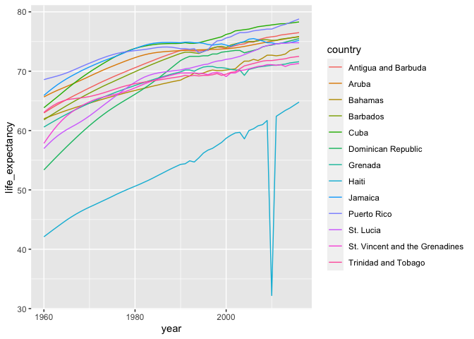<!-- -->

The plot is what we want, but much of the space is wasted to accommodate
some of the long country names. We have four countries with names longer
than 12 characters. These names appear once for each year in the
Gapminder dataset. Once we pick nicknames, we need to change them all
consistently. The recode function can be used to do this:

``` r
gapminder %>% filter(region=="Caribbean") %>%
  mutate(country = recode(country, 
                          `Antigua and Barbuda` = "Barbuda",
                          `Dominican Republic` = "DR",
                          `St. Vincent and the Grenadines` = "St. Vincent",
                          `Trinidad and Tobago` = "Trinidad")) %>%
  ggplot(aes(year, life_expectancy, color = country)) +
  geom_line()
```

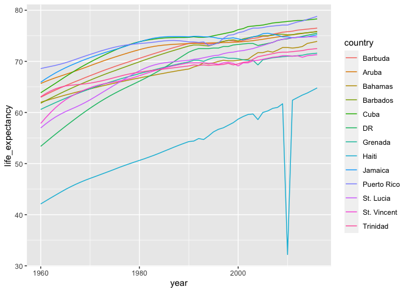<!-- -->

 

### Assessment

1.  If you use the extract code from our video, the decimal point is
    dropped. What modification of the code would allow you to put the
    decimals in a third column called “decimal”?

<!-- end list -->

``` r
s <- c("5'10", "6'1\"", "5'8inches", "5'7.5")
tab <- data.frame(x = s)
```

``` r
extract(data = tab, col = x, into = c("feet", "inches", "decimal"), 
regex = "(\\d)'(\\d{1,2})(\\.\\d+)?") 
```

    ##   feet inches decimal
    ## 1    5     10    <NA>
    ## 2    6      1    <NA>
    ## 3    5      8    <NA>
    ## 4    5      7      .5

2.  how do we split staff names in 3 separate
columns

<!-- end list -->

``` r
schedule <- data.frame(day=c("Monday","Tuesday"), staff=c("Mandy, Chris and Laura", "Steve, Ruth and Frank"))

schedule
```

    ##       day                  staff
    ## 1  Monday Mandy, Chris and Laura
    ## 2 Tuesday  Steve, Ruth and Frank

``` r
str_split(schedule$staff, ",|and") #NO
```

    ## [[1]]
    ## [1] "M"       "y"       " Chris " " Laura" 
    ## 
    ## [[2]]
    ## [1] "Steve"  " Ruth " " Frank"

``` r
str_split(schedule$staff, ", | and ") #YES
```

    ## [[1]]
    ## [1] "Mandy" "Chris" "Laura"
    ## 
    ## [[2]]
    ## [1] "Steve" "Ruth"  "Frank"

``` r
str_split(schedule$staff, ",\\s|\\sand\\s") #YES
```

    ## [[1]]
    ## [1] "Mandy" "Chris" "Laura"
    ## 
    ## [[2]]
    ## [1] "Steve" "Ruth"  "Frank"

``` r
str_split(schedule$staff, "\\s?(,|and)\\s?") #NO
```

    ## [[1]]
    ## [1] "M"     "y"     "Chris" "Laura"
    ## 
    ## [[2]]
    ## [1] "Steve" "Ruth"  "Frank"

3.  To turn it into tidy table with 2 columns, and names per row

<!-- end list -->

``` r
tidy <- schedule %>% 
  mutate(staff = str_split(staff, ", | and ")) %>% 
  unnest()
```

    ## Warning: `cols` is now required.
    ## Please use `cols = c(staff)`

``` r
tidy
```

    ## # A tibble: 6 x 2
    ##   day     staff
    ##   <fct>   <chr>
    ## 1 Monday  Mandy
    ## 2 Monday  Chris
    ## 3 Monday  Laura
    ## 4 Tuesday Steve
    ## 5 Tuesday Ruth 
    ## 6 Tuesday Frank

4.  Using the gapminder data, you want to recode countries longer than
    12 letters in the region “Middle Africa” to their abbreviations in a
    new column, “country\_short”. Which code would accomplish this?

<!-- end list -->

``` r
dat <- gapminder %>% filter(region == "Middle Africa") %>% 
  mutate(country_short = recode(country, 
                                "Central African Republic" = "CAR", 
                                "Congo, Dem. Rep." = "DRC",
                                "Equatorial Guinea" = "Eq. Guinea"))
head(dat)
```

    ##                    country year infant_mortality life_expectancy fertility
    ## 1                   Angola 1960            208.0           35.98      7.32
    ## 2                 Cameroon 1960            166.9           43.46      5.65
    ## 3 Central African Republic 1960            165.5           37.43      5.84
    ## 4                     Chad 1960               NA           40.95      6.25
    ## 5         Congo, Dem. Rep. 1960            174.0           43.90      6.00
    ## 6              Congo, Rep. 1960            110.6           48.25      5.88
    ##   population        gdp continent        region country_short
    ## 1    5270844         NA    Africa Middle Africa        Angola
    ## 2    5361367 2537944080    Africa Middle Africa      Cameroon
    ## 3    1503501  534982718    Africa Middle Africa           CAR
    ## 4    3002596  750173439    Africa Middle Africa          Chad
    ## 5   15248246 4992962083    Africa Middle Africa           DRC
    ## 6    1013581  626127041    Africa Middle Africa   Congo, Rep.

Import raw Brexit referendum polling data from Wikipedia:

``` r
library(rvest)
library(tidyverse)
library(stringr)
url <- "https://en.wikipedia.org/w/index.php?title=Opinion_polling_for_the_United_Kingdom_European_Union_membership_referendum&oldid=896735054"
tab <- read_html(url) %>% html_nodes("table")
polls <- tab[[5]] %>% html_table(fill = TRUE)
head(polls)
```

    ##   Date(s) conducted Remain Leave Undecided Lead     Sample
    ## 1 Date(s) conducted              Undecided Lead     Sample
    ## 2      23 June 2016  48.1% 51.9%       N/A 3.8% 33,577,342
    ## 3           23 June    52%   48%       N/A   4%      4,772
    ## 4           22 June    55%   45%       N/A  10%      4,700
    ## 5        20–22 June    51%   49%       N/A   2%      3,766
    ## 6        20–22 June    49%   46%        1%   3%      1,592
    ##                                                               Conducted by
    ## 1                                                             Conducted by
    ## 2 Results of the United Kingdom European Union membership referendum, 2016
    ## 3                                                                   YouGov
    ## 4                                                                  Populus
    ## 5                                                                   YouGov
    ## 6                                                               Ipsos MORI
    ##         Polling type                                        Notes
    ## 1       Polling type                                        Notes
    ## 2 UK-wide referendum                                             
    ## 3             Online                              On the day poll
    ## 4             Online                                             
    ## 5             Online Includes Northern Ireland (turnout weighted)
    ## 6          Telephone

5.  Some rows in this table do not contain polls. You can identify these
    by the lack of the percent sign (%) in the Remain column.

Update polls by changing the column names to c(“dates”, “remain”,
“leave”, “undecided”, “lead”, “samplesize”, “pollster”,
“poll\_type”, “notes”) and only keeping rows that have a percent
sign (%) in the remain column.

How many rows remain in the polls data
frame?

``` r
names(polls) <- c("dates", "remain", "leave", "undecided", "lead", "samplesize", "pollster", "poll_type", "notes")
polls <- polls[str_detect(polls$remain, "%"), -9]
nrow(polls)
```

    ## [1] 129

6.  The remain and leave columns are both given in the format “48.1%”:
    percentages out of 100% with a percent symbol.

Which of these commands converts the remain vector to a proportion
between 0 and 1?

``` r
# as.numeric(str_remove(polls$remain, "%"))
# as.numeric(polls$remain)/100
# parse_number(polls$remain)
# str_remove(polls$remain, "%")/100
as.numeric(str_replace(polls$remain, "%", ""))/100 # YES
```

    ##   [1] 0.481 0.520 0.550 0.510 0.490 0.440 0.540 0.480 0.410 0.450 0.420 0.530
    ##  [13] 0.450 0.440 0.440 0.420 0.420 0.370 0.460 0.430 0.390 0.450 0.440 0.460
    ##  [25] 0.400 0.480 0.530 0.420 0.440 0.450 0.430 0.430 0.480 0.410 0.430 0.400
    ##  [37] 0.410 0.420 0.440 0.510 0.440 0.440 0.410 0.410 0.450 0.550 0.440 0.440
    ##  [49] 0.520 0.550 0.470 0.430 0.550 0.380 0.360 0.380 0.440 0.420 0.440 0.430
    ##  [61] 0.420 0.490 0.390 0.410 0.450 0.430 0.440 0.510 0.510 0.490 0.480 0.430
    ##  [73] 0.530 0.380 0.400 0.390 0.350 0.450 0.420 0.400 0.390 0.440 0.510 0.390
    ##  [85] 0.350 0.410 0.510 0.450 0.490 0.400 0.480 0.410 0.460 0.470 0.430 0.450
    ##  [97] 0.480 0.490 0.400 0.400 0.400 0.390 0.410 0.390 0.480 0.480 0.370 0.380
    ## [109] 0.420 0.510 0.450 0.400 0.540 0.360 0.430 0.490 0.410 0.360 0.420 0.380
    ## [121] 0.550 0.440 0.540 0.410 0.520 0.420 0.380 0.420 0.440

``` r
parse_number(polls$remain)/100 # YES
```

    ##   [1] 0.481 0.520 0.550 0.510 0.490 0.440 0.540 0.480 0.410 0.450 0.420 0.530
    ##  [13] 0.450 0.440 0.440 0.420 0.420 0.370 0.460 0.430 0.390 0.450 0.440 0.460
    ##  [25] 0.400 0.480 0.530 0.420 0.440 0.450 0.430 0.430 0.480 0.410 0.430 0.400
    ##  [37] 0.410 0.420 0.440 0.510 0.440 0.440 0.410 0.410 0.450 0.550 0.440 0.440
    ##  [49] 0.520 0.550 0.470 0.430 0.550 0.380 0.360 0.380 0.440 0.420 0.440 0.430
    ##  [61] 0.420 0.490 0.390 0.410 0.450 0.430 0.440 0.510 0.510 0.490 0.480 0.430
    ##  [73] 0.530 0.380 0.400 0.390 0.350 0.450 0.420 0.400 0.390 0.440 0.510 0.390
    ##  [85] 0.350 0.410 0.510 0.450 0.490 0.400 0.480 0.410 0.460 0.470 0.430 0.450
    ##  [97] 0.480 0.490 0.400 0.400 0.400 0.390 0.410 0.390 0.480 0.480 0.370 0.380
    ## [109] 0.420 0.510 0.450 0.400 0.540 0.360 0.430 0.490 0.410 0.360 0.420 0.380
    ## [121] 0.550 0.440 0.540 0.410 0.520 0.420 0.380 0.420 0.440

7.  The undecided column has some “N/A” values. These “N/A”s are only
    present when the remain and leave columns total 100%, so they should
    actually be zeros.

Use a function from stringr to convert “N/A” in the undecided column to
0. The format of your command should be function\_name(polls$undecided,
“arg1”, “arg2”).

What function replaces
    function\_name?

``` r
polls$undecided
```

    ##   [1] "N/A" "N/A" "N/A" "N/A" "1%"  "9%"  "N/A" "11%" "16%" "11%" "13%" "2%" 
    ##  [13] "13%" "9%"  "12%" "9%"  "13%" "16%" "11%" "3%"  "15%" "5%"  "7%"  "9%" 
    ##  [25] "13%" "3%"  "N/A" "11%" "13%" "N/A" "11%" "9%"  "5%"  "11%" "16%" "16%"
    ##  [37] "13%" "15%" "9%"  "3%"  "12%" "18%" "13%" "16%" "10%" "3%"  "14%" "12%"
    ##  [49] "7%"  "5%"  "14%" "10%" "5%"  "21%" "22%" "16%" "11%" "13%" "11%" "11%"
    ##  [61] "14%" "N/A" "26%" "13%" "17%" "13%" "10%" "6%"  "9%"  "8%"  "11%" "13%"
    ##  [73] "6%"  "28%" "16%" "17%" "30%" "17%" "12%" "16%" "18%" "13%" "5%"  "18%"
    ##  [85] "30%" "14%" "N/A" "12%" "10%" "19%" "11%" "17%" "19%" "4%"  "16%" "16%"
    ##  [97] "7%"  "15%" "19%" "18%" "19%" "19%" "18%" "18%" "15%" "N/A" "25%" "25%"
    ## [109] "17%" "10%" "23%" "19%" "10%" "25%" "18%" "10%" "17%" "19%" "19%" "20%"
    ## [121] "9%"  "14%" "10%" "18%" "N/A" "17%" "22%" "12%" "18%"

``` r
str_replace(polls$undecided,"N/A","0")
```

    ##   [1] "0"   "0"   "0"   "0"   "1%"  "9%"  "0"   "11%" "16%" "11%" "13%" "2%" 
    ##  [13] "13%" "9%"  "12%" "9%"  "13%" "16%" "11%" "3%"  "15%" "5%"  "7%"  "9%" 
    ##  [25] "13%" "3%"  "0"   "11%" "13%" "0"   "11%" "9%"  "5%"  "11%" "16%" "16%"
    ##  [37] "13%" "15%" "9%"  "3%"  "12%" "18%" "13%" "16%" "10%" "3%"  "14%" "12%"
    ##  [49] "7%"  "5%"  "14%" "10%" "5%"  "21%" "22%" "16%" "11%" "13%" "11%" "11%"
    ##  [61] "14%" "0"   "26%" "13%" "17%" "13%" "10%" "6%"  "9%"  "8%"  "11%" "13%"
    ##  [73] "6%"  "28%" "16%" "17%" "30%" "17%" "12%" "16%" "18%" "13%" "5%"  "18%"
    ##  [85] "30%" "14%" "0"   "12%" "10%" "19%" "11%" "17%" "19%" "4%"  "16%" "16%"
    ##  [97] "7%"  "15%" "19%" "18%" "19%" "19%" "18%" "18%" "15%" "0"   "25%" "25%"
    ## [109] "17%" "10%" "23%" "19%" "10%" "25%" "18%" "10%" "17%" "19%" "19%" "20%"
    ## [121] "9%"  "14%" "10%" "18%" "0"   "17%" "22%" "12%" "18%"

8.  The dates column contains the range of dates over which the poll was
    conducted. The format is “8-10 Jan” where the poll had a start date
    of 2016-01-08 and end date of 2016-01-10. Some polls go across month
    boundaries (16 May-12 June).

The end date of the poll will always be one or two digits, followed by a
space, followed by the month as one or more letters (either capital or
lowercase). In these data, all month abbreviations or names have 3, 4 or
5 letters.

Write a regular expression to extract the end day and month from dates.
Insert it into the skeleton code below:

temp \<- str\_extract\_all(polls$dates, \_\_\_\_\_) end\_date \<-
sapply(temp, function(x) x\[length(x)\]) \# take last element (handles
polls that cross month boundaries)

Which of the following regular expressions correctly extracts the end
day and month when inserted into the blank in the code
    above?

``` r
head(polls$dates,10)
```

    ##  [1] "23 June 2016" "23 June"      "22 June"      "20–22 June"   "20–22 June"  
    ##  [6] "20–22 June"   "17–22 June"   "17–22 June"   "16–22 June"   "20 June"

``` r
"\\d+\\s[a-zA-Z]+" correct
"\\d+\\s[A-Z]+"
"[0-9]+\\s[a-zA-Z]+" correct
"\\d{1,2}\\s[a-zA-Z]+" correct
"\\d{1,2}[a-zA-Z]+"
"\\d+\\s[a-zA-Z]{3,5}"
```

 

## 6.4 Dates, Time and Text mining

 

### The date data type

``` r
data("polls_us_election_2016")
polls_us_election_2016$startdate %>% head
```

    ## [1] "2016-11-03" "2016-11-01" "2016-11-02" "2016-11-04" "2016-11-03"
    ## [6] "2016-11-03"

These look like strings, but they are not:

``` r
class(polls_us_election_2016$startdate)
```

    ## [1] "Date"

Look at what happens when we convert them to numbers:

``` r
as.numeric(polls_us_election_2016$startdate) %>% head
```

    ## [1] 17108 17106 17107 17109 17108 17108

The as.Date function can convert a character into a date. So to see that
the epoch is day 0 we can type

``` r
as.Date("1970-01-01") %>% as.numeric
```

    ## [1] 0

Plotting functions, such as those in ggplot, are aware of the date
format. This means that, for example, a scatterplot can use the numeric
representation to decide on the position of the point, but include the
string in the
labels:

``` r
polls_us_election_2016 %>% filter(pollster == "Ipsos" & state =="U.S.") %>%
  ggplot(aes(startdate, rawpoll_trump)) +
  geom_line()
```

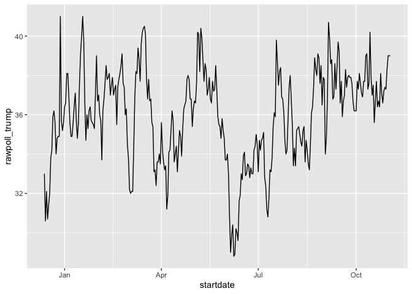<!-- -->

 

### The lubridate package

The tidyverse includes functionality for dealing with dates through the
lubridate package.

    ## 
    ## Attaching package: 'lubridate'

    ## The following objects are masked from 'package:dplyr':
    ## 
    ##     intersect, setdiff, union

    ## The following objects are masked from 'package:base':
    ## 
    ##     date, intersect, setdiff, union

We will take a random sample of dates to show some of the useful things
one can do:

``` r
set.seed(2002)
dates <- sample(polls_us_election_2016$startdate, 10) %>% sort
dates
```

    ##  [1] "2016-05-31" "2016-08-08" "2016-08-19" "2016-09-22" "2016-09-27"
    ##  [6] "2016-10-12" "2016-10-24" "2016-10-26" "2016-10-29" "2016-10-30"

The functions year, month and day extract those values:

``` r
tibble(date = dates, 
       month = month(dates),
       day = day(dates),
       year = year(dates))
```

    ## # A tibble: 10 x 4
    ##    date       month   day  year
    ##    <date>     <dbl> <int> <dbl>
    ##  1 2016-05-31     5    31  2016
    ##  2 2016-08-08     8     8  2016
    ##  3 2016-08-19     8    19  2016
    ##  4 2016-09-22     9    22  2016
    ##  5 2016-09-27     9    27  2016
    ##  6 2016-10-12    10    12  2016
    ##  7 2016-10-24    10    24  2016
    ##  8 2016-10-26    10    26  2016
    ##  9 2016-10-29    10    29  2016
    ## 10 2016-10-30    10    30  2016

We can also extract the month labels:

``` r
month(dates, label = TRUE)
```

    ##  [1] May Aug Aug Sep Sep Oct Oct Oct Oct Oct
    ## 12 Levels: Jan < Feb < Mar < Apr < May < Jun < Jul < Aug < Sep < ... < Dec

Another useful set of functions are the parsers that convert strings
into dates. The function ymd assumes the dates are in the format
YYYY-MM-DD and tries to parse as well as possible.

``` r
x <- c(20090101, "2009-01-02", "2009 01 03", "2009-1-4",
       "2009-1, 5", "Created on 2009 1 6", "200901 !!! 07")
ymd(x)
```

    ## [1] "2009-01-01" "2009-01-02" "2009-01-03" "2009-01-04" "2009-01-05"
    ## [6] "2009-01-06" "2009-01-07"

f the string is:

``` r
x <- "09/01/02"
```

The ymd function assumes the first entry is the year, the second is the
month, and the third is the day, so it converts it to:

``` r
ymd(x)
```

    ## [1] "2009-01-02"

The mdy function assumes the first entry is the month, then the day,
then the year:

``` r
mdy(x)
```

    ## [1] "2002-09-01"

The lubridate package provides a function for every possibility:

``` r
ydm(x)
```

    ## [1] "2009-02-01"

``` r
myd(x)
```

    ## [1] "2001-09-02"

``` r
dmy(x)
```

    ## [1] "2002-01-09"

``` r
dym(x)
```

    ## [1] "2001-02-09"

The lubridate package is also useful for dealing with times. In R base,
you can get the current time typing Sys.time(). The lubridate package
provides a slightly more advanced function, now, that permits you to
define the time zone:

``` r
now()
```

    ## [1] "2020-05-05 23:23:12 AEST"

``` r
now("GMT")
```

    ## [1] "2020-05-05 13:23:12 GMT"

You can see all the available time zones with OlsonNames() function.

We can also extract hours, minutes, and seconds:

``` r
now() %>% hour()
```

    ## [1] 23

``` r
now() %>% minute()
```

    ## [1] 23

``` r
now() %>% second()
```

    ## [1] 12.54752

The package also includes a function to parse strings into times as well
as parsers for time objects that include dates:

``` r
x <- c("12:34:56")
hms(x)
```

    ## [1] "12H 34M 56S"

``` r
x <- "Nov/2/2012 12:34:56"
mdy_hms(x)
```

    ## [1] "2012-11-02 12:34:56 UTC"

The make\_date function can be used to quickly create a date object. It
takes three arguments: year, month, day, hour, minute, seconds, and time
zone defaulting to the epoch values on UTC time. So create an date
object representing, for example, July 6, 2019 we write:

``` r
make_date(2019, 7, 6)
```

    ## [1] "2019-07-06"

To make a vector of January 1 for the 80s we
    write:

``` r
make_date(1980:1989)
```

    ##  [1] "1980-01-01" "1981-01-01" "1982-01-01" "1983-01-01" "1984-01-01"
    ##  [6] "1985-01-01" "1986-01-01" "1987-01-01" "1988-01-01" "1989-01-01"

Another very useful function is the round\_date. It can be used to round
dates to nearest year, quarter, month, week, day, hour, minutes, or
seconds. So if we want to group all the polls by week of the year we can
do the following:

``` r
polls_us_election_2016 %>% 
  mutate(week = round_date(startdate, "week")) %>%
  group_by(week) %>%
  summarize(margin = mean(rawpoll_clinton - rawpoll_trump)) %>%
  qplot(week, margin, data = .)
```

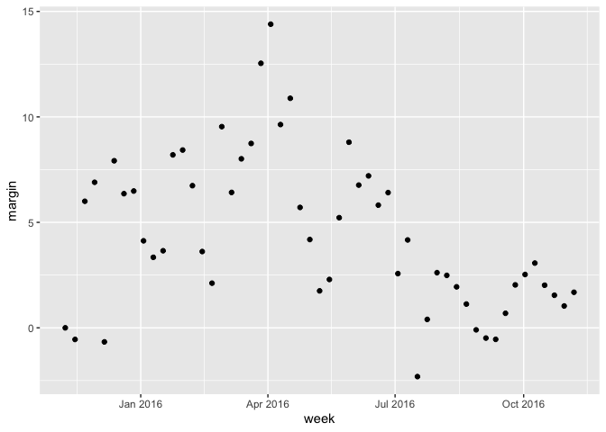<!-- -->

 

### Text mining: Trump tweets case study

    ## 
    ## Attaching package: 'scales'

    ## The following object is masked from 'package:english':
    ## 
    ##     ordinal

    ## The following object is masked from 'package:purrr':
    ## 
    ##     discard

    ## The following object is masked from 'package:readr':
    ## 
    ##     col_factor

n general, we can extract data directly from Twitter using the rtweet
package. However, in this case, a group has already compiled data for us
and made it available at <http://www.trumptwitterarchive.com>. We can
get the data from their JSON API using a script like this:

``` r
url <- 'http://www.trumptwitterarchive.com/data/realdonaldtrump/%s.json'
trump_tweets <- map(2009:2017, ~sprintf(url, .x)) %>%
  map_df(jsonlite::fromJSON, simplifyDataFrame = TRUE) %>%
  filter(!is_retweet & !str_detect(text, '^"')) %>%
  mutate(created_at = parse_date_time(created_at, 
                                      orders = "a b! d! H!:M!:S! z!* Y!",
                                      tz="EST"))

# also available within the dslabs package
data("trump_tweets")
```

``` r
names(trump_tweets)
```

    ## [1] "source"                  "id_str"                 
    ## [3] "text"                    "created_at"             
    ## [5] "retweet_count"           "in_reply_to_user_id_str"
    ## [7] "favorite_count"          "is_retweet"

The source variable tells us which device was used to compose and upload
each tweet:

``` r
trump_tweets %>% count(source) %>% arrange(desc(n)) %>% head(5)
```

    ## # A tibble: 5 x 2
    ##   source                  n
    ##   <chr>               <int>
    ## 1 Twitter Web Client  10718
    ## 2 Twitter for Android  4652
    ## 3 Twitter for iPhone   3962
    ## 4 TweetDeck             468
    ## 5 TwitLonger Beta       288

We are interested in what happened during the campaign, so for this
analysis we will focus on what was tweeted between the day Trump
announced his campaign and election day. We define the following table
containing just the tweets from that time period. Note that we use
extract to remove the Twitter for part of the source and filter out
retweets.

``` r
campaign_tweets <- trump_tweets %>% 
  extract(source, "source", "Twitter for (.*)") %>%
  filter(source %in% c("Android", "iPhone") & #keep Android and iOS source
           created_at >= ymd("2015-06-17") & 
           created_at < ymd("2016-11-08")) %>% #between relevant dates
  filter(!is_retweet) %>% #remove retweets
  arrange(created_at) #arrange by date
```

``` r
head(campaign_tweets)
```

    ##    source             id_str
    ## 1 Android 612063082186174464
    ## 2 Android 612066176294866945
    ## 3 Android 612076000529268736
    ## 4 Android 612083064945180672
    ## 5 Android 612406758351478788
    ## 6 Android 612415976890593284
    ##                                                                                                                                           text
    ## 1                                                             Why did @DanaPerino beg me for a tweet (endorsement) when her book was launched?
    ## 2      I like Mexico and love the spirit of  Mexican people, but we must protect our borders from people, from all over, pouring into the U.S.
    ## 3    Mexico is killing the United States economically because their leaders and negotiators are FAR smarter than ours. But nobody beats Trump!
    ## 4      Druggies, drug dealers, rapists and killers are coming across the southern border. When will the U.S. get smart and stop this travesty?
    ## 5                                                                                                           My speech is right now on C-SPAN 1
    ## 6 Thank you @AnnCoulter for your nice words. The U.S. is becoming a dumping ground for the world. Pols don't get it. Make America Great Again!
    ##            created_at retweet_count in_reply_to_user_id_str favorite_count
    ## 1 2015-06-19 20:03:05           166                    <NA>            348
    ## 2 2015-06-19 20:15:22          1266                    <NA>           2118
    ## 3 2015-06-19 20:54:25          1033                    <NA>           1770
    ## 4 2015-06-19 21:22:29          1578                    <NA>           2181
    ## 5 2015-06-20 18:48:43            86                    <NA>            312
    ## 6 2015-06-20 19:25:21           299                    <NA>            643
    ##   is_retweet
    ## 1      FALSE
    ## 2      FALSE
    ## 3      FALSE
    ## 4      FALSE
    ## 5      FALSE
    ## 6      FALSE

We can now use data visualization to explore the possibility that two
different groups were tweeting from these devices. For each tweet, we
will extract the hour, East Coast time (EST), it was tweeted and then
compute the proportion of tweets tweeted at each hour for each device:

``` r
ds_theme_set()
campaign_tweets %>%
  mutate(hour = hour(with_tz(created_at, "EST"))) %>%
  count(source, hour) %>%
  group_by(source) %>%
  mutate(percent = n / sum(n)) %>%
  ungroup %>%
  ggplot(aes(hour, percent, color = source)) +
  geom_line() +
  geom_point() +
  scale_y_continuous(labels = percent_format()) +
  labs(x = "Hour of day (EST)", y = "% of tweets", color = "")
```

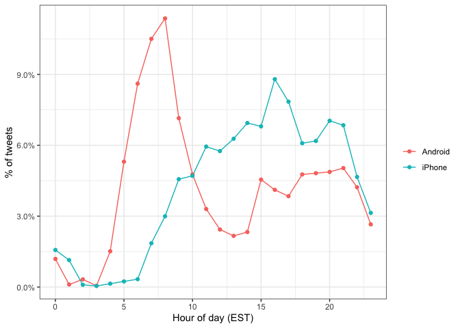<!-- -->

 

#### Text as data

`unnest_tokens`. A token refers to a unit that we are considering to be
a data point. The most common token will be words, but they can also be
single characters, ngrams, sentences, lines, or a pattern defined by a
regex. The functions will take a vector of strings and extract the
tokens so that each one gets a row in the new table. Here is a simple
example:

``` r
poem <- c("Roses are red,", "Violets are blue,", 
          "Sugar is sweet,", "And so are you.")

example <- tibble(line = c(1, 2, 3, 4),
                      text = poem)
example
```

    ## # A tibble: 4 x 2
    ##    line text             
    ##   <dbl> <chr>            
    ## 1     1 Roses are red,   
    ## 2     2 Violets are blue,
    ## 3     3 Sugar is sweet,  
    ## 4     4 And so are you.

``` r
example %>% unnest_tokens(word,text)
```

    ## # A tibble: 13 x 2
    ##     line word   
    ##    <dbl> <chr>  
    ##  1     1 roses  
    ##  2     1 are    
    ##  3     1 red    
    ##  4     2 violets
    ##  5     2 are    
    ##  6     2 blue   
    ##  7     3 sugar  
    ##  8     3 is     
    ##  9     3 sweet  
    ## 10     4 and    
    ## 11     4 so     
    ## 12     4 are    
    ## 13     4 you

Now let’s look at an example from the tweets. We will look at tweet
number 3008 because it will later permit us to illustrate a couple of
points:

``` r
i <- 3008
campaign_tweets$text[i] %>% str_wrap(width = 65) %>% cat()
```

    ## Great to be back in Iowa! #TBT with @JerryJrFalwell joining me in
    ## Davenport- this past winter. #MAGA https://t.co/A5IF0QHnic

``` r
campaign_tweets %>% unnest_tokens(word,text) %>% pull(word) %>% head()
```

    ## [1] "why"        "did"        "danaperino" "beg"        "me"        
    ## [6] "for"

Another minor adjustment we want to make is to remove the links to
pictures:

``` r
links <- "https://t.co/[A-Za-z\\d]+|&amp;"
campaign_tweets[i,] %>% 
  mutate(text = str_replace_all(text, links, ""))  %>%
  unnest_tokens(word, text, token = "tweets") %>%
  pull(word) %>% head()
```

    ## Using `to_lower = TRUE` with `token = 'tweets'` may not preserve URLs.

    ## [1] "great" "to"    "be"    "back"  "in"    "iowa"

Now we are now ready to extract the words for all our tweets.

``` r
tweet_words <- campaign_tweets %>% 
  mutate(text = str_replace_all(text, links, ""))  %>%
  unnest_tokens(word, text, token = "tweets") 
```

    ## Using `to_lower = TRUE` with `token = 'tweets'` may not preserve URLs.

And we can now answer questions such as “what are the most commonly used
words?”:

``` r
tweet_words %>% 
  count(word) %>%
  arrange(desc(n)) %>% head(8)
```

    ## # A tibble: 8 x 2
    ##   word      n
    ##   <chr> <int>
    ## 1 the    2329
    ## 2 to     1410
    ## 3 and    1239
    ## 4 in     1185
    ## 5 i      1143
    ## 6 a      1112
    ## 7 you     999
    ## 8 of      982

It is not surprising that these are the top words. The top words are not
informative. The tidytext package has a database of these commonly used
words, referred to as stop words, in text mining:

``` r
head(stop_words)
```

    ## # A tibble: 6 x 2
    ##   word      lexicon
    ##   <chr>     <chr>  
    ## 1 a         SMART  
    ## 2 a's       SMART  
    ## 3 able      SMART  
    ## 4 about     SMART  
    ## 5 above     SMART  
    ## 6 according SMART

If we filter out rows representing stop words with filter(\!word %in%
stop\_words$word):

``` r
tweet_words <- campaign_tweets %>% 
  mutate(text = str_replace_all(text, links, ""))  %>%
  unnest_tokens(word, text, token = "tweets") %>%
  filter(!word %in% stop_words$word ) 
```

    ## Using `to_lower = TRUE` with `token = 'tweets'` may not preserve URLs.

we end up with a much more informative set of top 10 tweeted words:

``` r
tweet_words %>% 
  count(word) %>%
  top_n(10, n) %>%
  mutate(word = reorder(word, n)) %>%
  arrange(desc(n))
```

    ## # A tibble: 10 x 2
    ##    word                       n
    ##    <fct>                  <int>
    ##  1 #trump2016               414
    ##  2 hillary                  405
    ##  3 people                   303
    ##  4 #makeamericagreatagain   294
    ##  5 america                  254
    ##  6 clinton                  237
    ##  7 poll                     217
    ##  8 crooked                  205
    ##  9 trump                    195
    ## 10 cruz                     159

some of our tokens are just numbers (years, for example). We want to
remove these and we can find them using the regex ^$. Second, some of
our tokens come from a quote and they start with ‘. We want to remove
the’ when it is at the start of a word so we will just str\_replace. We
add these two lines to the code above to generate our final table:

``` r
tweet_words <- campaign_tweets %>% 
  mutate(text = str_replace_all(text, links, ""))  %>%
  unnest_tokens(word, text, token = "tweets") %>%
  filter(!word %in% stop_words$word &
           !str_detect(word, "^\\d+$")) %>%
  mutate(word = str_replace(word, "^'", ""))
```

    ## Using `to_lower = TRUE` with `token = 'tweets'` may not preserve URLs.

For each device and a given word, let’s call it y, we compute the odds
or the ratio between the proportion of words that are y and not y and
compute the ratio of those odds. Here we will have many proportions that
are 0, so we use the 0.5 correction described in Section 15.10.

``` r
android_iphone_or <- tweet_words %>%
  count(word, source) %>%
  spread(source, n, fill = 0) %>%
  mutate(or = (Android + 0.5) / (sum(Android) - Android + 0.5) / 
           ( (iPhone + 0.5) / (sum(iPhone) - iPhone + 0.5)))
```

Here are the highest odds ratios for Android

``` r
android_iphone_or %>% arrange(desc(or))
```

    ## # A tibble: 5,914 x 4
    ##    word      Android iPhone    or
    ##    <chr>       <dbl>  <dbl> <dbl>
    ##  1 poor           13      0  23.1
    ##  2 poorly         12      0  21.4
    ##  3 turnberry      11      0  19.7
    ##  4 @cbsnews       10      0  18.0
    ##  5 angry          10      0  18.0
    ##  6 bosses         10      0  18.0
    ##  7 write          10      0  18.0
    ##  8 brexit          9      0  16.3
    ##  9 defend          9      0  16.3
    ## 10 funny           9      0  16.3
    ## # … with 5,904 more rows

and the top for iPhone:

``` r
android_iphone_or %>% arrange(or)
```

    ## # A tibble: 5,914 x 4
    ##    word                   Android iPhone      or
    ##    <chr>                    <dbl>  <dbl>   <dbl>
    ##  1 #makeamericagreatagain       0    294 0.00142
    ##  2 #americafirst                0     71 0.00595
    ##  3 #draintheswamp               0     63 0.00670
    ##  4 #trump2016                   3    411 0.00706
    ##  5 #votetrump                   0     56 0.00753
    ##  6 join                         1    157 0.00805
    ##  7 #imwithyou                   0     51 0.00827
    ##  8 #crookedhillary              0     30 0.0140 
    ##  9 #fitn                        0     30 0.0140 
    ## 10 #gopdebate                   0     30 0.0140 
    ## # … with 5,904 more rows

Given that several of these words are overall low frequency words, we
can impose a filter based on the total frequency like this:

``` r
android_iphone_or %>% filter(Android+iPhone > 100) %>%
  arrange(desc(or))
```

    ## # A tibble: 30 x 4
    ##    word        Android iPhone    or
    ##    <chr>         <dbl>  <dbl> <dbl>
    ##  1 @cnn             90     17  4.44
    ##  2 bad             104     26  3.39
    ##  3 crooked         156     49  2.72
    ##  4 interviewed      76     25  2.57
    ##  5 media            76     25  2.57
    ##  6 ted              84     28  2.54
    ##  7 win              74     28  2.24
    ##  8 hillary         289    116  2.14
    ##  9 debate           79     32  2.10
    ## 10 cruz            113     46  2.09
    ## # … with 20 more rows

``` r
android_iphone_or %>% filter(Android+iPhone > 100) %>%
  arrange(or)
```

    ## # A tibble: 30 x 4
    ##    word                   Android iPhone      or
    ##    <chr>                    <dbl>  <dbl>   <dbl>
    ##  1 #makeamericagreatagain       0    294 0.00142
    ##  2 #trump2016                   3    411 0.00706
    ##  3 join                         1    157 0.00805
    ##  4 tomorrow                    24     99 0.209  
    ##  5 vote                        46     67 0.588  
    ##  6 america                    114    140 0.695  
    ##  7 tonight                     70     84 0.712  
    ##  8 iowa                        61     65 0.802  
    ##  9 trump                      104     91 0.976  
    ## 10 poll                       116    101 0.981  
    ## # … with 20 more rows

 

#### Sentiment analysis

The bing lexicon divides words into positive and negative sentiments. We
can see this using the tidytext function get\_sentiments:

``` r
get_sentiments("bing")
```

    ## # A tibble: 6,786 x 2
    ##    word        sentiment
    ##    <chr>       <chr>    
    ##  1 2-faces     negative 
    ##  2 abnormal    negative 
    ##  3 abolish     negative 
    ##  4 abominable  negative 
    ##  5 abominably  negative 
    ##  6 abominate   negative 
    ##  7 abomination negative 
    ##  8 abort       negative 
    ##  9 aborted     negative 
    ## 10 aborts      negative 
    ## # … with 6,776 more rows

The AFINN lexicon assigns a score between -5 and 5, with -5 the most
negative and 5 the most positive. Note that this lexicon needs to be
downloaded the first time you call the function get\_sentiment:

``` r
get_sentiments("afinn")
```

The loughran and nrc lexicons provide several different sentiments. Note
that these also have to be downloaded the first time you use them.

``` r
get_sentiments("loughran") %>% count(sentiment)
```

    ## # A tibble: 6 x 2
    ##   sentiment        n
    ##   <chr>        <int>
    ## 1 constraining   184
    ## 2 litigious      904
    ## 3 negative      2355
    ## 4 positive       354
    ## 5 superfluous     56
    ## 6 uncertainty    297

``` r
get_sentiments("nrc") %>% count(sentiment)
```

    ## # A tibble: 10 x 2
    ##    sentiment        n
    ##    <chr>        <int>
    ##  1 anger         1247
    ##  2 anticipation   839
    ##  3 disgust       1058
    ##  4 fear          1476
    ##  5 joy            689
    ##  6 negative      3324
    ##  7 positive      2312
    ##  8 sadness       1191
    ##  9 surprise       534
    ## 10 trust         1231

For our analysis, we are interested in exploring the different
sentiments of each tweet so we will use the nrc lexicon:

``` r
nrc <- get_sentiments("nrc") %>%
  select(word, sentiment)
```

We can combine the words and sentiments using inner\_join, which will
only keep words associated with a sentiment. Here are 10 random words
extracted from the tweets:

``` r
tweet_words %>% inner_join(nrc, by = "word") %>% 
  select(source, word, sentiment) %>% 
  sample_n(5)
```

    ##    source     word    sentiment
    ## 1  iPhone horrible      disgust
    ## 2 Android  failing        anger
    ## 3 Android  illegal      sadness
    ## 4 Android     vote anticipation
    ## 5  iPhone   betray      disgust

we will count and compare the frequencies of each sentiment appearing in
each device.

``` r
sentiment_counts <- tweet_words %>%
  left_join(nrc, by = "word") %>%
  count(source, sentiment) %>%
  spread(source, n) %>%
  mutate(sentiment = replace_na(sentiment, replace = "none"))
sentiment_counts
```

    ## # A tibble: 11 x 3
    ##    sentiment    Android iPhone
    ##    <chr>          <int>  <int>
    ##  1 anger            958    528
    ##  2 anticipation     910    715
    ##  3 disgust          638    322
    ##  4 fear             795    486
    ##  5 joy              688    535
    ##  6 negative        1641    929
    ##  7 positive        1806   1473
    ##  8 sadness          894    515
    ##  9 surprise         518    365
    ## 10 trust           1236    990
    ## 11 none           11904  10766

For each sentiment, we can compute the odds of being in the device:
proportion of words with sentiment versus proportion of words without,
and then compute the odds ratio comparing the two devices.

``` r
sentiment_counts %>%
  mutate(Android = Android / (sum(Android) - Android) , 
         iPhone = iPhone / (sum(iPhone) - iPhone), 
         or = Android/iPhone) %>%
  arrange(desc(or))
```

    ## # A tibble: 11 x 4
    ##    sentiment    Android iPhone    or
    ##    <chr>          <dbl>  <dbl> <dbl>
    ##  1 disgust       0.0299 0.0186 1.61 
    ##  2 anger         0.0456 0.0309 1.47 
    ##  3 negative      0.0807 0.0556 1.45 
    ##  4 sadness       0.0424 0.0301 1.41 
    ##  5 fear          0.0375 0.0284 1.32 
    ##  6 surprise      0.0241 0.0211 1.14 
    ##  7 joy           0.0323 0.0313 1.03 
    ##  8 anticipation  0.0432 0.0423 1.02 
    ##  9 trust         0.0596 0.0595 1.00 
    ## 10 positive      0.0895 0.0912 0.981
    ## 11 none          1.18   1.57   0.752

we can compute, for each sentiment, an odds ratio and a confidence
interval, as defined in Section 15.10. We will add the two values we
need to form a two-by-two table and the odds ratio:

``` r
library(broom)
log_or <- sentiment_counts %>%
  mutate(log_or = log((Android / (sum(Android) - Android)) / 
      (iPhone / (sum(iPhone) - iPhone))),
          se = sqrt(1/Android + 1/(sum(Android) - Android) + 
                      1/iPhone + 1/(sum(iPhone) - iPhone)),
          conf.low = log_or - qnorm(0.975)*se,
          conf.high = log_or + qnorm(0.975)*se) %>%
  arrange(desc(log_or))
  
log_or
```

    ## # A tibble: 11 x 7
    ##    sentiment    Android iPhone    log_or     se conf.low conf.high
    ##    <chr>          <int>  <int>     <dbl>  <dbl>    <dbl>     <dbl>
    ##  1 disgust          638    322  0.474    0.0691  0.338      0.609 
    ##  2 anger            958    528  0.389    0.0552  0.281      0.497 
    ##  3 negative        1641    929  0.371    0.0424  0.288      0.454 
    ##  4 sadness          894    515  0.342    0.0563  0.232      0.452 
    ##  5 fear             795    486  0.280    0.0585  0.165      0.394 
    ##  6 surprise         518    365  0.132    0.0691 -0.00368    0.267 
    ##  7 joy              688    535  0.0312   0.0586 -0.0835     0.146 
    ##  8 anticipation     910    715  0.0208   0.0510 -0.0792     0.121 
    ##  9 trust           1236    990  0.000737 0.0439 -0.0853     0.0868
    ## 10 positive        1806   1473 -0.0190   0.0367 -0.0909     0.0529
    ## 11 none           11904  10766 -0.285    0.0205 -0.325     -0.245

A graphical visualization shows some sentiments that are clearly
overrepresented:

``` r
log_or %>%
  mutate(sentiment = reorder(sentiment, log_or)) %>%
  ggplot(aes(x = sentiment, ymin = conf.low, ymax = conf.high)) +
  geom_errorbar() +
  geom_point(aes(sentiment, log_or)) +
  ylab("Log odds ratio for association between Android and sentiment") +
  coord_flip()
```

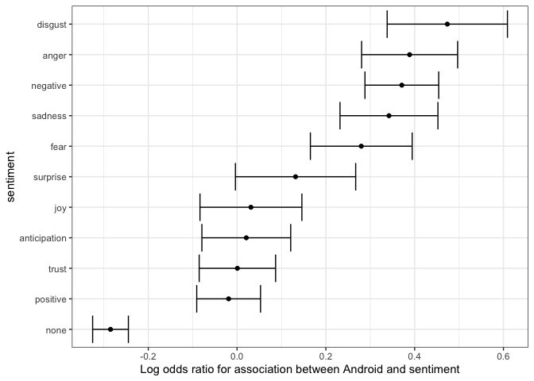<!-- -->

If we are interested in exploring which specific words are driving these
differences, we can refer back to our android\_iphone\_or object:

``` r
android_iphone_or %>% inner_join(nrc) %>%
  filter(sentiment == "disgust" & Android + iPhone > 10) %>%
  arrange(desc(or))
```

    ## Joining, by = "word"

    ## # A tibble: 20 x 5
    ##    word      Android iPhone    or sentiment
    ##    <chr>       <dbl>  <dbl> <dbl> <chr>    
    ##  1 mess           13      2 4.62  disgust  
    ##  2 finally        12      2 4.28  disgust  
    ##  3 unfair         12      2 4.28  disgust  
    ##  4 bad           104     26 3.39  disgust  
    ##  5 terrible       31      8 3.17  disgust  
    ##  6 lie            12      3 3.05  disgust  
    ##  7 lying           9      3 2.32  disgust  
    ##  8 waste          12      5 1.94  disgust  
    ##  9 illegal        32     14 1.92  disgust  
    ## 10 phony          20      9 1.85  disgust  
    ## 11 pathetic       11      5 1.79  disgust  
    ## 12 nasty          13      6 1.78  disgust  
    ## 13 horrible       14      7 1.65  disgust  
    ## 14 disaster       21     11 1.60  disgust  
    ## 15 winning        14      9 1.31  disgust  
    ## 16 liar            6      5 1.01  disgust  
    ## 17 john           24     21 0.974 disgust  
    ## 18 dishonest      36     32 0.960 disgust  
    ## 19 dying           6      6 0.855 disgust  
    ## 20 terrorism       9      9 0.855 disgust

and we can make a graph:

``` r
android_iphone_or %>% inner_join(nrc, by = "word") %>%
  mutate(sentiment = factor(sentiment, levels = log_or$sentiment)) %>%
  mutate(log_or = log(or)) %>%
  filter(Android + iPhone > 10 & abs(log_or)>1) %>%
  mutate(word = reorder(word, log_or)) %>%
  ggplot(aes(word, log_or, fill = log_or < 0)) +
  facet_wrap(~sentiment, scales = "free_x", nrow = 2) + 
  geom_bar(stat="identity", show.legend = FALSE) +
  theme(axis.text.x = element_text(angle = 90, hjust = 1)) 
```

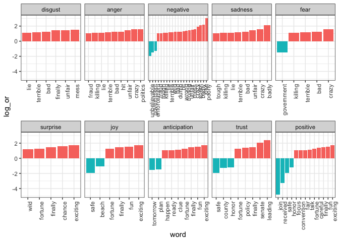<!-- -->

 

### Exercises

``` r
library(dslabs)
library(lubridate)
options(digits = 3)
```

3.  Load the brexit\_polls data frame from dslabs: How many polls had a
    start date (startdate) in April (month number 4)?

<!-- end list -->

``` r
brexit_polls %>% filter(month(startdate)==4) %>% nrow()
```

    ## [1] 25

Use the round\_date() function on the enddate column with the argument
unit=“week”. How many polls ended the week of
2016-06-12?

``` r
brexit_polls %>% mutate(week=round_date(enddate,"week")) %>% filter(week=="2016-06-12") %>% nrow()
```

    ## [1] 13

``` r
# or

sum(round_date(brexit_polls$enddate,"week")=="2016-06-12")
```

    ## [1] 13

4.  Use the weekdays() function from lubridate to determine the weekday
    on which each poll ended (enddate).

On which weekday did the greatest number of polls end?

``` r
weekdays_end <- brexit_polls %>% mutate(weekday=weekdays(enddate)) %>%
  select(weekday) %>% count(weekday)

weekdays_end %>% arrange(desc(n))
```

    ## # A tibble: 7 x 2
    ##   weekday       n
    ##   <chr>     <int>
    ## 1 Sunday       37
    ## 2 Tuesday      23
    ## 3 Monday       20
    ## 4 Thursday     17
    ## 5 Friday       14
    ## 6 Wednesday    12
    ## 7 Saturday      4

``` r
#or

weekdays_end %>% top_n(1)
```

    ## Selecting by n

    ## # A tibble: 1 x 2
    ##   weekday     n
    ##   <chr>   <int>
    ## 1 Sunday     37

``` r
#or the easiest way

table(weekdays(brexit_polls$enddate))
```

    ## 
    ##    Friday    Monday  Saturday    Sunday  Thursday   Tuesday Wednesday 
    ##        14        20         4        37        17        23        12

5.  Load the movielens data frame from dslabs.

This data frame contains a set of about 100,000 movie reviews. The
timestamp column contains the review date as the number of seconds since
1970-01-01 (epoch time).

Convert the timestamp column to dates using the lubridate as\_datetime()
function.

Which year had the most movie reviews?

``` r
# to see the year...
table(year(as_datetime(movielens$timestamp))) 
```

    ## 
    ##  1995  1996  1997  1998  1999  2000  2001  2002  2003  2004  2005  2006  2007 
    ##     3  6239  3294  1825  5901 13869  4658  3938  4462  4658  7161  7493  1548 
    ##  2008  2009  2010  2011  2012  2013  2014  2015  2016 
    ##  3676  3434  2518  4450  3849  1969  2224  6610  6225

``` r
movielens %>% mutate(year=year(as_datetime(timestamp))) %>%
  select(year) %>% count(year) %>% arrange(desc(n))
```

    ## # A tibble: 22 x 2
    ##     year     n
    ##    <dbl> <int>
    ##  1  2000 13869
    ##  2  2006  7493
    ##  3  2005  7161
    ##  4  2015  6610
    ##  5  1996  6239
    ##  6  2016  6225
    ##  7  1999  5901
    ##  8  2001  4658
    ##  9  2004  4658
    ## 10  2003  4462
    ## # … with 12 more rows

``` r
# solution
dates <- as_datetime(movielens$timestamp)
reviews_by_year <- table(year(dates))    # count reviews by year
names(which.max(reviews_by_year))    # name of year with most reviews
```

    ## [1] "2000"

Which hour of the day had the most reviews?

``` r
# solution

reviews_by_hour <- table(hour(dates))    # count reviews by hour
names(which.max(reviews_by_hour))    # name of hour with most reviews
```

    ## [1] "20"

library(tidyverse)

library(tidytext)

You can see the books and documents available in gutenbergr like this:

``` r
library(gutenbergr)
options(digits = 3)
head(gutenberg_metadata)
```

    ## # A tibble: 6 x 8
    ##   gutenberg_id title author gutenberg_autho… language gutenberg_books… rights
    ##          <int> <chr> <chr>             <int> <chr>    <chr>            <chr> 
    ## 1            0  <NA> <NA>                 NA en       <NA>             Publi…
    ## 2            1 "The… Jeffe…             1638 en       United States L… Publi…
    ## 3            2 "The… Unite…                1 en       American Revolu… Publi…
    ## 4            3 "Joh… Kenne…             1666 en       <NA>             Publi…
    ## 5            4 "Lin… Linco…                3 en       US Civil War     Publi…
    ## 6            5 "The… Unite…                1 en       American Revolu… Publi…
    ## # … with 1 more variable: has_text <lgl>

6.  Use str\_detect() to find the ID of the novel Pride and Prejudice.

How many different ID numbers are returned?

``` r
gutenberg_metadata %>%
  filter(str_detect(title, "Pride and Prejudice"))
```

    ## # A tibble: 6 x 8
    ##   gutenberg_id title author gutenberg_autho… language gutenberg_books… rights
    ##          <int> <chr> <chr>             <int> <chr>    <chr>            <chr> 
    ## 1         1342 Prid… Auste…               68 en       Best Books Ever… Publi…
    ## 2        20686 Prid… Auste…               68 en       Harvard Classic… Publi…
    ## 3        20687 Prid… Auste…               68 en       Harvard Classic… Publi…
    ## 4        26301 Prid… Auste…               68 en       Best Books Ever… Publi…
    ## 5        37431 Prid… <NA>                 NA en       <NA>             Publi…
    ## 6        42671 Prid… Auste…               68 en       Best Books Ever… Publi…
    ## # … with 1 more variable: has_text <lgl>

7.  Notice that there are several versions of the book. The
    gutenberg\_works() function filters this table to remove replicates
    and include only English language works. Use this function to find
    the ID for Pride and Prejudice.

What is the correct ID number?

``` r
gutenberg_works(title=="Pride and Prejudice")
```

    ## # A tibble: 1 x 8
    ##   gutenberg_id title author gutenberg_autho… language gutenberg_books… rights
    ##          <int> <chr> <chr>             <int> <chr>    <chr>            <chr> 
    ## 1         1342 Prid… Auste…               68 en       Best Books Ever… Publi…
    ## # … with 1 more variable: has_text <lgl>

8.  Use the gutenberg\_download() function to download the text for
    Pride and Prejudice. Use the tidytext package to create a tidy table
    with all the words in the text. Save this object as words.

How many words are present in the
    book?

``` r
pridebook <- gutenberg_download(1342)
```

    ## Determining mirror for Project Gutenberg from http://www.gutenberg.org/robot/harvest

    ## Using mirror http://aleph.gutenberg.org

``` r
pridewords <- pridebook %>% unnest_tokens(word, text)

pridewords %>% pull(word) %>% length()
```

    ## [1] 122204

``` r
# solution
# book <- gutenberg_download(1342)
# words <- book %>%
#  unnest_tokens(word, text)
# nrow(words)
```

9.  Remove stop words from the words object. Recall that stop words are
    defined in the stop\_words data frame from the tidytext package.

How many words remain?

``` r
pridewords %>% filter(!word %in% stop_words$word) %>% nrow()
```

    ## [1] 37246

10. After removing stop words, detect and then filter out any token that
    contains a digit from words.

How many words
    remain?

``` r
length(pridewords) - sum(str_detect(pridewords,"\\d"))
```

    ## Warning in stri_detect_regex(string, pattern, negate = negate, opts_regex =
    ## opts(pattern)): argument is not an atomic vector; coercing

    ## [1] 0

``` r
#or

pridewords %>%
  filter(!str_detect(word, "\\d")) %>% nrow()
```

    ## [1] 122138

11. Analyze the most frequent words in the novel after removing stop
    words and tokens with digits.

How many words appear more than 100 times in the book?

``` r
# words with no stopwords or digits

finalwords <- pridewords %>% filter(!str_detect(word, "\\d")) %>% filter(!word %in% stop_words$word)

finalwords %>% count(word) %>% filter(n>100) %>% nrow()
```

    ## [1] 23

What is the most common word?

``` r
finalwords %>% count(word) %>% arrange(desc(n)) %>% head()
```

    ## # A tibble: 6 x 2
    ##   word          n
    ##   <chr>     <int>
    ## 1 elizabeth   597
    ## 2 darcy       373
    ## 3 bennet      294
    ## 4 miss        283
    ## 5 jane        264
    ## 6 bingley     257

12. Define the afinn lexicon:

`afinn <- get_sentiments("afinn")`

Use this afinn lexicon to assign sentiment values to words. Keep only
words that are present in both words and the afinn lexicon. Save this
data frame as afinn\_sentiments.

How many elements of words have sentiments in the afinn lexicon?

``` r
afinn <- get_sentiments("afinn")
```

``` r
afinn_sentiments <- inner_join(afinn, pridewords)
```

    ## Joining, by = "word"

``` r
nrow(afinn_sentiments)
```

    ## [1] 7783

What proportion of words in afinn\_sentiments have a positive value?

``` r
mean(afinn_sentiments$value > 0)
```

    ## [1] 0.588

How many elements of afinn\_sentiments have a value of 4?

``` r
sum(afinn_sentiments$value == 4)
```

    ## [1] 51

## Assessment: Hurricane in Puerto Rico

1.  n the extdata directory of the dslabs package, you will find a PDF
    file containing daily mortality data for Puerto Rico from Jan 1,
    2015 to May 31, 2018. You can find the file like
this:

<!-- end list -->

``` r
fn <- system.file("extdata", "RD-Mortality-Report_2015-18-180531.pdf", package="dslabs")
```

Find and open the file or open it directly from RStudio. On a Mac, you
can type:

``` r
system2("open", args = fn)
```

2.  We are going to create a tidy dataset with each row representing one
    observation. The variables in this dataset will be year, month, day
    and deaths.

Use the pdftools package to read in fn using the pdf\_text() function.
Store the results in an object called txt.

Describe what you see in txt.

``` r
text <- pdf_text(fn)
str(text)
```

    ##  chr [1:12] "6/4/2018                       Departamento de Salud - Registro Demográfico - División de Calidad y Estadística"| __truncated__ ...

3.  Extract the ninth page of the PDF file from the object txt, then use
    the str\_split() function from the stringr package so that you have
    each line in a different entry. The new line character is `\n`. Call
    this string vector x.

Look at x. What best describes what you see?

``` r
x <- str_split(text[9],"\n")
head(x) #we can see the table
```

    ## [[1]]
    ##  [1] "6/4/2018                               Departamento de Salud - Registro Demográfico - División de Calidad y Estadísticas Vitales"                                                      
    ##  [2] "SEP    2015  2016   2017  2018"                                                                                                                                                        
    ##  [3] "    1     75    75     94      0"                                                                                                                                                      
    ##  [4] "    2     77    67     69      0                                                                      Defunciones Ocurridas en Septiembre por Día y Año"                               
    ##  [5] "    3     67    78     80      0"                                                                                                                                                      
    ##  [6] "                                   140"                                                                                                                                                
    ##  [7] "    4     71    99     84      0"                                                                                                                                                      
    ##  [8] "    5     62    89     74      0"                                                                                                                                                      
    ##  [9] "                                   120"                                                                                                                                                
    ## [10] "    6     77    74     83      0"                                                                                                                                                      
    ## [11] "    7     85    67     87      0"                                                                                                                                                      
    ## [12] "    8     84    77     94      0   100"                                                                                                                                                
    ## [13] "    9     79    90     72      0"                                                                                                                                                      
    ## [14] "   10     66    73     98      0    80"                                                                                                                                                
    ## [15] "   11     92    78     92      0"                                                                                                                                                      
    ## [16] "   12     79    66     80      0    60"                                                                                                                                                
    ## [17] "   13     81    88    100      0"                                                                                                                                                      
    ## [18] "   14     70    81     79      0    40"                                                                                                                                                
    ## [19] "   15     87    91     84      0"                                                                                                                                                      
    ## [20] "   16     70    71     80      0    20"                                                                                                                                                
    ## [21] "   17     70    68     88      0"                                                                                                                                                      
    ## [22] "   18     76    79     78      0      0"                                                                                                                                               
    ## [23] "   19     81    82     75      0            1       2    3        4      5      6       7       8       9    10 11 12    13 14    15 16    17 18   19 20 21 22 23 24 25 26 27 28 29 30"
    ## [24] "   20     69    79    106      0   Fuente: Registro Demográfico - División de Calidad y Estadísticas Vitales         2015      2016     2017     2018"                                 
    ## [25] "   21     70    67    124      0"                                                                                                                                                      
    ## [26] "   22     68    97    110      0"                                                                                                                                                      
    ## [27] "   23     70    71    109      0"                                                                                                                                                      
    ## [28] "   24     78    79    122      0"                                                                                                                                                      
    ## [29] "   25     60    75    137      0"                                                                                                                                                      
    ## [30] "   26     76    82    132      0"                                                                                                                                                      
    ## [31] "   27     78    82    122      0"                                                                                                                                                      
    ## [32] "   28     84    81    112      0"                                                                                                                                                      
    ## [33] "   29     83    70    131      0"                                                                                                                                                      
    ## [34] "   30     73    91    132      0"                                                                                                                                                      
    ## [35] "Total   2258  2367   2928      0"                                                                                                                                                      
    ## [36] "Avg       75    79     98      0"                                                                                                                                                      
    ## [37] "Max       92    99    137      0 NOTA:"                                                                                                                                                
    ## [38] "Min       60    66     69      0 * Año 2017 - Datos preliminares; archivo final en proceso operacional de revisión de calidad y validación."                                           
    ## [39] "Med       76   78.5    93      0 ** Año 2018 - Datos preliminares; Certificados de Defunción registrados en sistema hasta 5/31/2018."                                                  
    ## [40] ""

``` r
class(x) # x is a list
```

    ## [1] "list"

``` r
length(x) # 1 entry
```

    ## [1] 1

4.  Define s to be the first entry of the x object.

What kind of object is s?

``` r
s <- x[[1]]
str(s)
```

    ##  chr [1:40] "6/4/2018                               Departamento de Salud - Registro Demográfico - División de Calidad y Est"| __truncated__ ...

``` r
class(s)
```

    ## [1] "character"

5.  When inspecting the string we obtained above, we see a common
    problem: white space before and after the other characters. Trimming
    is a common first step in string processing. These extra spaces will
    eventually make splitting the strings hard so we start by removing
    them.

We learned about the command str\_trim() that removes spaces at the
start or end of the strings. Use this function to trim s and assign the
result to s again.

After trimming, what single character is the last character of element 1
of s?

``` r
s <- str_trim(s)
```

6.  We want to extract the numbers from the strings stored in s.
    However, there are a lot of non-numeric characters that will get in
    the way. We can remove these, but before doing this we want to
    preserve the string with the column header, which includes the month
    abbreviation.

Use the str\_which() function to find the row with the header. Save this
result to header\_index. Hint: find the first string that matches the
pattern “2015” using the str\_which() function.

What is the value of header\_index?

``` r
header_index <- str_which(s, "2015")
header_index <- header_index[1]
```

7.  We want to extract two objects from the header row: month will store
    the month and header will store the column names.

Save the content of the header row into an object called header, then
use str\_split() to help define the two objects we need.

What is the value of month?

``` r
tmp <- str_split(s[header_index], "\\s+", simplify = TRUE)
month <- tmp[1]
header <- tmp[-1]
month
```

    ## [1] "SEP"

``` r
header
```

    ## [1] "2015" "2016" "2017" "2018"

8.  Notice that towards the end of the page defined by s you see a
    “Total” row followed by rows with other summary statistics. Create
    an object called tail\_index with the index of the “Total” entry.

What is the value of tail\_index?

``` r
tail_index <- str_which(s, "Total")
tail_index
```

    ## [1] 35

9.  Because our PDF page includes graphs with numbers, some of our rows
    have just one number (from the y-axis of the plot). Use the
    str\_count() function to create an object n with the count of
    numbers in each row.

How many rows have a single number in them?

``` r
n <- str_count(s, "\\d+")
sum (n==1)
```

    ## [1] 2

``` r
n
```

    ##  [1]  3  4  5  5  5  1  5  5  1  5  5  6  5  6  5  6  5  6  5  6  5  6 35  9  5
    ## [26]  5  5  5  5  5  5  5  5  5  4  4  4  5  9  0

10. We are now ready to remove entries from rows that we know we don’t
    need. The entry header\_index and everything before it should be
    removed. Entries for which n is 1 should also be removed, and the
    entry tail\_index and everything that comes after it should be
    removed as well.

How many entries remain in s?

``` r
# we define rows to remove
# from row 1 to header_index
# rows with 1 digit
# from tail_index to final row (length(s))

out <- c(1:header_index, which(n==1), tail_index:length(s))

# remove rows
s <- s[-out]
length(s)
```

    ## [1] 30

11. Now we are ready to remove all text that is not a digit or space. Do
    this using regular expressions (regex) and the str\_remove\_all()
    function.

In regex, using the ^ inside the square brackets \[\] means not, like
the \! means not in \!=. To define the regex pattern to catch all
non-numbers, you can type \[^\\\\d\]. But remember you also want to keep
spaces.

Which of these commands produces the correct output?

``` r
s <- str_remove_all(s, "[^\\d\\s]")
```

12. Use the str\_split\_fixed function to convert s into a data matrix
    with just the day and death count data:

<!-- end list -->

``` r
s <- str_split_fixed(s, "\\s+", n = 6)[,1:5]
```

Now you are almost ready to finish. Add column names to the matrix: the
first column should be day and the next columns should be the header.
Convert all values to numeric. Also, add a column with the month. Call
the resulting object tab.

What was the mean number of deaths per day in September 2015?

``` r
tab <- s %>% 
    as_data_frame() %>% 
    setNames(c("day", header)) %>%
    mutate_all(as.numeric)
```

    ## Warning: `as_data_frame()` is deprecated as of tibble 2.0.0.
    ## Please use `as_tibble()` instead.
    ## The signature and semantics have changed, see `?as_tibble`.
    ## This warning is displayed once every 8 hours.
    ## Call `lifecycle::last_warnings()` to see where this warning was generated.

    ## Warning: The `x` argument of `as_tibble.matrix()` must have column names if `.name_repair` is omitted as of tibble 2.0.0.
    ## Using compatibility `.name_repair`.
    ## This warning is displayed once every 8 hours.
    ## Call `lifecycle::last_warnings()` to see where this warning was generated.

``` r
head(tab)
```

    ## # A tibble: 6 x 5
    ##     day `2015` `2016` `2017` `2018`
    ##   <dbl>  <dbl>  <dbl>  <dbl>  <dbl>
    ## 1     1     75     75     94      0
    ## 2     2     77     67     69      0
    ## 3     3     67     78     80      0
    ## 4     4     71     99     84      0
    ## 5     5     62     89     74      0
    ## 6     6     77     74     83      0

``` r
# mean 2015
mean(tab$"2015")
```

    ## [1] 75.3

``` r
# mean 2016
mean(tab$"2016")
```

    ## [1] 78.9

``` r
# 2017 from 1 to 19
mean(tab$"2017"[1:19])
```

    ## [1] 83.7

``` r
# 2017 from 20 to 30
mean(tab$"2017"[20:30])
```

    ## [1] 122

13. Finish it up by changing tab to a tidy format, starting from this
    code outline:

<!-- end list -->

``` r
tab <- tab %>% gather(year, deaths, -day)
tab
```

    ## # A tibble: 120 x 3
    ##      day year  deaths
    ##    <dbl> <chr>  <dbl>
    ##  1     1 2015      75
    ##  2     2 2015      77
    ##  3     3 2015      67
    ##  4     4 2015      71
    ##  5     5 2015      62
    ##  6     6 2015      77
    ##  7     7 2015      85
    ##  8     8 2015      84
    ##  9     9 2015      79
    ## 10    10 2015      66
    ## # … with 110 more rows

``` r
tab %>% mutate(deaths = as.numeric(deaths))
```

    ## # A tibble: 120 x 3
    ##      day year  deaths
    ##    <dbl> <chr>  <dbl>
    ##  1     1 2015      75
    ##  2     2 2015      77
    ##  3     3 2015      67
    ##  4     4 2015      71
    ##  5     5 2015      62
    ##  6     6 2015      77
    ##  7     7 2015      85
    ##  8     8 2015      84
    ##  9     9 2015      79
    ## 10    10 2015      66
    ## # … with 110 more rows

``` r
head(tab)
```

    ## # A tibble: 6 x 3
    ##     day year  deaths
    ##   <dbl> <chr>  <dbl>
    ## 1     1 2015      75
    ## 2     2 2015      77
    ## 3     3 2015      67
    ## 4     4 2015      71
    ## 5     5 2015      62
    ## 6     6 2015      77

14. Make a plot of deaths versus day with color to denote year. Exclude
    2018 since we have no data. Add a vertical line at day 20, the day
    that Hurricane María hit in 2017.

Which of the following are TRUE?

``` r
tab %>% ggplot(aes(day, deaths, color=year)) + geom_line()
```

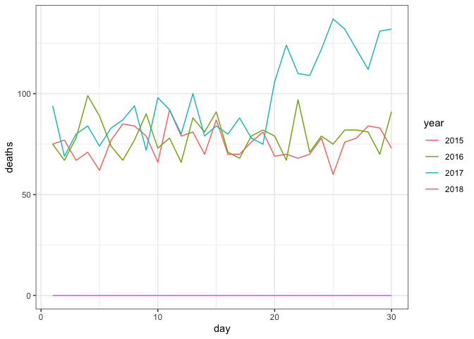<!-- -->
