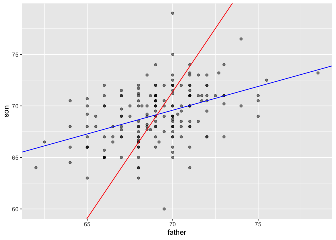
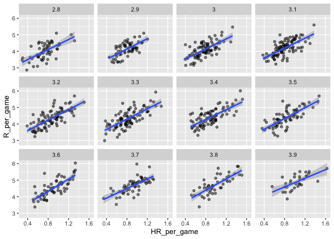
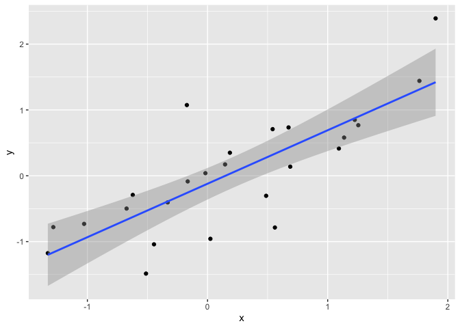

PH125.7 Linear Regression | Notes
================

 

## 7.1 Introduction to regression

 

### Moneyball case study

Do teams that hit more home runs score more runs?

``` r
# BB = walks by batters
# HR = home runs
# H = hits by batter
# R = runs scored
# G = games played

Teams %>% filter(yearID %in% 1961:2001) %>%
  mutate(HR_per_game = HR / G, R_per_game = R / G) %>%
  ggplot(aes(HR_per_game, R_per_game)) + 
  geom_point(alpha = 0.5)
```

<!-- -->

The plot shows a strong association: teams with more HRs tend to score
more runs. Now let’s examine the relationship between stolen bases and
runs:

``` r
Teams %>% filter(yearID %in% 1961:2001) %>%
  mutate(SB_per_game = SB / G, R_per_game = R / G) %>%
  ggplot(aes(SB_per_game, R_per_game)) + 
  geom_point(alpha = 0.5)
```

<!-- -->

Here the relationship is not as clear. Finally, let’s examine the
relationship between BB and runs:

``` r
Teams %>% filter(yearID %in% 1961:2001) %>%
  mutate(BB_per_game = BB/G, R_per_game = R/G) %>%
  ggplot(aes(BB_per_game, R_per_game)) + 
  geom_point(alpha = 0.5)
```

<!-- -->

One of the most important lessons you learn in this book is that
association is not causation.

In fact, it looks like BBs and HRs are also associated:

``` r
Teams %>% filter(yearID %in% 1961:2001 ) %>%
  mutate(HR_per_game = HR/G, BB_per_game = BB/G) %>%
  ggplot(aes(HR_per_game, BB_per_game)) + 
  geom_point(alpha = 0.5)
```

<!-- -->

Can we use regression with these data? First, notice that the HR and Run
data appear to be bivariate normal. We save the plot into the object p
as we will use it again later.

``` r
p <- Teams %>% filter(yearID %in% 1961:2001 ) %>%
  mutate(HR_per_game = HR/G, R_per_game = R/G) %>%
  ggplot(aes(HR_per_game, R_per_game)) + 
  geom_point(alpha = 0.5)
p
```

<!-- -->

The qq-plots confirm that the normal approximation is useful here:

``` r
Teams %>% filter(yearID %in% 1961:2001 ) %>%
  mutate(z_HR = round((HR - mean(HR))/sd(HR)), 
         R_per_game = R/G) %>%
  filter(z_HR %in% -2:3) %>%
  ggplot() +  
  stat_qq(aes(sample=R_per_game)) +
  facet_wrap(~z_HR) 
```

<!-- -->

Now we are ready to use linear regression to predict the number of runs
a team will score if we know how many home runs the team hits. All we
need to do is compute the five summary statistics:

``` r
summary_stats <- Teams %>% 
  filter(yearID %in% 1961:2001 ) %>%
  mutate(HR_per_game = HR/G, R_per_game = R/G) %>%
  summarize(avg_HR = mean(HR_per_game),
            s_HR = sd(HR_per_game),
            avg_R = mean(R_per_game),
            s_R = sd(R_per_game),
            r = cor(HR_per_game, R_per_game))
summary_stats
```

    ##      avg_HR      s_HR    avg_R       s_R         r
    ## 1 0.8547104 0.2429707 4.355262 0.5885791 0.7615597

and use the formulas given above to create the regression lines:

``` r
reg_line <- summary_stats %>% summarize(slope = r*s_R/s_HR,
                            intercept = avg_R - slope*avg_HR)

p + geom_abline(intercept = reg_line$intercept, slope = reg_line$slope)
```

<!-- -->

Soon we will learn R functions, such as lm, that make fitting regression
lines much easier. Another example is the ggplot2 function geom\_smooth
which computes and adds a regression line to plot along with confidence
intervals, which we also learn about later. We use the argument method =
“lm” which stands for linear model, the title of an upcoming section. So
we can simplify the code above like this:

``` r
p + geom_smooth(method = "lm")
```

    ## `geom_smooth()` using formula 'y ~ x'

<!-- -->

In the example above, the slope is 1.845. So this tells us that teams
that hit 1 more HR per game than the average team, score 1.845 more runs
per game than the average team. Given that the most common final score
is a difference of a run, this can certainly lead to a large increase in
wins. Not surprisingly, HR hitters are very expensive. Because we are
working on a budget, we will need to find some other way to increase
wins. So in the next section we move our attention to BB.

  Confounding

Previously, we noted a strong relationship between Runs and BB. If we
find the regression line for predicting runs from bases on balls, we a
get slope of:

``` r
get_slope <- function(x, y) cor(x, y) * sd(y) / sd(x)

bb_slope <- Teams %>% 
  filter(yearID %in% 1961:2001 ) %>% 
  mutate(BB_per_game = BB/G, R_per_game = R/G) %>% 
  summarize(slope = get_slope(BB_per_game, R_per_game))

bb_slope 
```

    ##       slope
    ## 1 0.7353288

So does this mean that if we go and hire low salary players with many
BB, and who therefore increase the number of walks per game by 2, our
team will score 1.5 more runs per game?

We are again reminded that association is not causation. The data does
provide strong evidence that a team with two more BB per game than the
average team, scores 1.5 runs per game. But this does not mean that BB
are the cause.

Note that if we compute the regression line slope for singles we get:

``` r
singles_slope <- Teams %>% 
  filter(yearID %in% 1961:2001 ) %>%
  mutate(Singles_per_game = (H-HR-X2B-X3B)/G, R_per_game = R/G) %>%
  summarize(slope = get_slope(Singles_per_game, R_per_game))

singles_slope 
```

    ##       slope
    ## 1 0.4494253

which is a lower value than what we obtain for BB.

Also, notice that a single gets you to first base just like a BB. Those
that know about baseball will tell you that with a single, runners on
base have a better chance of scoring than with a BB. So how can BB be
more predictive of runs? The reason this happen is because of
confounding. Here we show the correlation between HR, BB, and singles:

``` r
Teams %>% 
  filter(yearID %in% 1961:2001 ) %>% 
  mutate(Singles = (H-HR-X2B-X3B)/G, BB = BB/G, HR = HR/G) %>%  
  summarize(cor(BB, HR), cor(Singles, HR), cor(BB, Singles))
```

    ##   cor(BB, HR) cor(Singles, HR) cor(BB, Singles)
    ## 1   0.4039313       -0.1737435      -0.05603822

It turns out that pitchers, afraid of HRs, will sometimes avoid throwing
strikes to HR hitters. As a result, HR hitters tend to have more BBs and
a team with many HRs will also have more BBs. Although it may appear
that BBs cause runs, it is actually the HRs that cause most of these
runs. We say that BBs are confounded with HRs. Nonetheless, could it be
that BBs still help? To find out, we somehow have to adjust for the HR
effect. Regression can help with this as well.

A first approach is to keep HRs fixed at a certain value and then
examine the relationship between BB and runs. As we did when we
stratified fathers by rounding to the closest inch, here we can stratify
HR per game to the closest ten. We filter out the strata with few points
to avoid highly variable estimates:

``` r
dat <- Teams %>% filter(yearID %in% 1961:2001) %>%
  mutate(HR_strata = round(HR/G, 1), 
         BB_per_game = BB / G,
         R_per_game = R / G) %>%
  filter(HR_strata >= 0.4 & HR_strata <=1.2) 
```

and then make a scatterplot for each strata:

``` r
dat %>% 
  ggplot(aes(BB_per_game, R_per_game)) +  
  geom_point(alpha = 0.5) +
  geom_smooth(method = "lm") +
  facet_wrap( ~ HR_strata) 
```

    ## `geom_smooth()` using formula 'y ~ x'

<!-- -->

Remember that the regression slope for predicting runs with BB was 0.7.
Once we stratify by HR, these slopes are substantially reduced:

``` r
dat %>%  
  group_by(HR_strata) %>%
  summarize(slope = get_slope(BB_per_game, R_per_game))
```

    ## # A tibble: 9 x 2
    ##   HR_strata slope
    ##       <dbl> <dbl>
    ## 1       0.4 0.734
    ## 2       0.5 0.566
    ## 3       0.6 0.412
    ## 4       0.7 0.285
    ## 5       0.8 0.365
    ## 6       0.9 0.261
    ## 7       1   0.511
    ## 8       1.1 0.454
    ## 9       1.2 0.440

The slopes are reduced, but they are not 0, which indicates that BBs are
helpful for producing runs, just not as much as previously thought. In
fact, the values above are closer to the slope we obtained from singles,
0.45, which is more consistent with our intuition. Since both singles
and BB get us to first base, they should have about the same predictive
power.

 

### Correlation

To imitate Galton’s analysis, we will create a dataset with the heights
of fathers and a randomly selected son of each family:

``` r
data("GaltonFamilies")

set.seed(1983)
galton_heights <- GaltonFamilies %>%
  filter(gender == "male") %>%
  group_by(family) %>%
  sample_n(1) %>%
  ungroup() %>%
  select(father, childHeight) %>%
  rename(son = childHeight)
```

Suppose we were asked to summarize the father and son data. Since both
distributions are well approximated by the normal distribution, we could
use the two averages and two standard deviations as summaries:

``` r
galton_heights %>% 
  summarize(mean(father), sd(father), mean(son), sd(son))
```

    ## # A tibble: 1 x 4
    ##   `mean(father)` `sd(father)` `mean(son)` `sd(son)`
    ##            <dbl>        <dbl>       <dbl>     <dbl>
    ## 1           69.1         2.55        69.2      2.71

However, this summary fails to describe an important characteristic of
the data: the trend that the taller the father, the taller the son.

``` r
galton_heights %>% ggplot(aes(father, son)) + 
  geom_point(alpha = 0.5)
```

<!-- -->

The correlation between father and son’s heights is about 0.5:

``` r
galton_heights %>% summarize(r = cor(father, son)) %>% pull(r)
```

    ## [1] 0.4334102

By way of illustration, let’s assume that the 179 pairs of fathers and
sons is our entire population. A less fortunate geneticist can only
afford measurements from a random sample of 25 pairs. The sample
correlation can be computed with:

``` r
R <- sample_n(galton_heights, 25, replace = TRUE) %>% 
  summarize(r = cor(father, son)) %>% pull(r)
R
```

    ## [1] 0.4630811

R is a random variable. We can run a Monte Carlo simulation to see its
distribution:

``` r
B <- 1000
N <- 25
R <- replicate(B, {
  sample_n(galton_heights, N, replace = TRUE) %>% 
    summarize(r=cor(father, son)) %>% 
    pull(r)
})
qplot(R, geom = "histogram", binwidth = 0.05, color = I("black"))
```

<!-- -->

``` r
mean(R)
```

    ## [1] 0.4291816

``` r
sd(R)
```

    ## [1] 0.1663783

So, when interpreting correlations, remember that correlations derived
from samples are estimates containing uncertainty.

Also, note that because the sample correlation is an average of
independent draws, the central limit actually applies. Therefore, for
large enough  
N, the distribution of R is approximately normal with expected value p

``` r
ggplot(aes(sample=R), data = data.frame(R)) + 
  stat_qq() + 
  geom_abline(intercept = mean(R), slope = sqrt((1-mean(R)^2)/(N-2)))
```

<!-- -->

  \#\#\# Stratification and variance

To guess height of child if father is 72 inches we can stratify that
group and pull the average of child height

we can round father heights to the nearest inch and assume that they are
all 72 inches. If we do this, we end up with the following prediction
for the son of a father that is 72 inches tall:

``` r
conditional_avg <- galton_heights %>% 
  filter(round(father) == 72) %>%
  summarize(avg = mean(son)) %>% 
  pull(avg)
conditional_avg
```

    ## [1] 70.5

Note that a 72-inch father is taller than average – specifically, 72 -
69.1/2.5 = 1.1 standard deviations taller than the average father. Our
prediction 70.5 is also taller than average, but only 0.49 standard
deviations larger than the average son. The sons of 72-inch fathers have
regressed some to the average height. We notice that the reduction in
how many SDs taller is about 0.5, which happens to be the correlation.
As we will see in a later section, this is not a coincidence.

If we want to make a prediction of any height, not just 72, we could
apply the same approach to each strata. Stratification followed by
boxplots lets us see the distribution of each group:

``` r
galton_heights %>% mutate(father_strata = factor(round(father))) %>% 
  ggplot(aes(father_strata, son)) + 
  geom_boxplot() + 
  geom_point()
```

<!-- -->

Regression line:

y = mx + b

m = r \* sd(y)/sd(x) b = avg(y) - m \* avg(x)

``` r
mu_x <- mean(galton_heights$father)
mu_y <- mean(galton_heights$son)
s_x <- sd(galton_heights$father)
s_y <- sd(galton_heights$son)
r <- cor(galton_heights$father, galton_heights$son)

galton_heights %>% 
  ggplot(aes(father, son)) + 
  geom_point(alpha = 0.5) +
  geom_abline(slope = r * s_y/s_x, intercept = mu_y - r * s_y/s_x * mu_x) 
```

<!-- -->

The regression formula implies that if we first standardize the
variables, that is subtract the average and divide by the standard
deviation, then the regression line has intercept 0 and slope equal to
the correlation  
ρ. You can make same plot, but using standard units like this:

``` r
galton_heights %>% 
  ggplot(aes(scale(father), scale(son))) + 
  geom_point(alpha = 0.5) +
  geom_abline(intercept = 0, slope = r) 
```

<!-- -->

Let’s compare the two approaches to prediction that we have presented:

Round fathers’ heights to closest inch, stratify, and then take the
average. Compute the regression line and use it to predict. We use a
Monte Carlo simulation sampling N=50 families:

``` r
B <- 1000
N <- 50

set.seed(1983)
conditional_avg <- replicate(B, {
  dat <- sample_n(galton_heights, N)
  dat %>% filter(round(father) == 72) %>% 
    summarize(avg = mean(son)) %>% 
    pull(avg)
  })

regression_prediction <- replicate(B, {
  dat <- sample_n(galton_heights, N)
  mu_x <- mean(dat$father)
  mu_y <- mean(dat$son)
  s_x <- sd(dat$father)
  s_y <- sd(dat$son)
  r <- cor(dat$father, dat$son)
  mu_y + r*(72 - mu_x)/s_x*s_y 
})
```

Although the expected value of these two random variables is about the
same:

``` r
mean(conditional_avg, na.rm = TRUE)
```

    ## [1] 70.49368

``` r
mean(regression_prediction)
```

    ## [1] 70.50941

The standard error for the regression prediction is substantially
smaller:

``` r
sd(conditional_avg, na.rm = TRUE)
```

    ## [1] 0.9635814

``` r
sd(regression_prediction)
```

    ## [1] 0.4520833

BIVARIATE NORMAL DISTRIBUTION

if  
X is a normally distributed random variable,  
Y is also a normally distributed random variable, and the conditional
distribution of Y for any X = x is approximately normal, then the pair
is approximately bivariate normal.

If we think the height data is well approximated by the bivariate normal
distribution, then we should see the normal approximation hold for each
strata. Here we stratify the son heights by the standardized father
heights and see that the assumption appears to hold:

``` r
galton_heights %>%
  mutate(z_father = round((father - mean(father)) / sd(father))) %>%
  filter(z_father %in% -2:2) %>%
  ggplot() +  
  stat_qq(aes(sample = son)) +
  facet_wrap( ~ z_father) 
```

<!-- -->

In summary, if our data is approximately bivariate, then the conditional
expectation, the best prediction of Y given we know the value of X, is
given by the regression line.

WARNING: THERE ARE 2 REGRESSION LINES

We computed a regression line to predict the son’s height from father’s
height. We used these calculations:

``` r
mu_x <- mean(galton_heights$father)
mu_y <- mean(galton_heights$son)
s_x <- sd(galton_heights$father)
s_y <- sd(galton_heights$son)
r <- cor(galton_heights$father, galton_heights$son)
m_1 <-  r * s_y / s_x
b_1 <- mu_y - m_1*mu_x
```

which gives us the function 37.3 + 0.46 x

What if we want to predict the father’s height based on the son’s? It is
important to know that this is not determined by computing the inverse
function. We need to compute E(X|Y=y). Since the data is approximately
bivariate normal, the theory described above tells us that this
conditional expectation will follow a line with slope and intercept:

``` r
m_2 <-  r * s_x / s_y
b_2 <- mu_x - m_2 * mu_y
```

40.9 + 0.41 y

Here is a plot showing the two regression lines, with blue for the
predicting son heights with father heights and red for predicting father
heights with son heights:

``` r
galton_heights %>% 
  ggplot(aes(father, son)) + 
  geom_point(alpha = 0.5) + 
  geom_abline(intercept = b_1, slope = m_1, col = "blue") +
  geom_abline(intercept = -b_2/m_2, slope = 1/m_2, col = "red") 
```

<!-- -->

  \#\#\# Assessment

In the second part of this assessment, you’ll analyze a set of mother
and daughter heights, also from GaltonFamilies.

Define female\_heights, a set of mother and daughter heights sampled
from GaltonFamilies, as follows:

``` r
set.seed(1989) #if you are using R 3.5 or earlier
set.seed(1989, sample.kind="Rounding") #if you are using R 3.6 or later
```

    ## Warning in set.seed(1989, sample.kind = "Rounding"): non-uniform 'Rounding'
    ## sampler used

``` r
data("GaltonFamilies")

female_heights <- GaltonFamilies%>%     
    filter(gender == "female") %>%     
    group_by(family) %>%     
    sample_n(1) %>%     
    ungroup() %>%     
    select(mother, childHeight) %>%     
    rename(daughter = childHeight)
```

Calculate the mean and standard deviation of mothers’ heights, the mean
and standard deviation of daughters’ heights, and the correlaton
coefficient between mother and daughter heights.

``` r
mu_m <- mean(female_heights$mother)
sd_m <- sd(female_heights$mother)
mu_d <- mean(female_heights$daughter)
sd_d <- sd(female_heights$daughter)
rmd <- cor(female_heights$mother, female_heights$daughter)
rmd
```

    ## [1] 0.3245199

Calculate the slope and intercept of the regression line predicting
daughters’ heights given mothers’ heights. Given an increase in mother’s
height by 1 inch, how many inches is the daughter’s height expected to
change?

Slope and intercept of regression line predicting daughters’ height from
mothers’ heights

``` r
slope <- rmd * sd_d / sd_m
slope
```

    ## [1] 0.3393856

``` r
intercept <- mu_d - slope * mu_m
intercept
```

    ## [1] 42.51701

What percent of the variability in daughter heights is explained by the
mother’s height?

``` r
rmd^2 * 100
```

    ## [1] 10.53132

A mother has a height of 60 inches.

What is the conditional expected value of her daughter’s height given
the mother’s height?

``` r
60*slope+intercept
```

    ## [1] 62.88015

## 7.2 Introduction to linear models

 

### Confounding

Association is not causation\! Although it may appear that BB cause
runs, it is actually the HR that cause most of these runs. We say that
BB are confounded with HR. Regression can help us account for
confounding.

``` r
# find regression line for predicting runs from BBs
bb_slope <- Teams %>% 
  filter(yearID %in% 1961:2001 ) %>% 
  mutate(BB_per_game = BB/G, R_per_game = R/G) %>% 
  lm(R_per_game ~ BB_per_game, data = .) %>% 
  .$coef %>%
  .[2]
bb_slope
```

    ## BB_per_game 
    ##   0.7353288

``` r
# compute regression line for predicting runs from singles
singles_slope <- Teams %>% 
  filter(yearID %in% 1961:2001 ) %>%
  mutate(Singles_per_game = (H-HR-X2B-X3B)/G, R_per_game = R/G) %>%
  lm(R_per_game ~ Singles_per_game, data = .) %>%
  .$coef  %>%
  .[2]
singles_slope
```

    ## Singles_per_game 
    ##        0.4494253

``` r
# calculate correlation between HR, BB and singles
Teams %>% 
  filter(yearID %in% 1961:2001 ) %>% 
  mutate(Singles = (H-HR-X2B-X3B)/G, BB = BB/G, HR = HR/G) %>%  
  summarize(cor(BB, HR), cor(Singles, HR), cor(BB,Singles))
```

    ##   cor(BB, HR) cor(Singles, HR) cor(BB, Singles)
    ## 1   0.4039313       -0.1737435      -0.05603822

nbsp;

### Stratification and Multivariate Regression

A first approach to check confounding is to keep HRs fixed at a certain
value and then examine the relationship between BB and runs. The slopes
of BB after stratifying on HR are reduced, but they are not 0, which
indicates that BB are helpful for producing runs, just not as much as
previously thought.

``` r
# stratify HR per game to nearest 10, filter out strata with few points
dat <- Teams %>% filter(yearID %in% 1961:2001) %>%
  mutate(HR_strata = round(HR/G, 1), 
         BB_per_game = BB / G,
         R_per_game = R / G) %>%
  filter(HR_strata >= 0.4 & HR_strata <=1.2)
  
# scatterplot for each HR stratum
dat %>% 
  ggplot(aes(BB_per_game, R_per_game)) +  
  geom_point(alpha = 0.5) +
  geom_smooth(method = "lm") +
  facet_wrap( ~ HR_strata)
```

    ## `geom_smooth()` using formula 'y ~ x'

<!-- -->

``` r
# calculate slope of regression line after stratifying by HR
dat %>%  
  group_by(HR_strata) %>%
  summarize(slope = cor(BB_per_game, R_per_game)*sd(R_per_game)/sd(BB_per_game))
```

    ## # A tibble: 9 x 2
    ##   HR_strata slope
    ##       <dbl> <dbl>
    ## 1       0.4 0.734
    ## 2       0.5 0.566
    ## 3       0.6 0.412
    ## 4       0.7 0.285
    ## 5       0.8 0.365
    ## 6       0.9 0.261
    ## 7       1   0.511
    ## 8       1.1 0.454
    ## 9       1.2 0.440

``` r
# stratify by BB
dat <- Teams %>% filter(yearID %in% 1961:2001) %>%
  mutate(BB_strata = round(BB/G, 1), 
         HR_per_game = HR / G,
         R_per_game = R / G) %>%
  filter(BB_strata >= 2.8 & BB_strata <=3.9) 

# scatterplot for each BB stratum
dat %>% ggplot(aes(HR_per_game, R_per_game)) +  
  geom_point(alpha = 0.5) +
  geom_smooth(method = "lm") +
  facet_wrap( ~ BB_strata)
```

    ## `geom_smooth()` using formula 'y ~ x'

<!-- -->

``` r
# slope of regression line after stratifying by BB
dat %>%  
  group_by(BB_strata) %>%
  summarize(slope = cor(HR_per_game, R_per_game)*sd(R_per_game)/sd(HR_per_game)) 
```

    ## # A tibble: 12 x 2
    ##    BB_strata slope
    ##        <dbl> <dbl>
    ##  1       2.8  1.52
    ##  2       2.9  1.57
    ##  3       3    1.52
    ##  4       3.1  1.49
    ##  5       3.2  1.58
    ##  6       3.3  1.56
    ##  7       3.4  1.48
    ##  8       3.5  1.63
    ##  9       3.6  1.83
    ## 10       3.7  1.45
    ## 11       3.8  1.70
    ## 12       3.9  1.30

### Least square estimates LSE

For regression, we aim to find the coefficient values that minimize the
distance of the fitted model to the data. Residual sum of squares (RSS)
measures the distance between the true value and the predicted value
given by the regression line. The values that minimize the RSS are
called the least squares estimates (LSE). We can use partial derivatives
to get the values for 𝛽0 and 𝛽1 in Galton’s data.

``` r
# compute RSS for any pair of beta0 and beta1 in Galton's data

data("GaltonFamilies")
set.seed(1983)
galton_heights <- GaltonFamilies %>%
  filter(gender == "male") %>%
  group_by(family) %>%
  sample_n(1) %>%
  ungroup() %>%
  select(father, childHeight) %>%
  rename(son = childHeight)
rss <- function(beta0, beta1, data){
    resid <- galton_heights$son - (beta0+beta1*galton_heights$father)
    return(sum(resid^2))
}

# plot RSS as a function of beta1 when beta0=25
beta1 = seq(0, 1, len=nrow(galton_heights))
results <- data.frame(beta1 = beta1,
                      rss = sapply(beta1, rss, beta0 = 25))
results %>% ggplot(aes(beta1, rss)) +  
  geom_line(aes(beta1, rss))
```

<!-- -->

`lm` function

When calling the lm() function, the variable that we want to predict is
put to the left of the ~ symbol, and the variables that we use to
predict is put to the right of the ~ symbol. The intercept is added
automatically. LSEs are random variables.

``` r
# fit regression line to predict son's height from father's height
fit <- lm(son ~ father, data = galton_heights)
fit
```

    ## 
    ## Call:
    ## lm(formula = son ~ father, data = galton_heights)
    ## 
    ## Coefficients:
    ## (Intercept)       father  
    ##     38.7646       0.4411

``` r
# summary statistics
summary(fit)
```

    ## 
    ## Call:
    ## lm(formula = son ~ father, data = galton_heights)
    ## 
    ## Residuals:
    ##     Min      1Q  Median      3Q     Max 
    ## -9.4228 -1.7022  0.0333  1.5670  9.3567 
    ## 
    ## Coefficients:
    ##             Estimate Std. Error t value Pr(>|t|)    
    ## (Intercept) 38.76457    5.41093   7.164 2.03e-11 ***
    ## father       0.44112    0.07825   5.637 6.72e-08 ***
    ## ---
    ## Signif. codes:  0 '***' 0.001 '**' 0.01 '*' 0.05 '.' 0.1 ' ' 1
    ## 
    ## Residual standard error: 2.659 on 177 degrees of freedom
    ## Multiple R-squared:  0.1522, Adjusted R-squared:  0.1474 
    ## F-statistic: 31.78 on 1 and 177 DF,  p-value: 6.719e-08

LSE are random variables

Because they are derived from the samples, LSE are random variables. 𝛽0
and 𝛽1 appear to be normally distributed because the central limit
theorem plays a role. The t-statistic depends on the assumption that 𝜖
follows a normal distribution.

``` r
# Monte Carlo simulation
B <- 1000
N <- 50
lse <- replicate(B, {
  sample_n(galton_heights, N, replace = TRUE) %>% 
    lm(son ~ father, data = .) %>% 
    .$coef 
})
lse <- data.frame(beta_0 = lse[1,], beta_1 = lse[2,]) 

# Plot the distribution of beta_0 and beta_1

p1 <- lse %>% ggplot(aes(beta_0)) + geom_histogram(binwidth = 5, color = "black") 
p2 <- lse %>% ggplot(aes(beta_1)) + geom_histogram(binwidth = 0.1, color = "black") 
grid.arrange(p1, p2, ncol = 2)
```

<!-- -->

``` r
# summary statistics
sample_n(galton_heights, N, replace = TRUE) %>% 
  lm(son ~ father, data = .) %>% 
  summary %>%
  .$coef
```

    ##               Estimate Std. Error  t value     Pr(>|t|)
    ## (Intercept) 34.4729422  8.6021831 4.007464 0.0002129225
    ## father       0.4990193  0.1240572 4.022493 0.0002030210

``` r
lse %>% summarize(se_0 = sd(beta_0), se_1 = sd(beta_1))
```

    ##       se_0      se_1
    ## 1 9.683973 0.1411404

Advanced note on LSE

Although interpretation is not straight-forward, it is also useful to
know that the LSE can be strongly correlated, which can be seen using
this code:

``` r
lse %>% summarize(cor(beta_0, beta_1))
```

    ##   cor(beta_0, beta_1)
    ## 1          -0.9993386

However, the correlation depends on how the predictors are defined or
transformed.

Here we standardize the father heights, which changes 𝑥𝑖 to 𝑥𝑖−𝑥¯ .

``` r
B <- 1000
N <- 50
lse <- replicate(B, {
      sample_n(galton_heights, N, replace = TRUE) %>%
      mutate(father = father - mean(father)) %>%
      lm(son ~ father, data = .) %>% .$coef 
})
```

Observe what happens to the correlation in this case:

``` r
cor(lse[1,], lse[2,]) 
```

    ## [1] 0.1100929

Predicted values are random variables

The predicted value is often denoted as 𝑌̂ , which is a random variable.
Mathematical theory tells us what the standard error of the predicted
value is. The predict() function in R can give us predictions directly.

``` r
# plot predictions and confidence intervals
galton_heights %>% ggplot(aes(son, father)) +
  geom_point() +
  geom_smooth(method = "lm")
```

    ## `geom_smooth()` using formula 'y ~ x'

<!-- -->

``` r
# predict Y directly
fit <- galton_heights %>% lm(son ~ father, data = .) 
Y_hat <- predict(fit, se.fit = TRUE)
names(Y_hat)
```

    ## [1] "fit"            "se.fit"         "df"             "residual.scale"

``` r
# plot best fit line
galton_heights %>%
  mutate(Y_hat = predict(lm(son ~ father, data=.))) %>%
  ggplot(aes(father, Y_hat))+
  geom_line()
```

<!-- -->

 

### Assessment

In a model for sons’ heights vs fathers’ heights, what is the least
squares estimate (LSE) for 𝛽1 if we assume 𝛽̂ 0 is 36

``` r
beta1 = seq(0, 1, len=nrow(galton_heights))
results <- data.frame(beta1 = beta1,
                      rss = sapply(beta1, rss, beta0 = 36))
results %>% ggplot(aes(beta1, rss)) + geom_line() + 
  geom_line(aes(beta1, rss), col=2)
```

<!-- -->

Define female\_heights, a set of mother and daughter heights sampled
from GaltonFamilies, as follows:

``` r
set.seed(1989) #if you are using R 3.5 or earlier

data("GaltonFamilies")
options(digits = 3)    # report 3 significant digits

female_heights <- GaltonFamilies %>%     
    filter(gender == "female") %>%     
    group_by(family) %>%     
    sample_n(1) %>%     
    ungroup() %>%     
    select(mother, childHeight) %>%     
    rename(daughter = childHeight)
```

Fit a linear regression model predicting the mothers’ heights using
daughters’ heights. What are the slope and intercept?

``` r
# fit linear model
fit <- lm(mother ~ daughter, data = female_heights)
fit
```

    ## 
    ## Call:
    ## lm(formula = mother ~ daughter, data = female_heights)
    ## 
    ## Coefficients:
    ## (Intercept)     daughter  
    ##       44.18         0.31

``` r
# slope
slope <- unname(fit$coefficients[2])
slope
```

    ## [1] 0.31

``` r
#intercept
intercept <- unname(fit$coefficients[1])
intercept
```

    ## [1] 44.2

Predict mothers’ heights using the model.

What is the predicted height of the first mother in the dataset?

``` r
# height of first daughter
female_heights$daughter[1]
```

    ## [1] 69

``` r
# height of first mother
slope * female_heights$daughter[1] + intercept
```

    ## [1] 65.6

``` r
# actual height of first mother
female_heights$mother[1]
```

    ## [1] 67

  Stability of singles and BB in baseball

We want to generate two tables: one for 2002 and another for the average
of 1999-2001 seasons. We want to define per plate appearance statistics,
keeping only players with more than 100 plate appearances. Here is how
we create the 2002 table:

``` r
bat_02 <- Batting %>% filter(yearID == 2002) %>%
    mutate(pa = AB + BB, singles = (H - X2B - X3B - HR)/pa, bb = BB/pa) %>%
    filter(pa >= 100) %>%
    select(playerID, singles, bb)
bat_02 %>% head(8)
```

    ##    playerID singles     bb
    ## 1 abernbr01   0.180 0.0512
    ## 2 abreubo01   0.148 0.1538
    ## 3 agbaybe01   0.118 0.0787
    ## 4 alfoned01   0.197 0.1123
    ## 5 alicelu01   0.160 0.1190
    ## 6 alomaro01   0.182 0.0881
    ## 7 alomasa02   0.174 0.0291
    ## 8 alomasa02   0.225 0.0333

Now compute a similar table but with rates computed over 1999-2001. Keep
only rows from 1999-2001 where players have 100 or more plate
appearances, calculate each player’s single rate and BB rate per season,
then calculate the average single rate (mean\_singles) and average BB
rate (mean\_bb) per player over those three seasons.

``` r
bat_99_01 <- Batting %>% filter(yearID %in% 1999:2001) %>%
    mutate(pa = AB + BB, singles = (H - X2B - X3B - HR)/pa, bb = BB/pa) %>%
    filter(pa >= 100) %>%
    group_by(playerID) %>%
    summarize(mean_singles = mean(singles), mean_bb = mean(bb))

bat_99_01 %>% head(8)
```

    ## # A tibble: 8 x 3
    ##   playerID  mean_singles mean_bb
    ##   <chr>            <dbl>   <dbl>
    ## 1 abbotje01        0.169  0.0890
    ## 2 abbotku01        0.143  0.0674
    ## 3 abernbr01        0.178  0.0816
    ## 4 abreubo01        0.153  0.156 
    ## 5 agbaybe01        0.162  0.115 
    ## 6 alexama02        0.166  0.0581
    ## 7 alfoned01        0.161  0.123 
    ## 8 alicelu01        0.168  0.100

How many players had a single rate mean\_singles of greater than 0.2 per
plate appearance over 1999-2001?

``` r
bat_99_01 %>% filter(mean_singles > 0.2) %>% nrow()
```

    ## [1] 46

How many players had a BB rate mean\_bb of greater than 0.2 per plate
appearance over 1999-2001?

``` r
bat_99_01 %>% filter(mean_bb > 0.2) %>% nrow()
```

    ## [1] 3

Use inner\_join() to combine the bat\_02 table with the table of
1999-2001 rate averages you created in the previous question.

What is the correlation between 2002 singles rates and 1999-2001 average
singles rates? What is the correlation between 2002 BB rates and
1999-2001 average BB rates?

``` r
dat <- inner_join(bat_02,bat_99_01)
```

    ## Joining, by = "playerID"

``` r
dat %>% head(8)
```

    ##    playerID singles     bb mean_singles mean_bb
    ## 1 abernbr01   0.180 0.0512        0.178  0.0816
    ## 2 abreubo01   0.148 0.1538        0.153  0.1557
    ## 3 agbaybe01   0.118 0.0787        0.162  0.1153
    ## 4 alfoned01   0.197 0.1123        0.161  0.1228
    ## 5 alicelu01   0.160 0.1190        0.168  0.1001
    ## 6 alomaro01   0.182 0.0881        0.186  0.1222
    ## 7 alomasa02   0.174 0.0291        0.183  0.0410
    ## 8 alomasa02   0.225 0.0333        0.183  0.0410

``` r
# correlation between 2002 single rates and 99-01 avg singles
cor(dat$singles,dat$mean_singles)
```

    ## [1] 0.551

``` r
# correlation between 2002 BB and 99-01 avg BB rates
cor(dat$bb, dat$mean_bb)
```

    ## [1] 0.717

Make scatterplots of mean\_singles versus singles and mean\_bb versus
bb.

Are either of these distributions bivariate normal?

``` r
sp_singles <- dat %>% ggplot(aes(singles, mean_singles)) +
  geom_point(alpha=0.5)
sp_bb <- dat %>% ggplot(aes(bb, mean_bb)) + 
  geom_point(alpha=0.5)
grid.arrange(sp_singles,sp_bb)
```

<!-- -->

``` r
dat %>% 
  mutate(z_singles = round((singles - mean(singles))/sd(singles))) %>%
  filter(z_singles %in% -2:3) %>%
  ggplot() +  
  stat_qq(aes(sample=mean_singles)) +
  facet_wrap(~z_singles) 
```

<!-- -->

``` r
dat %>% 
  mutate(z_bb = round((bb - mean(bb))/sd(bb))) %>%
  filter(z_bb %in% -2:3) %>%
  ggplot() +  
  stat_qq(aes(sample=mean_bb)) +
  facet_wrap(~z_bb) 
```

<!-- -->

Fit a linear model to predict 2002 singles given 1999-2001
mean\_singles.

What is the coefficient of mean\_singles, the slope of the fit?

``` r
fit_singles <- lm(singles~mean_singles,data=dat)
fit_singles$coefficients[2]
```

    ## mean_singles 
    ##        0.588

Fit a linear model to predict 2002 bb given 1999-2001 mean\_bb.

What is the coefficient of mean\_bb, the slope of the fit?

``` r
fit_bb <- lm(bb ~ mean_bb, data=dat)
fit_bb$coefficients[2]
```

    ## mean_bb 
    ##   0.829

 

### Tibbles, do and broom

#### Tibbles

Tibbles can be regarded as a modern version of data frames and are the
default data structure in the tidyverse. Some functions that do not work
properly with data frames do work with tibbles.

``` r
# stratify by HR
dat <- Teams %>% filter(yearID %in% 1961:2001) %>%
  mutate(HR = round(HR/G, 1), 
         BB = BB/G,
         R = R/G) %>%
  select(HR, BB, R) %>%
  filter(HR >= 0.4 & HR<=1.2)

dat %>% head(8)
```

    ##    HR   BB    R
    ## 1 0.9 3.56 4.24
    ## 2 0.7 3.97 4.47
    ## 3 0.8 3.37 4.69
    ## 4 1.1 3.46 4.42
    ## 5 1.0 2.75 4.61
    ## 6 0.9 3.06 4.58
    ## 7 1.1 4.13 5.16
    ## 8 0.6 3.58 4.22

``` r
# calculate slope of regression lines to predict runs by BB in different HR strata
dat %>%  
  group_by(HR) %>%
  summarize(slope = cor(BB,R)*sd(R)/sd(BB))
```

    ## # A tibble: 9 x 2
    ##      HR slope
    ##   <dbl> <dbl>
    ## 1   0.4 0.734
    ## 2   0.5 0.566
    ## 3   0.6 0.412
    ## 4   0.7 0.285
    ## 5   0.8 0.365
    ## 6   0.9 0.261
    ## 7   1   0.511
    ## 8   1.1 0.454
    ## 9   1.2 0.440

``` r
# use lm to get estimated slopes - lm does not work with grouped tibbles
dat %>%  
  group_by(HR) %>%
  lm(R ~ BB, data = .) %>%
  .$coef
```

    ## (Intercept)          BB 
    ##       2.198       0.638

``` r
# inspect a grouped tibble
dat %>% group_by(HR) %>% head()
```

    ## # A tibble: 6 x 3
    ## # Groups:   HR [5]
    ##      HR    BB     R
    ##   <dbl> <dbl> <dbl>
    ## 1   0.9  3.56  4.24
    ## 2   0.7  3.97  4.47
    ## 3   0.8  3.37  4.69
    ## 4   1.1  3.46  4.42
    ## 5   1    2.75  4.61
    ## 6   0.9  3.06  4.58

``` r
dat %>% group_by(HR) %>% class()
```

    ## [1] "grouped_df" "tbl_df"     "tbl"        "data.frame"

Tibbles are more readable than data frames. If you subset a data frame,
you may not get a data frame. If you subset a tibble, you always get a
tibble. Tibbles can hold more complex objects such as lists or
functions. Tibbles can be grouped.

``` r
# inspect data frame and tibble
Teams %>% head(10)
```

    ##    yearID lgID teamID franchID divID Rank  G Ghome  W  L DivWin WCWin LgWin
    ## 1    1871   NA    BS1      BNA  <NA>    3 31    NA 20 10   <NA>  <NA>     N
    ## 2    1871   NA    CH1      CNA  <NA>    2 28    NA 19  9   <NA>  <NA>     N
    ## 3    1871   NA    CL1      CFC  <NA>    8 29    NA 10 19   <NA>  <NA>     N
    ## 4    1871   NA    FW1      KEK  <NA>    7 19    NA  7 12   <NA>  <NA>     N
    ## 5    1871   NA    NY2      NNA  <NA>    5 33    NA 16 17   <NA>  <NA>     N
    ## 6    1871   NA    PH1      PNA  <NA>    1 28    NA 21  7   <NA>  <NA>     Y
    ## 7    1871   NA    RC1      ROK  <NA>    9 25    NA  4 21   <NA>  <NA>     N
    ## 8    1871   NA    TRO      TRO  <NA>    6 29    NA 13 15   <NA>  <NA>     N
    ## 9    1871   NA    WS3      OLY  <NA>    4 32    NA 15 15   <NA>  <NA>     N
    ## 10   1872   NA    BL1      BLC  <NA>    2 58    NA 35 19   <NA>  <NA>     N
    ##    WSWin   R   AB   H X2B X3B HR BB SO SB CS HBP SF  RA  ER  ERA CG SHO SV
    ## 1   <NA> 401 1372 426  70  37  3 60 19 73 16  NA NA 303 109 3.55 22   1  3
    ## 2   <NA> 302 1196 323  52  21 10 60 22 69 21  NA NA 241  77 2.76 25   0  1
    ## 3   <NA> 249 1186 328  35  40  7 26 25 18  8  NA NA 341 116 4.11 23   0  0
    ## 4   <NA> 137  746 178  19   8  2 33  9 16  4  NA NA 243  97 5.17 19   1  0
    ## 5   <NA> 302 1404 403  43  21  1 33 15 46 15  NA NA 313 121 3.72 32   1  0
    ## 6   <NA> 376 1281 410  66  27  9 46 23 56 12  NA NA 266 137 4.95 27   0  0
    ## 7   <NA> 231 1036 274  44  25  3 38 30 53 10  NA NA 287 108 4.30 23   1  0
    ## 8   <NA> 351 1248 384  51  34  6 49 19 62 24  NA NA 362 153 5.51 28   0  0
    ## 9   <NA> 310 1353 375  54  26  6 48 13 48 13  NA NA 303 137 4.37 32   0  0
    ## 10  <NA> 617 2571 753 106  31 14 29 28 53 18  NA NA 434 166 2.90 48   1  1
    ##    IPouts  HA HRA BBA SOA   E DP    FP                    name
    ## 1     828 367   2  42  23 243 24 0.834    Boston Red Stockings
    ## 2     753 308   6  28  22 229 16 0.829 Chicago White Stockings
    ## 3     762 346  13  53  34 234 15 0.818  Cleveland Forest Citys
    ## 4     507 261   5  21  17 163  8 0.803    Fort Wayne Kekiongas
    ## 5     879 373   7  42  22 235 14 0.840        New York Mutuals
    ## 6     747 329   3  53  16 194 13 0.845  Philadelphia Athletics
    ## 7     678 315   3  34  16 220 14 0.821   Rockford Forest Citys
    ## 8     750 431   4  75  12 198 22 0.845          Troy Haymakers
    ## 9     846 371   4  45  13 218 20 0.850     Washington Olympics
    ## 10   1548 573   3  63  77 432 22 0.830      Baltimore Canaries
    ##                                 park attendance BPF PPF teamIDBR teamIDlahman45
    ## 1                South End Grounds I         NA 103  98      BOS            BS1
    ## 2            Union Base-Ball Grounds         NA 104 102      CHI            CH1
    ## 3       National Association Grounds         NA  96 100      CLE            CL1
    ## 4                     Hamilton Field         NA 101 107      KEK            FW1
    ## 5           Union Grounds (Brooklyn)         NA  90  88      NYU            NY2
    ## 6           Jefferson Street Grounds         NA 102  98      ATH            PH1
    ## 7  Agricultural Society Fair Grounds         NA  97  99      ROK            RC1
    ## 8                 Haymakers' Grounds         NA 101 100      TRO            TRO
    ## 9                   Olympics Grounds         NA  94  98      OLY            WS3
    ## 10                    Newington Park         NA 106 102      BAL            BL1
    ##    teamIDretro
    ## 1          BS1
    ## 2          CH1
    ## 3          CL1
    ## 4          FW1
    ## 5          NY2
    ## 6          PH1
    ## 7          RC1
    ## 8          TRO
    ## 9          WS3
    ## 10         BL1

``` r
as.tibble(Teams) %>% head(10)
```

    ## Warning: `as.tibble()` is deprecated as of tibble 2.0.0.
    ## Please use `as_tibble()` instead.
    ## The signature and semantics have changed, see `?as_tibble`.
    ## This warning is displayed once every 8 hours.
    ## Call `lifecycle::last_warnings()` to see where this warning was generated.

    ## # A tibble: 10 x 48
    ##    yearID lgID  teamID franchID divID  Rank     G Ghome     W     L DivWin WCWin
    ##     <int> <fct> <fct>  <fct>    <chr> <int> <int> <int> <int> <int> <chr>  <chr>
    ##  1   1871 NA    BS1    BNA      <NA>      3    31    NA    20    10 <NA>   <NA> 
    ##  2   1871 NA    CH1    CNA      <NA>      2    28    NA    19     9 <NA>   <NA> 
    ##  3   1871 NA    CL1    CFC      <NA>      8    29    NA    10    19 <NA>   <NA> 
    ##  4   1871 NA    FW1    KEK      <NA>      7    19    NA     7    12 <NA>   <NA> 
    ##  5   1871 NA    NY2    NNA      <NA>      5    33    NA    16    17 <NA>   <NA> 
    ##  6   1871 NA    PH1    PNA      <NA>      1    28    NA    21     7 <NA>   <NA> 
    ##  7   1871 NA    RC1    ROK      <NA>      9    25    NA     4    21 <NA>   <NA> 
    ##  8   1871 NA    TRO    TRO      <NA>      6    29    NA    13    15 <NA>   <NA> 
    ##  9   1871 NA    WS3    OLY      <NA>      4    32    NA    15    15 <NA>   <NA> 
    ## 10   1872 NA    BL1    BLC      <NA>      2    58    NA    35    19 <NA>   <NA> 
    ## # … with 36 more variables: LgWin <chr>, WSWin <chr>, R <int>, AB <int>,
    ## #   H <int>, X2B <int>, X3B <int>, HR <int>, BB <dbl>, SO <int>, SB <dbl>,
    ## #   CS <dbl>, HBP <dbl>, SF <int>, RA <int>, ER <int>, ERA <dbl>, CG <int>,
    ## #   SHO <int>, SV <int>, IPouts <int>, HA <int>, HRA <int>, BBA <int>,
    ## #   SOA <int>, E <int>, DP <int>, FP <dbl>, name <chr>, park <chr>,
    ## #   attendance <int>, BPF <int>, PPF <int>, teamIDBR <chr>,
    ## #   teamIDlahman45 <chr>, teamIDretro <chr>

``` r
# subsetting a data frame sometimes generates vectors
class(Teams[,20])
```

    ## [1] "integer"

``` r
# subsetting a tibble always generates tibbles
class(as.tibble(Teams[,20]))
```

    ## [1] "tbl_df"     "tbl"        "data.frame"

``` r
# pulling a vector out of a tibble
class(as.tibble(Teams)$HR)
```

    ## [1] "integer"

``` r
# access a non-existing column in a data frame or a tibble
Teams$hr
```

    ## NULL

``` r
as.tibble(Teams)$hr
```

    ## Warning: Unknown or uninitialised column: `hr`.

    ## NULL

``` r
# create a tibble with complex objects
tibble(id = c(1, 2, 3), func = c(mean, median, sd))
```

    ## # A tibble: 3 x 2
    ##      id func  
    ##   <dbl> <list>
    ## 1     1 <fn>  
    ## 2     2 <fn>  
    ## 3     3 <fn>

#### `do`function

The do() function serves as a bridge between R functions, such as lm(),
and the tidyverse. We have to specify a column when using the do()
function, otherwise we will get an error. If the data frame being
returned has more than one row, the rows will be concatenated
appropriately.

``` r
# use do to fit a regression line to each HR stratum
head(dat)
```

    ##    HR   BB    R
    ## 1 0.9 3.56 4.24
    ## 2 0.7 3.97 4.47
    ## 3 0.8 3.37 4.69
    ## 4 1.1 3.46 4.42
    ## 5 1.0 2.75 4.61
    ## 6 0.9 3.06 4.58

``` r
dat %>%  
    group_by(HR) %>%
    do(fit = lm(R ~ BB, data = .))
```

    ## Source: local data frame [9 x 2]
    ## Groups: <by row>
    ## 
    ## # A tibble: 9 x 2
    ##      HR fit   
    ## * <dbl> <list>
    ## 1   0.4 <lm>  
    ## 2   0.5 <lm>  
    ## 3   0.6 <lm>  
    ## 4   0.7 <lm>  
    ## 5   0.8 <lm>  
    ## 6   0.9 <lm>  
    ## 7   1   <lm>  
    ## 8   1.1 <lm>  
    ## 9   1.2 <lm>

``` r
# using do without a column name gives an error
# dat %>%
    # group_by(HR) %>%
    # do(lm(R ~ BB, data = .))

# define a function to extract slope from lm
get_slope <- function(data){
  fit <- lm(R ~ BB, data = data)
  data.frame(slope = fit$coefficients[2], 
             se = summary(fit)$coefficient[2,2])
}

# return the desired data frame
dat %>%  
  group_by(HR) %>%
  do(get_slope(.))
```

    ## # A tibble: 9 x 3
    ## # Groups:   HR [9]
    ##      HR slope     se
    ##   <dbl> <dbl>  <dbl>
    ## 1   0.4 0.734 0.208 
    ## 2   0.5 0.566 0.110 
    ## 3   0.6 0.412 0.0974
    ## 4   0.7 0.285 0.0705
    ## 5   0.8 0.365 0.0653
    ## 6   0.9 0.261 0.0754
    ## 7   1   0.511 0.0749
    ## 8   1.1 0.454 0.0855
    ## 9   1.2 0.440 0.0801

``` r
# not the desired output: a column containing data frames
dat %>%  
  group_by(HR) %>%
  do(slope = get_slope(.))
```

    ## Source: local data frame [9 x 2]
    ## Groups: <by row>
    ## 
    ## # A tibble: 9 x 2
    ##      HR slope           
    ## * <dbl> <list>          
    ## 1   0.4 <df[,2] [1 × 2]>
    ## 2   0.5 <df[,2] [1 × 2]>
    ## 3   0.6 <df[,2] [1 × 2]>
    ## 4   0.7 <df[,2] [1 × 2]>
    ## 5   0.8 <df[,2] [1 × 2]>
    ## 6   0.9 <df[,2] [1 × 2]>
    ## 7   1   <df[,2] [1 × 2]>
    ## 8   1.1 <df[,2] [1 × 2]>
    ## 9   1.2 <df[,2] [1 × 2]>

``` r
# data frames with multiple rows will be concatenated appropriately
get_lse <- function(data){
  fit <- lm(R ~ BB, data = data)
  data.frame(term = names(fit$coefficients),
    slope = fit$coefficients, 
    se = summary(fit)$coefficient[,2])
}

dat %>%  
  group_by(HR) %>%
  do(get_lse(.))
```

    ## # A tibble: 18 x 4
    ## # Groups:   HR [9]
    ##       HR term        slope     se
    ##    <dbl> <fct>       <dbl>  <dbl>
    ##  1   0.4 (Intercept) 1.36  0.631 
    ##  2   0.4 BB          0.734 0.208 
    ##  3   0.5 (Intercept) 2.01  0.344 
    ##  4   0.5 BB          0.566 0.110 
    ##  5   0.6 (Intercept) 2.53  0.305 
    ##  6   0.6 BB          0.412 0.0974
    ##  7   0.7 (Intercept) 3.21  0.225 
    ##  8   0.7 BB          0.285 0.0705
    ##  9   0.8 (Intercept) 3.07  0.213 
    ## 10   0.8 BB          0.365 0.0653
    ## 11   0.9 (Intercept) 3.54  0.252 
    ## 12   0.9 BB          0.261 0.0754
    ## 13   1   (Intercept) 2.88  0.255 
    ## 14   1   BB          0.511 0.0749
    ## 15   1.1 (Intercept) 3.21  0.300 
    ## 16   1.1 BB          0.454 0.0855
    ## 17   1.2 (Intercept) 3.40  0.291 
    ## 18   1.2 BB          0.440 0.0801

#### `broom` package

The broom package has three main functions, all of which extract
information from the object returned by lm and return it in a tidyverse
friendly data frame. The tidy() function returns estimates and related
information as a data frame. The functions glance() and augment() relate
to model specific and observation specific outcomes
respectively.

``` r
# use tidy to return lm estimates and related information as a data frame

fit <- lm(R ~ BB, data = dat)
tidy(fit)
```

    ## # A tibble: 2 x 5
    ##   term        estimate std.error statistic  p.value
    ##   <chr>          <dbl>     <dbl>     <dbl>    <dbl>
    ## 1 (Intercept)    2.20     0.113       19.4 1.12e-70
    ## 2 BB             0.638    0.0344      18.5 1.35e-65

``` r
# add confidence intervals with tidy
tidy(fit, conf.int = TRUE)
```

    ## # A tibble: 2 x 7
    ##   term        estimate std.error statistic  p.value conf.low conf.high
    ##   <chr>          <dbl>     <dbl>     <dbl>    <dbl>    <dbl>     <dbl>
    ## 1 (Intercept)    2.20     0.113       19.4 1.12e-70    1.98      2.42 
    ## 2 BB             0.638    0.0344      18.5 1.35e-65    0.570     0.705

``` r
# pipeline with lm, do, tidy
dat %>%  
  group_by(HR) %>%
  do(tidy(lm(R ~ BB, data = .), conf.int = TRUE)) %>%
  filter(term == "BB") %>%
  select(HR, estimate, conf.low, conf.high)
```

    ## # A tibble: 9 x 4
    ## # Groups:   HR [9]
    ##      HR estimate conf.low conf.high
    ##   <dbl>    <dbl>    <dbl>     <dbl>
    ## 1   0.4    0.734    0.308     1.16 
    ## 2   0.5    0.566    0.346     0.786
    ## 3   0.6    0.412    0.219     0.605
    ## 4   0.7    0.285    0.146     0.425
    ## 5   0.8    0.365    0.236     0.494
    ## 6   0.9    0.261    0.112     0.410
    ## 7   1      0.511    0.363     0.660
    ## 8   1.1    0.454    0.284     0.624
    ## 9   1.2    0.440    0.280     0.601

``` r
# make ggplots
dat %>%  
  group_by(HR) %>%
  do(tidy(lm(R ~ BB, data = .), conf.int = TRUE)) %>%
  filter(term == "BB") %>%
  select(HR, estimate, conf.low, conf.high) %>%
  ggplot(aes(HR, y = estimate, ymin = conf.low, ymax = conf.high)) +
  geom_errorbar() +
  geom_point()
```

<!-- -->

``` r
# inspect with glance
glance(fit)
```

    ## # A tibble: 1 x 11
    ##   r.squared adj.r.squared sigma statistic  p.value    df logLik   AIC   BIC
    ##       <dbl>         <dbl> <dbl>     <dbl>    <dbl> <int>  <dbl> <dbl> <dbl>
    ## 1     0.266         0.265 0.454      343. 1.35e-65     2  -596. 1199. 1214.
    ## # … with 2 more variables: deviance <dbl>, df.residual <int>

 

### Assessment

You want to know whether the relationship between home runs and runs per
game varies by baseball league. You create the following dataset:

``` r
dat <- Teams %>% filter(yearID %in% 1961:2001) %>%
  mutate(HR = HR/G,
         R = R/G) %>%
  select(lgID, HR, BB, R) 
head(dat)
```

    ##   lgID    HR  BB    R
    ## 1   AL 0.914 581 4.24
    ## 2   AL 0.687 647 4.47
    ## 3   AL 0.847 550 4.69
    ## 4   NL 1.128 539 4.42
    ## 5   NL 1.026 423 4.61
    ## 6   AL 0.932 492 4.58

What code would help you quickly answer this question?

``` r
dat %>% 
  group_by(lgID) %>% 
  do(tidy(lm(R ~ HR, data = .), conf.int = T)) %>% 
  filter(term == "HR")
```

    ## # A tibble: 2 x 8
    ## # Groups:   lgID [2]
    ##   lgID  term  estimate std.error statistic  p.value conf.low conf.high
    ##   <fct> <chr>    <dbl>     <dbl>     <dbl>    <dbl>    <dbl>     <dbl>
    ## 1 AL    HR        1.90    0.0734      25.9 1.29e-95     1.75      2.04
    ## 2 NL    HR        1.76    0.0671      26.2 1.16e-95     1.62      1.89

Create the galton dataset using the code below:

``` r
data("GaltonFamilies")
set.seed(1) 
galton <- GaltonFamilies %>%
    group_by(family, gender) %>%
    sample_n(1) %>%
    ungroup() %>% 
    gather(parent, parentHeight, father:mother) %>%
    mutate(child = ifelse(gender == "female", "daughter", "son")) %>%
    unite(pair, c("parent", "child"))

head(galton,12)
```

    ## # A tibble: 12 x 8
    ##    family midparentHeight children childNum gender childHeight pair 
    ##    <fct>            <dbl>    <int>    <int> <fct>        <dbl> <chr>
    ##  1 001               75.4        4        2 female        69.2 fath…
    ##  2 001               75.4        4        1 male          73.2 fath…
    ##  3 002               73.7        4        4 female        65.5 fath…
    ##  4 002               73.7        4        2 male          72.5 fath…
    ##  5 003               72.1        2        2 female        68   fath…
    ##  6 003               72.1        2        1 male          71   fath…
    ##  7 004               72.1        5        5 female        63   fath…
    ##  8 004               72.1        5        2 male          68.5 fath…
    ##  9 005               69.1        6        5 female        62.5 fath…
    ## 10 005               69.1        6        1 male          72   fath…
    ## 11 006               73.7        1        1 female        69.5 fath…
    ## 12 007               73.7        6        5 female        70.5 fath…
    ## # … with 1 more variable: parentHeight <dbl>

Group by pair and summarize the number of observations in each group.

How many father-daughter pairs are in the dataset?

``` r
galton %>%
    group_by(pair) %>%
    summarize(n = n())
```

    ## # A tibble: 4 x 2
    ##   pair                n
    ##   <chr>           <int>
    ## 1 father_daughter   176
    ## 2 father_son        179
    ## 3 mother_daughter   176
    ## 4 mother_son        179

Which pairs have the weakest and strongest correlation?

``` r
# weakest correlation
galton %>%
    group_by(pair) %>%
    summarize(cor = cor(parentHeight, childHeight)) %>%
    filter(cor == min(cor))
```

    ## # A tibble: 1 x 2
    ##   pair         cor
    ##   <chr>      <dbl>
    ## 1 mother_son 0.343

``` r
#strongest correlation
galton %>%
    group_by(pair) %>%
    summarize(cor = cor(parentHeight, childHeight)) %>%
    filter(cor == max(cor))
```

    ## # A tibble: 1 x 2
    ##   pair         cor
    ##   <chr>      <dbl>
    ## 1 father_son 0.430

Use lm() and the broom package to fit regression lines for each
parent-child pair type. Compute the least squares estimates, standard
errors, confidence intervals and p-values for the parentHeight
coefficient for each pair.

``` r
# coefficient of father-daughter

father_daugther_only <- galton %>% filter(pair=="father_daughter")

fit_father_daughter <- lm(childHeight ~ parentHeight, data = father_daugther_only)
tidy(fit_father_daughter)
```

    ## # A tibble: 2 x 5
    ##   term         estimate std.error statistic  p.value
    ##   <chr>           <dbl>     <dbl>     <dbl>    <dbl>
    ## 1 (Intercept)    40.1      4.16        9.65 6.50e-18
    ## 2 parentHeight    0.345    0.0599      5.77 3.56e- 8

``` r
# for every 1 inch increase in mothers height...son?

mother_son_only <- galton %>% filter(pair=="mother_son")

fit_mother_son <- lm(childHeight ~ parentHeight, data=mother_son_only)
tidy(fit_mother_son)
```

    ## # A tibble: 2 x 5
    ##   term         estimate std.error statistic  p.value
    ##   <chr>           <dbl>     <dbl>     <dbl>    <dbl>
    ## 1 (Intercept)    44.9      5.02        8.94 4.96e-16
    ## 2 parentHeight    0.381    0.0784      4.86 2.59e- 6

``` r
galton %>%
    group_by(pair) %>%
    do(tidy(lm(childHeight ~ parentHeight, data = .), conf.int = TRUE)) %>%
    filter(term == "parentHeight" & p.value < .05)
```

    ## # A tibble: 4 x 8
    ## # Groups:   pair [4]
    ##   pair       term      estimate std.error statistic   p.value conf.low conf.high
    ##   <chr>      <chr>        <dbl>     <dbl>     <dbl>     <dbl>    <dbl>     <dbl>
    ## 1 father_da… parentHe…    0.345    0.0599      5.77   3.56e-8    0.227     0.464
    ## 2 father_son parentHe…    0.443    0.0700      6.33   1.94e-9    0.305     0.581
    ## 3 mother_da… parentHe…    0.394    0.0720      5.47   1.56e-7    0.252     0.536
    ## 4 mother_son parentHe…    0.381    0.0784      4.86   2.59e-6    0.226     0.535

 

### Regression and baseball

``` r
# linear regression with two variables
fit <- Teams %>% 
  filter(yearID %in% 1961:2001) %>% 
  mutate(BB = BB/G, HR = HR/G,  R = R/G) %>%  
  lm(R ~ BB + HR, data = .)
  tidy(fit, conf.int = TRUE)
```

    ## # A tibble: 3 x 7
    ##   term        estimate std.error statistic   p.value conf.low conf.high
    ##   <chr>          <dbl>     <dbl>     <dbl>     <dbl>    <dbl>     <dbl>
    ## 1 (Intercept)    1.74     0.0824      21.2 7.62e- 83    1.58      1.91 
    ## 2 BB             0.387    0.0270      14.3 1.20e- 42    0.334     0.440
    ## 3 HR             1.56     0.0490      31.9 1.78e-155    1.47      1.66

``` r
# regression with BB, singles, doubles, triples, HR
fit <- Teams %>% 
  filter(yearID %in% 1961:2001) %>% 
  mutate(BB = BB / G, 
         singles = (H - X2B - X3B - HR) / G, 
         doubles = X2B / G, 
         triples = X3B / G, 
         HR = HR / G,
         R = R / G) %>%  
  lm(R ~ BB + singles + doubles + triples + HR, data = .)
coefs <- tidy(fit, conf.int = TRUE)
coefs
```

    ## # A tibble: 6 x 7
    ##   term        estimate std.error statistic   p.value conf.low conf.high
    ##   <chr>          <dbl>     <dbl>     <dbl>     <dbl>    <dbl>     <dbl>
    ## 1 (Intercept)   -2.77     0.0862     -32.1 4.76e-157   -2.94     -2.60 
    ## 2 BB             0.371    0.0117      31.6 1.87e-153    0.348     0.394
    ## 3 singles        0.519    0.0127      40.8 8.67e-217    0.494     0.544
    ## 4 doubles        0.771    0.0226      34.1 8.44e-171    0.727     0.816
    ## 5 triples        1.24     0.0768      16.1 2.12e- 52    1.09      1.39 
    ## 6 HR             1.44     0.0243      59.3 0.           1.40      1.49

``` r
# predict number of runs for each team in 2002 and plot
Teams %>% 
  filter(yearID %in% 2002) %>% 
  mutate(BB = BB/G, 
         singles = (H-X2B-X3B-HR)/G, 
         doubles = X2B/G, 
         triples =X3B/G, 
         HR=HR/G,
         R=R/G)  %>% 
  mutate(R_hat = predict(fit, newdata = .)) %>%
  ggplot(aes(R_hat, R, label = teamID)) + 
  geom_point() +
  geom_text(nudge_x=0.1, cex = 2) + 
  geom_abline()
```

<!-- -->

``` r
# average number of team plate appearances per game
pa_per_game <- Batting %>% filter(yearID == 2002) %>% 
  group_by(teamID) %>%
  summarize(pa_per_game = sum(AB+BB)/max(G)) %>% 
  pull(pa_per_game) %>% 
  mean
  
# compute per-plate-appearance rates for players available in 2002 using previous data
players <- Batting %>% filter(yearID %in% 1999:2001) %>% 
  group_by(playerID) %>%
  mutate(PA = BB + AB) %>%
  summarize(G = sum(PA)/pa_per_game,
    BB = sum(BB)/G,
    singles = sum(H-X2B-X3B-HR)/G,
    doubles = sum(X2B)/G, 
    triples = sum(X3B)/G, 
    HR = sum(HR)/G,
    AVG = sum(H)/sum(AB),
    PA = sum(PA)) %>%
  filter(PA >= 300) %>%
  select(-G) %>%
  mutate(R_hat = predict(fit, newdata = .))
  
# plot player-specific predicted runs
qplot(R_hat, data = players, geom = "histogram", binwidth = 0.5, color = I("black"))
```

<!-- -->

``` r
# add 2002 salary of each player
players <- Salaries %>% 
  filter(yearID == 2002) %>%
  select(playerID, salary) %>%
  right_join(players, by="playerID")
  
# add defensive position
position_names <- c("G_p","G_c","G_1b","G_2b","G_3b","G_ss","G_lf","G_cf","G_rf")
tmp_tab <- Appearances %>% 
  filter(yearID == 2002) %>% 
  group_by(playerID) %>%
  summarize_at(position_names, sum) %>%
  ungroup()  
pos <- tmp_tab %>%
  select(position_names) %>%
  apply(., 1, which.max) 
```

    ## Note: Using an external vector in selections is ambiguous.
    ## ℹ Use `all_of(position_names)` instead of `position_names` to silence this message.
    ## ℹ See <https://tidyselect.r-lib.org/reference/faq-external-vector.html>.
    ## This message is displayed once per session.

``` r
players <- data_frame(playerID = tmp_tab$playerID, POS = position_names[pos]) %>%
  mutate(POS = str_to_upper(str_remove(POS, "G_"))) %>%
  filter(POS != "P") %>%
  right_join(players, by="playerID") %>%
  filter(!is.na(POS)  & !is.na(salary))
```

    ## Warning: `data_frame()` is deprecated as of tibble 1.1.0.
    ## Please use `tibble()` instead.
    ## This warning is displayed once every 8 hours.
    ## Call `lifecycle::last_warnings()` to see where this warning was generated.

``` r
# add players' first and last names
players <- Master %>%
  select(playerID, nameFirst, nameLast, debut) %>%
  mutate(debut = as.Date(debut)) %>%
  right_join(players, by="playerID")
  
# top 10 players
players %>% select(nameFirst, nameLast, POS, salary, R_hat) %>% 
  arrange(desc(R_hat)) %>% 
  top_n(10) 
```

    ## Selecting by R_hat

    ##    nameFirst    nameLast POS   salary R_hat
    ## 1      Barry       Bonds  LF 15000000  9.05
    ## 2       Todd      Helton  1B  5000000  8.23
    ## 3      Manny     Ramirez  LF 15462727  8.20
    ## 4      Sammy        Sosa  RF 15000000  8.19
    ## 5      Larry      Walker  RF 12666667  8.15
    ## 6      Jason      Giambi  1B 10428571  7.99
    ## 7    Chipper       Jones  LF 11333333  7.64
    ## 8      Brian       Giles  LF  8063003  7.57
    ## 9     Albert      Pujols  LF   600000  7.54
    ## 10     Nomar Garciaparra  SS  9000000  7.51

``` r
# players with a higher metric have higher salaries
players %>% ggplot(aes(salary, R_hat, color = POS)) + 
  geom_point() +
  scale_x_log10()
```

<!-- -->

``` r
# remake plot without players that debuted after 1998

players %>% filter(year(debut) < 1998) %>%
 ggplot(aes(salary, R_hat, color = POS)) + 
  geom_point() +
  scale_x_log10()
```

<!-- -->

 

### Regression fallacy

Regression can bring about errors in reasoning, especially when
interpreting individual observations. The example showed in the video
demonstrates that the “sophomore slump” observed in the data is caused
by regressing to the mean.

The code to create a table with player ID, their names, and their most
played position:

``` r
playerInfo <- Fielding %>%
    group_by(playerID) %>%
    arrange(desc(G)) %>%
    slice(1) %>%
    ungroup %>%
    left_join(Master, by="playerID") %>%
    select(playerID, nameFirst, nameLast, POS)
head(playerInfo)
```

    ## # A tibble: 6 x 4
    ##   playerID  nameFirst nameLast POS  
    ##   <chr>     <chr>     <chr>    <chr>
    ## 1 aardsda01 David     Aardsma  P    
    ## 2 aaronha01 Hank      Aaron    OF   
    ## 3 aaronto01 Tommie    Aaron    1B   
    ## 4 aasedo01  Don       Aase     P    
    ## 5 abadan01  Andy      Abad     1B   
    ## 6 abadfe01  Fernando  Abad     P

The code to create a table with only the ROY award winners and add their
batting statistics:

``` r
ROY <- AwardsPlayers %>%
    filter(awardID == "Rookie of the Year") %>%
    left_join(playerInfo, by="playerID") %>%
    rename(rookie_year = yearID) %>%
    right_join(Batting, by="playerID") %>%
    mutate(AVG = H/AB) %>%
    filter(POS != "P")

head(ROY)
```

    ##    playerID            awardID rookie_year lgID.x  tie notes nameFirst nameLast
    ## 1  darkal01 Rookie of the Year        1948     ML <NA>  <NA>        Al     Dark
    ## 2 robinja02 Rookie of the Year        1947     ML <NA>  <NA>    Jackie Robinson
    ## 3  darkal01 Rookie of the Year        1948     ML <NA>  <NA>        Al     Dark
    ## 4 robinja02 Rookie of the Year        1947     ML <NA>  <NA>    Jackie Robinson
    ## 5  darkal01 Rookie of the Year        1948     ML <NA>  <NA>        Al     Dark
    ## 6 dropowa01 Rookie of the Year        1950     AL <NA>  <NA>      Walt    Dropo
    ##   POS yearID stint teamID lgID.y   G  AB   R   H X2B X3B HR RBI SB CS BB SO IBB
    ## 1  SS   1946     1    BSN     NL  15  13   0   3   3   0  0   1  0 NA  0  3  NA
    ## 2  2B   1947     1    BRO     NL 151 590 125 175  31   5 12  48 29 NA 74 36  NA
    ## 3  SS   1948     1    BSN     NL 137 543  85 175  39   6  3  48  4 NA 24 36  NA
    ## 4  2B   1948     1    BRO     NL 147 574 108 170  38   8 12  85 22 NA 57 37  NA
    ## 5  SS   1949     1    BSN     NL 130 529  74 146  23   5  3  53  5 NA 31 43  NA
    ## 6  1B   1949     1    BOS     AL  11  41   3   6   2   0  0   1  0  0  3  7  NA
    ##   HBP SH SF GIDP   AVG
    ## 1   0  0 NA    0 0.231
    ## 2   9 28 NA    5 0.297
    ## 3   2 10 NA    4 0.322
    ## 4   7  8 NA    7 0.296
    ## 5   1 11 NA   10 0.276
    ## 6   0  0 NA    2 0.146

The code to keep only the rookie and sophomore seasons and remove
players who did not play sophomore seasons:

``` r
ROY <- ROY %>%
    filter(yearID == rookie_year | yearID == rookie_year+1) %>%
    group_by(playerID) %>%
    mutate(rookie = ifelse(yearID == min(yearID), "rookie", "sophomore")) %>%
    filter(n() == 2) %>%
    ungroup %>%
    select(playerID, rookie_year, rookie, nameFirst, nameLast, AVG)

head(ROY)
```

    ## # A tibble: 6 x 6
    ##   playerID  rookie_year rookie    nameFirst nameLast   AVG
    ##   <chr>           <int> <chr>     <chr>     <chr>    <dbl>
    ## 1 robinja02        1947 rookie    Jackie    Robinson 0.297
    ## 2 darkal01         1948 rookie    Al        Dark     0.322
    ## 3 robinja02        1947 sophomore Jackie    Robinson 0.296
    ## 4 darkal01         1948 sophomore Al        Dark     0.276
    ## 5 sievero01        1949 rookie    Roy       Sievers  0.306
    ## 6 dropowa01        1950 rookie    Walt      Dropo    0.322

The code to use the spread function to have one column for the rookie
and sophomore years batting averages:

``` r
ROY <- ROY %>% spread(rookie, AVG) %>% arrange(desc(rookie))
head(ROY)
```

    ## # A tibble: 6 x 6
    ##   playerID  rookie_year nameFirst nameLast rookie sophomore
    ##   <chr>           <int> <chr>     <chr>     <dbl>     <dbl>
    ## 1 mccovwi01        1959 Willie    McCovey   0.354     0.238
    ## 2 suzukic01        2001 Ichiro    Suzuki    0.350     0.321
    ## 3 bumbral01        1973 Al        Bumbry    0.337     0.233
    ## 4 lynnfr01         1975 Fred      Lynn      0.331     0.314
    ## 5 pujolal01        2001 Albert    Pujols    0.329     0.314
    ## 6 troutmi01        2012 Mike      Trout     0.326     0.323

The code to calculate the proportion of players who have a lower batting
average their sophomore year:

``` r
mean(ROY$sophomore - ROY$rookie <= 0)
```

    ## [1] 0.686

The code to do the similar analysis on all players that played the 2013
and 2014 seasons and batted more than 130 times (minimum to win Rookie
of the Year):

``` r
two_years <- Batting %>%
    filter(yearID %in% 2013:2014) %>%
    group_by(playerID, yearID) %>%
    filter(sum(AB) >= 130) %>%
    summarize(AVG = sum(H)/sum(AB)) %>%
    ungroup %>%
    spread(yearID, AVG) %>%
    filter(!is.na(`2013`) & !is.na(`2014`)) %>%
    left_join(playerInfo, by="playerID") %>%
    filter(POS!="P") %>%
    select(-POS) %>%
    arrange(desc(`2013`)) %>%
    select(nameFirst, nameLast, `2013`, `2014`)
head(two_years)
```

    ## # A tibble: 6 x 4
    ##   nameFirst nameLast `2013` `2014`
    ##   <chr>     <chr>     <dbl>  <dbl>
    ## 1 Miguel    Cabrera   0.348  0.313
    ## 2 Hanley    Ramirez   0.345  0.283
    ## 3 Michael   Cuddyer   0.331  0.332
    ## 4 Scooter   Gennett   0.324  0.289
    ## 5 Joe       Mauer     0.324  0.277
    ## 6 Mike      Trout     0.323  0.287

The code to see what happens to the worst performers of 2013:

``` r
arrange(two_years, `2013`) %>% head()
```

    ## # A tibble: 6 x 4
    ##   nameFirst nameLast `2013` `2014`
    ##   <chr>     <chr>     <dbl>  <dbl>
    ## 1 Danny     Espinosa  0.158  0.219
    ## 2 Dan       Uggla     0.179  0.149
    ## 3 Jeff      Mathis    0.181  0.2  
    ## 4 Melvin    Upton     0.184  0.208
    ## 5 Adam      Rosales   0.190  0.262
    ## 6 Aaron     Hicks     0.192  0.215

The code to see the correlation for performance in two separate years:

``` r
qplot(`2013`, `2014`, data = two_years)
```

<!-- -->

``` r
summarize(two_years, cor(`2013`,`2014`))
```

    ## # A tibble: 1 x 1
    ##   `cor(\`2013\`, \`2014\`)`
    ##                       <dbl>
    ## 1                     0.460

 

### Measurement error models

Up to now, all our linear regression examples have been applied to two
or more random variables. We assume the pairs are bivariate normal and
use this to motivate a linear model.

Another use for linear regression is with measurement error models,
where it is common to have a non-random covariate (such as time).
Randomness is introduced from measurement error rather than sampling or
natural variability.

The code to use dslabs function rfalling\_object to generate simulations
of dropping balls:

``` r
falling_object <- rfalling_object()
```

The code to draw the trajectory of the ball:

``` r
falling_object %>%
    ggplot(aes(time, observed_distance)) +
    geom_point() +
    ylab("Distance in meters") +
    xlab("Time in seconds")
```

<!-- -->

The code to use the lm() function to estimate the coefficients:

``` r
fit <- falling_object %>%
    mutate(time_sq = time^2) %>%
    lm(observed_distance~time+time_sq, data=.)

tidy(fit)
```

    ## # A tibble: 3 x 5
    ##   term        estimate std.error statistic  p.value
    ##   <chr>          <dbl>     <dbl>     <dbl>    <dbl>
    ## 1 (Intercept)   55.0       0.434    127.   9.15e-19
    ## 2 time           0.888     0.620      1.43 1.80e- 1
    ## 3 time_sq       -5.08      0.184    -27.7  1.61e-11

The code to check if the estimated parabola fits the data:

``` r
augment(fit) %>%
    ggplot() +
    geom_point(aes(time, observed_distance)) +
    geom_line(aes(time, .fitted), col = "blue")
```

<!-- -->

The code to see the summary statistic of the regression:

``` r
tidy(fit, conf.int = TRUE)
```

    ## # A tibble: 3 x 7
    ##   term        estimate std.error statistic  p.value conf.low conf.high
    ##   <chr>          <dbl>     <dbl>     <dbl>    <dbl>    <dbl>     <dbl>
    ## 1 (Intercept)   55.0       0.434    127.   9.15e-19   54.1       56.0 
    ## 2 time           0.888     0.620      1.43 1.80e- 1   -0.476      2.25
    ## 3 time_sq       -5.08      0.184    -27.7  1.61e-11   -5.49      -4.68

 

#### Assessment

Imagine you have two teams. Team A is comprised of batters who, on
average, get two bases on balls, four singles, one double, no triples,
and one home run. Team B is comprised of batters who, on average, get
one base on balls, six singles, two doubles, one triple, and no home
runs.

Which team scores more runs, as predicted by our model?

``` r
fit <- Teams %>% 
  filter(yearID %in% 1961:2001) %>% 
  mutate(BB = BB / G, 
         singles = (H - X2B - X3B - HR) / G, 
         doubles = X2B / G, 
         triples = X3B / G, 
         HR = HR / G,
         R = R / G) %>%  
  lm(R ~ BB + singles + doubles + triples + HR, data = .)
coefs <- tidy(fit, conf.int = TRUE)
coefs
```

    ## # A tibble: 6 x 7
    ##   term        estimate std.error statistic   p.value conf.low conf.high
    ##   <chr>          <dbl>     <dbl>     <dbl>     <dbl>    <dbl>     <dbl>
    ## 1 (Intercept)   -2.77     0.0862     -32.1 4.76e-157   -2.94     -2.60 
    ## 2 BB             0.371    0.0117      31.6 1.87e-153    0.348     0.394
    ## 3 singles        0.519    0.0127      40.8 8.67e-217    0.494     0.544
    ## 4 doubles        0.771    0.0226      34.1 8.44e-171    0.727     0.816
    ## 5 triples        1.24     0.0768      16.1 2.12e- 52    1.09      1.39 
    ## 6 HR             1.44     0.0243      59.3 0.           1.40      1.49

``` r
# team A
coefs$estimate[2] *2 + coefs$estimate[3] * 4 + coefs$estimate[4] * 1 + coefs$estimate[5] * 0 + coefs$estimate[6] * 1 + coefs$estimate[1]
```

    ## [1] 2.27

``` r
# team B
coefs$estimate[2] * 1 + coefs$estimate[3] * 6 + coefs$estimate[4] * 2 + coefs$estimate[5] * 1 + coefs$estimate[6] * 0 + coefs$estimate[1]
```

    ## [1] 3.5

Use the Teams data frame from the Lahman package. Fit a multivariate
linear regression model to obtain the effects of BB and HR on Runs (R)
in 1971. Use the tidy() function in the broom package to obtain the
results in a data frame.

``` r
fit <- Teams %>% 
  filter(yearID == 1971) %>% 
  mutate(BB = BB / G, 
         HR = HR / G,
         R = R / G) %>%  
  lm(R ~ BB + HR, data = .)
coefs <- tidy(fit, conf.int = TRUE)
coefs
```

    ## # A tibble: 3 x 7
    ##   term        estimate std.error statistic p.value conf.low conf.high
    ##   <chr>          <dbl>     <dbl>     <dbl>   <dbl>    <dbl>     <dbl>
    ## 1 (Intercept)    1.60      0.665      2.40 0.0256    0.215      2.98 
    ## 2 BB             0.412     0.203      2.03 0.0552   -0.0101     0.835
    ## 3 HR             1.29      0.427      3.03 0.00639   0.406      2.18

``` r
# BB 0.412
# HR 1.294
# HR has a significant effect (p < 0.05), we cannot state the same with BB
```

Repeat the above exercise to find the effects of BB and HR on runs (R)
for every year from 1961 to 2018 using do() and the broom package.

Make a scatterplot of the estimate for the effect of BB on runs over
time and add a trend line with confidence intervals.

Fill in the blank to complete the statement:

The effect of BB on runs has \_\_\_\_\_\_\_\_\_\_\_\_\_ over time.

``` r
Teams %>%  
  filter(yearID %in% 1961:2018) %>%
  group_by(yearID) %>%
  do(tidy(lm(R ~ BB + HR, data = .), conf.int = TRUE)) %>%
  filter(term == "BB") %>%
  ggplot(aes(yearID, estimate)) + 
  geom_point() + 
  geom_smooth(method = "lm")
```

    ## `geom_smooth()` using formula 'y ~ x'

<!-- -->

``` r
# the effect of BB on Runs has increased over time
```

Fit a linear model on the results from Question 10 to determine the
effect of year on the impact of BB.

``` r
res <- Teams %>%
    filter(yearID %in% 1961:2018) %>%
    group_by(yearID) %>%
    do(tidy(lm(R ~ BB + HR, data = .))) %>%
    ungroup() 

head(res)
```

    ## # A tibble: 6 x 6
    ##   yearID term        estimate std.error statistic  p.value
    ##    <int> <chr>          <dbl>     <dbl>     <dbl>    <dbl>
    ## 1   1961 (Intercept)  455.       89.8       5.07  0.000139
    ## 2   1961 BB             0.205     0.156     1.32  0.208   
    ## 3   1961 HR             0.999     0.300     3.33  0.00455 
    ## 4   1962 (Intercept)  448.      149.        3.01  0.00789 
    ## 5   1962 BB             0.179     0.283     0.632 0.536   
    ## 6   1962 HR             1.18      0.504     2.34  0.0316

``` r
res %>%
    filter(term == "BB") %>%
    lm(estimate ~ yearID, data = .) %>%
    tidy() %>%
    filter(term == "yearID")
```

    ## # A tibble: 1 x 5
    ##   term   estimate std.error statistic p.value
    ##   <chr>     <dbl>     <dbl>     <dbl>   <dbl>
    ## 1 yearID  0.00355   0.00129      2.75 0.00807

``` r
# For each additional year, by what value does the impact of BB on runs change?
# 0.00355

# What is the p-value for this effect?
# 0.00807
```

 

### Final assessment Linear Models

Game attendance in baseball varies partly as a function of how well a
team is playing.

Load the Lahman library. The Teams data frame contains an attendance
column. This is the total attendance for the season. To calculate
average attendance, divide by the number of games played, as follows:

``` r
Teams_small <- Teams %>% 
    filter(yearID %in% 1961:2001) %>% 
    mutate(avg_attendance = attendance/G)

# statistics for each team and year, sample:
Teams_small %>% filter(teamID=="BAL") %>% head()
```

    ##   yearID lgID teamID franchID divID Rank   G Ghome  W  L DivWin WCWin LgWin
    ## 1   1961   AL    BAL      BAL  <NA>    3 163    82 95 67   <NA>  <NA>     N
    ## 2   1962   AL    BAL      BAL  <NA>    7 162    82 77 85   <NA>  <NA>     N
    ## 3   1963   AL    BAL      BAL  <NA>    4 162    81 86 76   <NA>  <NA>     N
    ## 4   1964   AL    BAL      BAL  <NA>    3 163    82 97 65   <NA>  <NA>     N
    ## 5   1965   AL    BAL      BAL  <NA>    3 162    79 94 68   <NA>  <NA>     N
    ## 6   1966   AL    BAL      BAL  <NA>    1 160    79 97 63   <NA>  <NA>     Y
    ##   WSWin   R   AB    H X2B X3B  HR  BB   SO SB CS HBP SF  RA  ER  ERA CG SHO SV
    ## 1     N 691 5481 1393 227  36 149 581  902 39 30  NA NA 588 526 3.22 54  21 33
    ## 2     N 652 5491 1363 225  34 156 516  931 45 32  NA NA 680 599 3.69 32   8 33
    ## 3     N 644 5448 1359 207  32 146 469  940 97 34  NA NA 621 557 3.45 35   8 43
    ## 4     N 679 5463 1357 229  20 162 537 1019 78 38  NA NA 567 512 3.16 44  17 41
    ## 5     N 641 5450 1299 227  38 125 529  907 67 31  NA NA 578 489 2.98 32  15 41
    ## 6     Y 755 5529 1426 243  35 175 514  926 55 43  NA NA 601 541 3.32 23  13 51
    ##   IPouts   HA HRA BBA  SOA   E  DP    FP              name             park
    ## 1   4413 1226 109 617  926 126 173 0.980 Baltimore Orioles Memorial Stadium
    ## 2   4386 1373 147 549  898 122 152 0.980 Baltimore Orioles Memorial Stadium
    ## 3   4356 1353 137 507  913  99 157 0.984 Baltimore Orioles Memorial Stadium
    ## 4   4374 1292 129 456  939  95 159 0.985 Baltimore Orioles Memorial Stadium
    ## 5   4431 1268 120 510  939 126 152 0.980 Baltimore Orioles Memorial Stadium
    ## 6   4398 1267 127 514 1070 115 142 0.981 Baltimore Orioles Memorial Stadium
    ##   attendance BPF PPF teamIDBR teamIDlahman45 teamIDretro avg_attendance
    ## 1     951089  96  96      BAL            BAL         BAL           5835
    ## 2     790254  94  93      BAL            BAL         BAL           4878
    ## 3     774343  96  95      BAL            BAL         BAL           4780
    ## 4    1116215 100  99      BAL            BAL         BAL           6848
    ## 5     781649 102 101      BAL            BAL         BAL           4825
    ## 6    1203366  99  98      BAL            BAL         BAL           7521

Use runs (R) per game to predict average attendance.

For every 1 run scored per game, average attendance increases by how
much?

``` r
Teams_small %>%
  mutate(R_per_game = R/G) %>%
  lm(avg_attendance ~ R_per_game, data= .)
```

    ## 
    ## Call:
    ## lm(formula = avg_attendance ~ R_per_game, data = .)
    ## 
    ## Coefficients:
    ## (Intercept)   R_per_game  
    ##       -7213         4117

Use home runs (HR) per game to predict average attendance.

For every 1 home run hit per game, average attendance increases by how
much?

``` r
Teams_small %>%
  mutate(HR_per_game = HR/G) %>%
  lm(avg_attendance ~ HR_per_game, data= .)
```

    ## 
    ## Call:
    ## lm(formula = avg_attendance ~ HR_per_game, data = .)
    ## 
    ## Coefficients:
    ## (Intercept)  HR_per_game  
    ##        3783         8113

Use number of wins to predict average attendance; do not normalize for
number of games.

For every game won in a season, how much does average attendance
increase?

``` r
Teams_small %>%
  lm(avg_attendance ~ W, data= .) %>%
  .$coef
```

    ## (Intercept)           W 
    ##        1129         121

``` r
# 121 increase
```

Suppose a team won zero games in a season.

Predict the average attendance.

``` r
# intercept: 1129
```

Use year to predict average attendance.

How much does average attendance increase each year?

``` r
Teams_small %>%
  lm(avg_attendance ~ yearID, data= .) %>%
  .$coef
```

    ## (Intercept)      yearID 
    ##     -473937         244

``` r
# 244
```

Game wins, runs per game and home runs per game are positively
correlated with attendance. We saw in the course material that runs per
game and home runs per game are correlated with each other. Are wins and
runs per game or wins and home runs per game correlated?

What is the correlation coefficient for wins and runs per game?

``` r
Teams_small <- Teams_small %>% 
  mutate(R_per_game = R/G, HR_per_game = HR/G)

cor(Teams_small$W, Teams_small$R_per_game)
```

    ## [1] 0.412

What is the correlation coefficient for wins and home runs per game?

``` r
cor(Teams_small$W, Teams_small$HR_per_game)
```

    ## [1] 0.274

Stratify Teams\_small by wins: divide number of wins by 10 and then
round to the nearest integer. Keep only strata 5 through 10, which have
20 or more data points.

Use the stratified dataset to answer this three-part question.

``` r
dat <- Teams_small %>%
    mutate(W_strata = round(W/10)) %>%
    filter(W_strata >= 5 & W_strata <= 10)

sum(dat$W_strata == 8) #or
```

    ## [1] 338

``` r
dat %>% filter(W_strata == 8) %>% nrow()
```

    ## [1] 338

Calculate the slope of the regression line predicting average attendance
given runs per game for each of the win strata.

Which win stratum has the largest regression line slope?

``` r
dat %>%
  group_by(W_strata) %>%
  summarise(slope = cor(avg_attendance,R_per_game)*sd(avg_attendance)/sd(R_per_game))
```

    ## # A tibble: 6 x 2
    ##   W_strata slope
    ##      <dbl> <dbl>
    ## 1        5 4362.
    ## 2        6 4343.
    ## 3        7 3888.
    ## 4        8 3128.
    ## 5        9 3701.
    ## 6       10 3107.

Calculate the slope of the regression line predicting average attendance
given HR per game for each of the win strata.

Which win stratum has the largest regression line slope?

``` r
dat %>%
  group_by(W_strata) %>%
  summarise(slope = cor(avg_attendance,HR_per_game)*sd(avg_attendance)/sd(HR_per_game))
```

    ## # A tibble: 6 x 2
    ##   W_strata  slope
    ##      <dbl>  <dbl>
    ## 1        5 10192.
    ## 2        6  7032.
    ## 3        7  8931.
    ## 4        8  6301.
    ## 5        9  5863.
    ## 6       10  4917.

``` r
dat %>%
  group_by(W_strata) %>%
  summarise(cor = cor(avg_attendance,HR_per_game))
```

    ## # A tibble: 6 x 2
    ##   W_strata   cor
    ##      <dbl> <dbl>
    ## 1        5 0.460
    ## 2        6 0.269
    ## 3        7 0.496
    ## 4        8 0.362
    ## 5        9 0.292
    ## 6       10 0.235

Fit a multivariate regression determining the effects of runs per game,
home runs per game, wins, and year on average attendance. Use the
original Teams\_small wins column, not the win strata from question 3.

What is the estimate of the effect of runs per game, home runs per game
and wins on average attendance?

``` r
fit <- Teams_small %>% 
   lm(avg_attendance ~ R_per_game + HR_per_game + W + yearID, data = .)
tidy(fit)
```

    ## # A tibble: 5 x 5
    ##   term        estimate std.error statistic  p.value
    ##   <chr>          <dbl>     <dbl>     <dbl>    <dbl>
    ## 1 (Intercept) -456674.  21815.     -20.9   3.00e-81
    ## 2 R_per_game      322.    331.       0.972 3.31e- 1
    ## 3 HR_per_game    1798.    690.       2.61  9.24e- 3
    ## 4 W               117.      9.88    11.8   2.79e-30
    ## 5 yearID          230.     11.2     20.6   7.10e-79

Use the multivariate regression model from Question 4. Suppose a team
averaged 5 runs per game, 1.2 home runs per game, and won 80 games in a
season.

What would this team’s average attendance be in 2002 and 1960?

``` r
# In 2002
5* fit$coefficients[2] + 1.2 * fit$coefficients[3] + 80 * fit$coefficients[4] + 2002 * fit$coefficients[5] + fit$coefficients[1]
```

    ## R_per_game 
    ##      16149

``` r
# In 1960
5* fit$coefficients[2] + 1.2 * fit$coefficients[3] + 80 * fit$coefficients[4] + 1960 * fit$coefficients[5] + fit$coefficients[1]
```

    ## R_per_game 
    ##       6505

Use your model from Question 4 to predict average attendance for teams
in 2002 in the original Teams data frame.

What is the correlation between the predicted attendance and actual
attendance?

``` r
newdata <- Teams %>%
    filter(yearID == 2002) %>%
    mutate(avg_attendance = attendance/G,
           R_per_game = R/G,
           HR_per_game = HR/G)
preds <- predict(fit, newdata)
cor(preds, newdata$avg_attendance)
```

    ## [1] 0.519

 

## 7.3 Confounding

 

### Correlation is not causation: Spurious correlation

Association/correlation is not causation. p-hacking is a topic of much
discussion because it is a problem in scientific publications. Because
publishers tend to reward statistically significant results over
negative results, there is an incentive to report significant results.

``` r
# generate the Monte Carlo simulation
N <- 25
g <- 1000000
sim_data <- tibble(group = rep(1:g, each = N), x = rnorm(N * g), y = rnorm(N * g))

# calculate correlation between X,Y for each group
res <- sim_data %>% 
  group_by(group) %>% 
  summarize(r = cor(x, y)) %>% 
  arrange(desc(r))
res
```

    ## # A tibble: 1,000,000 x 2
    ##     group     r
    ##     <int> <dbl>
    ##  1 840003 0.794
    ##  2 767028 0.791
    ##  3 971856 0.776
    ##  4 212248 0.768
    ##  5  60200 0.761
    ##  6  27045 0.756
    ##  7 114409 0.756
    ##  8 755537 0.754
    ##  9 422986 0.753
    ## 10 789165 0.747
    ## # … with 999,990 more rows

``` r
# plot points from the group with maximum correlation
sim_data %>% filter(group == res$group[which.max(res$r)]) %>%
  ggplot(aes(x, y)) +
  geom_point() + 
  geom_smooth(method = "lm")
```

    ## `geom_smooth()` using formula 'y ~ x'

<!-- -->

``` r
# histogram of correlation in Monte Carlo simulations
res %>% ggplot(aes(x=r)) + geom_histogram(binwidth = 0.1, color = "black")
```

<!-- -->

``` r
# linear regression on group with maximum correlation
sim_data %>% 
  filter(group == res$group[which.max(res$r)]) %>%
  do(tidy(lm(y ~ x, data = .)))
```

    ## # A tibble: 2 x 5
    ##   term        estimate std.error statistic    p.value
    ##   <chr>          <dbl>     <dbl>     <dbl>      <dbl>
    ## 1 (Intercept)   -0.121     0.116     -1.04 0.309     
    ## 2 x              0.812     0.130      6.27 0.00000213

### Outliers

Correlations can be caused by outliers. The Spearman correlation is
calculated based on the ranks of data.

``` r
# simulate independent X, Y and standardize all except entry 23
set.seed(1985)
x <- rnorm(100,100,1)
y <- rnorm(100,84,1)
x[-23] <- scale(x[-23])
y[-23] <- scale(y[-23])

# plot shows the outlier
qplot(x, y, alpha = 0.5)
```

<!-- -->

``` r
# outlier makes it appear there is correlation
cor(x,y)
```

    ## [1] 0.988

``` r
cor(x[-23], y[-23])
```

    ## [1] -0.0442

``` r
# use rank instead
qplot(rank(x), rank(y))
```

<!-- -->

``` r
cor(rank(x), rank(y))
```

    ## [1] 0.00251

``` r
# Spearman correlation with cor function
cor(x, y, method = "spearman")
```

    ## [1] 0.00251

### Reversing cause and effect

Another way association can be confused with causation is when the cause
and effect are reversed. As discussed in the video, in the Galton data,
when father and son were reversed in the regression, the model was
technically correct. The estimates and p-values were obtained correctly
as well. What was incorrect was the interpretation of the model.

``` r
# cause and effect reversal using son heights to predict father heights
library(HistData)
data("GaltonFamilies")
GaltonFamilies %>%
  filter(childNum == 1 & gender == "male") %>%
  select(father, childHeight) %>%
  rename(son = childHeight) %>% 
  do(tidy(lm(father ~ son, data = .)))
```

    ## # A tibble: 2 x 5
    ##   term        estimate std.error statistic  p.value
    ##   <chr>          <dbl>     <dbl>     <dbl>    <dbl>
    ## 1 (Intercept)   34.0      4.57        7.44 4.31e-12
    ## 2 son            0.499    0.0648      7.70 9.47e-13

### Confounders

If X and Y are correlated, we call Z a confounder if changes in Z causes
changes in both X and Y.

``` r
# UC-Berkeley admission data
library(dslabs)
data(admissions)
admissions
```

    ##    major gender admitted applicants
    ## 1      A    men       62        825
    ## 2      B    men       63        560
    ## 3      C    men       37        325
    ## 4      D    men       33        417
    ## 5      E    men       28        191
    ## 6      F    men        6        373
    ## 7      A  women       82        108
    ## 8      B  women       68         25
    ## 9      C  women       34        593
    ## 10     D  women       35        375
    ## 11     E  women       24        393
    ## 12     F  women        7        341

``` r
# percent men and women accepted
admissions %>% group_by(gender) %>% 
  summarize(percentage = 
              round(sum(admitted*applicants)/sum(applicants),1))
```

    ## # A tibble: 2 x 2
    ##   gender percentage
    ##   <chr>       <dbl>
    ## 1 men          44.5
    ## 2 women        30.3

``` r
# test whether gender and admission are independent
admissions %>% group_by(gender) %>% 
  summarize(total_admitted = round(sum(admitted / 100 * applicants)), 
            not_admitted = sum(applicants) - sum(total_admitted)) %>%
  select(-gender) %>% 
  do(tidy(chisq.test(.)))
```

    ## # A tibble: 1 x 4
    ##   statistic  p.value parameter method                                           
    ##       <dbl>    <dbl>     <int> <chr>                                            
    ## 1      91.6 1.06e-21         1 Pearson's Chi-squared test with Yates' continuit…

``` r
# percent admissions by major
admissions %>% select(major, gender, admitted) %>%
  spread(gender, admitted) %>%
  mutate(women_minus_men = women - men)
```

    ##   major men women women_minus_men
    ## 1     A  62    82              20
    ## 2     B  63    68               5
    ## 3     C  37    34              -3
    ## 4     D  33    35               2
    ## 5     E  28    24              -4
    ## 6     F   6     7               1

``` r
# plot total percent admitted to major versus percent women applicants
admissions %>% 
  group_by(major) %>% 
  summarize(major_selectivity = sum(admitted * applicants) / sum(applicants),
            percent_women_applicants = sum(applicants * (gender=="women")) / sum(applicants) * 100) %>%
  ggplot(aes(major_selectivity, percent_women_applicants, label = major)) +
  geom_text()
```

<!-- -->

``` r
# plot number of applicants admitted and not
admissions %>%
  mutate(yes = round(admitted/100*applicants), no = applicants - yes) %>%
  select(-applicants, -admitted) %>%
  gather(admission, number_of_students, -c("major", "gender")) %>%
  ggplot(aes(gender, number_of_students, fill = admission)) +
  geom_bar(stat = "identity", position = "stack") +
  facet_wrap(. ~ major)
```

<!-- -->

``` r
admissions %>% 
  mutate(percent_admitted = admitted * applicants/sum(applicants)) %>%
  ggplot(aes(gender, y = percent_admitted, fill = major)) +
  geom_bar(stat = "identity", position = "stack")
```

<!-- -->

``` r
# condition on major and then look at differences
admissions %>% ggplot(aes(major, admitted, col = gender, size = applicants)) + geom_point()
```

<!-- -->

``` r
# average difference by major
admissions %>%  group_by(gender) %>% summarize(average = mean(admitted))
```

    ## # A tibble: 2 x 2
    ##   gender average
    ##   <chr>    <dbl>
    ## 1 men       38.2
    ## 2 women     41.7

### Assessment

For this set of exercises, we examine the data from a 2014 PNAS paper
that analyzed success rates from funding agencies in the Netherlands and
concluded:

“our results reveal gender bias favoring male applicants over female
applicants in the prioritization of their”quality of researcher" (but
not “quality of proposal”) evaluations and success rates, as well as in
the language used in instructional and evaluation materials."

A response was published a few months later titled No evidence that
gender contributes to personal research funding success in The
Netherlands: A reaction to Van der Lee and Ellemers, which concluded:

However, the overall gender effect borders on statistical significance,
despite the large sample. Moreover, their conclusion could be a prime
example of Simpson’s paradox; if a higher percentage of women apply for
grants in more competitive scientific disciplines (i.e., with low
application success rates for both men and women), then an analysis
across all disciplines could incorrectly show “evidence” of gender
inequality.

Who is right here: the original paper or the response? Here, you will
examine the data and come to your own conclusion.

The main evidence for the conclusion of the original paper comes down to
a comparison of the percentages. The information we need was originally
in Table S1 in the paper, which we include in dslabs:

``` r
library(dslabs)
data("research_funding_rates")
research_funding_rates
```

    ##            discipline applications_total applications_men applications_women
    ## 1   Chemical sciences                122               83                 39
    ## 2   Physical sciences                174              135                 39
    ## 3             Physics                 76               67                  9
    ## 4          Humanities                396              230                166
    ## 5  Technical sciences                251              189                 62
    ## 6   Interdisciplinary                183              105                 78
    ## 7 Earth/life sciences                282              156                126
    ## 8     Social sciences                834              425                409
    ## 9    Medical sciences                505              245                260
    ##   awards_total awards_men awards_women success_rates_total success_rates_men
    ## 1           32         22           10                26.2              26.5
    ## 2           35         26            9                20.1              19.3
    ## 3           20         18            2                26.3              26.9
    ## 4           65         33           32                16.4              14.3
    ## 5           43         30           13                17.1              15.9
    ## 6           29         12           17                15.8              11.4
    ## 7           56         38           18                19.9              24.4
    ## 8          112         65           47                13.4              15.3
    ## 9           75         46           29                14.9              18.8
    ##   success_rates_women
    ## 1                25.6
    ## 2                23.1
    ## 3                22.2
    ## 4                19.3
    ## 5                21.0
    ## 6                21.8
    ## 7                14.3
    ## 8                11.5
    ## 9                11.2

Construct a two-by-two table of gender (men/women) by award status
(awarded/not) using the total numbers across all disciplines.

What is the number of men not awarded?

``` r
two_by_two <- research_funding_rates %>% 
    select(-discipline) %>% 
    summarize_all(funs(sum)) %>%
    summarize(yes_men = awards_men, 
              no_men = applications_men - awards_men, 
              yes_women = awards_women, 
              no_women = applications_women - awards_women) %>%
    gather %>%
    separate(key, c("awarded", "gender")) %>%
    spread(gender, value)
```

    ## Warning: funs() is soft deprecated as of dplyr 0.8.0
    ## Please use a list of either functions or lambdas: 
    ## 
    ##   # Simple named list: 
    ##   list(mean = mean, median = median)
    ## 
    ##   # Auto named with `tibble::lst()`: 
    ##   tibble::lst(mean, median)
    ## 
    ##   # Using lambdas
    ##   list(~ mean(., trim = .2), ~ median(., na.rm = TRUE))
    ## This warning is displayed once per session.

``` r
  two_by_two
```

    ##   awarded  men women
    ## 1      no 1345  1011
    ## 2     yes  290   177

Use the two-by-two table from Question 1 to compute the percentages of
men awarded versus women awarded.

What is the percentage of men awarded?

``` r
two_by_two_rates <- two_by_two %>% 
    mutate(men = round(men/sum(men)*100, 1), women = round(women/sum(women)*100, 1)) 

two_by_two_rates
```

    ##   awarded  men women
    ## 1      no 82.3  85.1
    ## 2     yes 17.7  14.9

Run a chi-squared test on the two-by-two table to determine whether the
difference in the two success rates is significant. (You can use tidy()
to turn the output of chisq.test() into a data frame as well.)

What is the p-value of the difference in funding rate?

``` r
two_by_two %>%
  select(-awarded) %>%
  chisq.test() %>% tidy()
```

    ## # A tibble: 1 x 4
    ##   statistic p.value parameter method                                            
    ##       <dbl>   <dbl>     <int> <chr>                                             
    ## 1      3.81  0.0509         1 Pearson's Chi-squared test with Yates' continuity…

There may be an association between gender and funding. But can we infer
causation here? Is gender bias causing this observed difference? The
response to the original paper claims that what we see here is similar
to the UC Berkeley admissions example. Specifically they state that this
“could be a prime example of Simpson’s paradox; if a higher percentage
of women apply for grants in more competitive scientific disciplines,
then an analysis across all disciplines could incorrectly show
‘evidence’ of gender inequality.”

To settle this dispute, use this dataset with number of applications,
awards, and success rate for each gender:

``` r
dat <- research_funding_rates %>% 
      mutate(discipline = reorder(discipline, success_rates_total)) %>%
      rename(success_total = success_rates_total,
             success_men = success_rates_men,
             success_women = success_rates_women) %>%
      gather(key, value, -discipline) %>%
      separate(key, c("type", "gender")) %>%
      spread(type, value) %>%
      filter(gender != "total")
dat
```

    ##             discipline gender applications awards success
    ## 1      Social sciences    men          425     65    15.3
    ## 2      Social sciences  women          409     47    11.5
    ## 3     Medical sciences    men          245     46    18.8
    ## 4     Medical sciences  women          260     29    11.2
    ## 5    Interdisciplinary    men          105     12    11.4
    ## 6    Interdisciplinary  women           78     17    21.8
    ## 7           Humanities    men          230     33    14.3
    ## 8           Humanities  women          166     32    19.3
    ## 9   Technical sciences    men          189     30    15.9
    ## 10  Technical sciences  women           62     13    21.0
    ## 11 Earth/life sciences    men          156     38    24.4
    ## 12 Earth/life sciences  women          126     18    14.3
    ## 13   Physical sciences    men          135     26    19.3
    ## 14   Physical sciences  women           39      9    23.1
    ## 15   Chemical sciences    men           83     22    26.5
    ## 16   Chemical sciences  women           39     10    25.6
    ## 17             Physics    men           67     18    26.9
    ## 18             Physics  women            9      2    22.2

To check if this is a case of Simpson’s paradox, plot the success rates
versus disciplines, which have been ordered by overall success, with
colors to denote the genders and size to denote the number of
applications.

In which fields do men have a higher success rate than women?

Which two fields have the most applications from women

Which two fields have the lowest overall funding rates?

``` r
dat %>% 
      ggplot(aes(discipline, success, size = applications, color = gender)) + 
      theme(axis.text.x = element_text(angle = 90, hjust = 1)) +
      geom_point()
```

<!-- -->
